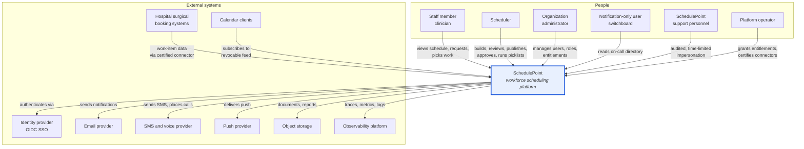
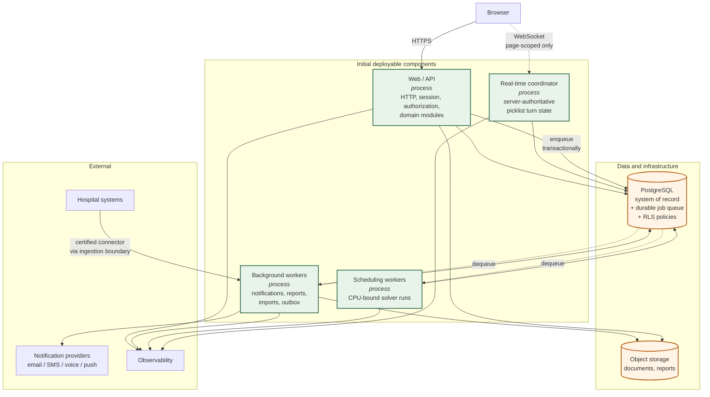

# 03 — System Context and Containers

**Status: `PROPOSED`.**

> **REVISED 2026-08-01 (CAR-005, CAR-013, CAR-017).** **Six process classes and three images**, not four and one ([01](01-architecture-overview.md) §2.2). Availability, failover, fencing, and recovery are specified in [SPEC-10](specs/SPEC-10-deployment-topology.md); cross-module transaction ownership in [SPEC-12](specs/SPEC-12-cross-module-unit-of-work.md).

---

## 1. System context

### 1.1 Actors

| Actor | Interacts by | Notes |
|---|---|---|
| **Staff member** | Viewing their schedule, submitting requests, claiming opportunities, picking work | The largest population. Mobile use is a primary scenario, not an afterthought |
| **Scheduler** | Configuring rules, running builds, reviewing conflicts, publishing, approving, running picklists | The power user; most capability surface area |
| **Organization administrator** | Managing users, memberships, roles, group settings | Distinct from scheduler — administers *people*, not *schedules* |
| **Notification-only user** | Reading the on-call directory | Never appears on a schedule, never picks (CAP-044) |
| **Support personnel** | Time-limited, banner-visible, fully audited impersonation | Never able to reach credential-changing screens (CAP-010) |
| **Platform operator** | Granting entitlements, certifying connectors | Operates above the organization boundary |

### 1.2 External systems

| System | Direction | Boundary note |
|---|---|---|
| **Identity provider** | Outbound (OIDC) | Per-organization SSO; first-party auth remains available |
| **Email / SMS / voice / push providers** | Outbound | Behind ports; a provider swap must not touch domain code |
| **Hospital surgical booking systems** | **Inbound** | **The only inbound data path, and the highest-risk one.** Every connector passes the platform-controlled ingestion boundary — no exceptions (I-07) |
| **Object storage** | Bidirectional | Per-tenant key prefixes, short-lived signed URLs, no public access |
| **Observability platform** | Outbound | **Scrubbed** — no ingestion payloads, no PII |
| **Calendar clients** | Inbound (read-only) | Revocable hash-stored token; **no PII in the URL** |

---

## 2. Containers

### 2.1 Three levels of boundary — kept deliberately distinct

**Logical boundaries (many).** The 25 domain modules in [04-domain-boundaries.md](04-domain-boundaries.md). These are compile-time and review-time boundaries enforced by import rules. They exist from day one and are the thing that makes later extraction cheap.

**Deployable components (four).** Web/API · background workers · scheduling workers · real-time coordinator. **One codebase, one image, four entry points.** They are separate because their *failure and scaling characteristics* differ, not because their domains do.

**Future extraction candidates (five).** Scheduling workers · real-time coordinator · notification delivery · hospital connectors · report generation. The first two are already separate processes, so extracting them to separate services is a deployment change. The other three are in-process modules with worker entry points today.

> **The distinction matters.** A logical boundary costs almost nothing and buys optionality. A deployable component costs operational overhead and buys isolation. A service costs a network boundary, a failure mode, and a consistency problem — and buys independent scaling and deployment. We pay only the first two now.

### 2.2 Why each process is separate

| Process | Separate because | Would be unsafe in-process because |
|---|---|---|
| **Web / API** | — (baseline) | — |
| **Background workers** | Long-running, retryable | A slow provider call would occupy a request thread |
| **Scheduling workers** | **CPU-bound, minutes-long, memory-hungry** | A solver run would starve request handling and blow memory limits |
| **Real-time coordinator** | **Stateful connections; owns turn state and the authoritative clock** | Turn ownership cannot be safely held by an arbitrary request handler across a horizontally-scaled web tier |

### 2.3 Communication rules

- **Web → workers:** enqueue a job **in the same transaction** as the domain change. No job is visible unless its cause committed (I-11).
- **Workers → domain:** call published module operations. **Never** reach into another module's tables.
- **Real-time → domain:** the coordinator owns transient turn state; every *durable* effect goes through the picklist module's operations and lands in PostgreSQL.
- **Any process → notifications:** emit a domain event; the outbox turns it into a notification intent. **Never** call a provider inline from a domain transaction.

---

## 3. Data flows worth naming

### 3.1 Publication (transactional)
Scheduler approves → one transaction creates the new `schedule_version`, supersedes the prior version, writes assignments, writes audit events, and enqueues notification jobs → transaction commits → workers dispatch. **Notification failure cannot roll back a successful publication** (I-11), and publication failure means nothing was notified.

### 3.2 Solver run (asynchronous, isolated)
Scheduler submits → build validated and queued → a scheduling worker claims it, loads a **solver-neutral problem**, translates to the solver adapter, runs, persists result + violations + quality metrics → status becomes `completed`, `completed-with-unmet-preferences`, or `infeasible`. **`failed` is a distinct status meaning the system broke, not the problem.**

### 3.3 Live picklist turn (real-time, server-authoritative)
Coordinator advances the turn → notification intents emitted → participant connects (page-scoped) → selects → **the coordinator performs an atomic conditional claim in PostgreSQL** → exactly one selection wins → state broadcast to subscribers → next turn. Two simultaneous selections resolve deterministically ([10](10-picklist-and-realtime.md) §6).

### 3.4 Hospital import (inbound, privacy-critical)
Connector fetches or receives → **canonical schema validation** → **positive-allowlist de-identification** → reconciliation against manual items → batch applied or quarantined → audited. **Rejected content never reaches storage, logs, queues, audit payloads, or observability** (I-07).

---

## 4. What is deliberately absent

| Not included | Why |
|---|---|
| API gateway | One web tier; no service mesh to front |
| Service mesh | No inter-service traffic to manage |
| Separate read database | Read replicas when reporting load justifies, not before |
| Message broker | PostgreSQL-backed queue gives transactional enqueue; a broker is a later optimisation |
| Per-service datastores | Rejected with microservices; relational integrity here is load-bearing |
| CDN for application traffic | Static assets yes; application responses are tenant-scoped and must not be edge-cached |

Each is a **deferral with a stated trigger**, not an exclusion. See [17-deployment-and-operations.md](17-deployment-and-operations.md) §8.
