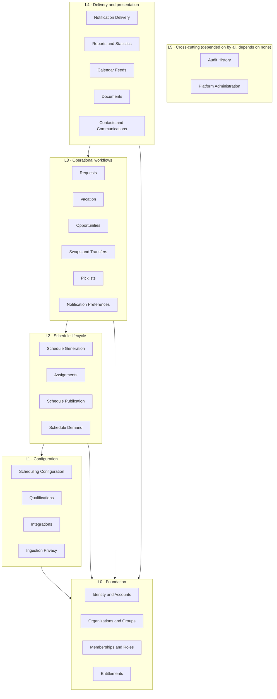

# 04 — Domain Boundaries

**Status: `PROPOSED`.**

> **REVISED 2026-08-01 (CAR-017).** **Strict "a module never touches another module's tables" is replaced by three write classes** — own-aggregate writes, **in-transaction domain ports**, and post-commit outbox reactions — with one named owner per workflow. **The module count is rationalised from 25 to 19** where two modules shared every invariant and every transaction. See [SPEC-12](specs/SPEC-12-cross-module-unit-of-work.md) and [ADR-0017](decisions/ADR-0017-cross-module-unit-of-work.md). **M-08 Ingestion Privacy and M-24 Audit remain separate and are never merged.**

25 modules. Each owns its entities, publishes explicit operations, emits and consumes events, and declares what it may **never** depend on.

---

## 1. Rules

1. **A module owns its tables.** No other module reads or writes them directly — ever. This single rule is what makes later extraction a deployment change rather than a rewrite.
2. **Cross-module reads go through published operations.** Cross-module writes go through operations or events.
3. **No circular dependencies.** Enforced by the layering in §2 and by an automated import check.
4. **Events are facts, not commands.** `SchedulePublished` is a fact; "send emails" is the notification module's decision.
5. **Every module declares its tenant ownership and sensitivity.** No module is tenant-agnostic by accident.
6. **Platform Administration is the only module allowed above the organization boundary** — and it is audited most heavily as a result.

---

## 2. Dependency layering

Dependencies flow **downward only**.

**Ingestion Privacy sits at L1 deliberately.** It is a *policy* module that Integrations depends on, not a service Integrations may choose to call. A connector cannot reach L2+ without passing through it.

---

## 3. Prohibited dependencies

| Prohibition | Why |
|---|---|
| **No L0 module may depend on anything above it** | Foundation must be independently reasonable |
| **Nothing may write another module's tables** | Kills extraction; hides invariants |
| **Notification Delivery may not depend on any L2/L3 domain** | It reacts to events; if it needed domain knowledge it could not be extracted |
| **Integrations may not bypass Ingestion Privacy** | I-07. Structural, not procedural |
| **Schedule Generation may not depend on Publication** | Generation proposes; publication decides. Reversing this couples the solver to release management |
| **Assignments may not depend on Picklists, Opportunities, or Swaps** | Those *produce* assignments; the dependency runs one way |
| **No domain module may import the solver library** | Solver replacement boundary (ADR-0006) |
| **No module may read `audit_events` for business logic** | Audit is append-only observation, never a data source for decisions |
| **Reports may not write to any domain table** | Read-only by construction |

---

## 4. Module catalogue

**Field key:** Purpose · Owns · Invariants · Operations · Emits · Consumes · Depends on · Must never depend on · Transaction boundary · Concurrency risk · Audit · Tenant · Sensitivity.

### L0 — Foundation

#### M-01 · Identity and Accounts
**Purpose:** authenticable identities, credentials, sessions, account lifecycle.
**Owns:** `users`, `user_profiles`, `sessions`, `credentials`, `invitations`, `push_registrations`
**Invariants:** email is unique and immutable per account; a user holding history is never hard-deleted; suspension invalidates live sessions immediately.
**Operations:** `invite`, `activate`, `authenticate`, `suspend`, `deactivate`, `archive`, `changeCredential`, `beginImpersonation`
**Emits:** `UserInvited`, `UserActivated`, `UserSuspended`, `UserDeactivated`, `ImpersonationStarted/Ended`
**Consumes:** — · **Depends on:** — · **Never depends on:** anything above L0
**Transaction:** account lifecycle transitions are atomic with session invalidation. **Concurrency:** duplicate invitation; token replay (single-use, atomic consumption).
**Audit:** every transition, every credential change, every impersonation. **Tenant:** Organization. **Sensitivity:** `PII` / `SECRET`.
**Capabilities:** CAP-005, CAP-007, CAP-008, CAP-009, CAP-010

#### M-02 · Organizations and Groups
**Purpose:** the tenancy root and scheduling scopes.
**Owns:** `organizations`, `groups`, `sites`, `group_settings`
**Invariants:** every group belongs to exactly one organization; **no operation returns rows across an organization boundary**; group settings are group-scoped.
**Operations:** `createOrganization`, `createGroup`, `configureGroup`, `resolveTenantContext`
**Emits:** `OrganizationCreated`, `GroupCreated`, `GroupSettingsChanged` · **Consumes:** —
**Depends on:** — · **Never depends on:** anything above L0
**Transaction:** settings changes atomic. **Concurrency:** concurrent settings edits (optimistic).
**Audit:** all settings changes. **Tenant:** self (root). **Sensitivity:** `INTERNAL`.
**Capabilities:** CAP-001, CAP-002, CAP-003, CAP-004

#### M-03 · Memberships and Roles
**Purpose:** **where a person's authority actually lives** — the join carrying role and capabilities per group.
**Owns:** `memberships`, `roles`, `capabilities`, `role_capabilities`, `capability_grants`
**Invariants:** **role is per-membership, never global**; no capability grant exists without a tested capability difference (I-02); deny-by-default.
**Operations:** `addMembership`, `assignRole`, `grantCapability`, `revokeCapability`, `authorize`, `listCapabilities`
**Emits:** `MembershipCreated`, `RoleAssigned`, `CapabilityGranted/Revoked`, `MembershipEnded`
**Consumes:** `UserDeactivated` · **Depends on:** M-01, M-02, M-04 · **Never depends on:** L2+
**Transaction:** grant changes atomic with audit. **Concurrency:** concurrent grant edits.
**Audit:** **every privilege change, both directions.** **Tenant:** Organization + Group. **Sensitivity:** `INTERNAL`.
**Capabilities:** CAP-006, CAP-044

#### M-04 · Entitlements
**Purpose:** which modules an organization has, and whether a group may use them. **Not permissions.**
**Owns:** `entitlements`, `module_definitions`, `module_dependencies`, `group_module_availability`
**Invariants:** **an entitlement is never a permission**; dependencies validated on activation; **disabling never deletes data**; effective dates respected.
**Operations:** `grantEntitlement`, `suspendEntitlement`, `revokeEntitlement`, `setGroupAvailability`, `isModuleAvailable`
**Emits:** `EntitlementGranted/Suspended/Revoked`, `GroupAvailabilityChanged` · **Consumes:** —
**Depends on:** M-02 · **Never depends on:** M-03 (**explicitly** — the separation is the point)
**Transaction:** grant + dependency validation atomic. **Concurrency:** concurrent grants converge; dependencies re-validated at commit.
**Audit:** every change and every dependency override. **Tenant:** Organization. **Sensitivity:** `INTERNAL`.
**Capabilities:** CAP-057

### L1 — Configuration

#### M-05 · Qualifications
**Purpose:** competencies, credentials, expiry, and eligibility.
**Owns:** `qualifications`, `qualification_holdings`, `shift_type_qualifications`
**Invariants:** **eligibility is evaluated against the assignment date, never "today"**; an expired holding confers nothing; overrides require a reason and are audited.
**Operations:** `defineQualification`, `grantHolding`, `revokeHolding`, `isEligible(membership, shiftType, date)`, `listExpiring`
**Emits:** `QualificationGranted`, `HoldingExpiring`, `HoldingExpired`, `HoldingRevoked` · **Consumes:** `MembershipEnded`
**Depends on:** M-02, M-03 · **Never depends on:** L2+
**Transaction:** grant atomic. **Concurrency:** renewal racing an expiry sweep (converge to one window).
**Audit:** grants, expiries, revocations, **and every override**. **Tenant:** Group. **Sensitivity:** `SENSITIVE-PII`.
**Capabilities:** CAP-058

#### M-06 · Scheduling Configuration
**Purpose:** shift types, groups, rules, templates — the vocabulary the engine consumes.
**Owns:** `shift_types`, `shift_groups`, `staff_groups`, `valid_groups`, `pattern_rules`, `staff_rules`, `assignment_templates`, `rule_sets`
**Invariants:** retired shift types are never hard-deleted while assignments reference them; rules are versioned so a build records exactly which rule text it used.
**Operations:** `defineShiftType`, `defineRule`, `composeRuleSet`, `getRuleSet`
**Emits:** `ShiftTypeChanged`, `RuleChanged`, `RuleSetComposed` · **Consumes:** —
**Depends on:** M-02, M-05 · **Never depends on:** L2+
**Transaction:** rule edits atomic. **Concurrency:** concurrent rule edits (optimistic).
**Audit:** all definition changes. **Tenant:** Group. **Sensitivity:** `INTERNAL` (staff rules name individuals).
**Capabilities:** CAP-011, CAP-012, CAP-013, CAP-016

#### M-07 · Integrations
**Purpose:** connector configuration, scheduling, and import orchestration.
**Owns:** `integration_connections`, `connector_versions`, `import_batches`, `imported_work_items`, `quarantined_records`
**Invariants:** **every import passes M-08 first — structurally, not by convention**; imports are idempotent by key; a batch is atomic; manual items are never silently destroyed.
**Operations:** `configureConnector`, `certifyConnector`, `runImport`, `retryImport`, `reconcile`, `inspectQuarantine`
**Emits:** `ImportApplied`, `ImportQuarantined`, `ImportFailed` · **Consumes:** —
**Depends on:** M-02, **M-08** · **Never depends on:** any L2+ module directly (it publishes work items through the picklist module's operations)
**Transaction:** batch application atomic. **Concurrency:** two batches for one date reconcile by receipt order.
**Audit:** every batch, rejection, and quarantine decision. **Tenant:** Group. **Sensitivity:** `INTERNAL` — **must never hold patient-level content**.
**Capabilities:** CAP-055, CAP-061, CAP-063, CAP-064, CAP-065

#### M-08 · Ingestion Privacy
**Purpose:** **the de-identification boundary.** A policy module, not a service.
**Owns:** `allowlist_schemas`, `ingestion_rejections` (metadata only — never rejected content)
**Invariants:** **positive allowlist, never deny-list**; unexpected fields rejected or quarantined; **rejected content never reaches storage, logs, queues, audit payloads, or observability**; no patient names, MRNs, dates of birth, health-card/insurance identifiers, or unrestricted clinical free text.
**Operations:** `validateAndStrip(payload, schema)` → accepted fields | rejection metadata
**Emits:** `IngestionRejected` (metadata only) · **Consumes:** —
**Depends on:** — · **Never depends on:** anything (deliberately dependency-free so it cannot be subverted)
**Transaction:** pure function; no state. **Concurrency:** none.
**Audit:** rejection **metadata** only — counts and field names, never values. **Tenant:** n/a. **Sensitivity:** `EXCLUDED` — exists to keep a data class out.
**Capabilities:** CAP-062

### L2 — Schedule lifecycle

#### M-09 · Schedule Demand
**Purpose:** how much staffing is needed, when.
**Owns:** `schedule_periods`, `schedule_requirements`, `demand_defaults`
**Invariants:** a period has a bounded, non-overlapping date range per group.
**Operations:** `definePeriod`, `setRequirements`, `getDemand` · **Emits:** `PeriodDefined`, `DemandChanged` · **Consumes:** —
**Depends on:** M-02, M-06 · **Never depends on:** M-10, M-11, M-12
**Transaction:** requirement edits atomic. **Concurrency:** optimistic. **Audit:** changes. **Tenant:** Group. **Sensitivity:** `NONE`.
**Capabilities:** CAP-014 (period part)

#### M-10 · Schedule Generation
**Purpose:** run the engine; produce candidate schedules with explanations.
**Owns:** `build_configurations`, `build_runs`, `solver_inputs`, `solver_results`, `rule_violations`, `quality_metrics`
**Invariants:** **one running build per period**; protected assignments preserved exactly; **`infeasible` ≠ `failed`**; every result carries the full explainability set; reproducible given identical inputs and seed.
**Operations:** `configureBuild`, `validateBuild`, `submitBuild`, `cancelBuild`, `getResult`, `compareBuilds`
**Emits:** `BuildQueued`, `BuildCompleted`, `BuildInfeasible`, `BuildFailed` · **Consumes:** `RuleSetComposed`
**Depends on:** M-05, M-06, M-09, M-11 (reads assignments for protection/history) · **Never depends on:** M-12 Publication
**Transaction:** result persistence atomic. **Concurrency:** **period-scoped serialisation.**
**Audit:** every stage transition. **Tenant:** Group. **Sensitivity:** `INTERNAL`.
**Capabilities:** CAP-015, CAP-017, CAP-018, CAP-059

#### M-11 · Assignments
**Purpose:** who is working what, when — plus fairness credit, **which is a separate concept**.
**Owns:** `shifts`, `assignments`, `assignment_versions`, `credits`
**Invariants:** **no overlapping assignments for one person, including across midnight**; minimum rest respected; qualification enforced at the assignment date; **credit is independently movable from the assignment**; every mutation audited with provenance.
**Operations:** `createAssignment`, `moveAssignment`, `moveCredit`, `lockAssignment`, `unlockAssignment`, `validateAssignment`
**Emits:** `AssignmentCreated/Moved/Cancelled`, `CreditMoved`, `AssignmentLocked` · **Consumes:** `BuildCompleted`, `PickRecorded`, `OpportunityClaimed`, `SwapExecuted`, `VacationCommitted`
**Depends on:** M-05, M-06, M-09 · **Never depends on:** M-15..M-18 (they produce assignments; the arrow runs one way)
**Transaction:** each mutation atomic with its audit event. **Concurrency:** **optimistic concurrency per assignment.**
**Audit:** **every mutation.** **Tenant:** Group. **Sensitivity:** `INTERNAL`.
**Capabilities:** CAP-019, CAP-020

#### M-12 · Schedule Publication
**Purpose:** make a schedule live as an **immutable version**, and revise it safely.
**Owns:** `schedule_versions`, `publication_records`, `version_supersessions`
**Invariants:** **prior versions are superseded, never deleted**; publication prerequisites re-checked **at commit**, not only at request; revert publishes forward; concurrent publication for one period is serialised.
**Operations:** `createDraftVersion`, `circulateForReview`, `approve`, `publish`, `amend`, `revert`, `compareVersions`
**Emits:** `SchedulePublished`, `ScheduleAmended`, `ScheduleReverted`, `VersionSuperseded` · **Consumes:** `BuildCompleted`
**Depends on:** M-10, M-11 · **Never depends on:** M-13..M-18
**Transaction:** **publication is one transaction** — version + assignments + supersession + audit + enqueued notifications.
**Concurrency:** period-scoped serialisation. **Audit:** publication, supersession, lock, revert. **Tenant:** Group. **Sensitivity:** `INTERNAL`.
**Capabilities:** CAP-014

### L3 — Operational workflows

#### M-13 · Requests
**Purpose:** one canonical typed request domain (PO-DEC-03 default).
**Owns:** `requests`, `request_comments`, `approvals`
**Invariants:** deadlines enforced **server-side**; withdrawal (requester) and denial (approver) are distinct; **every view operates on the same authoritative state**; idempotent submission.
**Operations:** `submit`, `withdraw`, `approve`, `deny`, `comment`, `listForMembership`
**Emits:** `RequestSubmitted/Approved/Denied/Withdrawn/Expired` · **Consumes:** `SchedulePublished`
**Depends on:** M-03, M-06 · **Never depends on:** M-10 (the engine reads requests; requests do not drive builds)
**Transaction:** decision atomic with audit. **Concurrency:** two approvers — first wins, second gets a clear conflict.
**Audit:** submission, decision, withdrawal, comment edits. **Tenant:** Group. **Sensitivity:** `SENSITIVE-PII` (absence data).
**Capabilities:** CAP-021

#### M-14 · Vacation
**Purpose:** vacation periods, entitlement, quota, selection, and commit — a linked specialisation of Requests.
**Owns:** `vacation_periods`, `vacation_quotas`, `vacation_selections`
**Invariants:** both quota/grant and open modes supported; **over-quota is advisory, not blocking**; **commit is idempotent** (keyed by selection + target version) and reversible via versioning.
**Operations:** `openPeriod`, `select`, `approve`, `deny`, `withdraw`, `batchApprove`, `commitToSchedule`
**Emits:** `VacationSelected/Approved/Denied/Withdrawn/Committed` · **Consumes:** `SchedulePublished`
**Depends on:** M-13, M-12 · **Never depends on:** M-10
**Transaction:** **balance decrement atomic with approval**; commit atomic with version creation.
**Concurrency:** **two approvals racing the last entitlement unit — exactly one succeeds.**
**Audit:** every transition, **especially commit**. **Tenant:** Group. **Sensitivity:** `SENSITIVE-PII`.
**Capabilities:** CAP-022, CAP-023

#### M-15 · Opportunities
**Purpose:** one-to-many give-away with email fan-out and locum preference.
**Owns:** `opportunities`, `opportunity_claims`
**Invariants:** **atomic conditional claim — exactly one winner**; eligibility re-validated **at claim time**; future dates only; staff-over-locum priority window honoured.
**Operations:** `post`, `withdraw`, `claim`, `listEligible`
**Emits:** `OpportunityPosted/Claimed/Withdrawn/Expired` · **Consumes:** `AssignmentCancelled`, `SchedulePublished`
**Depends on:** M-11, M-05, M-03 · **Never depends on:** M-16
**Transaction:** **claim is one atomic conditional update.** **Concurrency:** **the sharpest case outside the picklist.**
**Audit:** post, claim, withdraw, expiry. **Tenant:** Group. **Sensitivity:** `INTERNAL`.
**Capabilities:** CAP-024, CAP-025

#### M-16 · Swaps and Transfers
**Purpose:** directed offers, mutual swaps, administrative transfers.
**Owns:** `shift_offers`, `shift_swaps`, `transfers`
**Invariants:** counterpart acceptance **always** required for a swap; scheduler review **configurable per group**; execution is **atomic — both legs or neither**; both legs re-validated at execution.
**Operations:** `proposeOffer`, `acceptOffer`, `declineOffer`, `proposeSwap`, `acceptSwap`, `approveSwap`, `executeSwap`, `transfer`
**Emits:** `OfferProposed/Accepted/Declined`, `SwapProposed/Accepted/Executed/Failed` · **Consumes:** `AssignmentMoved`
**Depends on:** M-11, M-05, M-13 · **Never depends on:** M-15
**Transaction:** **swap execution is one transaction covering both legs.** **Concurrency:** either leg reassigned mid-flow invalidates the swap.
**Audit:** all transitions and **both assignment legs**. **Tenant:** Group. **Sensitivity:** `INTERNAL`.
**Capabilities:** CAP-026, CAP-027 (partly)

#### M-17 · Picklists
**Purpose:** turn-based drafting in three operating modes.
**Owns:** `picklists`, `picklist_participants`, `picklist_work_items`, `picklist_turns`, `selections`, `proxies`
**Invariants:** **server owns turn state and the clock**; **atomic work-item claim**; participants derived from the published schedule; **no control persists before an explicit save**; mode is group configuration.
**Operations:** `prepare`, `addWorkItem`, `reorder`, `start`, `advanceTurn`, `select`, `skip`, `pause`, `resume`, `complete`, `intervene`, `pickOnBehalf`
**Emits:** `PicklistStarted`, `TurnStarted`, `PickRecorded`, `TurnSkipped`, `PicklistCompleted` · **Consumes:** `SchedulePublished`, `ImportApplied`
**Depends on:** M-11, M-12, M-03, M-05 · **Never depends on:** M-19/M-20 (it emits events; delivery decides)
**Transaction:** **selection is one atomic conditional claim.** **Concurrency:** **the most severe in the product.**
**Audit:** start, every turn, every pick, every skip, every proxy action, every intervention. **Tenant:** Group. **Sensitivity:** `INTERNAL` — **never patient-level content**.
**Capabilities:** CAP-030, CAP-031, CAP-032, CAP-033, CAP-034, CAP-060

#### M-18 · Notification Preferences
**Purpose:** escalation ladders and channel preferences; group defaults with per-user override.
**Owns:** `notification_preferences`, `escalation_policies`, `escalation_steps`, `quiet_hours`
**Invariants:** two windows (business/personal) resolved against the **group timezone**; admin lock respected; user override beats group default.
**Operations:** `setGroupDefault`, `setUserPreference`, `resolvePolicy(membership, eventType, at)`
**Emits:** `PreferenceChanged` · **Consumes:** `MembershipCreated`
**Depends on:** M-02, M-03 · **Never depends on:** M-19
**Transaction:** preference edits atomic. **Concurrency:** optimistic. **Audit:** changes. **Tenant:** Group + User. **Sensitivity:** `INTERNAL`.
**Capabilities:** CAP-040 (preferences part)

### L4 — Delivery and presentation

#### M-19 · Notification Delivery
**Purpose:** turn intents into delivered messages, reliably.
**Owns:** `notification_messages`, `delivery_attempts`, `outbox_events`, `suppressions`
**Invariants:** **dispatch only after the triggering transaction commits**; bounded backoff retry; dead-lettering; **explicit `no-destination` outcome, never a silent skip**; deduplicated; resolution cancels pending steps.
**Operations:** `enqueueIntent`, `render`, `dispatch`, `recordOutcome`, `suppress`
**Emits:** `NotificationDelivered/Failed/Suppressed` · **Consumes:** **every domain event that should notify**
**Depends on:** M-18, provider ports · **Never depends on:** **any L2/L3 domain module** (deliberately — this is what makes it extractable)
**Transaction:** **outbox claim + dispatch + outcome**, never inside a domain transaction.
**Concurrency:** **retries must not duplicate.** **Audit:** creation and final outcome per attempt. **Tenant:** Group + User. **Sensitivity:** `PII` — **message bodies never carry clinical content**.
**Capabilities:** CAP-040, CAP-041

#### M-20 · Contacts and Communications
**Purpose:** the staff directory, bulk messaging, and the group communication identity.
**Owns:** `contact_visibility_policies`, `group_communication_identities`, `broadcast_records`
**Invariants:** directory inclusion by **explicit policy**, never an emergent filter; **field-level PII minimisation by role**; recipients resolve **only** from the roster — never free text; rate-limited.
**Operations:** `listDirectory`, `sendBroadcast`, `configureIdentity`
**Emits:** `BroadcastSent` · **Consumes:** `MembershipCreated/Ended`
**Depends on:** M-01, M-03, M-19 · **Never depends on:** L2/L3 domains
**Transaction:** broadcast record atomic with intent creation. **Concurrency:** low.
**Audit:** every broadcast with sender, recipient count, and filter. **Tenant:** Group. **Sensitivity:** `PII`.
**Capabilities:** CAP-042, CAP-043, CAP-056

#### M-21 · Reports and Statistics
**Purpose:** fairness statistics and generated report artifacts.
**Owns:** `report_definitions`, `report_runs`, `report_artifacts`
**Invariants:** **read-only — writes to no domain table**; output is **tenant-scoped**; generated asynchronously; access-controlled and expiring; generation audited.
**Operations:** `defineReport`, `requestGeneration`, `getArtifact`, `share`
**Emits:** `ReportGenerated`, `ReportShared` · **Consumes:** `SchedulePublished`
**Depends on:** M-11, M-12, M-14, M-17 (**read-only**) · **Never depends on:** M-19 directly
**Transaction:** artifact write atomic. **Concurrency:** low. **Audit:** generation, download, sharing. **Tenant:** Group. **Sensitivity:** `INTERNAL` — may aggregate `PII`.
**Capabilities:** CAP-045, CAP-046

#### M-22 · Calendar Feeds
**Purpose:** revocable read-only iCalendar subscriptions.
**Owns:** `calendar_feed_tokens`
**Invariants:** **hash-stored tokens, plaintext shown once**; read-only; **scoped to one membership**; rotation invalidates immediately; **no PII in the URL**.
**Operations:** `issue`, `rotate`, `revoke`, `renderFeed`
**Emits:** `FeedTokenIssued/Rotated/Revoked` · **Consumes:** `SchedulePublished`, `MembershipEnded`
**Depends on:** M-03, M-11 · **Never depends on:** L3
**Transaction:** token lifecycle atomic. **Concurrency:** rotation racing a fetch — **no window in which both tokens work.**
**Audit:** issue, rotate, revoke. **Tenant:** User. **Sensitivity:** `SECRET`.
**Capabilities:** CAP-047

#### M-23 · Documents
**Purpose:** the shared file repository.
**Owns:** `document_categories`, `documents`, `document_versions`
**Invariants:** uploader and version recorded; **signed, short-lived, tenant-scoped URLs**; purge invalidates URLs; role-based category visibility; upload validated and scanned.
**Operations:** `createCategory`, `upload`, `supersede`, `archive`, `purge`, `getDownloadUrl`, `search`
**Emits:** `DocumentUploaded/Superseded/Purged` · **Consumes:** —
**Depends on:** M-02, M-03, storage port · **Never depends on:** L2/L3
**Transaction:** metadata + object write coordinated; **orphan-object cleanup on failure**.
**Concurrency:** concurrent version uploads both retained and ordered. **Audit:** upload, download, supersession, purge. **Tenant:** Group. **Sensitivity:** `INTERNAL`.
**Capabilities:** CAP-048

### L5 — Cross-cutting

#### M-24 · Audit History
**Purpose:** the append-only, queryable record of every consequential action.
**Owns:** `audit_events`
**Invariants:** **append-only — never updated or deleted**; every entry carries actor, on-behalf-of, action, target, before/after, mechanism, correlation id; **`before`/`after` payloads never embed PII or clinical content**.
**Operations:** `record`, `query` · **Emits:** — · **Consumes:** every module's events
**Depends on:** — · **Never depends on:** anything (**and no module may read it for business logic**)
**Transaction:** written **within** the originating transaction. **Concurrency:** append-only, no contention.
**Audit:** is the audit. **Tenant:** Organization (group-tagged). **Sensitivity:** `INTERNAL`.
**Capabilities:** CAP-027

#### M-25 · Platform Administration
**Purpose:** operations above the organization boundary.
**Owns:** `platform_operators`, `connector_certifications`, `feature_flags`
**Invariants:** **the only module permitted above the organization boundary**; every action audited at the highest level; support access is time-limited and banner-visible.
**Operations:** `certifyConnector`, `grantOrganizationEntitlement`, `beginSupportAccess`
**Emits:** `ConnectorCertified`, `SupportAccessGranted` · **Consumes:** —
**Depends on:** M-04, M-07 · **Never depends on:** tenant domains
**Transaction:** atomic with audit. **Concurrency:** low. **Audit:** **maximum.** **Tenant:** platform. **Sensitivity:** `INTERNAL`.
**Capabilities:** CAP-051, CAP-057 (platform side)

---

## 5. Enforcement

| Rule | How enforced |
|---|---|
| No cross-module table access | Module-scoped repositories; **automated import-boundary check in CI** |
| No circular dependencies | Layer assertion in CI |
| No domain module imports the solver | CI import check (ADR-0006) |
| Integrations cannot bypass Ingestion Privacy | M-07 depends on M-08 and has no other write path to work items; **contract test asserts it** |
| Notification Delivery has no L2/L3 dependency | Import check |
| Reports write nothing | Read-only repository interfaces + CI check |
| Audit is append-only | No update/delete operation exists; database grants withhold them |

**A boundary rule without an automated check is a suggestion.** Every rule above has one.
