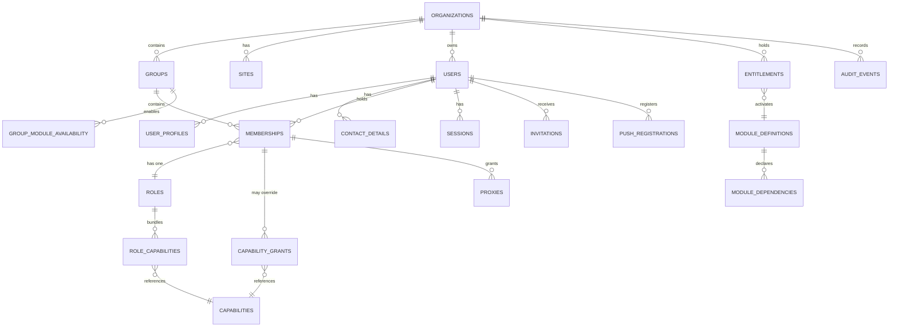
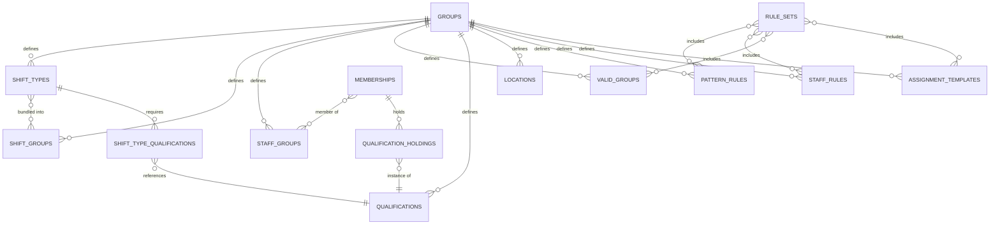
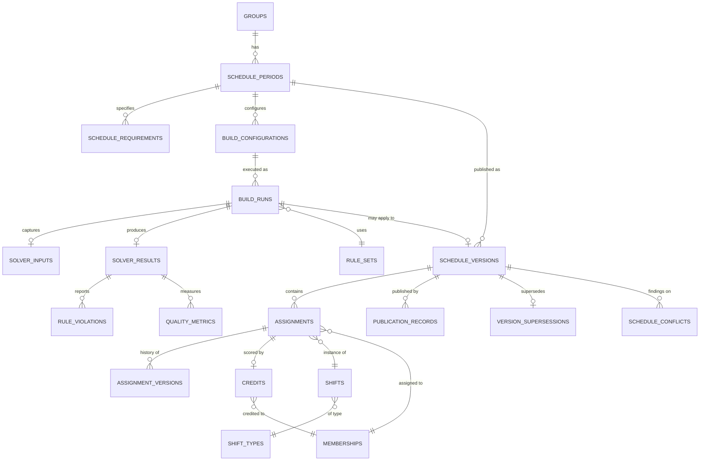
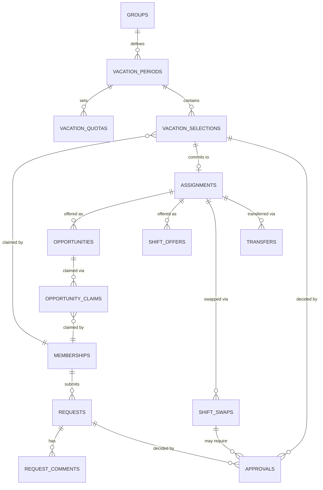
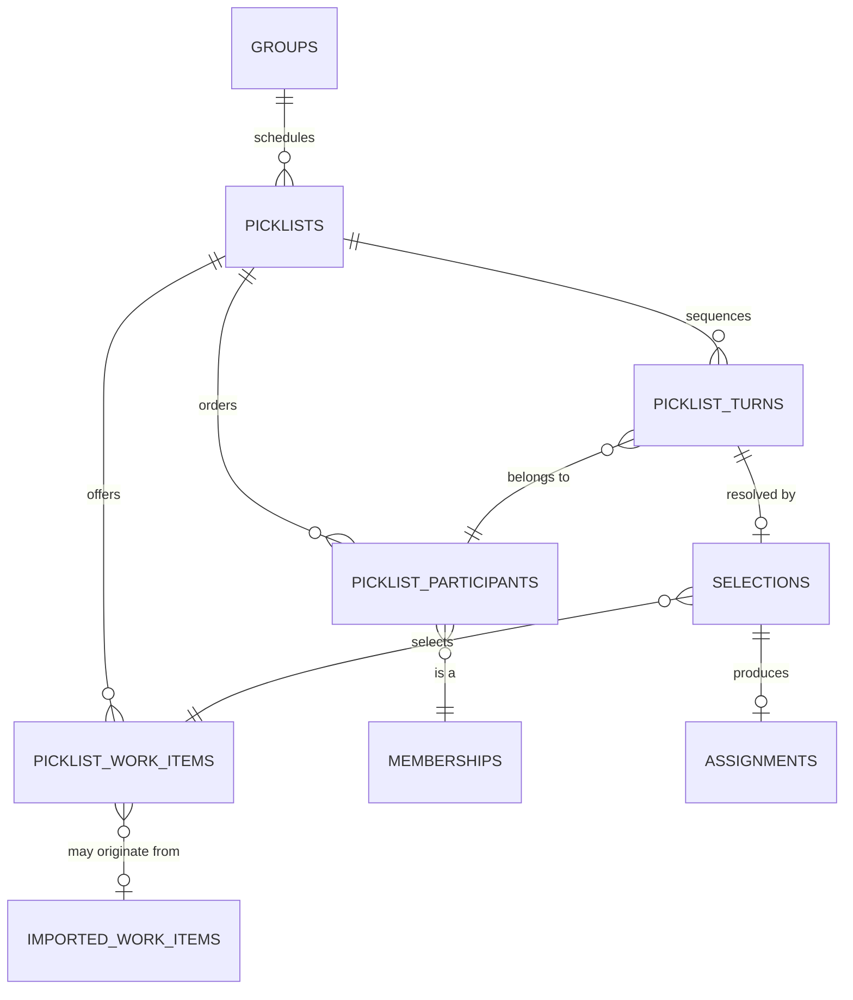
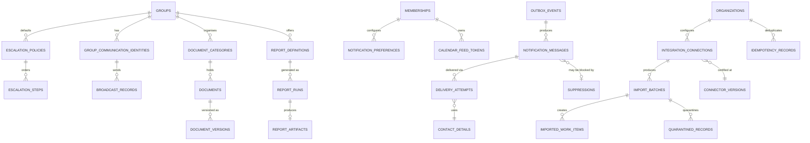

# 06 — Data Architecture

**Status: `PROPOSED`.** Logical schema only. **No migration was created and none should be inferred from this document.**

> **REVISED 2026-08-01 — Codex review remediation.** This document was the single most-cited artifact in the independent review. Six findings changed its content materially:
> **CAR-003** (§3.5, D-3) · **CAR-004** (§3.5 work items, §3.7 quarantine) · **CAR-006** (§3.1–3.3, D-4) · **CAR-007** (§3.3, D-1) · **CAR-009** (§3.1 push) · **CAR-011** (§3.4 requests) · **CAR-020** (missing structures) · **CAR-021** (site model) · **CAR-027** (account email).
> Where a table or invariant changed, the change is marked **CHANGED**, **NEW**, or **REMOVED**, and the governing specification is named. **Nothing was renamed to make a mismatch disappear.**

---

## 1. Conventions

Applied to every table unless explicitly noted.

| Convention | Rule |
|---|---|
| **Tenant key** | Every tenant-scoped table carries `organization_id`. Group-scoped tables also carry `group_id` |
| **Composite FK** | `(organization_id, group_id)` references `groups (organization_id, id)` — a mismatched pair is rejected by the database |
| **Primary key** | Opaque surrogate (UUID). **Never a natural key** — natural keys leak into URLs and cannot be re-issued |
| **Concurrency** | Mutable aggregates carry `version` (integer) for optimistic concurrency |
| **Audit fields** | `created_at`, `created_by`, `updated_at`, `updated_by` (membership ids) |
| **Soft lifecycle** | `status` / `state` enums. **Hard deletion is prohibited wherever history or audit references the row** |
| **Time** | `timestamptz` for instants; `date` for calendar dates. **Shift-local semantics resolve against the group timezone** |
| **RLS** | Every tenant-scoped table has RLS enabled **and** `FORCE ROW LEVEL SECURITY`, with its policy created in the same migration |
| **Sensitivity** | Every table classified `NONE` \| `INTERNAL` \| `PII` \| `SENSITIVE-PII` \| `SECRET` |

**Sensitivity classes and their handling:**

| Class | Handling |
|---|---|
| `NONE` | Configuration; no restriction beyond tenancy |
| `INTERNAL` | Tenant-isolated business data |
| `PII` | Field-level minimisation by role. **May be processed only by an approved subprocessor under a declared payload schema** ([SPEC-07](specs/SPEC-07-notification-delivery-contracts.md) §7). **CHANGED (CAR-019)** — the previous blanket "never sent to third parties" was unimplementable and made an approved processor indistinguishable from exfiltration |
| `SENSITIVE-PII` | Absence and credential data; narrower access; retention-controlled |
| `SECRET` | Hash-stored only; never returned by an API; never logged |
| **`EXCLUDED`** | **Patient-level content. No table in this schema carries it** |

---

## 2. Entity-relationship diagrams

Split by domain — one diagram covering 60+ tables would be unreadable and therefore useless.

### 2.1 Foundation: tenancy, identity, authorization

### 2.2 Configuration and qualifications

### 2.3 Schedule lifecycle

### 2.4 Requests, vacation, marketplace

### 2.5 Picklist

### 2.6 Notifications, communications, integrations, artifacts

---

## 3. Table catalogue

**Field key:** Tenant · Key fields · Relationships · Uniqueness · State · Version · Audit · Retention · Sensitivity · Archive/deletion · Indexes · DB invariants.

### 3.1 Foundation

| Table | Tenant | Key fields | Uniqueness | State | Ver | Sensitivity | Retention / deletion | Key indexes | DB invariants |
|---|---|---|---|---|:--:|---|---|---|---|
| `organizations` | self | `name`, `status`, `data_region?` | `slug` | active/suspended/closed | ✓ | `INTERNAL` | Indefinite; closure archives | `slug` | — |
| `groups` | org | `organization_id`, `name`, `timezone`, settings | `(organization_id, slug)` | active/archived | ✓ | `INTERNAL` | Indefinite | `(organization_id)` | **`timezone` NOT NULL** |
| ~~`sites`~~ **REMOVED (CAR-021)** | — | — | — | — | — | — | — | — | **PO-DEC-01 is `pending` with a working default of "defer a first-class Site; model location as an attribute." A first-class table with foreign keys is not neutral toward that decision. The table and `locations.site_id` are withdrawn until the product owner decides.** Migration boundary: [SPEC-05a](#3-2a-site-migration-boundary-po-dec-01) |
| `users` **CHANGED** | org | `login_email`, `account_type`, `status`, `password_hash` | **`(organization_id, lower(login_email))`** | invited→active→suspended→deactivated→archived | ✓ | `PII`/`SECRET` | **Never hard-deleted where history exists** | `(organization_id, lower(login_email))` | `account_type ∈ {person,functional,placeholder}`. **`login_email` is NOT self-editable, but IS changeable by an administrator with `identity.change_login_email` or by a linked identity provider — audited, with all sessions invalidated and pending invitations reconciled. CHANGED (CAR-027): absolute immutability blocked hospital domain changes, mistyped-invitation correction, and SSO linking, forcing a second account and losing membership and audit continuity** |
| `user_profiles` | org | names, locale, preferences | `user_id` | — | ✓ | `PII` | Purge on archive | `user_id` | — |
| `contact_details` | org | `kind`, `value`, `verified`, `visibility` | `(user_id, kind, value)` | active/superseded | ✓ | `SENSITIVE-PII` | Purge on archive | `user_id` | `kind ∈ {email,mobile,home,pager}` |
| `sessions` | org | `user_id`, `expires_at`, `absolute_expires_at` | token hash | active/revoked | — | `SECRET` | Purge on expiry | `user_id`, `expires_at` | **Token stored hashed only** |
| `invitations` | org | `email`, `token_hash`, `expires_at`, `consumed_at` | `token_hash` | pending/accepted/expired/revoked | — | `SECRET` | Purge after expiry+grace | `token_hash` | **Single-use: `consumed_at` set atomically** |
| `memberships` | org+group | `user_id`, `group_id`, `role_id`, `work_percentage`, `show_in_schedule`, `pick_position_exclusions`, `preferences` | `(user_id, group_id)` | invited/active/suspended/ended | ✓ | `INTERNAL` | Retained after end | `(group_id)`, `(user_id)` | **Composite FK to `groups`** |
| `roles` | org/system | `key`, `name`, `is_system_role` | `(organization_id, key)` | active/deprecated | ✓ | `INTERNAL` | Indefinite | `(organization_id)` | — |
| `capabilities` | system | `key`, `description`, `module_key` | `key` | — | — | `INTERNAL` | Indefinite | `key` | — |
| `role_capabilities` | org | `role_id`, `capability_key` | `(role_id, capability_key)` | — | — | `INTERNAL` | — | `role_id` | — |
| `capability_grants` | org+group | `membership_id`, `capability_key`, `granted`, `granted_by` | `(membership_id, capability_key)` | — | ✓ | `INTERNAL` | Retained | `membership_id` | — |
| `entitlements` | org | `module_key`, `state`, `effective_from`, `effective_to?` | `(organization_id, module_key)` | trial/active/suspended/revoked | ✓ | `INTERNAL` | Indefinite | `(organization_id)` | `effective_to > effective_from` |
| `module_definitions` | system | `key`, `name` | `key` | — | — | `NONE` | — | — | — |
| `module_dependencies` | system | `module_key`, `depends_on` | `(module_key, depends_on)` | — | — | `NONE` | — | — | **No self-dependency** |
| `group_module_availability` | org+group | `group_id`, `module_key`, `available` | `(group_id, module_key)` | — | ✓ | `INTERNAL` | Retained | `group_id` | — |
| `organization_settings` **NEW (CAR-020)** | org | `organization_id`, setting key/value pairs, `data_region?` | `(organization_id, key)` | — | ✓ | `INTERNAL` | Indefinite | `organization_id` | Referenced by CAP-001 in the traceability document; **previously referenced but never defined** |
| `user_identities` **NEW (CAR-020)** | org | `user_id`, `provider`, `issuer`, `subject`, `linked_at`, `link_method` | **`(provider, issuer, subject)`** | active/unlinked | ✓ | `PII` | Retained | `user_id` | **Linking requires proof of control of the existing account; an unverified IdP email never auto-links (T-27)** |
| `membership_work_profiles` **NEW (CAR-006, CAR-020)** | org+group | `membership_id`, `effective_from`, `effective_to?`, `work_percentage`, `max_assignments_per_week?`, `max_assignments_per_period?`, `max_consecutive_days?` | `(membership_id, effective_from)` | — | ✓ | `INTERNAL` | Retained | `membership_id` | **Non-overlapping validity via exclusion constraint; `0 < work_percentage <= 100`. Effective-dated so a historical build reproduces against the profile then in force** |
| `membership_weekday_fte` **NEW (CAR-006, CAR-020)** | org+group | `work_profile_id`, `weekday (0–6)`, `fte_fraction`, `max_assignments?` | `(work_profile_id, weekday)` | — | ✓ | `INTERNAL` | Retained | `work_profile_id` | `0 <= fte_fraction <= 1`. **The canonical home weekday FTE previously lacked** |
| `proxy_grants` **RENAMED (CAR-020)** | org+group | *(was `proxies` in §3.5)* | — | — | — | — | — | — | **The traceability document referenced `proxy_grants`; the schema said `proxies`. `proxy_grants` is now the single name** |
| `push_registrations` **CHANGED** | org | `membership_id`, `platform`, **`subscription_lookup_hash`**, **`delivery_material_ref`**, **`key_version`**, `endpoint_origin`, `consent_granted_at`, `consent_source`, `state`, `last_success_at`, `consecutive_failures` | `subscription_lookup_hash` | consent-pending/active/stale/invalid/revoked | ✓ | `PII`/`SECRET` | Purge on archive, revocation, or provider 404/410 | `membership_id` | **CHANGED (CAR-009). Hash-only storage could never deliver: Web Push requires the endpoint, `p256dh`, and `auth` to be retained (verified fact S-05). `delivery_material_ref` holds them envelope-encrypted and is readable ONLY by the delivery-worker role; the hash remains for lookup and deduplication only.** See [SPEC-07](specs/SPEC-07-notification-delivery-contracts.md) §3 |

### 3.2 Configuration and qualifications

| Table | Tenant | Key fields | Uniqueness | State | Ver | Sensitivity | Notes |
|---|---|---|---|---|:--:|---|---|
| `locations` **CHANGED (CAR-021)** | group | `name`, **`site_label?`** *(free-form attribute, not a foreign key)*, `address?`, `timezone?` | `(group_id, name)` | active/archived | ✓ | `NONE` | **`site_label` is a denormalised attribute implementing the PO-DEC-01 pending default.** See §3.2a |
| `shift_types` | group | `code`, `name`, `start_time`, `end_time`, `crosses_midnight`, `is_on_call`, `is_manual_only`, `is_daily_pick`, `attracts_stipend`, `credit_weight` | `(group_id, code)` | active/retired | ✓ | `NONE` | **Never hard-deleted while assignments reference it** |
| `shift_groups` | group | `name`, `scoring_mode`, `weight`, `allow_request`, `request_off_label` | `(group_id, name)` | active/archived | ✓ | `NONE` | `scoring_mode ∈ {hard,weighted}` |
| `staff_groups` | group | `name` | `(group_id, name)` | active/archived | ✓ | `INTERNAL` | — |
| `valid_groups` | group | `shift_type_ids`, `allowed_pick_positions` | `(group_id, name)` | active/archived | ✓ | `NONE` | — |
| `qualifications` | group | `key`, `name`, `requires_expiry`, `issuing_body?` | `(group_id, key)` | active/retired | ✓ | `INTERNAL` | Not deleted while holdings exist |
| `qualification_holdings` | group | `membership_id`, `qualification_id`, `valid_from`, `valid_until?`, `evidence_ref?`, `status` | `(membership_id, qualification_id, valid_from)` | pending/valid/expiring/expired/revoked | ✓ | **`SENSITIVE-PII`** | **Retained after expiry for audit** |
| `shift_type_qualifications` | group | `shift_type_id`, `qualification_id` | pair | active/archived *(dated correction 2026-08-03, OPUS-M2-004: the table ships with a state column and archive-not-delete like its catalogue siblings; the original `—` cells predated implementation)* | ✓ | `NONE` | Composite FKs carry organization **and** group, so a shift type cannot require another group's qualification |
| `pattern_rules` | group | `name`, `trigger`, `days_of_week`, `date_scope`, `segments` | `(group_id, name)` | active/disabled/archived | ✓ | `NONE` | Rule text versioned |
| `staff_rules` | group | `name`, `conditions`, `action`, `action_params`, `days_of_week` | `(group_id, name)` | active/disabled/archived | ✓ | **`INTERNAL`** | **Names individuals — narrower access** |
| `assignment_templates` | group | `name`, `cycle_length_weeks`, `entries` | `(group_id, name)` | active/disabled/archived | ✓ | `NONE` | — |
| `rule_sets` | group | `name`, rule id arrays | `(group_id, name)` | active/archived | ✓ | `NONE` | Referenced by builds |
| `rules` **NEW (CAR-006)** | group | `rule_key`, `name`, **`rule_schema_version`**, **`classification ∈ {HARD, SOFT}`**, `weight?`, `scope`, **`predicate` (typed AST)** | `(group_id, rule_key)` | active/disabled/archived | ✓ | `INTERNAL` | **`CHECK ((classification='HARD' AND weight IS NULL) OR (classification='SOFT' AND weight IS NOT NULL))` — the database half of the hard/soft invariant. The AST node set is closed; a rule the AST cannot express is a schema change with a migration, never an escape hatch** |
| `work_item_labels` **NEW (CAR-004)** | group | `key`, `display_text`, `state`, `approved_by`, `approved_at` | `(group_id, key)` | draft/active/retired | ✓ | `INTERNAL` | **The controlled vocabulary that replaces free text on protected work-item paths. Human-approved before activation; connectors reference but cannot mint** |
| `group_holidays` **NEW (CAR-011)** | group | `date`, `name`, `observed` | `(group_id, date)` | — | ✓ | `NONE` | **Deadline rolling needs an explicit calendar: "the deadline is Friday" is ambiguous when Friday is a holiday** |

> **AMENDED 2026-08-03 (FAD-16, M2-002 issuance)** — additive field-set extension recording the owner's M2 authorization for the shift catalogue; the observed source concepts (research 01 §ADM-07/08/09, 05 §1) are preserved through this model, never by schema copying:
> - **`shift_types` gains:** `description` · display metadata as **`display_palette_key`** + **`display_text_style`** (each a CHECK-constrained member of the curated accessible set in the design tokens — never a free colour value; SP-E token discipline applies to user-chosen colours) · `include_in_statistics` · `is_leave_of_absence` · `report_order` · `allow_on_request` · `allow_off_request`. The observed "start day" concept is carried by `start_time`/`end_time`/`crosses_midnight` plus the demand weekday dimension, not a new column; the observed "Request Off Text" remains `shift_groups.request_off_label` per the observed model.
> - **New table `shift_type_weekday_demand`** (group tenant, versioned, sensitivity `NONE`): `shift_type_id`, `day ∈ {mon..sun, holiday}`, `demand_count ≥ 0`; unique `(group_id, shift_type_id, day)`; composite tenant FK to `shift_types`. Default per-day demand — the M4 engine's demand input authored at the catalogue (owner-mandated in M2-002); build-scoped demand overrides remain M4 scope.
> - **`groups` (settings) gains `pick_position_count`** (integer ≥ 0, **monotonically increasing only, trigger-enforced** — the observed group-wide constraint, research 05 §ADM-07); `valid_groups.allowed_pick_positions` members must be ≤ it.
> - `group_holidays` (CAR-011) is unchanged and receives its authoring surface in M2-002 (Δ-2/W-61).

> **AMENDED 2026-08-03 (FAD-17, M2-003):** `membership_weekday_fte`'s day dimension is **`{mon..sun, holiday}`** (an enumerated domain including the holiday arm), superseding the earlier `weekday (0–6)` shorthand — aligning the staffing-target dimension with `shift_type_weekday_demand`'s (FAD-16) so the M4 engine consumes one day vocabulary on both the demand and the people side.

> **AMENDED 2026-08-04 (FAD-18 / FAD-20, OPUS-M3-001 authentication) — additive; the pre-existing `users`/`sessions`/`invitations` rows are unchanged:**
> - **New table `user_mfa`** (org tenant, one row per `(organization_id, user_id)`, sensitivity `SENSITIVE-PII`/`SECRET`): `secret_ciphertext` · `secret_nonce` · `secret_tag` · `key_version` · `algorithm`/`digits`/`period_seconds` (each CHECK-constrained) · `state ∈ {provisioned, active}` + `enrolled_at` (a provisioned factor is **not in force**) · `last_accepted_time_step` (monotonically increasing, trigger-enforced — the TOTP step-replay defence, `MFA_TIME_STEP_REPLAY`) · `recovery_codes jsonb` (**hashed**). **FAD-18 (ratified 2026-08-04):** the TOTP secret is **AES-256-GCM encrypted at rest** — a TOTP secret cannot be hashed because the verifier must recompute HMAC over it — with the associated data binding `(organizationId, userId)` so a ciphertext moved to another row fails to open (proven by the independent review's PROBE D). Key from `SP_AUTHN_MFA_KEY_V<n>`; **`keyIsIsolated` returns `false` and says so** (the same disclosed posture as the audit checkpoint signer — key isolation is a deployment property this repository does not yet provide). RLS ENABLE+FORCE with the org predicate; deliberately **excluded** from the support/break-glass read grant (SBX-004 confirms `app_readonly_support/user_mfa = 42501`). MFA reset (SPEC-11 X-12) **deletes the row**, secret and all.
> - **New table `password_reset_tokens`** (org tenant, sensitivity `SECRET`): `user_id`, `token_hash` (stored **hashed only**), `expires_at`, `consumed_at` (single-use, set atomically), state pending/consumed/expired. **FAD-20 (ratified 2026-08-04):** password reset needs a token namespace **separate** from `invitations` — SPEC-11's separate-flow requirement (STM-017/018) cannot hold if reset and invitation share a namespace, which a `purpose` column on `invitations` would be. `hashToken` domain-separates the three token classes (session/invitation/password_reset) so a token minted for one is rejected by the others (independent review PROBE B: an invitation token presented to reset completion is refused, opaquely, and neither table is touched).
> - **`users` additions (additive, the row's state machine is unchanged):** `password_hash` (SECRET, **FAD-19**: `scrypt$N$r$p$salt$digest`, `N=2^15, r=8, p=1`, `node:crypto` — ratified with the recorded limitation that scrypt lacks argon2id's side-channel hardening and separate time/memory parameters; a native argon2 dependency is disallowed by the no-new-runtime-dependency constraint) and failed-attempt lockout state (T-22).
> - **`sessions`** carries application-supplied `issued_at` alongside `expires_at` (idle) and `absolute_expires_at`, both immutable after issue (trigger `SESSION_ABSOLUTE_DEADLINE_IMMUTABLE`); expiry is a **predicate, not a deletion** (the row remains for audit). The cookie is `__Host-sp_session`, `HttpOnly`+`Secure`+`SameSite=Strict`+`Path=/`, no `Domain`.
> - **Registry:** `TENANT_TABLES` now has 31 entries — 30 carrying a tenant column plus `users` reached through membership (global by PO-DEC-06). The SBX-004 sweep covers all of them with 0 wrong-tenant rows.

> **AMENDED 2026-08-04 (FAD-21, OPUS-M3-002 pre-migration ruling) — the `pattern_rules` and `staff_rules` rows are SUPERSEDED by the typed `rules` model:** SPEC-04 §3.1 is binding — "Rules are stored as a typed abstract syntax tree … **not as free-form constraint objects**," and the closed node set already contains `PatternRule(trigger, days_of_week, segments)` with no custom-expression node. Building `pattern_rules.segments` and `staff_rules.{conditions, action, action_params}` as separate free-form/JSON columns would re-open the exact CAR-006 escape hatch the typed `rules` table exists to close. Therefore migration `0008` creates **`rules` + `rule_sets` only**, and `rules` gains an **additive, CHECK-constrained typed discriminator `category ∈ {general, pattern, staff}`** (default `general`) so the two observed rule classes remain first-class and queryable. **No capability is dropped (non-bypass rule 11)** — every column of both superseded rows maps to a typed node or scope element (field mapping of record: `pattern_rules.{trigger,days_of_week,date_scope,segments}` → `PatternRule.{trigger,daysOfWeek,…}` + `RuleScope.dateRange` + typed `PatternSegment[]`; `staff_rules.{conditions,action,action_params}` → the predicate node kind + `scope` + the concrete typed node with typed params; `days_of_week` → `PatternRule.daysOfWeek`/`scope`). **Sensitivity is preserved and derived**, not lost: `staff_rules`'s "names individuals → INTERNAL" becomes `ruleSensitivity(rule) = INTERNAL whenever scope.memberships is non-empty`, reinforced by `category = 'staff'`. The `pattern_rules`/`staff_rules` rows above are retained as historical (like `~~sites~~`) and are **not created** as tables. `rule_key` stability (non-bypass rule 13) is unaffected.

#### 3.2a Site migration boundary (PO-DEC-01)

**PO-DEC-01 remains `pending`. The schema implements its working default and defines — but does not build — the path to the alternative.**

| Direction | Migration |
|---|---|
| **Attribute → first-class Site** *(if the owner approves the entity)* | Create `sites (organization_id, name, address, timezone)`; populate by distinct `locations.site_label` per organization; add `locations.site_id` FK; backfill; **retain `site_label` for one release** as the rollback path; then drop it |
| **First-class Site → attribute** *(rollback)* | Denormalise `sites.name` into `locations.site_label`; drop the FK; drop `sites` |

**Both directions are modelled with fixtures before either is built.** Until PO-DEC-01 is decided, **no site administration surface, no site-scoped API, and no site-specific workflow is designed** — building one would select the branch by stealth.

**The traceability document previously cited `group_sites` and `shift_type_sites`, which never existed in any version of this schema.** Those references are removed rather than materialised (CAR-020).

### 3.3 Schedule lifecycle

> **AMENDED 2026-08-01 (V-21 / FD-8, V-23)** — [rationale](remediation/internal-verification-corrections.md) §1 FD-8 and §2:
> **V-21 / FD-8:** the new table **`current_published_assignments`** is added below. It is the real table on which D-1b's `EXCLUDE` constraint is declared; the previously stated "projection / materialised view refreshed inside the publication transaction" is **withdrawn** as unbuildable (see §4 D-1b).
> **V-23:** **`credits` is rekeyed** onto `assignment_identity_id` + `source_version_id` + `source_snapshot_id`. It previously keyed on `assignment_id` — a column on the `assignments` table that [SPEC-05](specs/SPEC-05-schedule-version-identity-and-publication.md) §1 **deleted**. `credits` is also listed among D-15a's protected child tables, so its route to a parent version ran through a table that no longer exists.

| Table | Tenant | Key fields | Uniqueness | State | Ver | Sensitivity | Notes |
|---|---|---|---|---|:--:|---|---|
| `schedule_periods` | group | `name`, `start_date`, `end_date`, `status` | `(group_id, name)` | planning/published/closed | ✓ | `NONE` | **Exclusion constraint: no overlapping periods per group** |
| `schedule_requirements` | group | `period_id`, `date`, `shift_type_id`, `required_count` | `(period_id, date, shift_type_id)` | — | ✓ | `NONE` | `required_count >= 0` |
| `build_configurations` | group | `period_id`, `rule_set_id`, scope arrays, solver options | `(period_id, name)` | — | ✓ | `INTERNAL` | — |
| `build_runs` **CHANGED (CAR-006)** | group | `configuration_id`, `state`, `candidate_label`, `parent_build_ids`, **`protected_assignment_identities`**, `retry_of_build_run_id?`, `applied_to_version_id?`, `solver_version`, **`solver_image_digest`**, **`solver_parameters`**, **`deterministic_worker_count`**, **`compiler_version`**, **`platform_arch`**, `random_seed`, `termination_reason?`, timestamps | **`(period_id, configuration_id) WHERE state non-terminal` (D-4a)**; **`(applied_to_version_id) WHERE NOT NULL` (D-4d)** | draft→validating→readiness→queued→running→completed/…/archived | ✓ | `INTERNAL` | **CHANGED: the old D-4 allowed only one non-terminal build per *period*, which made the candidate comparison CAP-017 and CAP-059 require impossible. Now scoped per configuration.** The added provenance columns are what reproducibility actually requires ([SPEC-04](specs/SPEC-04-solver-runtime-and-rule-model.md) §4) |
| `solver_inputs` | group | `build_run_id`, canonical problem snapshot, `input_hash` | `build_run_id` | — | — | `INTERNAL` | **`input_hash` enables reproducibility checks** |
| `solver_results` | group | `build_run_id`, `outcome`, counts, objective scores, `solver_log_ref?` | `build_run_id` | — | — | `INTERNAL` | `outcome ∈ {optimal,feasible,infeasible,failed}` |
| `rule_violations` | group | `solver_result_id`, `severity`, rule ref, affected refs, `explanation`, `remediation?` | — | — | — | `INTERNAL` | Severity taxonomy per PO-DEC-13 (pending) |
| `quality_metrics` | group | `solver_result_id`, `metric_key`, `value`, `threshold`, `within_band` | `(solver_result_id, metric_key)` | — | — | `INTERNAL` | — |
| `schedule_versions` **CHANGED (CAR-007)** | group | `period_id`, `version_number`, `source_build_id?`, `cloned_from_version_id?`, `state`, **`lock_state`**, **`is_current`**, `published_at?`, `published_by?`, `superseded_at?`, `superseded_by_version_id?`, `circulation_state`, `change_summary` | `(period_id, version_number)`; **`(period_id) WHERE is_current` (D-16)** | **draft/in_review/approved/publishing/published/superseded/cancelled** | ✓ | `INTERNAL` | **Never hard-deleted (D-15c). CHANGED: the state list previously omitted the approval and publishing states the state diagram showed, and `locked` appeared both as a status and as `is_locked`. `lock_state` is now the single editability concept and is rejected by CHECK on a published version, which is immutable regardless** |
| `publication_records` | group | `version_id`, `actor`, `prerequisites_snapshot`, `at` | `version_id` | — | — | `INTERNAL` | Append-only |
| `version_supersessions` | group | `superseded_version_id`, `superseding_version_id`, `at` | pair | — | — | `INTERNAL` | Append-only |
| `shifts` | group | `version_id`, `date`, `shift_type_id`, `location_id?`, `required_count` | `(version_id, date, shift_type_id, location_id)` | — | ✓ | `INTERNAL` | — |
| `assignment_identities` **NEW (CAR-007)** | group | `id`, `period_id`, `origin`, `created_at` | — | — | — | `INTERNAL` | **The stable thing a human means by "that assignment." Spans versions. Carries no schedule values. Never deleted** |
| `assignment_snapshots` **REPLACES `assignments` (CAR-007)** | group | `assignment_identity_id`, **`version_id`**, `membership_id`, `shift_id`, `date`, `starts_at`, `ends_at`, `origin`, `pick_position?`, **`is_pinned`**, `status`, `supersedes_snapshot_id?` | **`(version_id, assignment_identity_id)` (D-14)** | active/cancelled | ✓ | `INTERNAL` | **Belongs to exactly one version; immutable once that version is published (D-15a). Overlap exclusion is scoped by `version_id` (D-1a), which is what makes cloning possible.** `is_pinned` renamed from `is_locked` — it is a solver input, not an editing control |
| ~~`assignment_versions`~~ **REMOVED (CAR-007)** | — | — | — | — | — | — | **A per-assignment mutation log inside an immutable version was a contradiction. "History of an assignment" is now a query over snapshots sharing an `assignment_identity_id` — both more honest and cheaper** |
| `assignment_audit` **NOTE (CAR-020)** | — | — | — | — | — | — | **Referenced by the traceability document; it never existed and is not created. Assignment change history is `assignment_snapshots` joined by identity, plus `audit_events`. The trace is corrected rather than the table invented** |
| `credits` **CHANGED (V-23, 2026-08-01)** | group | **`assignment_identity_id`**, **`source_version_id`**, **`source_snapshot_id`**, `credited_membership_id`, `weight`, `reason?`, `moved_by?` | **`(assignment_identity_id, source_version_id)`** | active/reassigned/voided | ✓ | `INTERNAL` | **Credited membership may differ from assignee — by design.** **CHANGED 2026-08-01 (V-23):** previously keyed on `assignment_id`, a column of the deleted `assignments` table, which left this row — one of D-15a's protected child tables — with no resolvable route to its parent version. Now keyed exactly as `opportunities` is (CAR-018 parity) |
| `current_published_assignments` **NEW (V-21 / FD-8, 2026-08-01) — AMENDED mechanism for D-1b; the view-based form is withdrawn** | org+group | `membership_id`, `period_id`, `starts_at`, `ends_at`, **`source_version_id`**, **`source_snapshot_id`**, `assignment_identity_id` | **`EXCLUDE USING gist (membership_id WITH =, tstzrange(starts_at, ends_at) WITH &&)` — this is D-1b** | — | — | `INTERNAL` | **A real table, not a view — because an `EXCLUDE` constraint cannot be declared on a materialised view, `REFRESH` without `CONCURRENTLY` takes `ACCESS EXCLUSIVE`, and the `CONCURRENTLY` form cannot run in a transaction block at all.** Maintained **inside** the publication transaction (delete the outgoing version's rows, insert the incoming version's, under the period lock), so a cross-period double-booking aborts the **publishing** transaction. **RLS-enabled with `FORCE`**, unlike a view, so it is inside the fail-closed model. [SPEC-05](specs/SPEC-05-schedule-version-identity-and-publication.md) §2.1 |
| `schedule_conflicts` | group | `version_id?`/`build_result_id?`, `severity`, refs, `explanation`, `remediation?`, `state` | — | open/accepted/resolved | ✓ | `INTERNAL` | **Sign-off blocked while any `hard-breach` is `open`** |

### 3.4 Requests, vacation, marketplace

> **AMENDED 2026-08-01 (V-23, V-27 / FD-9, V-28, V-29)** — [rationale](remediation/internal-verification-corrections.md) §1 FD-9 and §2:
> **V-23:** **`shift_offers`, `shift_swaps`, and `transfers` are rekeyed** onto `assignment_identity_id` + `source_version_id` + `source_snapshot_id`, matching `opportunities`. CAR-018's remediation had been applied to `opportunities` and **not** to its three sibling marketplace tables, which carry the identical defect — a bare assignment reference with no version or snapshot binding, which is exactly the stale-version race CAR-018 describes. D-24 asserts that an accepted offer or swap references an active snapshot in the current published version, and `shift_offers`/`shift_swaps` carried no snapshot reference to check it against.
> **V-27 / FD-9:** `vacation-selection` **is** a subtype under D-18/D-19/D-20, and `requests.status` for a vacation request is **derived** from `vacation_selections.status` ([SPEC-08](specs/SPEC-08-request-subtype-lifecycles.md) §5.3).
> **V-28 / V-29:** `vacation_grants` gains **`override_units`**; `vacation_selections` gains its own **`version`** and an **`approval_idempotency_key`**.

| Table | Tenant | Key fields | Uniqueness | State | Ver | Sensitivity | Notes |
|---|---|---|---|---|:--:|---|---|
| `requests` **CHANGED (CAR-011)** | group | `membership_id`, **`subtype`**, `status`, `submitted_at?`, `decided_at?`, `decided_by?`, `withdrawn_at?`, `expires_at`, `is_late`, `idempotency_key` | `(membership_id, idempotency_key)` (D-7) | per-subtype — **there is no universal status machine** | ✓ | **`SENSITIVE-PII`** | **CHANGED: aggregate root carrying only universally-common fields. All subtype columns move to the five tables below. The universal `applied` status is REMOVED and split into `consumed_by_build`, `reflected_in_version`, and `unsatisfied`, which are three different facts.** **CHANGED 2026-08-01 (V-27 / FD-9):** `subtype` has **six** values — the five below **plus `vacation-selection`**, whose subtype table is `vacation_selections`. For that subtype `requests.status` is **derived from `vacation_selections.status`** and written in the same transaction (D-27; [SPEC-08](specs/SPEC-08-request-subtype-lifecycles.md) §5.3), and the root status domain additionally admits **`reversed`** for that column only — legal because D-20's domains are per-subtype |
| `request_availability` **NEW** | group | `request_id`, `target_date` | `(request_id)` | — | — | `SENSITIVE-PII` | **D-19 `CHECK`: required fields non-null, prohibited fields null** |
| `request_time_off` **NEW** | group | `request_id`, `target_date?`, `range_start?`, `range_end?` | `(request_id)` | — | — | `SENSITIVE-PII` | `CHECK` exactly one of date or range |
| `request_no_call` **NEW** | group | `request_id`, `target_date` | `(request_id)` | — | — | `SENSITIVE-PII` | Excludes **all** on-call shift types for the date |
| `request_shift_preference` **NEW** | group | `request_id`, `target_date`, **`shift_type_id` NOT NULL**, **`preference_strength` NOT NULL** | `(request_id)` | — | — | `SENSITIVE-PII` | **This `NOT NULL` is the fix for the review's named failure: a shift preference could previously reach a terminal state with no shift type** |
| `request_shift_group_off` **NEW** | group | `request_id`, `target_date`, **`shift_group_id` NOT NULL** | `(request_id)` | — | — | `SENSITIVE-PII` | Target group's `allow_request` must be true |
| `request_decisions` **NOTE (CAR-020)** | — | — | — | — | — | — | **Referenced by the traceability document; the real table is `approvals` (polymorphic). The trace is corrected; no duplicate table is created** |
| `request_comments` | group | `request_id`, `author`, `body`, `at` | — | — | — | `SENSITIVE-PII` | Append-only |
| `approvals` | group | `subject_type`, `subject_id`, `decision`, `decided_by`, `at`, `reason?`, `batch_id?` | — | terminal | — | `INTERNAL` | **Polymorphic; a reversal is a new record** |
| `vacation_periods` | group | `start_date` (Mon), `end_date` (Fri), mode flags | `(group_id, start_date)` | draft/open/closed/archived | ✓ | `NONE` | — |
| `vacation_grants` **RENAMED + CHANGED (CAR-011, CAR-020; V-28 2026-08-01)** | group | `period_id`, `kind`, `membership_id?`, `week_start?`, **`units_total`**, **`units_consumed`**, **`override_units`** *(NEW 2026-08-01, V-28 — default `0`, `CHECK (override_units >= 0)`, written **only** by the audited override path)*, `version` | — | — | ✓ | `INTERNAL` | **`CHECK (units_consumed >= 0)` and `CHECK (units_consumed <= units_total + override_units)` (D-21, amended 2026-08-01, V-28).** Allocation is a conditional `UPDATE … WHERE units_consumed < units_total + override_units AND version = :expected`, so **two approvals racing the last unit resolve to exactly one winner.** **CHANGED 2026-08-01 (V-28):** the previous form stated `CHECK (0 <= units_consumed <= units_total)` **and** that the bound was "relaxed only on the override path" — impossible, because a table `CHECK` is unconditional and `is_override` lives on `vacation_selections` where no `CHECK` on this row can see it. The override path now **raises the bound** by incrementing `override_units`, so the constraint is never suspended and every relaxation is a visible, audited column value. Renamed from `vacation_quotas`; the traceability document's `vacation_entitlements`/`vacation_capacity` are the two `kind` values, not separate tables |
| `vacation_selections` **CHANGED (CAR-011; V-27/V-29 2026-08-01)** | group | **`request_id`** (→ `requests`, subtype `vacation-selection`), `membership_id`, `period_id`, `week_start`, `status`, **`version`** *(NEW 2026-08-01, V-29 — the selection's own optimistic-concurrency counter; the grant's version is a different counter)*, `grant_id?`, `is_override`, `override_reason?`, **`approval_idempotency_key`** *(NEW 2026-08-01, V-29)*, `committed_to_version_id?`, `commit_idempotency_key` | **`(request_id)` — this is a D-18 subtype table** *(2026-08-01, V-27 / FD-9)*; `(membership_id, period_id, week_start)` (D-22); **`(selection_id, committed_to_version_id)` (D-23)**; **`(selection_id, approval_idempotency_key)` on `vacation_approval_commands` (D-26)** *(2026-08-01, V-29)* | available→pending→approved/denied/withdrawn→committed→**reversed** | ✓ | **`SENSITIVE-PII`** | **`request_id` is the canonical link the previous design promised and did not have. `reversed` is new — the observed product's one-way commit had no undo, and neither did the previous design.** **CHANGED 2026-08-01 (V-27 / FD-9):** this **is** the `vacation-selection` subtype table under D-18, and its `status` is the **authoritative** one from which `requests.status` is derived in the same transaction (D-27). **CHANGED 2026-08-01 (V-29):** approval now requires `status='pending'` **and** the selection's own `version`, so a duplicate or retried approval cannot consume a second quota unit |
| `vacation_approval_commands` **NEW (V-29, 2026-08-01)** | group | `selection_id`, `approval_idempotency_key`, `received_at`, `outcome` | **`(selection_id, approval_idempotency_key)` (D-26)** | — | — | `INTERNAL` | **Approval idempotency, distinct from commit idempotency (D-23).** A retried `APPROVE-VACATION` returns the recorded outcome and consumes no unit |
| `opportunities` **CHANGED (CAR-018)** | group | **`assignment_identity_id`**, **`source_version_id`**, **`source_snapshot_id`**, `posted_by`, `status`, `claimed_by?`, `claimed_at?`, `resulting_version_id?`, `eligibility_rule?`, `locum_priority_until?` | — | posted/claimed/withdrawn/expired/**invalidated** | ✓ | `INTERNAL` | **CHANGED: the claim compare-and-set now binds the source version and snapshot, so a claim racing a republication fails `STALE_ASSIGNMENT` instead of transferring a snapshot that no longer exists. `invalidated` is driven by the version binding rather than a heuristic (D-24)** |
| `opportunity_claims` | group | `opportunity_id`, `membership_id`, `at`, `outcome` | `(opportunity_id, membership_id)` | — | — | `INTERNAL` | Losing claims recorded for audit |
| `shift_offers` **CHANGED (V-23, 2026-08-01)** | group | **`assignment_identity_id`**, **`source_version_id`**, **`source_snapshot_id`**, `from`, `to`, `status`, `expires_at?` | — | proposed/accepted/declined/withdrawn/expired/**invalidated** | ✓ | `INTERNAL` | **CHANGED 2026-08-01 (V-23):** previously keyed on `assignment_id`, a column of the deleted `assignments` table, with no version or snapshot binding — the identical defect CAR-018 fixed on `opportunities`. Acceptance is now a compare-and-set against the source version and snapshot, so an offer racing a republication fails `STALE_ASSIGNMENT`, and **D-24 is checkable**, which it was not before |
| `shift_swaps` **CHANGED (V-23, 2026-08-01)** | group | **two `(assignment_identity_id, source_version_id, source_snapshot_id)` triples**, two membership ids, `status`, `requires_approval`, `approval_id?` | — | proposed→counterpart-accepted→awaiting-approval→approved→executed/failed/**invalidated** | ✓ | `INTERNAL` | **Both legs or neither.** **CHANGED 2026-08-01 (V-23):** previously "two assignment ids" against the deleted table, with no snapshot reference for D-24 to check. **Both** legs bind their source version and snapshot — the reciprocal-swap race CAR-018 named needs both sides bound, not one |
| `transfers` **CHANGED (V-23, 2026-08-01)** | group | **`assignment_identity_id`**, **`source_version_id`**, **`source_snapshot_id`**, `from`, `to`, `reason`, `approved_by?` | — | proposed/approved/executed/rejected/**invalidated** | ✓ | `INTERNAL` | Administrative path. **CHANGED 2026-08-01 (V-23):** rekeyed for CAR-018 parity with `opportunities` |

### 3.5 Picklist

> **AMENDED 2026-08-01 (V-13 / FD-5, V-18, V-11)** — [rationale](remediation/internal-verification-corrections.md) §1 FD-5 and §2:
> **V-13 / FD-5:** an accepted selection produces a **picklist-owned daily-assignment record**, not a schedule-version snapshot. The new **`daily_assignments`** table is added below, and `selections.resulting_assignment_identity_id?` is renamed **`resulting_daily_assignment_id?`**. The daily sheet renders the current published version **plus** this overlay; a live turn therefore never touches a published version and never reaches D-15a.
> **V-18:** `picklist_work_items` gains **`scheduler_note_ref?`**, which [SPEC-03](specs/SPEC-03-raw-ingress-trust-boundary.md) §5 introduced and which appeared in neither this table nor [SPEC-02](specs/SPEC-02-picklist-turn-transaction.md) §2. It is vocabulary-constrained and optional, on the same review discipline as `work_item_label_ref`.
> **V-11:** pause preserves the open turn's remaining allowance rather than letting it expire against a participant who was blocked from acting.

| Table | Tenant | Key fields | Uniqueness | State | Ver | Sensitivity | Notes |
|---|---|---|---|---|:--:|---|---|
| `picklists` **CHANGED (CAR-003; V-11 2026-08-01)** | group | `date`, `mode`, `state`, `lock_state`, `turn_time_limit_seconds?`, **`aggregate_version`**, **`event_sequence`**, `paused_at?` *(NEW 2026-08-01, V-11)* | `(group_id, date)` | draft/ready/active/paused/completed/cancelled/**reopened** | ✓ | `INTERNAL` | **`FOR UPDATE` on this row is the single-writer serialisation point for every picklist command** ([SPEC-02](specs/SPEC-02-picklist-turn-transaction.md) §3) |
| `picklist_participants` | group | `picklist_id`, `membership_id`, `position`, `status`, `acting_proxy_id?` | `(picklist_id, position)`, `(picklist_id, membership_id)` | waiting/active/picked/skipped/excluded/proxied | ✓ | `INTERNAL` | Order derived from the published schedule |
| `picklist_work_items` **CHANGED (CAR-004)** | group | `picklist_id`, **`work_item_label_ref`** (→ `work_item_labels`), **`location_ref?`**, **`service_category?`**, `procedure_count?`, `service_date`, `starts_at?`, `ends_at?`, `expected_duration_minutes?`, **`scheduler_note_ref?`** *(NEW 2026-08-01, V-18 — optional reference to a group-approved note vocabulary, same human-review discipline as `work_item_label_ref`; introduced by [SPEC-03](specs/SPEC-03-raw-ingress-trust-boundary.md) §5 and previously missing here)*, `display_order`, `state`, `origin`, `import_batch_id?` | `(picklist_id, display_order)` | available/taken/withdrawn | ✓ | `INTERNAL` | **CHANGED: `title` and `description` are REMOVED. "Free text sanitised" asserted a property no general sanitizer can prove. Every field is now typed, shape-constrained, or vocabulary-resolved — there is no box in which a patient name can be typed** ([SPEC-03](specs/SPEC-03-raw-ingress-trust-boundary.md) §5) |
| `picklist_turns` **CHANGED (CAR-003; V-11 2026-08-01)** | group | `picklist_id`, `participant_id`, **`turn_ordinal`**, `opened_at`, `expires_at`, `state`, `resolution`, `resolved_at?`, **`opened_by_fencing_token`**, `remaining_seconds_at_pause?` *(NEW 2026-08-01, V-11)* | **`(picklist_id) WHERE state='open'` (D-3c)**; `(picklist_id, turn_ordinal)` | open/resolved/expired/skipped | ✓ | `INTERNAL` | **Server owns `expires_at` and evaluates it server-side.** **CHANGED 2026-08-01 (V-11):** pause stores the remaining allowance and `EXPIRE-TURN` asserts `picklists.state = 'active'`, so a paused turn no longer times out against a participant whom step 04 was simultaneously blocking from selecting |
| `selections` **CHANGED (CAR-003)** | group | **`turn_id`**, `work_item_id`, **`picked_by_membership_id`**, **`acted_by_membership_id`**, **`actor_role ∈ {participant, proxy, administrator}`**, `picked_at`, **`status ∈ {accepted, rejected}`**, **`resulting_daily_assignment_id?`** *(amended 2026-08-01, V-13 / FD-5 — renamed from `resulting_assignment_identity_id?`, and the earlier `resulting_assignment_id` before it; both are withdrawn. A selection lands in `daily_assignments`, not in a schedule version)*, `supersedes_selection_id?`, `command_id` | **`(turn_id) WHERE accepted` (D-3a)** and **`(picklist_id, work_item_id) WHERE accepted` (D-3b)** | terminal | — | `INTERNAL` | **CHANGED: D-3a did not exist. The old single index prevented two claimants per item but NOT one turn accepting two items — the exact physician/proxy failure. `picked_by` and `acted_by` are always both recorded** |
| `daily_assignments` **NEW (V-13 / FD-5, 2026-08-01)** | org+group | `picklist_id`, **`selection_id`**, `membership_id`, `work_item_id`, `assignment_date`, `state ∈ {active, superseded}`, `origin='picklist'`, `created_by_membership_id`, `acted_by_membership_id`, `created_at`, `superseded_by_daily_assignment_id?`, `correction_reason?` | **`(selection_id)`**; `(picklist_id, work_item_id) WHERE state='active'` | active/superseded | — | `INTERNAL` | **Owned by the picklist module (M-17), not the schedule module.** This is the *daily assignment sheet*, which the source product distinguishes from the *master schedule* — and collapsing the two is what put the turn transaction on a collision course with D-15a. A live turn writes here and **never** to `assignment_snapshots`; a correction supersedes a row here, audited, and **does not** create a schedule version. RLS-enabled with both the organization and group predicate. [SPEC-02](specs/SPEC-02-picklist-turn-transaction.md) §2.1 |
| `picklist_commands` **NEW (CAR-003)** | group | `picklist_id`, `command_id`, `command_type`, `received_at`, `outcome`, `result_ref?` | **`(picklist_id, command_id)` (D-11)** | — | — | `INTERNAL` | Idempotency: a replayed command returns the recorded outcome and emits nothing |
| `picklist_events` **NEW (CAR-003)** | group | `picklist_id`, **`sequence`**, `event_type`, `payload`, `occurred_at`, `caused_by_command_id?` | **`(picklist_id, sequence)` (D-12)** | append-only | — | `INTERNAL` | **Gapless total order per picklist, allocated inside the transaction. Coordinators relay this log; they never generate events, so two coordinators cannot disagree** |
| `picklist_leases` **NEW (CAR-003)** | group | `picklist_id` (PK), `coordinator_id`, **`fencing_token`**, `acquired_at`, `expires_at` | `picklist_id` | — | — | `INTERNAL` | **Strictly increasing token (D-13). A partitioned coordinator's writes are rejected rather than merely discouraged** |
| `proxy_grants` **RENAMED (CAR-020)** | group | `grantor_membership_id`, `grantee_membership_id`, `scope`, `status`, `valid_from`, `valid_until?`, `locked_by_admin` | — | active/suspended/revoked/expired | ✓ | `INTERNAL` | `scope ∈ {notifications-only, act-on-behalf}`. **Renamed from `proxies` to match the name the traceability document already used** |

### 3.6 Notifications and communications

| Table | Tenant | Key fields | Uniqueness | State | Sensitivity | Notes |
|---|---|---|---|---|---|---|
| `outbox_events` | org+group | `event_type`, `payload`, `occurred_at`, `processed_at?`, `attempts` | — | pending/processing/processed/dead | `INTERNAL` | **Written in the domain transaction** |
| `notification_intents` **NEW (CAR-010, CAR-020)** | group | `outbox_event_id`, `recipient_membership_id`, **`notification_class`**, `created_at`, `acknowledged_at?` | **`(outbox_event_id, recipient_membership_id, notification_class)`** | — | `PII` | **The decision that someone should be told — exactly once per event per recipient per class.** Referenced by the traceability document; previously undefined |
| `logical_deliveries` **NEW (CAR-010)** | group | `intent_id`, **`logical_delivery_id`**, `channel`, `escalation_step?`, `state`, `acknowledged_at?`, `terminal_outcome?` | `(intent_id, channel, escalation_step)` | pending/sending/accepted/**ambiguous**/delivered/bounced/rejected/**unresolved**/no-destination/suppressed/cancelled | `PII` | **`logical_delivery_id` is the provider idempotency key and is STABLE ACROSS RETRIES.** The old key included `attempt`, so every retry was deliberately a different key — which is why an accepted-but-response-lost outcome duplicated the external message |
| `notification_messages` **CHANGED** | group | `logical_delivery_id`, `rendered_body_ref`, `template_version`, `status` | — | — | `PII` | **Bodies never carry clinical content**; retained on a shorter window than outcomes |
| `delivery_attempts` **CHANGED (CAR-010)** | group | **`logical_delivery_id`**, `attempt_number`, `provider`, `provider_message_ref?`, `request_sent_at`, `response_received_at?`, **`outcome ∈ {accepted, rejected, ambiguous, transport_failed}`**, `error_code?` | `(logical_delivery_id, attempt_number)` | terminal | `PII` | **`ambiguous` is the honest state the previous design lacked: the request was sent and no response arrived, so we do not know whether it was delivered** |
| `provider_callbacks` **NEW (CAR-010)** | group | `provider`, **`provider_event_id`**, `provider_message_ref`, `status`, `signature_verified`, `received_at`, `nonce`, `provider_timestamp` | **`(provider, provider_event_id)`** | — | `PII` | **Replay-safe by construction. An unverified callback is discarded and raises a security event — an unauthenticated callback is not evidence** |
| `escalation_policies` | group/user | `scope_type`, `scope_id`, `window`, `locked_by_admin` | `(scope_type, scope_id, window)` | active/superseded | `INTERNAL` | `window ∈ {business-hours, personal-hours}` |
| `escalation_steps` | group | `policy_id`, `offset_minutes`, `channels` | `(policy_id, offset_minutes)` | — | `INTERNAL` | Ordered |
| `notification_preferences` | user | `membership_id`, per-channel prefs, quiet hours | `membership_id` | — | `INTERNAL` | User override beats group default |
| `suppressions` | org | `contact_value_hash`, `reason`, `at` | `contact_value_hash` | active/lifted | `PII` | Bounce/opt-out handling |
| `contacts` *(view)* | group | Directory projection over memberships + contact details | — | — | `PII` | **Field-level minimisation by role** |
| `group_communication_identities` | group | `display_name`, `address_local_part`, sender/recipient policy, `archive_retention_days` | `(group_id, address_local_part)` | active/suspended/retired | `PII` | Recipients resolve **only** from the roster |
| `broadcast_records` | group | `identity_id`, `sender`, `recipient_count`, `filter_applied`, `at` | — | — | `PII` | **Every broadcast audited** |
| `broadcast_recipients` **NEW (CAR-020)** | group | `broadcast_id`, `recipient_membership_id`, `logical_delivery_id?` | `(broadcast_id, recipient_membership_id)` | — | `PII` | Referenced by the traceability document; previously undefined. **Recipients resolve only from the roster** |
| `push_tokens` **NOTE (CAR-020)** | — | — | — | — | — | **Referenced by the traceability document; the real table is `push_registrations` (§3.1). The trace is corrected; no duplicate is created** |

### 3.7 Integrations, artifacts, cross-cutting

| Table | Tenant | Key fields | Uniqueness | State | Sensitivity | Notes |
|---|---|---|---|---|---|---|
| `integration_connections` | org | `kind`, `version`, `direction`, `schedule?`, **`auth_ref`**, `state`, `target_group_id` | `(organization_id, kind, target_group_id)` | draft/certified/active/suspended/retired | `INTERNAL` | **`auth_ref` points to a secret store — no credential is stored here** |
| `connector_versions` | system | `kind`, `version`, `schema_ref`, `certified_at?` | `(kind, version)` | — | `NONE` | — |
| `import_batches` | group | `connection_id`, `received_at`, `source_ref`, **`idempotency_key`**, `state`, counts, `failure_reason?` | **`(connection_id, idempotency_key)`** | received→validating→de-identifying→reconciling→applied/quarantined/rejected/failed | `INTERNAL` | **Uniqueness makes re-delivery a no-op** |
| `imported_work_items` | group | `batch_id`, allowlisted fields only | — | — | `INTERNAL` | **Allowlisted fields only — enforced upstream** |
| `quarantined_records` **CHANGED (CAR-004)** | group | `batch_id`, **`field_path`**, **`rejection_code`**, **`occurrence_count`**, **`value_class`** (`string`/`number`/`object`/`array` only) | — | open/reviewed/discarded | `INTERNAL` | **Never stores the value, any substring of it, or ANY HASH of it — a hash of a patient name is still a re-identifiable pseudonym. Value length and character composition are also not stored.** The traceability document's `import_quarantine` is this table; the trace is corrected |
| `documents` | group | `category_id`, `filename`, `content_type`, `size_bytes`, `storage_key`, `uploaded_by`, `version`, `status`, `scan_status` | `(category_id, filename, version)` | uploading/available/superseded/archived/purged | `INTERNAL` | Purge invalidates URLs |
| `document_versions` | group | `document_id`, `version`, `storage_key`, `uploaded_by`, `at` | `(document_id, version)` | — | `INTERNAL` | Prior versions retained |
| `document_categories` | group | `name`, `parent_id?`, `visibility_role_ids?` | `(group_id, name, parent_id)` | active/archived | `INTERNAL` | Role-based visibility |
| `calendar_feed_tokens` | user | `membership_id`, **`token_hash`**, `created_at`, `last_used_at?`, `revoked_at?`, `rotated_from_id?` | `token_hash` | active/rotated/revoked | **`SECRET`** | **Hash only; plaintext shown once; no PII in URL** |
| `report_definitions` | group/system | `key`, `name`, `parameters`, `output_formats`, `required_capability` | `(group_id, key)` | active/deprecated | `INTERNAL` | — |
| `report_runs` **CHANGED (CAR-012)** | group | `definition_id`, `requested_by`, `parameters`, **`input_manifest`**, **`input_hash`**, **`policy_version`**, `state`, `at` | — | queued/running/completed/failed/**cancelled_unauthorized**/**cancelled_unentitled** | `INTERNAL` | **The manifest is what makes a report correspond to a defined, reproducible moment — and what makes a lost artifact regenerable.** Authorization is re-evaluated at execution, not inherited from the request |
| `report_artifacts` **CHANGED (CAR-012)** | group | `run_id`, `storage_key`, `format`, `expires_at`, **`data_changed_since_request`** | `run_id` | available/expired/purged | `INTERNAL` | May aggregate `PII`; expiring. **Authorization re-evaluated at every download** |
| `report_shares` **NEW (CAR-012)** | group | `artifact_id`, `shared_with_membership_id`, `shared_by`, `granted_at`, `expires_at?`, `revoked_at?` | `(artifact_id, shared_with_membership_id)` | — | `INTERNAL` | **Shares target memberships, never addresses. A share is not a bypass — the recipient must also pass the truth table at download** |
| `audit_checkpoints` **NEW (CAR-014)** | org | `organization_id`, `sequence`, `entry_hash`, `signed_at`, `key_version` | `(organization_id, sequence)` | append-only | `INTERNAL` | **Signed with a key the application role cannot read.** Makes chain rewriting detectable ([SPEC-11](specs/SPEC-11-audit-assurance-and-security-boundaries.md) §2) |
| `audit_events` **CHANGED (CAR-014)** | org (group-tagged) | `actor_user_id`, `actor_membership_id?`, **`on_behalf_of_membership_id?`**, `action`, `subject_type`, `subject_id`, `occurred_at`, `mechanism`, `before?`, `after?`, `correlation_id`, `source_channel`, **`sequence`**, **`prev_hash`**, **`entry_hash`** | **`(organization_id, sequence)`** | **append-only** | `INTERNAL` | **No update/delete operation exists; grants withhold them (D-8). CHANGED: that protects against application bugs and ordinary users only. The hash chain plus signed checkpoints make alteration by a privileged actor DETECTABLE — detection, not prevention** ([ADR-0019](decisions/ADR-0019-audit-assurance-level.md)) |
| `idempotency_records` | org | `key`, `operation`, `request_hash`, `response_ref`, `expires_at` | `(organization_id, key, operation)` | — | `INTERNAL` | Replay returns the recorded result |

---

## 4. Database invariants worth naming

These are enforced **by the database**, not by application convention — the distinction matters because application code has bugs.

| # | Invariant | Mechanism |
|---|---|---|
| **D-1a** **CHANGED (CAR-007)** | **No overlapping active assignments for one membership *within a single version*, including across midnight** | `EXCLUDE USING gist (version_id WITH =, membership_id WITH =, tstzrange(starts_at, ends_at) WITH &&) WHERE (status='active')` on `assignment_snapshots`. **`version_id` in the equality columns is the entire fix: the old D-1 omitted it, so cloning a published version collided with its own identical rows — forcing either abandoned cloning or mutated history** |
| **D-1b** **NEW (CAR-007) · MECHANISM AMENDED 2026-08-01 (V-21 / FD-8)** | **No overlapping assignments for one membership across the *current published* versions of different periods** | **`EXCLUDE USING gist (membership_id WITH =, tstzrange(starts_at, ends_at) WITH &&)` on the real table `current_published_assignments`** (§3.3), maintained **inside** the publication transaction — delete the outgoing version's rows, insert the incoming version's, under the period-scoped lock publication already holds. A cross-period double-booking therefore **aborts the publishing transaction**, which is the correct place for it to fail. Contention is per-membership row, not global. **This is the constraint D-1 was reaching for: reality is the set of currently published versions. Draft and candidate versions are proposals and are deliberately allowed to conflict.** **The previously stated mechanism — "the same exclusion evaluated over a projection / materialised view restricted to `is_current` versions, refreshed inside the publication transaction" — is WITHDRAWN**: an `EXCLUDE` constraint cannot be declared on a view; `REFRESH MATERIALIZED VIEW` without `CONCURRENTLY` takes `ACCESS EXCLUSIVE` and would serialise every publication across every tenant; the `CONCURRENTLY` form cannot execute inside a transaction block at all; and a view sits outside the per-table RLS model, so it carried no fail-closed guarantee. Test V-15 is executable against the new mechanism and was not against the old one. [SPEC-05](specs/SPEC-05-schedule-version-identity-and-publication.md) §2.1, [rationale](remediation/internal-verification-corrections.md) §1 FD-8 |
| **D-2** | No overlapping schedule periods per group | Exclusion constraint over `(group_id, daterange(start_date, end_date))` |
| **D-3a** **NEW (CAR-003)** | **At most one accepted selection per turn** | `UNIQUE (turn_id) WHERE status='accepted'` on `selections`. **This constraint did not exist. It is the only thing that stops a physician and their proxy accepting two *different* work items in one turn** |
| **D-3b** **CHANGED (CAR-003)** | **At most one claimant per work item** | `UNIQUE (picklist_id, work_item_id) WHERE status='accepted'`. **This is what the old D-3 actually enforced — it was described as "at most one work item claimed per picklist," which it never was** |
| **D-3c** **NEW (CAR-003)** | **At most one open turn per picklist** | `UNIQUE (picklist_id) WHERE state='open'` on `picklist_turns` |
| **D-4a** **CHANGED (CAR-006)** | At most one non-terminal build **per (period, configuration)** | Partial unique index. **The old D-4 scoped this per *period*, which prevented the concurrent candidate builds CAP-017 and CAP-059 require** |
| **D-4d** **NEW (CAR-006)** | At most one build result applied to a given schedule version | `UNIQUE (applied_to_version_id) WHERE NOT NULL` |
| **D-5** | Group belongs to its stated organization | Composite FK `(organization_id, group_id) → groups (organization_id, id)` |
| **D-6** | Import re-delivery is a no-op | Unique `(connection_id, idempotency_key)` |
| **D-7** | Request submission is idempotent | Unique `(membership_id, idempotency_key)` |
| **D-8** | Audit rows cannot be altered by the application | No `UPDATE`/`DELETE` grant on `audit_events` for runtime roles. **Necessary, and not sufficient — see D-25** |
| **D-9** | Version numbers are gapless per period | Unique `(period_id, version_number)` + allocation inside the publication transaction |
| **D-10** | Tenant tables cannot be read without a policy | RLS enabled + `FORCE` + policy created in the same migration (CI-enforced). **Combined with transaction-local context (I-15), a statement outside a unit of work reads zero rows and writes nothing** |
| **D-11** **NEW (CAR-003)** | Picklist commands are idempotent | `UNIQUE (picklist_id, command_id)` |
| **D-12** **NEW (CAR-003)** | One total event order per picklist | `UNIQUE (picklist_id, sequence)`, allocated under the picklist row lock |
| **D-13** **NEW (CAR-003)** | Coordinator fencing tokens are strictly increasing per picklist | Enforced on `picklist_leases` update |
| **D-14** **NEW (CAR-007)** | One snapshot per assignment identity per version | `UNIQUE (version_id, assignment_identity_id)` |
| **D-15a/b/c/d** **NEW (CAR-007)** | **Published version graph is immutable** | `BEFORE UPDATE OR DELETE` triggers raising on child rows of a `published`/`superseded` version; a version-row trigger permitting only `published → superseded`; a delete trigger that always raises; no `UPDATE`/`DELETE` grant on publication records. **Triggers rather than grants, because the permission depends on the parent row's state — which only a trigger can evaluate** |
| **D-16** **NEW (CAR-007)** | Exactly one current version per period | `UNIQUE (period_id) WHERE is_current` |
| **D-17** **NEW (CAR-007)** | Publication is idempotent | `UNIQUE (period_id, publication_idempotency_key)` |
| **D-18** **NEW (CAR-011)** | Exactly one subtype row per request | `UNIQUE (request_id)` per subtype table + discriminator `CHECK` |
| **D-19** **NEW (CAR-011)** | Per-subtype required and prohibited fields | `CHECK` per subtype table |
| **D-20** **NEW (CAR-011)** | Per-subtype legal statuses | Status domain per subtype + transition trigger. **There is no universal status machine** |
| **D-21** **NEW (CAR-011) · AMENDED 2026-08-01 (V-28)** | Vacation allocation never exceeds the **authorised** grant | **Two unconditional `CHECK`s on `vacation_grants`: `CHECK (units_consumed >= 0)` and `CHECK (units_consumed <= units_total + override_units)`** — plus the conditional `UPDATE … WHERE units_consumed < units_total + override_units AND version = :expected`. **Two approvals racing the last unit resolve to exactly one winner.** **The previous form — `CHECK (0 <= units_consumed <= units_total)` with the upper bound "relaxed only on the override path" — is WITHDRAWN as unimplementable**: a table `CHECK` is unconditional and cannot be relaxed per-transaction or per-caller, and `is_override` lives on `vacation_selections`, not on `vacation_grants`, so no `CHECK` on the grant row could observe it. R-07 (over-quota with capability and reason → approved) and the old `CHECK` could not both pass. The audited override path now **raises the bound** by incrementing `override_units` in the same transaction — so the invariant is never suspended, and **every relaxation is a visible, audited value on the grant row itself**. `is_override` and the reason remain on the selection. [SPEC-08](specs/SPEC-08-request-subtype-lifecycles.md) §5.4/§5.5, [rationale](remediation/internal-verification-corrections.md) §2 |
| **D-22** **NEW (CAR-011)** | One vacation selection per membership, period, week | `UNIQUE (membership_id, period_id, week_start)` |
| **D-23** **NEW (CAR-011)** | Vacation commit is idempotent | `UNIQUE (selection_id, committed_to_version_id)` |
| **D-24** **NEW (CAR-018)** | An accepted offer or swap references an active snapshot in the current published version | Reconciler + version binding; violators move to `invalidated` and alert |
| **D-26** **NEW (V-29, 2026-08-01)** | **Vacation approval is idempotent** | `UNIQUE (selection_id, approval_idempotency_key)` on `vacation_approval_commands`, **plus** the approval's own predicate `WHERE status='pending' AND version = :expected_selection_version` on `vacation_selections`. Distinct from D-23, which covers *commit*. **Without this a retried or duplicated approval consumed a second quota unit** — a quota-accounting error inside the transaction whose purpose is correct quota accounting, and one that D-21, D-22 and D-23 each legitimately permitted |
| **D-27** **NEW (V-27 / FD-9, 2026-08-01)** | **A vacation request's root status matches its selection status** | Trigger on `requests` rows with `subtype = 'vacation-selection'` asserting the [SPEC-08](specs/SPEC-08-request-subtype-lifecycles.md) §5.3 mapping (`pending→submitted`, `approved→approved`, `committed→reflected_in_version`, `denied→denied`, `withdrawn→withdrawn`, `expired→expired`, `reversed→reversed`); a mismatch raises. **`vacation_selections.status` is authoritative and `requests.status` is derived**, written in the same transaction by the vacation module and by no other writer. Without this, two rows could disagree about whether a vacation request was withdrawn — which is worse than the single overloaded status CAR-011 complained about |
| **D-25** **NEW (CAR-014)** | **Audit alteration is detectable** | Per-organization hash chain (`sequence`, `prev_hash`, `entry_hash`) with periodically signed checkpoints, plus external write-once replication. **Detection, not prevention** |

---

## 5. Retention and archival

| Class | Retention |
|---|---|
| **Audit events** | **CHANGED (CAR-014): 7 years by default, then tenant policy** — not "indefinite." Indefinite is not a lawful universal answer and collided with personal-data requests. **Rows are never deleted; a personal-data request produces anonymisation, retaining the pseudonymous actor so the hash chain stays intact.** Legal hold suspends every retention job. Partitioned by time when volume justifies |
| Schedule versions and assignments | Indefinite — history is the product |
| Requests and vacation | Retained; PII minimised on account archive |
| Notification messages and attempts | Rolling window (policy-driven); outcomes retained longer than bodies |
| Documents | Policy-driven per organization; purge invalidates URLs |
| Report artifacts | Expiring by default |
| Sessions, invitations, feed tokens | Purged after expiry; **revoked tokens retained for audit** |
| Import batches | Retained; **quarantined content never stored — only field names and counts** |
| Idempotency records | Expiring |

**Account archive** minimises PII on the user and contact records while **preserving audit history and historical assignments** — deleting a user who holds history would corrupt the audit trail, which is exactly what an audit trail exists to prevent.

---

## 6. Capability mapping

Every entity in the authoritative domain model ([14-domain-model.md](../../schedulepoint-research/reports/14-domain-model.md), 53 entities) has a table or view here. Capability coverage: [18-capability-traceability.md](18-capability-traceability.md).

**ADRs:** [ADR-0003](decisions/ADR-0003-database-and-tenancy-strategy.md), [ADR-0007](decisions/ADR-0007-schedule-versioning.md), [ADR-0016](decisions/ADR-0016-request-aggregate-and-subtypes.md), [ADR-0019](decisions/ADR-0019-audit-assurance-level.md), [ADR-0022](decisions/ADR-0022-request-scoped-tenant-context.md), [ADR-0023](decisions/ADR-0023-picklist-turn-transaction.md).

**Governing specifications:** [SPEC-02](specs/SPEC-02-picklist-turn-transaction.md) · [SPEC-03](specs/SPEC-03-raw-ingress-trust-boundary.md) · [SPEC-04](specs/SPEC-04-solver-runtime-and-rule-model.md) · [SPEC-05](specs/SPEC-05-schedule-version-identity-and-publication.md) · [SPEC-07](specs/SPEC-07-notification-delivery-contracts.md) · [SPEC-08](specs/SPEC-08-request-subtype-lifecycles.md) · [SPEC-09](specs/SPEC-09-report-snapshot-and-artifact-authorization.md) · [SPEC-11](specs/SPEC-11-audit-assurance-and-security-boundaries.md).

**Gates:** `G-ARCH` (design), `G-PROD` (SBX-004, SBX-018, SBX-035). **None passed. The D-1a, D-3a, and D-15 constraints are unexecuted design; [SPEC-01](specs/SPEC-01-request-context-and-tenant-isolation.md) §7, [SPEC-02](specs/SPEC-02-picklist-turn-transaction.md) §10, and [SPEC-05](specs/SPEC-05-schedule-version-identity-and-publication.md) §8 run at the schema/prototype stage, before feature work.**
