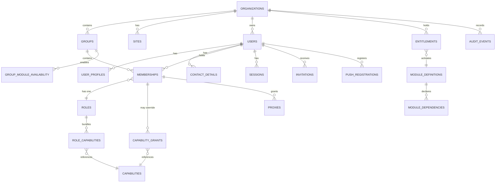
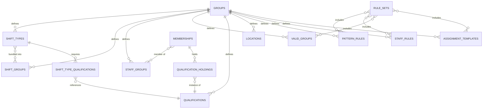
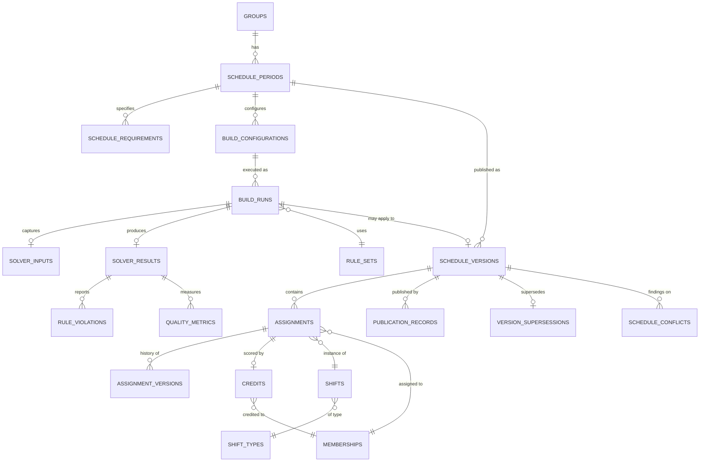
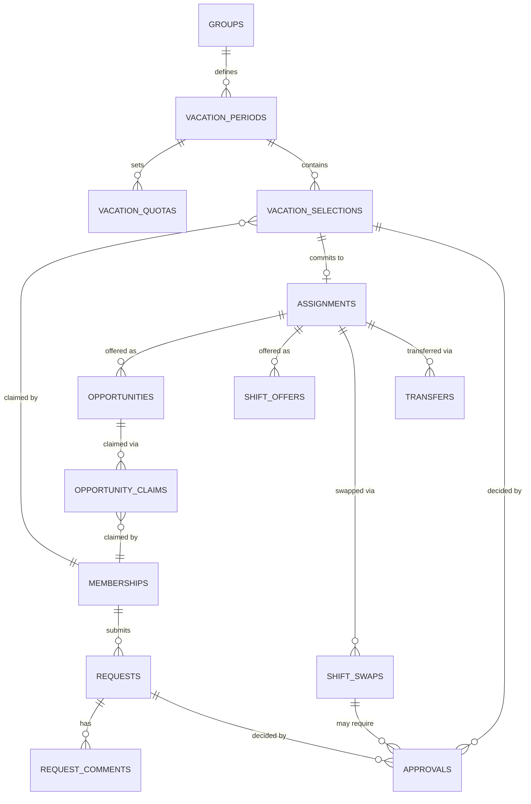
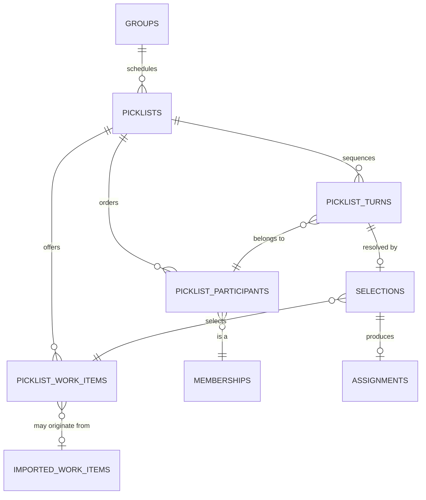
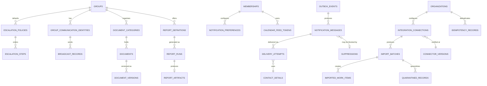

# 06 — Data Architecture

**Status: `PROPOSED`.** Logical schema only. **No migration was created and none should be inferred from this document.**

---

## 1. Conventions

Applied to every table unless explicitly noted.

| Convention | Rule |
|---|---|
| **Tenant key** | Every tenant-scoped table carries `organization_id`. Group-scoped tables also carry `group_id` |
| **Composite FK** | `(organization_id, group_id)` references `groups (organization_id, id)` — a mismatched pair is rejected by the database |
| **Primary key** | Opaque surrogate (UUID). **Never a natural key** — natural keys leak into URLs and cannot be re-issued |
| **Concurrency** | Mutable aggregates carry `version` (integer) for optimistic concurrency |
| **Audit fields** | `created_at`, `created_by`, `updated_at`, `updated_by` (membership ids) |
| **Soft lifecycle** | `status` / `state` enums. **Hard deletion is prohibited wherever history or audit references the row** |
| **Time** | `timestamptz` for instants; `date` for calendar dates. **Shift-local semantics resolve against the group timezone** |
| **RLS** | Every tenant-scoped table has RLS enabled **and** `FORCE ROW LEVEL SECURITY`, with its policy created in the same migration |
| **Sensitivity** | Every table classified `NONE` \| `INTERNAL` \| `PII` \| `SENSITIVE-PII` \| `SECRET` |

**Sensitivity classes and their handling:**

| Class | Handling |
|---|---|
| `NONE` | Configuration; no restriction beyond tenancy |
| `INTERNAL` | Tenant-isolated business data |
| `PII` | Field-level minimisation by role; never sent to third parties |
| `SENSITIVE-PII` | Absence and credential data; narrower access; retention-controlled |
| `SECRET` | Hash-stored only; never returned by an API; never logged |
| **`EXCLUDED`** | **Patient-level content. No table in this schema carries it** |

---

## 2. Entity-relationship diagrams

Split by domain — one diagram covering 60+ tables would be unreadable and therefore useless.

### 2.1 Foundation: tenancy, identity, authorization

### 2.2 Configuration and qualifications

### 2.3 Schedule lifecycle

### 2.4 Requests, vacation, marketplace

### 2.5 Picklist

### 2.6 Notifications, communications, integrations, artifacts

---

## 3. Table catalogue

**Field key:** Tenant · Key fields · Relationships · Uniqueness · State · Version · Audit · Retention · Sensitivity · Archive/deletion · Indexes · DB invariants.

### 3.1 Foundation

| Table | Tenant | Key fields | Uniqueness | State | Ver | Sensitivity | Retention / deletion | Key indexes | DB invariants |
|---|---|---|---|---|:--:|---|---|---|---|
| `organizations` | self | `name`, `status`, `data_region?` | `slug` | active/suspended/closed | ✓ | `INTERNAL` | Indefinite; closure archives | `slug` | — |
| `groups` | org | `organization_id`, `name`, `timezone`, settings | `(organization_id, slug)` | active/archived | ✓ | `INTERNAL` | Indefinite | `(organization_id)` | **`timezone` NOT NULL** |
| `sites` | org | `organization_id`, `name`, `address?`, `timezone?` | `(organization_id, slug)` | active/archived | ✓ | `INTERNAL` | Indefinite | `(organization_id)` | — |
| `users` | org | `email`, `account_type`, `status`, `password_hash` | **`(organization_id, lower(email))`** | invited→active→suspended→deactivated→archived | ✓ | `PII`/`SECRET` | **Never hard-deleted where history exists** | `(organization_id, lower(email))` | `account_type ∈ {person,functional,placeholder}` |
| `user_profiles` | org | names, locale, preferences | `user_id` | — | ✓ | `PII` | Purge on archive | `user_id` | — |
| `contact_details` | org | `kind`, `value`, `verified`, `visibility` | `(user_id, kind, value)` | active/superseded | ✓ | `SENSITIVE-PII` | Purge on archive | `user_id` | `kind ∈ {email,mobile,home,pager}` |
| `sessions` | org | `user_id`, `expires_at`, `absolute_expires_at` | token hash | active/revoked | — | `SECRET` | Purge on expiry | `user_id`, `expires_at` | **Token stored hashed only** |
| `invitations` | org | `email`, `token_hash`, `expires_at`, `consumed_at` | `token_hash` | pending/accepted/expired/revoked | — | `SECRET` | Purge after expiry+grace | `token_hash` | **Single-use: `consumed_at` set atomically** |
| `memberships` | org+group | `user_id`, `group_id`, `role_id`, `work_percentage`, `show_in_schedule`, `pick_position_exclusions`, `preferences` | `(user_id, group_id)` | invited/active/suspended/ended | ✓ | `INTERNAL` | Retained after end | `(group_id)`, `(user_id)` | **Composite FK to `groups`** |
| `roles` | org/system | `key`, `name`, `is_system_role` | `(organization_id, key)` | active/deprecated | ✓ | `INTERNAL` | Indefinite | `(organization_id)` | — |
| `capabilities` | system | `key`, `description`, `module_key` | `key` | — | — | `INTERNAL` | Indefinite | `key` | — |
| `role_capabilities` | org | `role_id`, `capability_key` | `(role_id, capability_key)` | — | — | `INTERNAL` | — | `role_id` | — |
| `capability_grants` | org+group | `membership_id`, `capability_key`, `granted`, `granted_by` | `(membership_id, capability_key)` | — | ✓ | `INTERNAL` | Retained | `membership_id` | — |
| `entitlements` | org | `module_key`, `state`, `effective_from`, `effective_to?` | `(organization_id, module_key)` | trial/active/suspended/revoked | ✓ | `INTERNAL` | Indefinite | `(organization_id)` | `effective_to > effective_from` |
| `module_definitions` | system | `key`, `name` | `key` | — | — | `NONE` | — | — | — |
| `module_dependencies` | system | `module_key`, `depends_on` | `(module_key, depends_on)` | — | — | `NONE` | — | — | **No self-dependency** |
| `group_module_availability` | org+group | `group_id`, `module_key`, `available` | `(group_id, module_key)` | — | ✓ | `INTERNAL` | Retained | `group_id` | — |
| `push_registrations` | org | `membership_id`, `platform`, `token_hash`, `consent_granted_at` | `token_hash` | consent-pending/active/stale/invalid/revoked | ✓ | `PII`/`SECRET` | Purge on archive | `membership_id` | **Token hashed; consent required** |

### 3.2 Configuration and qualifications

| Table | Tenant | Key fields | Uniqueness | State | Ver | Sensitivity | Notes |
|---|---|---|---|---|:--:|---|---|
| `locations` | group | `name`, `site_id?` | `(group_id, name)` | active/archived | ✓ | `NONE` | — |
| `shift_types` | group | `code`, `name`, `start_time`, `end_time`, `crosses_midnight`, `is_on_call`, `is_manual_only`, `is_daily_pick`, `attracts_stipend`, `credit_weight` | `(group_id, code)` | active/retired | ✓ | `NONE` | **Never hard-deleted while assignments reference it** |
| `shift_groups` | group | `name`, `scoring_mode`, `weight`, `allow_request`, `request_off_label` | `(group_id, name)` | active/archived | ✓ | `NONE` | `scoring_mode ∈ {hard,weighted}` |
| `staff_groups` | group | `name` | `(group_id, name)` | active/archived | ✓ | `INTERNAL` | — |
| `valid_groups` | group | `shift_type_ids`, `allowed_pick_positions` | `(group_id, name)` | active/archived | ✓ | `NONE` | — |
| `qualifications` | group | `key`, `name`, `requires_expiry`, `issuing_body?` | `(group_id, key)` | active/retired | ✓ | `INTERNAL` | Not deleted while holdings exist |
| `qualification_holdings` | group | `membership_id`, `qualification_id`, `valid_from`, `valid_until?`, `evidence_ref?`, `status` | `(membership_id, qualification_id, valid_from)` | pending/valid/expiring/expired/revoked | ✓ | **`SENSITIVE-PII`** | **Retained after expiry for audit** |
| `shift_type_qualifications` | group | `shift_type_id`, `qualification_id` | pair | — | — | `NONE` | — |
| `pattern_rules` | group | `name`, `trigger`, `days_of_week`, `date_scope`, `segments` | `(group_id, name)` | active/disabled/archived | ✓ | `NONE` | Rule text versioned |
| `staff_rules` | group | `name`, `conditions`, `action`, `action_params`, `days_of_week` | `(group_id, name)` | active/disabled/archived | ✓ | **`INTERNAL`** | **Names individuals — narrower access** |
| `assignment_templates` | group | `name`, `cycle_length_weeks`, `entries` | `(group_id, name)` | active/disabled/archived | ✓ | `NONE` | — |
| `rule_sets` | group | `name`, rule id arrays | `(group_id, name)` | active/archived | ✓ | `NONE` | Referenced by builds |

### 3.3 Schedule lifecycle

| Table | Tenant | Key fields | Uniqueness | State | Ver | Sensitivity | Notes |
|---|---|---|---|---|:--:|---|---|
| `schedule_periods` | group | `name`, `start_date`, `end_date`, `status` | `(group_id, name)` | planning/published/closed | ✓ | `NONE` | **Exclusion constraint: no overlapping periods per group** |
| `schedule_requirements` | group | `period_id`, `date`, `shift_type_id`, `required_count` | `(period_id, date, shift_type_id)` | — | ✓ | `NONE` | `required_count >= 0` |
| `build_configurations` | group | `period_id`, `rule_set_id`, scope arrays, solver options | `(period_id, name)` | — | ✓ | `INTERNAL` | — |
| `build_runs` | group | `configuration_id`, `state`, `parent_build_ids`, `protected_assignment_ids`, `solver_version`, `random_seed`, timestamps | — | draft→validating→readiness→queued→running→completed/…/archived | ✓ | `INTERNAL` | **Partial unique index: at most one non-terminal run per period** |
| `solver_inputs` | group | `build_run_id`, canonical problem snapshot, `input_hash` | `build_run_id` | — | — | `INTERNAL` | **`input_hash` enables reproducibility checks** |
| `solver_results` | group | `build_run_id`, `outcome`, counts, objective scores, `solver_log_ref?` | `build_run_id` | — | — | `INTERNAL` | `outcome ∈ {optimal,feasible,infeasible,failed}` |
| `rule_violations` | group | `solver_result_id`, `severity`, rule ref, affected refs, `explanation`, `remediation?` | — | — | — | `INTERNAL` | Severity taxonomy per PO-DEC-13 (pending) |
| `quality_metrics` | group | `solver_result_id`, `metric_key`, `value`, `threshold`, `within_band` | `(solver_result_id, metric_key)` | — | — | `INTERNAL` | — |
| `schedule_versions` | group | `period_id`, `version_number`, `source_build_id?`, `published_at`, `published_by`, `superseded_at?`, `is_locked`, `circulation_state`, `change_summary` | `(period_id, version_number)` | draft/circulated/published/superseded/locked | ✓ | `INTERNAL` | **Never hard-deleted** |
| `publication_records` | group | `version_id`, `actor`, `prerequisites_snapshot`, `at` | `version_id` | — | — | `INTERNAL` | Append-only |
| `version_supersessions` | group | `superseded_version_id`, `superseding_version_id`, `at` | pair | — | — | `INTERNAL` | Append-only |
| `shifts` | group | `version_id`, `date`, `shift_type_id`, `location_id?`, `required_count` | `(version_id, date, shift_type_id, location_id)` | — | ✓ | `INTERNAL` | — |
| `assignments` | group | `version_id`, `membership_id`, `shift_id`, `date`, `starts_at`, `ends_at`, `origin`, `pick_position?`, `is_locked`, `status` | — | active/superseded/cancelled | ✓ | `INTERNAL` | **Exclusion constraint prevents overlapping active assignments per membership** |
| `assignment_versions` | group | `assignment_id`, `sequence`, before/after, `changed_by`, `mechanism`, `at` | `(assignment_id, sequence)` | — | — | `INTERNAL` | **Append-only history** |
| `credits` | group | `assignment_id`, `credited_membership_id`, `weight`, `reason?`, `moved_by?` | `assignment_id` | active/reassigned/voided | ✓ | `INTERNAL` | **Credited membership may differ from assignee — by design** |
| `schedule_conflicts` | group | `version_id?`/`build_result_id?`, `severity`, refs, `explanation`, `remediation?`, `state` | — | open/accepted/resolved | ✓ | `INTERNAL` | **Sign-off blocked while any `hard-breach` is `open`** |

### 3.4 Requests, vacation, marketplace

| Table | Tenant | Key fields | Uniqueness | State | Ver | Sensitivity | Notes |
|---|---|---|---|---|:--:|---|---|
| `requests` | group | `membership_id`, `type`, `target_date`/`range`, `shift_type_id?`, `shift_group_id?`, `status`, `idempotency_key` | `(membership_id, idempotency_key)` | draft→submitted→under-review→approved/denied/withdrawn/expired→applied | ✓ | **`SENSITIVE-PII`** | `type ∈ {availability, time-off, no-call, shift-preference, shift-group-off}` |
| `request_comments` | group | `request_id`, `author`, `body`, `at` | — | — | — | `SENSITIVE-PII` | Append-only |
| `approvals` | group | `subject_type`, `subject_id`, `decision`, `decided_by`, `at`, `reason?`, `batch_id?` | — | terminal | — | `INTERNAL` | **Polymorphic; a reversal is a new record** |
| `vacation_periods` | group | `start_date` (Mon), `end_date` (Fri), mode flags | `(group_id, start_date)` | draft/open/closed/archived | ✓ | `NONE` | — |
| `vacation_quotas` | group | `period_id`, `kind`, `membership_id?`, `week_start?`, `value` | — | — | ✓ | `INTERNAL` | `kind ∈ {personal-entitlement, weekly-capacity}` |
| `vacation_selections` | group | `membership_id`, `period_id`, `week_start`, `status`, `committed_to_version_id?`, `commit_idempotency_key` | `(membership_id, period_id, week_start)` | available→pending→approved/denied/withdrawn→committed | ✓ | **`SENSITIVE-PII`** | **Commit idempotent by (selection, version)** |
| `opportunities` | group | `assignment_id`, `posted_by`, `status`, `claimed_by?`, `claimed_at?`, `eligibility_rule?`, `locum_priority_until?` | — | posted/claimed/withdrawn/expired | ✓ | `INTERNAL` | **Atomic conditional claim** |
| `opportunity_claims` | group | `opportunity_id`, `membership_id`, `at`, `outcome` | `(opportunity_id, membership_id)` | — | — | `INTERNAL` | Losing claims recorded for audit |
| `shift_offers` | group | `assignment_id`, `from`, `to`, `status`, `expires_at?` | — | proposed/accepted/declined/withdrawn/expired | ✓ | `INTERNAL` | — |
| `shift_swaps` | group | two assignment ids, two membership ids, `status`, `requires_approval`, `approval_id?` | — | proposed→counterpart-accepted→awaiting-approval→approved→executed/failed | ✓ | `INTERNAL` | **Both legs or neither** |
| `transfers` | group | `assignment_id`, `from`, `to`, `reason`, `approved_by?` | — | proposed/approved/executed/rejected | ✓ | `INTERNAL` | Administrative path |

### 3.5 Picklist

| Table | Tenant | Key fields | Uniqueness | State | Ver | Sensitivity | Notes |
|---|---|---|---|---|:--:|---|---|
| `picklists` | group | `date`, `mode`, `status`, `is_locked`, `turn_time_limit_seconds?`, `current_position?` | `(group_id, date)` | draft/ready/active/paused/completed/cancelled | ✓ | `INTERNAL` | `mode ∈ {paper, manual-entry, integrated}` |
| `picklist_participants` | group | `picklist_id`, `membership_id`, `position`, `status`, `acting_proxy_id?` | `(picklist_id, position)`, `(picklist_id, membership_id)` | waiting/active/picked/skipped/excluded/proxied | ✓ | `INTERNAL` | Order derived from the published schedule |
| `picklist_work_items` | group | `picklist_id`, `title`, `description?`, `procedure_count?`, `site_id?`, `display_order`, `status`, `origin`, `import_batch_id?` | `(picklist_id, display_order)` | available/taken/withdrawn | ✓ | `INTERNAL` | **Never patient-level content**; free text sanitised |
| `picklist_turns` | group | `picklist_id`, `participant_id`, `started_at`, `ends_at`, `outcome` | `(picklist_id, participant_id, started_at)` | active/resolved/expired/skipped | ✓ | `INTERNAL` | **Server owns `ends_at`** |
| `selections` | group | `turn_id`, `work_item_id`, `picked_by`, `picked_at`, `resulting_assignment_id?`, `idempotency_key` | **`(picklist_id, work_item_id)` unique where accepted** | terminal | — | `INTERNAL` | **The uniqueness constraint is what makes double-claim impossible** |
| `proxies` | group | `grantor_membership_id`, `grantee_membership_id`, `scope`, `status`, `valid_from`, `valid_until?`, `locked_by_admin` | — | active/suspended/revoked/expired | ✓ | `INTERNAL` | `scope ∈ {notifications-only, act-on-behalf}` |

### 3.6 Notifications and communications

| Table | Tenant | Key fields | Uniqueness | State | Sensitivity | Notes |
|---|---|---|---|---|---|---|
| `outbox_events` | org+group | `event_type`, `payload`, `occurred_at`, `processed_at?`, `attempts` | — | pending/processing/processed/dead | `INTERNAL` | **Written in the domain transaction** |
| `notification_messages` | group | `recipient_membership_id`, `event_type`, subject refs, `status`, `escalation_policy_id?`, `idempotency_key` | `idempotency_key` | pending/sending/delivered/failed/no-destination/cancelled | `PII` | **Bodies never carry clinical content** |
| `delivery_attempts` | group | `message_id`, `channel`, `contact_detail_id?`, `attempt_number`, `sent_at`, `outcome`, `provider_ref?`, `error_code?` | `(message_id, channel, attempt_number)` | terminal | `PII` | **`no-destination` is explicit, never a silent skip** |
| `escalation_policies` | group/user | `scope_type`, `scope_id`, `window`, `locked_by_admin` | `(scope_type, scope_id, window)` | active/superseded | `INTERNAL` | `window ∈ {business-hours, personal-hours}` |
| `escalation_steps` | group | `policy_id`, `offset_minutes`, `channels` | `(policy_id, offset_minutes)` | — | `INTERNAL` | Ordered |
| `notification_preferences` | user | `membership_id`, per-channel prefs, quiet hours | `membership_id` | — | `INTERNAL` | User override beats group default |
| `suppressions` | org | `contact_value_hash`, `reason`, `at` | `contact_value_hash` | active/lifted | `PII` | Bounce/opt-out handling |
| `contacts` *(view)* | group | Directory projection over memberships + contact details | — | — | `PII` | **Field-level minimisation by role** |
| `group_communication_identities` | group | `display_name`, `address_local_part`, sender/recipient policy, `archive_retention_days` | `(group_id, address_local_part)` | active/suspended/retired | `PII` | Recipients resolve **only** from the roster |
| `broadcast_records` | group | `identity_id`, `sender`, `recipient_count`, `filter_applied`, `at` | — | — | `PII` | **Every broadcast audited** |

### 3.7 Integrations, artifacts, cross-cutting

| Table | Tenant | Key fields | Uniqueness | State | Sensitivity | Notes |
|---|---|---|---|---|---|---|
| `integration_connections` | org | `kind`, `version`, `direction`, `schedule?`, **`auth_ref`**, `state`, `target_group_id` | `(organization_id, kind, target_group_id)` | draft/certified/active/suspended/retired | `INTERNAL` | **`auth_ref` points to a secret store — no credential is stored here** |
| `connector_versions` | system | `kind`, `version`, `schema_ref`, `certified_at?` | `(kind, version)` | — | `NONE` | — |
| `import_batches` | group | `connection_id`, `received_at`, `source_ref`, **`idempotency_key`**, `state`, counts, `failure_reason?` | **`(connection_id, idempotency_key)`** | received→validating→de-identifying→reconciling→applied/quarantined/rejected/failed | `INTERNAL` | **Uniqueness makes re-delivery a no-op** |
| `imported_work_items` | group | `batch_id`, allowlisted fields only | — | — | `INTERNAL` | **Allowlisted fields only — enforced upstream** |
| `quarantined_records` | group | `batch_id`, `reason`, **field names only** | — | open/reviewed/discarded | `INTERNAL` | **Never stores rejected values** |
| `documents` | group | `category_id`, `filename`, `content_type`, `size_bytes`, `storage_key`, `uploaded_by`, `version`, `status`, `scan_status` | `(category_id, filename, version)` | uploading/available/superseded/archived/purged | `INTERNAL` | Purge invalidates URLs |
| `document_versions` | group | `document_id`, `version`, `storage_key`, `uploaded_by`, `at` | `(document_id, version)` | — | `INTERNAL` | Prior versions retained |
| `document_categories` | group | `name`, `parent_id?`, `visibility_role_ids?` | `(group_id, name, parent_id)` | active/archived | `INTERNAL` | Role-based visibility |
| `calendar_feed_tokens` | user | `membership_id`, **`token_hash`**, `created_at`, `last_used_at?`, `revoked_at?`, `rotated_from_id?` | `token_hash` | active/rotated/revoked | **`SECRET`** | **Hash only; plaintext shown once; no PII in URL** |
| `report_definitions` | group/system | `key`, `name`, `parameters`, `output_formats`, `required_capability` | `(group_id, key)` | active/deprecated | `INTERNAL` | — |
| `report_runs` | group | `definition_id`, `requested_by`, `parameters`, `state`, `at` | — | queued/running/completed/failed | `INTERNAL` | Async only |
| `report_artifacts` | group | `run_id`, `storage_key`, `format`, `expires_at` | `run_id` | available/expired/purged | `INTERNAL` | May aggregate `PII`; expiring |
| `audit_events` | org (group-tagged) | `actor_user_id`, `actor_membership_id?`, **`on_behalf_of_membership_id?`**, `action`, `subject_type`, `subject_id`, `occurred_at`, `mechanism`, `before?`, `after?`, `correlation_id`, `source_channel` | — | **append-only** | `INTERNAL` | **No update/delete operation exists; grants withhold them.** `before`/`after` must not embed PII or clinical content |
| `idempotency_records` | org | `key`, `operation`, `request_hash`, `response_ref`, `expires_at` | `(organization_id, key, operation)` | — | `INTERNAL` | Replay returns the recorded result |

---

## 4. Database invariants worth naming

These are enforced **by the database**, not by application convention — the distinction matters because application code has bugs.

| # | Invariant | Mechanism |
|---|---|---|
| **D-1** | No overlapping active assignments for one membership, **including across midnight** | Exclusion constraint over `(membership_id, tstzrange(starts_at, ends_at))` where `status = 'active'` |
| **D-2** | No overlapping schedule periods per group | Exclusion constraint over `(group_id, daterange(start_date, end_date))` |
| **D-3** | **At most one work item claimed per picklist** | Partial unique index on `selections (picklist_id, work_item_id)` where accepted — **this is what makes simultaneous selection safe** |
| **D-4** | At most one non-terminal build per period | Partial unique index on `build_runs (period_id)` where `state` non-terminal |
| **D-5** | Group belongs to its stated organization | Composite FK `(organization_id, group_id) → groups (organization_id, id)` |
| **D-6** | Import re-delivery is a no-op | Unique `(connection_id, idempotency_key)` |
| **D-7** | Request submission is idempotent | Unique `(membership_id, idempotency_key)` |
| **D-8** | Audit is append-only | No `UPDATE`/`DELETE` grant on `audit_events` for the application role |
| **D-9** | Version numbers are gapless per period | Unique `(period_id, version_number)` + allocation inside the publication transaction |
| **D-10** | Tenant tables cannot be read without a policy | RLS enabled + `FORCE` + policy created in the same migration (CI-enforced) |

---

## 5. Retention and archival

| Class | Retention |
|---|---|
| **Audit events** | **Indefinite.** Never deleted. Partitioned by time when volume justifies |
| Schedule versions and assignments | Indefinite — history is the product |
| Requests and vacation | Retained; PII minimised on account archive |
| Notification messages and attempts | Rolling window (policy-driven); outcomes retained longer than bodies |
| Documents | Policy-driven per organization; purge invalidates URLs |
| Report artifacts | Expiring by default |
| Sessions, invitations, feed tokens | Purged after expiry; **revoked tokens retained for audit** |
| Import batches | Retained; **quarantined content never stored — only field names and counts** |
| Idempotency records | Expiring |

**Account archive** minimises PII on the user and contact records while **preserving audit history and historical assignments** — deleting a user who holds history would corrupt the audit trail, which is exactly what an audit trail exists to prevent.

---

## 6. Capability mapping

Every entity in the authoritative domain model ([14-domain-model.md](../../schedulepoint-research/reports/14-domain-model.md), 53 entities) has a table or view here. Capability coverage: [18-capability-traceability.md](18-capability-traceability.md).

**ADR:** [ADR-0003](decisions/ADR-0003-database-and-tenancy-strategy.md). **Gates:** `G-ARCH` (design), `G-PROD` (SBX-004, SBX-018, SBX-035).
