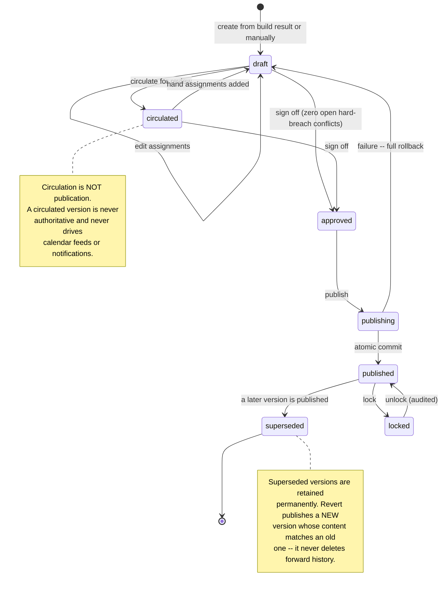
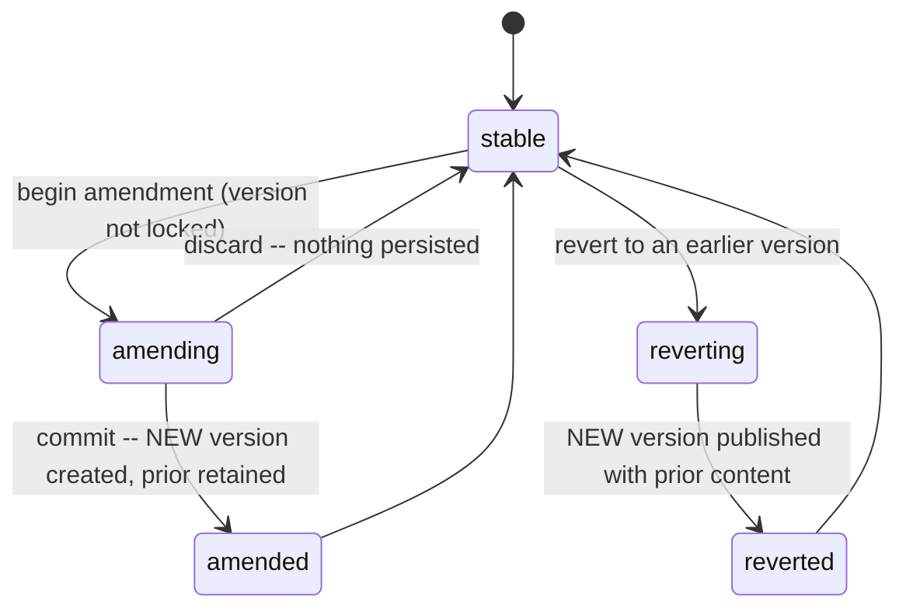

# 07 — Schedule and Publication

**Status: `PROPOSED`.** Implements CAP-014, CAP-019, CAP-020, and the publication half of CAP-018.

> **REVISED 2026-08-01 (CAR-007).** **The previous schema could not implement the lifecycle this document describes.** Assignment identity is now separated from versioned snapshots; the overlap constraint is scoped by version, which is what makes cloning a published version possible without mutating history; published immutability is enforced by **database triggers, not prose**; `locked` is one concept; and the version state set matches the state machine. Governing spec: [SPEC-05](specs/SPEC-05-schedule-version-identity-and-publication.md), which includes the required V1→V2→V3 proof.

---

## 1. The concepts, kept distinct

Nine concepts that are routinely conflated. Conflating any two of them produces a system that cannot answer "what changed, when, and who decided?" — which is the question this domain exists to answer.

| Concept | Is | Is not |
|---|---|---|
| **Schedule period** | A bounded date range a schedule is planned for | A schedule |
| **Schedule requirement** | How much staffing is needed on a date for a shift type | An assignment |
| **Shift** | An instance of a shift type on a date, needing *n* people | The type, and not a person's assignment |
| **Assignment** | **One person, one shift, one date** | The shift, and not the fairness credit |
| **Draft schedule version** | A mutable candidate | Visible to staff |
| **Published schedule version** | **An immutable, staff-visible snapshot** | Editable |
| **Build result** | The engine's output plus its explanation | A schedule — it must be *applied* to a draft |
| **Manual override** | A human edit, audited, with a reason where it breaches a soft rule | The production scheduling mechanism |
| **Fixed assignment** | A locked assignment the engine must preserve | A suggestion |
| **Progressive-build stage** | One build in a chain, solving around protected assignments | A separate schedule |

**Credit is a tenth concept and deliberately separate from Assignment.** Who *works* a shift and who is *scored* for it can legitimately differ. Flattening credit into the assignment would silently destroy fairness accounting — see [06](06-data-architecture.md) §3.3.

---

## 2. Version model

### 2.1 The rules that matter

| Rule | Why |
|---|---|
| **Published versions are immutable** | An "amendment" creates a **new version**; the prior one is superseded, never edited |
| **Supersession never deletes** | The history *is* the audit trail |
| **Revert publishes forward** | Reverting to v3 creates v5 with v3's content. Deleting v4 would erase the fact that it happened |
| **Circulation ≠ publication** | A circulated draft is not authoritative, does not appear in feeds, and triggers no staff notifications |
| **Prerequisites re-checked at commit** | Not only at request time — the world can change between clicking publish and the transaction committing |
| **Version numbers are gapless per period** | Allocated inside the publication transaction (D-9) |

---

## 3. Publication transaction

**Publication is one database transaction.** This is a deliberate architectural choice and the strongest argument for the modular monolith: in a service-oriented design this would be a saga with compensating actions, and the failure modes would be materially worse.

Inside the transaction:

1. Re-check prerequisites (approval state, **zero open `hard-breach` conflicts**, period not closed)
2. Allocate the next `version_number` for the period
3. Insert `schedule_versions` row
4. Materialise `shifts` and `assignments` for the version
5. Supersede the prior published version (`version_supersessions`)
6. Write `publication_records` with a prerequisites snapshot
7. Write `audit_events`
8. **Insert `outbox_events`** for affected-staff notification

Commit. **Only then** do workers dispatch notifications.

**Failure means nothing happened** — no partial publication, no orphan notifications. **Notification failure cannot roll back a successful publication** (I-11): the outbox row is already committed, and delivery retries independently.

### 3.1 Concurrency

**Period-scoped serialisation.** Two schedulers publishing the same period concurrently must not both succeed. Enforced by taking a period-scoped advisory lock at the start of the transaction, plus the gapless-version unique constraint as a backstop. The loser receives a clear conflict message naming the version that won — not a generic error.

Assignment edits within a draft use **optimistic concurrency** on `assignments.version`. A stale edit is **rejected, never merged blindly** — silently merging two schedulers' conflicting edits is how schedules become wrong in ways nobody notices.

---

## 4. Post-publication revision

**Side effects of an amendment or revert:**

| Effect | Behaviour |
|---|---|
| **Notification** | **Affected staff only** — never a group-wide broadcast (CAP-027) |
| **Calendar feeds** | Reflect the new current published version on next fetch; no push needed |
| **Reports** | Reference a specific version; a report generated against v3 remains correct and says so |
| **Audit** | Full diff recorded: what changed, for whom, by whom, why |
| **Downstream** | Opportunities and swaps referencing changed assignments are **re-validated and invalidated where necessary** ([09](09-requests-vacation-opportunities-transfers.md) §5) |

---

## 5. Manual scheduling — scope and limits

**Manual scheduling is `ADMINISTRATIVE FALLBACK OR OVERRIDE` and is additionally required to exist.** It is never the production scheduling mechanism (**I-05**, which means *only* this — the Add/New/Create save contract is **I-13**, CAR-023).

| Permitted use | Notes |
|---|---|
| **Administrator override** | Correcting engine output |
| **Recovery mechanism** | When the engine is unavailable or a result is unusable |
| **Fixed-assignment creation** | Hand-assign, then lock, then let the engine build around it |
| **Progressive-build input** | Locked manual assignments are protected inputs |
| **Development-stage tool** | An internal alpha may lean on it **with explicit disclosure** |

**Constraints that apply identically to manual and engine-produced assignments:**

- Validates the **same** eligibility and conflict rules — a manual assignment breaching a hard constraint is **blocked, not warned**
- Breaching a **soft** rule requires an explicit recorded **override reason**
- Fully audited with actor, mechanism, before/after
- Can be locked to protect it from regeneration

> **Manual scheduling may not be presented as the production scheduling solution** — not in the UI, not in documentation, not in a release note. A release relying on it does not satisfy the production gate.

---

## 6. Comparison

Any two versions, or any two build results, can be compared:

| Dimension | Output |
|---|---|
| Assignments | Added, removed, moved (with both endpoints) |
| Credits | Reassigned |
| Fairness metrics | Per-dimension delta |
| Conflicts | Introduced vs. resolved |
| Unfilled demand | Delta |
| Protected assignments | Confirmation that every one was preserved |

**Comparison is a first-class operation, not a diff view bolted on.** A scheduler deciding whether to publish v4 over v3 needs to see what actually changed — without it, "is this better?" is unanswerable.

---

## 7. Capability and gate mapping

| Capability | Coverage |
|---|---|
| **CAP-014** Schedule periods and versioned publication | §2, §3, §4 |
| **CAP-018** Partial-schedule circulation | §2 (`circulated` state — explicitly not publication) |
| **CAP-019** Manual scheduling, override, fixed assignments | §5 |
| **CAP-020** Schedule viewing and daily assignment sheet | Read models over published versions; **no patient-level content** |

**ADR:** [ADR-0007](decisions/ADR-0007-schedule-versioning.md). **Gates:** `G-PROD` — SBX-017 (progressive builds), SBX-018 (publication, versioning, revert). **Neither has been executed.**
