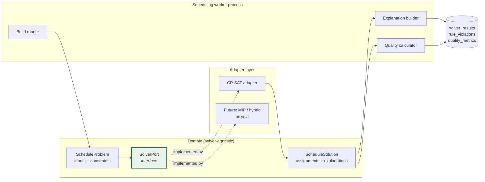
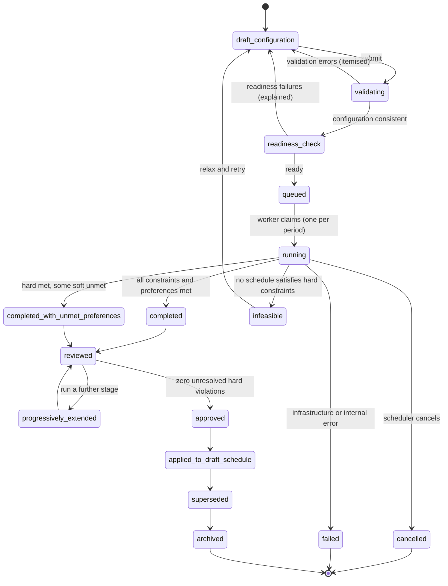

# 08 — Automated Scheduling Engine

**Status: `PROPOSED`.** Technical architecture for the requirements in [report 21](../../schedulepoint-research/reports/21-automated-scheduling-production-requirements.md).

> **REVISED 2026-08-01 (CAR-005, CAR-006).** **The solver runs in a separately packaged Python worker** — OR-Tools has no official Node.js binding (**verified fact S-04**), so the previous "one runtime" claim was unimplementable. `Constraint[]` is replaced by a **typed, versioned rule AST with a closed node set, a compiler, and migrations**; weekday FTE and maximum-assignment data gain canonical tables; cancellation is enforced by **process termination**, not a polled flag; **the "minimal infeasibility core" and "dominated alternative" promises are withdrawn** in favour of bounded tiers with honest degraded states; and reproducibility states exactly what is *not* promised. Governing spec: [SPEC-04](specs/SPEC-04-solver-runtime-and-rule-model.md), [ADR-0020](decisions/ADR-0020-solver-runtime-packaging.md).

> **Clean-room statement.** This is an **independently designed** architecture for a required capability. It does not reproduce, reverse-engineer, or approximate any proprietary scheduling algorithm. **No source algorithm was ever observed** — no build was run in thirteen research phases. What follows derives from the required *outcomes*, from observable configuration surfaces, and from independent engineering judgement.

**Automated scheduling is `REQUIRED FOR PRODUCTION` (CAP-015, C-08).** Manual scheduling is override and recovery only ([07](07-schedule-and-publication.md) §5).

---

## 1. Shape



**The `SolverPort` boundary is a hard architectural requirement, not a nicety.** It is what makes the solver replaceable.

---

## 2. Solver-neutral domain model

The domain expresses the problem in **its own vocabulary**, never the solver's.

```
ScheduleProblem
  period            { start, end, groupTimezone }
  demand            [ { date, shiftTypeId, requiredCount, locationId? } ]
  candidates        [ { membershipId, workPercentage, fte[], qualifications[],
                        availability[], preferences{}, isLocum } ]
  shiftTypes        [ { id, code, start, end, crossesMidnight, flags } ]
  protected         [ { assignmentId, membershipId, shiftId, date, reason } ]
  history           { priorCredits[], priorAssignments[], statisticsRange }
  constraints       [ Constraint ]
  objectives        [ ObjectiveTerm ]
  seed              integer
```

```
ScheduleSolution
  outcome           optimal | feasible | infeasible | failed
  assignments       [ { membershipId, shiftId, date, rationale? } ]
  satisfiedHard     [ constraintId ]
  unsatisfiedSoft   [ { constraintId, membershipId?, magnitude } ]
  violations        [ { severity, ruleRef, affected, explanation, remediation? } ]
  objectiveScores   { overall, perDimension{} }
  unmetDemand       [ { date, shiftTypeId, shortfall, reason } ]
  fairness          { perDimension{} }
  infeasibilityCore [ constraintId ]        // when infeasible
  preserved         [ assignmentId ]
  changed           [ { assignmentId, from, to } ]
  solverVersion, seed, inputHash, durationMs
```

**Nothing in these structures mentions the solver.** No domain module imports the solver library — enforced by a CI import check.

---

## 3. Constraint representation

### 3.1 Two enforcement classes

| Class | Semantics | Violation |
|---|---|---|
| **Hard** | Must hold. A schedule violating one is **infeasible** | **Never permitted in an accepted schedule** |
| **Soft / weighted** | Scored; traded off in the objective | Reported with magnitude and owner |

### 3.2 Hard constraints

| Constraint | Representation |
|---|---|
| No overlapping assignments (**incl. across midnight**) | Per membership, per overlapping time interval |
| Minimum rest | Per membership, consecutive-assignment gap |
| **Qualification validity at the assignment date** | Candidate eligibility filter, date-aware |
| Site restriction | Candidate × shift-type filter |
| Availability (approved absence, vacation) | Candidate unavailability window |
| Maximum assignments | Per membership, per shift type, per weekday, per period |
| Position restriction | Legal pick positions per shift set |
| **Protected assignments preserved** | Fixed variables — the solver may not move them |
| Author-declared hard rules | Any pattern or staff rule set to hard |

### 3.3 Soft constraints and objective terms

| Term | Direction |
|---|---|
| Target percentage adherence | Minimise deviation from `workPercentage` targets |
| Minimum assignments | Penalise falling below a floor |
| **Optimal call spacing** | Maximise minimum spacing between call assignments — **independently designed** |
| Weekend spacing | Penalise consecutive weekend calls |
| Sequence and pattern rules | Penalise offset violations |
| Linked shifts | Penalise unlinked pairs |
| Backup-call pairing | Penalise unpaired assignments |
| Alternating-week template adherence | Penalise template deviation |
| Staff-specific conditional rules | Weighted per rule |
| Preference satisfaction | Reward honoured ON / preferred-shift requests |
| Locum minimisation | Penalise locum use where permanent staff were eligible |
| Fairness | Minimise variance of normalised credits, weekends, high-burden shifts |
| **Schedule stability** | Penalise churn versus the prior published version |

### 3.4 The integer-scaling decision

**Documented fact (S-01): CP-SAT constraints must be expressed over integers; non-integer terms require scaling.**

This is a real modelling constraint. **Decide the scaling factor once, globally, and document it** — a per-rule ad-hoc choice produces objective terms that are not comparable, which silently corrupts every trade-off the solver makes.

Recommendation: a fixed precision (e.g. weights and percentages scaled by 10⁴) applied uniformly, with the factor recorded in `solver_inputs` so a result can always be interpreted.

---

## 4. Build lifecycle

**Sixteen states**, per report 21 §4, which governs. `infeasible` and `failed` are **different states and must never be conflated** — the first is a statement about the problem, the second about the system.



### 4.1 Job handling

| Aspect | Design |
|---|---|
| **Submission** | Validated, then enqueued **transactionally** with the build-run row |
| **Queueing** | Dedicated scheduling-worker queue; **one running build per period** (D-4) |
| **Claiming** | Worker claims atomically; heartbeats while running |
| **Cancellation** | Cooperative — the runner polls a cancellation flag; **no partial result persists** |
| **Timeout** | Configurable per dataset class; timeout → `failed` with a timeout reason (**not** `infeasible`) |
| **Retry** | **A new build in the chain — never a mutation of the old one.** Reruns are explicit and auditable |
| **Crash recovery** | A reaper transitions stale `running` builds (dead heartbeat) to `failed` |
| **Worker isolation** | Solver runs **only** on scheduling workers, never in a web process |
| **Result persistence** | Result + violations + quality metrics written in one transaction |

---

## 5. Progressive builds

| Requirement | Design |
|---|---|
| **Locked manual assignments** | `protected_assignment_ids` on the build run; fixed in the model |
| **Locked prior solver assignments** | A stage's output can be protected before the next stage |
| **Staged generation** | Each stage is a distinct build with `parent_build_ids` |
| **Partial-schedule circulation** | Stage output → draft version in `circulated` state — **never published** |
| **Manual assignments between stages** | Become protected inputs to the next stage |
| **Regeneration around protected** | The solver solves only the unprotected remainder |
| **Comparison between stages** | Full diff ([07](07-schedule-and-publication.md) §6) |
| **Explicit unlocking** | Deliberate action; **never a side effect of regeneration** |
| **Reasoned overrides** | Unlocking or breaching a hard constraint requires a recorded reason |
| **Audit** | Every stage, protection change, and override |

**The verification that matters:** SBX-017 must prove protected assignments are preserved **exactly** — not approximately, not usually.

---

## 6. Explainability

**A build must never return only a success/failure flag.** This is the single biggest deliberate improvement over the observed source product, which surfaces no explanation at all — and it is what makes an automated scheduler trustworthy enough to adopt.

| Question a scheduler asks | How the system answers |
|---|---|
| **Why is this person eligible / ineligible?** | Candidate eligibility trace: which filter passed or failed (qualification expiry, availability, site, max-count, position restriction) with the specific value that decided it |
| **Why was this assignment made?** | Assignment rationale: which objective terms it improved, which alternatives were dominated |
| **Which preference was not satisfied?** | `unsatisfiedSoft[]` naming the constraint, the affected person, and the magnitude |
| **Which hard constraint prevented a result?** | `infeasibilityCore[]` — a **minimal conflicting set expressed in domain terms**, not solver internals |
| **Why does demand remain unfilled?** | `unmetDemand[]` with a reason per slot (no eligible candidate / all at maximum / all unavailable) |
| **How was fairness measured?** | `fairness{}` per dimension with the normalisation basis stated |
| **What changed between builds?** | `changed[]` plus the comparison view |

**Infeasibility explanation is the hardest of these and the most important.** "No schedule exists" is useless; "these three hard constraints conflict on 14 March, and relaxing the minimum-rest rule or adding one qualified candidate would resolve it" is actionable.

**Design note, stated honestly:** the CP-SAT overview we consulted documents an `INFEASIBLE` status (S-01) but **did not document assumption-based infeasibility analysis**. The architecture therefore does **not** assume a solver-provided minimal core. Where the solver cannot supply one, the runner derives an explanation by **constraint-relaxation search** — re-solving with constraint subsets relaxed to identify a minimal conflicting set. This is slower and is bounded by a time budget; it is a deliberate design cost accepted to meet the requirement. **Whether the solver can do better must be established by benchmark (SBX-031), not assumed.**

---

## 7. Reproducibility

**Absolute requirement** (report 21 §7). Identical inputs and seed must produce an identical schedule.

| Mechanism | Purpose |
|---|---|
| **Pin the solver version** | Recorded in `solver_results.solver_version` |
| **Fix the random seed** | Recorded on the build run |
| **Hash the canonical input** | `solver_inputs.input_hash` — proves two runs saw the same problem |
| **Fix worker/thread count where parallelism affects determinism** | **Documented as unknown** — S-01 did not cover parallelism. Must be established by SBX-031 |
| **Canonical ordering** | Inputs sorted deterministically before translation, so map iteration order cannot leak in |

> **Why reproducibility matters more than it appears:** without it, a scheduler cannot distinguish "the engine changed its mind" from "an input changed." Every conversation about a rebuild becomes unfalsifiable.

---

## 8. Quality calculation

Twelve dimensions from report 21 §7, computed by the quality calculator and persisted per result.

| Dimension | Configurable? |
|---|---|
| **Hard-constraint violations** | **No — absolute. Zero** |
| Staffing-demand fulfilment | Yes |
| Fair distribution by FTE | Yes |
| Call-spacing quality | Yes |
| Weekend distribution | Yes |
| High-burden shift distribution | Yes |
| Preference satisfaction | Yes |
| Locum use | Yes |
| Workload variance | Yes |
| Schedule stability | Yes |
| **Reproducibility** | **No — absolute** |
| **Explainability** | **No — absolute** |

Thresholds are per-organization. **Sign-off is blocked while any `hard-breach` conflict is open** — the gate is structural, not advisory.

---

## 9. Performance

**Benchmark datasets** (report 21 §8.2): small · medium (30 staff + 6 locums, 3 months — closest to the public claim) · large (100+ staff, 6 months) · multi-site · large rule set · multi-stage progressive.

**Initial targets** (report 21 §8.3, deliberately conservative): medium **< 60 s** with zero hard violations and fairness within band.

> **The public claim of ~2,700 cells in as little as 5 seconds is `PUBLIC SOURCE CLAIM` evidence about a different product's proprietary implementation. It is not a SchedulePoint guarantee**, and it says nothing about the *quality* of what was produced. **Speed without a paired quality measure must never be reported.**

Targets are approved or revised on SBX-031 evidence: all six datasets, ≥5 runs each, reporting wall-clock **and** every quality dimension. **PO-DEC-23 remains pending.**

---

## 10. The replacement boundary

**Mandatory.** The `SolverPort` interface is the only contact point between domain and solver.

| Rule | Enforcement |
|---|---|
| No domain module imports the solver library | **CI import check** |
| The adapter translates `ScheduleProblem` → solver model → `ScheduleSolution` | Adapter package only |
| Domain tests run against a **stub solver** | No solver in the domain test path |
| Adding a second solver adds an adapter, not a domain change | Contract test suite runs against every adapter |

**This is what makes a future MIP or hybrid approach a change of adapter rather than a rewrite.** A hybrid — heuristic warm start feeding CP-SAT — is the most likely evolution and requires no domain change under this boundary.

---

## 11. Observability

| Signal | Purpose |
|---|---|
| Build duration, by dataset class | Performance regression detection |
| Outcome distribution | How often `infeasible` occurs, and for which groups |
| Quality metrics per run | Trend, not just point-in-time |
| Violations by severity and rule | Which rules are actually binding |
| Queue depth and wait time | Capacity planning |
| Worker memory and CPU | Right-sizing solver hosts |
| Cancellation and timeout rates | Are targets realistic? |

---

## 12. Capability and gate mapping

| Capability | Coverage |
|---|---|
| **CAP-015** Automated generation | §1–§4, §7, §9 |
| **CAP-016** Rule engine | §3 |
| **CAP-017** Progressive builds | §5 |
| **CAP-018** Partial circulation | §5 + [07](07-schedule-and-publication.md) §2 |
| **CAP-059** Conflict detection and build-quality verification | §6, §8 |
| **CAP-058** Qualification enforcement | §3.2 (hard constraint) |

**ADR:** [ADR-0006](decisions/ADR-0006-solver-architecture.md). **Gates:** `G-PROD` — SBX-015, SBX-016, SBX-017, SBX-019, SBX-031. **None executed.**

---

## 13. Open items

| # | Item | Resolution path |
|---|---|---|
| 1 | CP-SAT parallelism vs. determinism | **SBX-031** — not assumed either way |
| 2 | Whether solver-provided infeasibility cores are available | SBX-031; relaxation search is the designed fallback |
| 3 | Performance targets | PO-DEC-23 pending, on SBX-031 evidence |
| 4 | Conflict-severity taxonomy | PO-DEC-13 pending |
| 5 | Rule authoring: self-service vs. vendor-configured | PO-DEC-05 pending |
