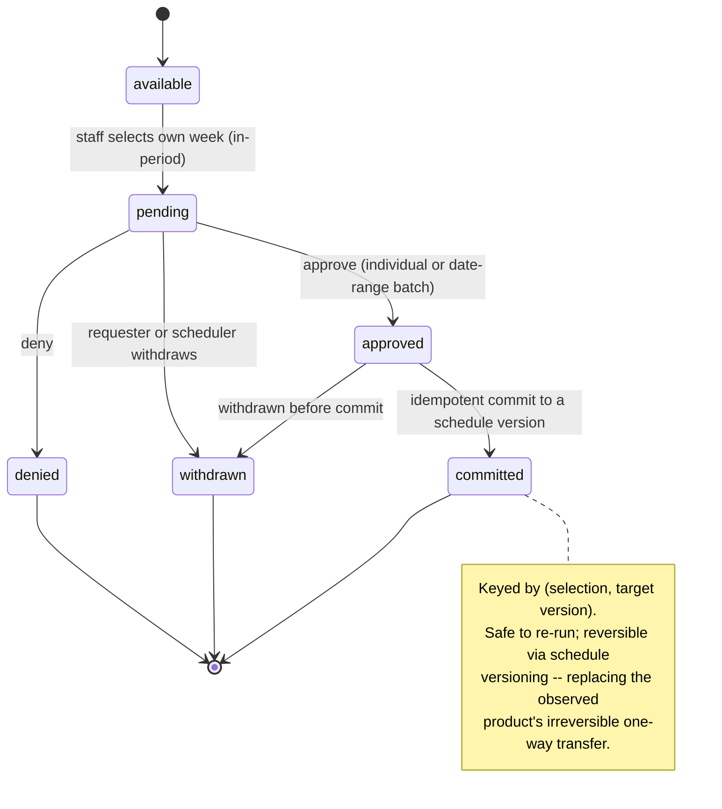
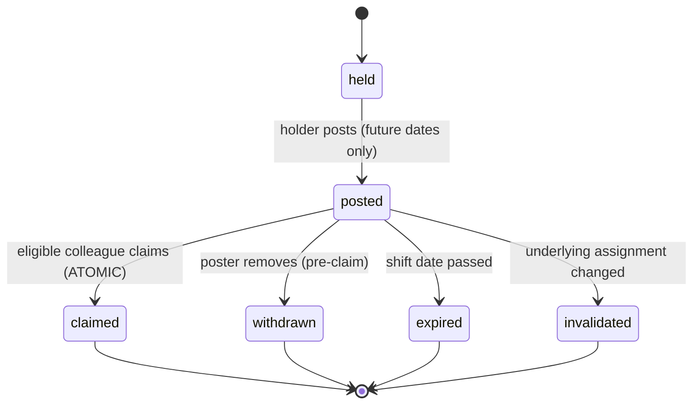
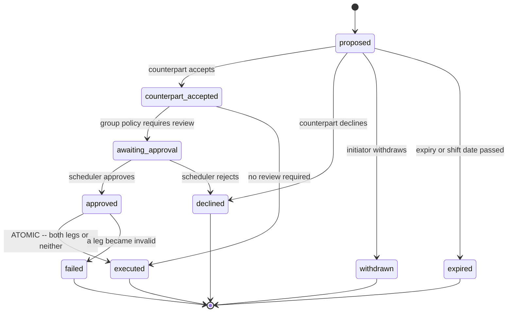

# 09 — Requests, Vacation, Opportunities, Swaps, Transfers

**Status: `PROPOSED`.** Implements CAP-021..CAP-026 and the C-03 approved resolution.

> **REVISED 2026-08-01 (CAR-011, CAR-018).** The typed-request narrative is now backed by **constrained subtype tables, per-subtype transition matrices, and database CHECKs** — the previous single nullable table could not enforce them ([SPEC-08](specs/SPEC-08-request-subtype-lifecycles.md)). Marketplace claims and approvals now **bind the source assignment version and snapshot**, with a deterministic lock order and a deadlock policy ([SPEC-13](specs/SPEC-13-marketplace-version-binding.md)). **PO-DEC-03 remains `pending`; the request design is explicitly provisional.**

---

## 1. Canonical typed requests

**C-03 working default (PO-DEC-03 — `pending`, product-owner direction 2026-08-01):** one Request **aggregate root** with **constrained subtype records** and a **linked but distinct** Vacation lifecycle. **This is not an approved decision, and the design is provisional** ([SPEC-08](specs/SPEC-08-request-subtype-lifecycles.md) §8 states what changes if it is decided otherwise).

> **The explicit warning applies here:** do **not** force genuinely different lifecycles into one indistinguishable status field. Shared infrastructure ≠ shared state machine.

### 1.1 Shared vs. subtype-specific

| Shared by every request type | Subtype-specific |
|---|---|
| Requester membership · target date or range · submission time · status · comments · approvals · audit trail · idempotency key · deadline enforcement · withdrawal semantics | Vacation: week, quota/grant accounting, commit-to-version Shift-group off: target shift group Shift preference: desired shift type and strength No Call: scope across all on-call types |

### 1.2 Types and their lifecycles

| Type | Distinct lifecycle behaviour |
|---|---|
| **`availability`** (ON request) | Engine input; may be honoured without an explicit approval step where policy allows |
| **`time-off`** (OFF) | Standard approval path |
| **`no-call`** | Broader than OFF — excludes **all** on-call shift types for the date |
| **`shift-preference`** | Non-binding engine input; "unsatisfied" is a normal, reportable outcome rather than a denial |
| **`shift-group-off`** | Targets a shift group; requires the group's `allow_request` flag |
| **`vacation-selection`** | **Materially different** — quota accounting, batch approval, and an idempotent commit to a schedule version |

**Vacation is a linked specialisation, not a parallel universe.** It shares the request infrastructure and audit trail but carries its own entity ([06](06-data-architecture.md) §3.4) and its own state machine (§3).

### 1.3 Common request lifecycle

```mermaid
stateDiagram-v2
    [*] --> draft
    draft --> submitted: submit (server re-validates deadline)
    submitted --> under_review: approver opens
    submitted --> withdrawn: requester withdraws
    under_review --> approved: approver approves
    under_review --> denied: approver denies
    under_review --> withdrawn: requester withdraws
    submitted --> expired: window closed, no decision
    under_review --> expired: window closed, no decision
    approved --> applied: reflected in a published version
    denied --> [*]
    withdrawn --> [*]
    expired --> [*]
    applied --> [*]
```

**Withdrawal and denial are distinct transitions with distinct actors** — the requester withdraws, the approver denies. Collapsing them loses the ability to answer "did they change their mind, or were they refused?"

### 1.4 Enforcement

| Requirement | Design |
|---|---|
| **Server-side validation** | Deadline (`request_until_date`), eligibility, and target validity re-checked **server-side at submission** — a client-side deadline is not a deadline |
| **Idempotency** | Unique `(membership_id, idempotency_key)` (D-7); a double-submitted request creates one record |
| **Audit** | Submission, decision, withdrawal, comment edits |
| **Notification triggers** | Requester on decision; approver on new submission |
| **Administrator override** | A scheduler may act on behalf of a requester — **always attributed to the scheduler**, never silently to the requester |
| **Engine integration** | Approved requests become engine inputs ([08](08-automated-scheduling-engine.md) §2) |
| **Concurrency** | Two approvers deciding concurrently — **first wins**; the second gets a clear conflict, not a silent overwrite |

---

## 2. Vacation

### 2.1 Two modes, both required

| Mode | Behaviour |
|---|---|
| **Quota / grant** | Per-staff entitlement (`personal-entitlement`) plus per-week org capacity (`weekly-capacity`) |
| **Open** | Staff select any weeks, subject to review |

**Over-quota is advisory, not blocking.** The variance indicator warns; approval still succeeds. This is a deliberate behaviour preserved from the observed product — schedulers routinely need to approve over capacity for legitimate reasons, and a hard block would push that decision outside the system where it is invisible.

### 2.2 Lifecycle

### 2.3 Commit to schedule

**The most consequential operation in this domain.** In one transaction: create OFF assignments in a new draft version → mark selections `committed` with `committed_to_version_id` → audit → enqueue notifications.

| Property | Design |
|---|---|
| **Idempotent** | Keyed by `(selection, target version)`. Re-running a range commit **cannot duplicate** |
| **Reversible** | Via schedule versioning ([07](07-schedule-and-publication.md) §4) — not by a destructive undo |
| **Atomic** | Balance decrement commits with the approval; the commit itself is one transaction |
| **Concurrency** | **Two approvals racing the last entitlement unit — exactly one succeeds** (SBX-013) |

---

## 3. Opportunities

### 3.1 Lifecycle

### 3.2 The atomic claim

**The sharpest concurrency case outside the picklist.** Two eligible colleagues claiming simultaneously must resolve to **exactly one winner**.

Design **CHANGED (CAR-018)**: the conditional claim now binds **`source_version_id` and `source_snapshot_id` as well as status**, because exactly one claimant winning the *status* race does not prove the underlying assignment still exists in the form that was offered. Zero rows updated means someone else won; the loser receives a clear "already claimed" message, **never a silent failure or a double assignment**.

**Re-validation happens at claim time, not post time.** The world changes between posting and claiming: the claimant's qualifications may have expired, they may have acquired a conflicting assignment, or minimum rest may now be violated. Validating only at post time would produce assignments that were legal when offered and illegal when taken.

| Check at claim time | Rejects |
|---|---|
| Qualification validity **at the shift date** | Expired or missing credential |
| Schedule conflict | Overlapping assignment |
| Minimum rest | Insufficient gap |
| Maximum assignments | Would exceed a cap |
| Position restriction | Illegal pick position |
| **Staff-over-locum priority window** | A locum claiming during the priority window |

### 3.3 Fan-out and recipient filtering

On posting, notification intents are emitted to **eligible group members**, honouring opt-outs. Recipients resolve **only from the roster** — never free-text addresses.

**Staff-over-locum preference** (CAP-025) is implemented as a **configurable priority window**: for the first *n* hours only non-locum members may claim; afterwards all eligible members may. Default 24h — **PO-DEC-16 pending**.

### 3.4 Stale opportunities

An opportunity whose underlying assignment is changed by a publication, swap, or manual edit is **invalidated**, not silently left claimable. The poster is notified. This is enforced by consuming `AssignmentMoved` / `SchedulePublished` events.

---

## 4. Swaps and transfers — three distinct operations

The observed product conflates these under one label. **They are separated here because their authorization and atomicity requirements genuinely differ.**

| Operation | Shape | Approval |
|---|---|---|
| **Shift offer** | Directed 1:1 — "will you take my shift?" | Recipient accepts |
| **Shift swap** | **Mutual exchange** — two assignments trade holders | Counterpart accepts; scheduler review **configurable** |
| **Transfer** | Administrative reassignment | Scheduler authority |

### 4.1 Swap lifecycle

**Counterpart acceptance is always required.** Scheduler review is a **per-group policy** (`review-required` | `review-optional`) — the public source indicates review is configurable, not mandatory. **PO-DEC-17 pending** on the default.

### 4.2 Atomicity

**Both legs commit or neither does.** One transaction updates both assignments, writes both audit entries, and enqueues both notifications. If either leg has become invalid — reassigned, cancelled, now conflicting — the whole swap moves to `failed` and **nothing changes**.

**A half-executed swap is the worst possible outcome**: one person believes they are off, another does not know they are on, and the schedule is silently wrong. The transaction boundary exists specifically to make it impossible.

---

## 5. Cross-cutting invalidation

Schedule changes ripple. Consuming `SchedulePublished`, `ScheduleAmended`, and `AssignmentMoved`:

| Affected | Action |
|---|---|
| Posted opportunities on a changed assignment | **Invalidated**; poster notified |
| Pending offers/swaps referencing a changed assignment | **Invalidated**; both parties notified |
| Approved requests for a changed date | Re-evaluated; conflicts surfaced to the scheduler |
| Committed vacation | Unaffected — already materialised as assignments in the version |

---

## 6. Capability and gate mapping

| Capability | Coverage |
|---|---|
| **CAP-021** Requests (ON, OFF, No Call, preference) | §1 |
| **CAP-022** Vacation, both modes | §2 |
| **CAP-023** Vacation commit | §2.3 |
| **CAP-024** Opportunity board with fan-out | §3 |
| **CAP-025** Staff-over-locum preference | §3.3 |
| **CAP-026** Offers, swaps, transfers | §4 |

**Gates:** `G-BETA` — SBX-010, SBX-011, SBX-012, SBX-013, SBX-013b, SBX-014b, SBX-014c. **None executed.**

**Pending decisions:** PO-DEC-03 (request model — confirmatory), PO-DEC-14 (default vacation mode), PO-DEC-15 (recipient filtering), PO-DEC-16 (locum window), PO-DEC-17 (review policy).
