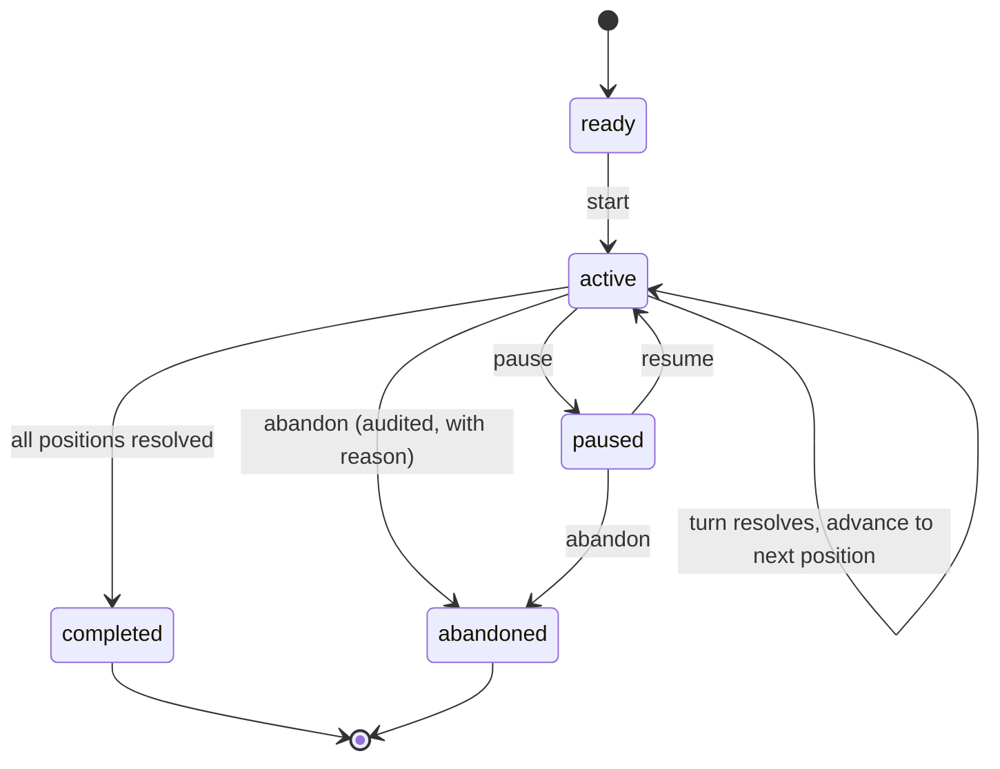
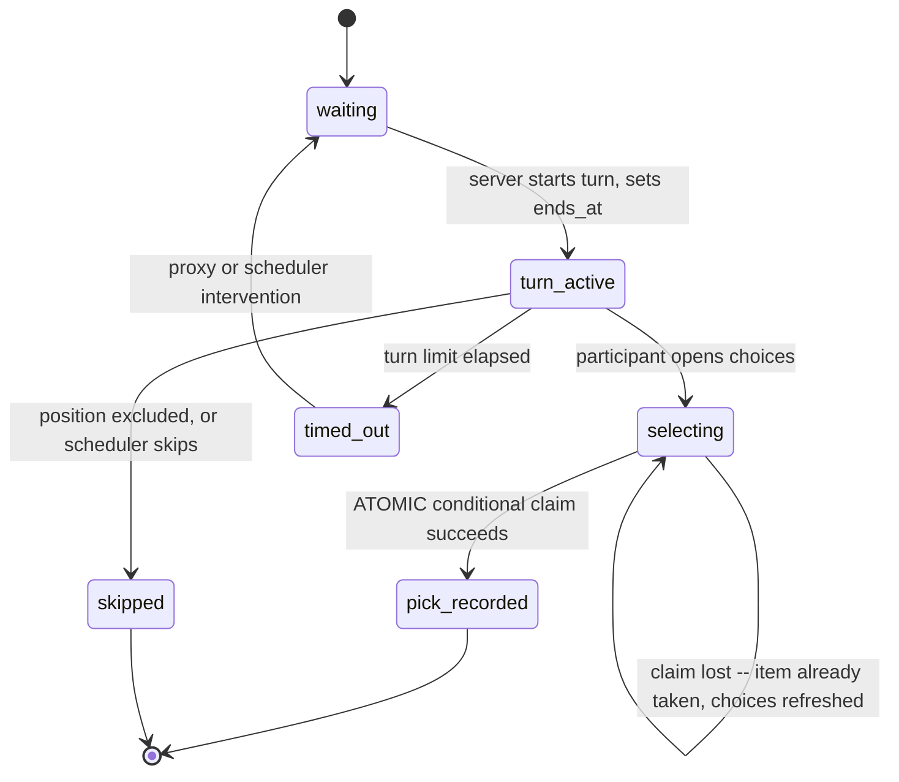

# 10 — Picklist and Real-Time

**Status: `PROPOSED`.** Implements **PO-DEC-18 (APPROVED)** and CAP-030..CAP-034, CAP-060.

> **This is the highest-concurrency, least-evidenced area of the product.** The picklist is the source product's signature feature, and its execution was **never observed** across thirteen research phases. Every lifecycle here is a SchedulePoint design; none is an observation. The sandbox tests in §11 are not optional polish — they are how this design becomes trustworthy.

**No patient-identifying information appears anywhere in this domain.** Work items carry titles, counts, and sanitised descriptions only.

---

## 1. Three operating modes

**CAP-060.** Mode is group configuration and is a precondition of `ready`.

| Mode | Work items | Picking | Disposition |
|---|---|---|---|
| **Paper** | Entered or imported | **Offline.** Results recorded afterwards by the scheduler | `ADMINISTRATIVE FALLBACK OR OVERRIDE` |
| **Manual-entry** | Typed by the scheduler | Live, in-product | `REQUIRED FOR PRODUCTION` |
| **Integrated** | **Imported via a certified connector** ([12](12-integrations-and-ingestion-privacy.md)) | Live, in-product | `REQUIRED FOR PRODUCTION` |

Imported and manually-created work items **coexist in one pool** — a group with an integration still adds items the hospital system does not know about. Switching mode never destroys an in-flight list.

**Integrated mode requires the `hospital_integration` entitlement**, which depends on `picklist` ([05](05-tenancy-entitlements-authorization.md) §3.2).

---

## 2. Preparation

```mermaid
stateDiagram-v2
    [*] --> draft: create (MUST stage, never persist on click)
    draft --> draft: add/edit/reorder work items; re-sync participants
    draft --> ready: validate (mode set, >=1 participant, >=1 work item)
    ready --> draft: reopen for editing
    draft --> cancelled: cancel
    ready --> cancelled: cancel
    ready --> [*]: hand off to execution
    cancelled --> [*]
```

**Participants are derived from the published schedule**, not authored here — pick order comes from the schedule's pick positions.

**The design-system safety contract applies absolutely (I-05 / CAP-050):** **no control labelled Add, New, or Create may persist anything before a completed form, validation, and an explicit Save.** This is enforced at the component level, not by convention, and is tested for every such control.

---

## 3. Execution



**Turn lifecycle within `active`:**



---

## 4. Server-authoritative state (PO-DEC-18)

**The server owns turn state and the clock. The client owns nothing.**

| Property | Design |
|---|---|
| **Turn ownership** | `picklist_turns` in PostgreSQL is the single source of truth |
| **The clock** | `ends_at` is **set and evaluated server-side**. A client clock is display only |
| **Advancement** | The coordinator advances; a client cannot cause advancement |
| **State broadcast** | Coordinator pushes state changes to subscribed clients |
| **Client role** | Render state; send commands. **Never authoritative** |

**Why this matters concretely:** if the client owned the clock, a user with a slow connection or a paused tab would lose turns unfairly, and a user with a manipulated clock could hold a turn indefinitely. Neither is acceptable in a system that decides who works.

---

## 5. Real-time transport

**Approved design (PO-DEC-18):**

| Requirement | Design |
|---|---|
| **Server-authoritative push for turn-critical state** | WebSocket from the real-time coordinator |
| **Atomic state transitions** | Every durable transition is a database transaction |
| **Version / concurrency tokens** | Each picklist and turn carries a `version`; clients echo it; stale commands are rejected |
| **Reconnection and resynchronization** | On reconnect the client sends its last-known version; the server replies with a **full state snapshot** if behind |
| **Visible connection and staleness state** | The UI always shows live / reconnecting / stale — **the user is never guessing** |
| **Explicit refresh fallback** | Always available; never the primary mechanism for turn-critical state |
| **Page-scoped connections** | A connection opens **only** on a page with a live feature — **never globally on every page** |
| **Ordinary refresh for administrative lists** | Picklist Manager index and history use normal request/refresh |

**Tenant context is resolved at connect time from the session** ([05](05-tenancy-entitlements-authorization.md) §4.5), never from a subscribe message. A subscribe request outside the connection's tenant is denied and logged as a security event.

### 5.1 Message contracts

**Server → client (state):** `PicklistState` (full snapshot) · `TurnStarted` · `TurnResolved` · `WorkItemTaken` · `PicklistCompleted` · `ConnectionStale`

**Client → server (commands):** `SubscribePicklist` · `SelectWorkItem` · `RequestSnapshot` · `Heartbeat`

Every command carries an **idempotency key** and the client's known `version`. Every state message carries the authoritative `version`.

**Contracts are defined independently of the transport** — replacing WebSocket would not change them.

---

## 6. Simultaneous selection — exactly one winner

**The requirement:** two participants (or a participant and their proxy) selecting the same work item at the same instant must resolve to **exactly one accepted outcome**.

**The mechanism is a database uniqueness constraint, not application logic:**

```
Partial unique index on selections (picklist_id, work_item_id) WHERE accepted
```

The selection path, in one transaction:

1. Verify the turn is `turn_active` and belongs to the actor (or their `act-on-behalf` proxy)
2. Verify the turn has not expired **by server clock**
3. `INSERT` the selection — **the unique index decides the race**
4. On unique violation → the item was taken; return "already taken" with a refreshed choice list
5. On success → mark the work item `taken`, create the assignment, resolve the turn, advance
6. Commit; broadcast new state

**Why a constraint rather than a lock or a check-then-write:** a check-then-write has a window; an application lock is another thing that can fail or be forgotten. The constraint cannot be bypassed by any code path, including a future one written by someone who has not read this document.

**Verification:** SBX-022 runs this race **≥50 times** with orchestrated timing. **A single pass is not evidence.**

---

## 7. Timers, expiry, and intervention

| Aspect | Design |
|---|---|
| **Turn limit** | Group-configurable; `ends_at` set server-side at turn start |
| **Expiry** | A sweeper resolves expired turns deterministically — the list **never deadlocks** |
| **Skip** | Automatic on expiry (policy) or scheduler-initiated; **always audited with a reason** |
| **Proxy fallback** | An `act-on-behalf` proxy may select; **the action names both the proxy and the grantor** |
| **Administrator intervention** | Reorder remaining participants, skip, or **pick on behalf of a staff member** — **always attributed to the administrator**, never silently to the staff member |
| **Pause / resume** | Scheduler-controlled; timers suspend |
| **Abandon** | A SchedulePoint addition; audited with a reason |

**Accessibility constraint (CAP-066, SP-HR-5):** the turn allowance **must be achievable using assistive technology**. A timed workflow a screen-reader user cannot complete is an exclusion, not an inconvenience. SBX-033 verifies a timed turn end-to-end with a screen reader.

---

## 8. Failure recovery

| Failure | Behaviour |
|---|---|
| **Client disconnects mid-turn** | **The turn is not lost.** Server state is authoritative; on reconnect the client resyncs |
| **Coordinator process restarts** | State is in PostgreSQL; a new coordinator resumes. Clients reconnect with **backoff and jitter** to avoid a thundering herd |
| **Duplicate command** | Idempotency key makes replay a no-op |
| **Network partition** | Client shows `stale`; commands are rejected with a version conflict and the client resyncs |
| **Selection commits but broadcast fails** | Durable state is correct; the next snapshot corrects every client |

**The ordering is deliberate: persist, then broadcast.** A broadcast without a commit would show users a pick that did not happen.

---

## 9. Notification integration

Turn start emits a **domain event**; [11](11-notifications-and-communications.md) decides delivery. The picklist module never calls a provider.

**Notification and execution are decoupled** — a staff member may be notified by voice call and pick from a desktop browser. This is an explicit design constraint drawn from the public evidence that users may hold notification-only phones.

Events: list-start, turn-start with escalation, per-selection confirmation, completion to staff and administrator.

---

## 10. Mobile and accessibility

| Requirement | Design |
|---|---|
| Mobile-first picking | The picking surface is the most mobile-critical screen in the product |
| Touch targets | ≥44×44 CSS px |
| **Live-region announcements** | Turn changes and remaining-choice updates announced **politely**; turn-start announced **assertively**. Announcements are **throttled** — a live picklist must not flood a screen-reader user |
| Keyboard operation | Full selection flow keyboard-operable |
| No page-level horizontal scroll | At any supported width |
| Reduced motion | Honoured |

---

## 11. Verification

| Test | Establishes |
|---|---|
| **SBX-020** | Preparation in all three modes; no control persists before Save |
| **SBX-021** | Full execution flow: start email, current picker, timer, remaining choices, confirmation, advancement, completion |
| **SBX-022** | **Simultaneous selection — exactly one winner over ≥50 trials** |
| **SBX-023** | Reconnection, stale state, resynchronization |
| **SBX-024** | Turn expiry, skip, proxy fallback |
| **SBX-025** | Administrator intervention and attribution |
| **SBX-026** | Proxy acting authority |
| **SBX-027** | Completion, correction, reopening |
| **SBX-033** | **A timed turn completed via screen reader** |

**All require the LIVE-SIM environment (E-04). None has been executed.**

---

## 12. Capability and gate mapping

CAP-030, CAP-031, CAP-032, CAP-033, CAP-034, CAP-060.

**ADR:** [ADR-0008](decisions/ADR-0008-realtime-picklist-transport.md). **Gates:** `G-ARCH` (transport design — CAP-032), `G-PROD` (execution and concurrency).

**Open:** PO-DEC-19 (default proxy scope) pending. The **source's** real-time behaviour remains `UNRESOLVED` and is not asserted anywhere in this design.
