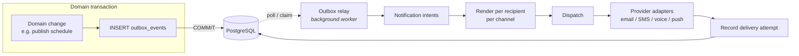
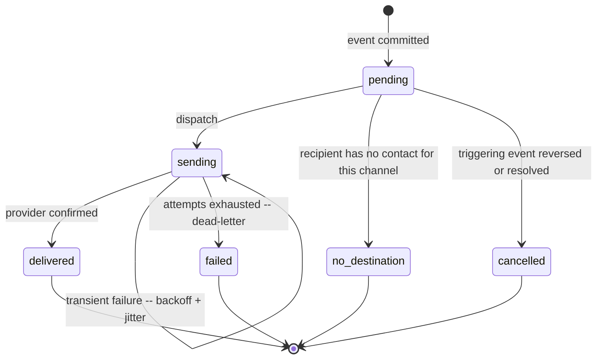

# 11 — Notifications and Communications

**Status: `PROPOSED`.** Implements CAP-040, CAP-041, CAP-042, CAP-043, CAP-056.

---

## 1. Four separated concepts

The single most important structural decision in this domain. Collapsing any two of these produces a system that cannot answer "was it sent, and to whom, and did it arrive?"

| Concept | Is | Owned by | Example |
|---|---|---|---|
| **Domain event** | A fact that happened | The domain module | `SchedulePublished` |
| **Notification intent** | A decision that someone should be told | Notification Delivery | "notify these 12 affected memberships" |
| **Rendered message** | Content for one recipient on one channel | Notification Delivery | The email body |
| **Delivery attempt** | One try on one channel, with an outcome | Notification Delivery | SMTP accepted / bounced |

**A domain module emits facts. It never decides who to notify, never renders content, and never calls a provider.** That is what allows notification delivery to be extracted later without touching a single domain module.

---

## 2. Reliability: transactional outbox

**The outbox row is written inside the domain transaction.** This gives the property that matters:

| Guarantee | Consequence |
|---|---|
| **Domain change commits ⇒ notification will be attempted** | No lost notification |
| **Domain change rolls back ⇒ no notification exists** | No phantom notification about something that did not happen |
| **Notification failure ⇒ domain change is unaffected** | **A provider outage cannot roll back a published schedule** (I-11) |
| **Relay crashes mid-dispatch ⇒ retry** | Idempotency key prevents duplicates |

**Why an outbox rather than a broker publish:** publishing to a broker inside a database transaction is not atomic with it. The classic failure — transaction commits, broker publish fails — silently loses the notification. The classic opposite — publish succeeds, transaction rolls back — notifies about something that never happened. Both are unacceptable when the message is "your shift changed."

**Justification for the PostgreSQL-backed queue** ([02](02-technology-stack.md) §4.2): it makes enqueue transactional with the domain write. Introducing a broker on day one would mean solving this problem immediately and separately.

---

## 3. Channels

| Channel | Notes |
|---|---|
| **Email** | Baseline; bounce handling feeds suppressions |
| **SMS** | Jurisdictional rules vary — a compliance question, not only technical |
| **Automated voice** | **Load-bearing.** Picking depends on reaching people who may not be at a screen |
| **Push** | **CAP-041 / C-10.** Requires explicit consent, invalid-token cleanup, and graceful fallback |
| **In-app** | For non-urgent status; never the sole channel for a turn |

**Every channel is behind a port.** A provider swap touches an adapter, never a domain module.

> **C-10 note:** push is **publicly claimed by the source product but absent from its application**. `POSSIBLY LEGACY` is **not** asserted — there is no evidence of removal. SchedulePoint implements push as a first-class channel because the product's value proposition depends on timely mobile contact.

**Notification delivery and action are decoupled.** A user may be notified by voice and act from a desktop. This is an explicit design constraint, not an accident.

---

## 4. Escalation

**Two windows, group defaults with per-user override** (CAP-040).

```mermaid
stateDiagram-v2
    [*] --> idle
    idle --> step_active: trigger fires; window selected by recipient's local time
    step_active --> escalating: step offset elapsed, unresolved
    escalating --> step_active: further steps remain
    step_active --> resolved: recipient acted
    escalating --> resolved: recipient acted
    escalating --> exhausted: ladder complete, unresolved
    idle --> suppressed: quiet hours or admin lock
    step_active --> suppressed: suppression applies
    resolved --> [*]
    exhausted --> [*]
    suppressed --> [*]
```

| Aspect | Design |
|---|---|
| **Window selection** | Business-hours vs. personal-hours ladder chosen by the recipient's local time, resolved against the **group timezone** |
| **Steps** | Ordered `(offset_minutes, channels[])` |
| **Group default → user override** | User preference wins unless admin-locked |
| **Resolution cancels pending steps** | Immediately — a resolved turn must not keep phoning people |
| **Exhaustion** | Raises an operational alert; never silent |
| **Suppression** | **Recorded, never silent** — a silently suppressed escalation is indistinguishable from a delivery failure |
| **Mandatory notifications** | Certain events (schedule change affecting you) bypass quiet hours by policy; the policy is explicit and configurable |

---

## 5. Delivery outcomes

| Outcome | Meaning |
|---|---|
| `delivered` | Provider confirmed handoff |
| `failed` | Retries exhausted; **dead-lettered for operator inspection, never silently discarded** |
| **`no-destination`** | **Explicit.** The recipient has no contact detail for this channel — never a silent skip |
| `cancelled` | The triggering event was reversed, or resolved before this step fired |

**`no-destination` deserves emphasis.** The observed source has accounts with no phone number, which would leave a voice channel with nothing to dial and no visible signal. Making it an explicit outcome turns an invisible gap into an operational fact.

### 5.1 Retry, deduplication, failover

| Mechanism | Design |
|---|---|
| **Retry** | Bounded exponential backoff **with jitter** |
| **Deduplication** | `idempotency_key` per (message, channel, attempt). **Running the relay twice must not double-send** |
| **Provider failover** | Only where justified by a real outage pattern — a second provider is a second integration to maintain, not free redundancy |
| **Suppression** | Bounces and opt-outs recorded against a **hashed** contact value |
| **Delivery receipts** | Recorded where the provider supplies them |

---

## 6. Content rules

| Rule | Why |
|---|---|
| **Message bodies never carry clinical content** | I-07. A notification is not a clinical record |
| **No PII in URLs** | Deep links carry opaque identifiers; the recipient authenticates |
| **Templates are versioned** | A message a user received must be reconstructable |
| **Localization-ready** | Templates keyed by locale from the start; **retrofitting localisation into concatenated strings is expensive** |
| **Sender identity unambiguous** | Prevents the product becoming a phishing vector from a trusted domain |

---

## 7. Group communication identity (CAP-056)

**C-11:** a "group email address" is claimed as a standard-edition inclusion in the source's commercial material but **has no corresponding field in the application**. Most plausibly provisioned out of band — **unproven**. SchedulePoint models it explicitly.

| Aspect | Design |
|---|---|
| **Membership and eligibility** | Derived from group roster |
| **Permitted senders** | Explicit policy — not everyone in a group may broadcast |
| **Recipient filtering** | **Recipients resolve only from the roster. Never free text** |
| **Opt-outs** | Honoured where operationally and legally permitted; **mandatory operational notices are exempt and marked as such** |
| **Archiving** | Broadcast records retained with sender, recipient count, and filter applied |
| **Delivery failures** | Surfaced to the sender, not swallowed |
| **Abuse prevention** | Rate-limited; volume anomalies alert |
| **Confidentiality** | Recipient lists are `PII`; bulk sends are audited |

**Recommendation: outbound-first.** Inbound reply handling is a materially larger commitment (routing, threading, storage, spam) and no evidence establishes it is needed. **PO-DEC-21 pending.**

---

## 8. Contacts directory (CAP-042, CAP-043)

| Requirement | Design |
|---|---|
| **Directory inclusion by explicit policy** | Not an emergent filter. Default: person accounts with an active membership; functional accounts opt-in; placeholders never |
| **Field-level PII minimisation by role** | The API **never returns fields the UI hides** — hiding in the client is not minimisation |
| **Bulk messaging** | Roster-only recipients, rate-limited, audited with recipient count and actor |

> **C-06 note:** the source's directory shows ~30–35% fewer rows than its roster via an undocumented filter. The cross-group consistency and the confirmed service-only role make exclusion-by-design the leading hypothesis — but **the exact rule remains UNRESOLVED and is not asserted.** SchedulePoint replaces an emergent filter with an explicit policy. SBX-003 would illuminate the source's rule; it is not required for ours.

---

## 9. Observability

Delivery ledger queryable by recipient, event type, channel, and outcome. Metrics: attempts, outcome distribution, retry depth, dead-letter count, escalation exhaustion rate, `no-destination` rate.

**The `no-destination` rate is an operational health metric, not noise** — a rising rate means the roster's contact data is decaying.

---

## 10. Capability and gate mapping

CAP-040, CAP-041, CAP-042, CAP-043, CAP-056.

**ADRs:** [ADR-0009](decisions/ADR-0009-job-and-event-reliability.md), [ADR-0010](decisions/ADR-0010-notification-architecture.md).

**Gates:** `G-PROD` — SBX-030a (delivery, retry, dedup, opt-out, failure), SBX-030b (push viability). **Neither executed.** All tests use **controlled endpoints only — no real person is ever contacted.**

**Pending:** PO-DEC-07 (push — confirmatory), PO-DEC-21 (group identity ownership).
