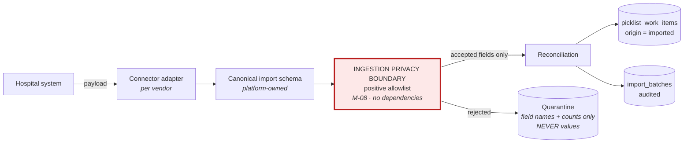
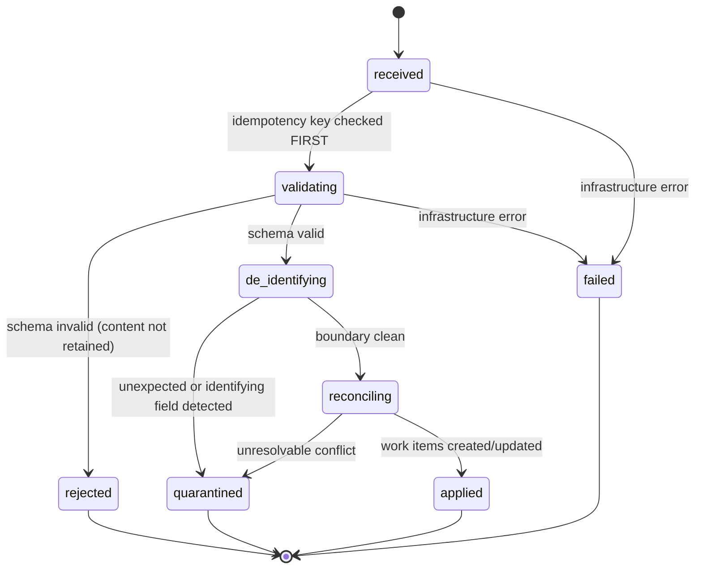

# 12 — Integrations and Ingestion Privacy

**Status: `PROPOSED`.** Implements **PO-DEC-08 (APPROVED)** and CAP-055, CAP-061..CAP-065, CAP-062.

> **This is the highest-consequence privacy boundary in the product.** A scheduling system that accumulates patient data inherits clinical-system regulatory obligations without clinical-system controls. The boundary below exists to make that impossible by construction rather than by policy.

---

## 1. The approved position

**PO-DEC-08:** **SchedulePoint owns and enforces the ingestion privacy boundary. Connector behaviour alone is never trusted to remove identifying information.**

Every connector — first-party, customer-specific, or future — passes through a **platform-controlled positive allowlist**. **No connector may bypass it.** This is structural: the connector interface has no code path that reaches work items without traversing the boundary ([04](04-domain-boundaries.md) §3).

---

## 2. Architecture

**Three layers, and the order matters:**

1. **Connector adapter** — vendor-specific; translates an external payload into the canonical schema. Owned per connector.
2. **Canonical import schema** — **platform-owned**. Connectors adapt to it; it never adapts to them.
3. **Ingestion privacy boundary** — **platform-owned, dependency-free, unbypassable.**

**Why a canonical schema matters commercially as well as technically:** connectors adapt to *our* shape, so **no hospital's IT timeline gates SchedulePoint's own release**. The absence of a vendor specification blocks that connector's certification, not the product.

---

## 3. Connector framework (CAP-055)

| Aspect | Design |
|---|---|
| **Interface** | `fetch()` or `receive()` → canonical payload. **No other capability** — a connector cannot write work items directly |
| **Configuration** | `integration_connections`: kind, version, direction, schedule, **`auth_ref`**, target group, state |
| **Authentication boundary** | **`auth_ref` points to a secret store. No credential is ever stored on the connection record** |
| **Scheduled synchronization** | Cron-like per connection; jitter to avoid synchronised load |
| **Manual retry** | Operator-initiated; **idempotent** |
| **Idempotency** | Unique `(connection_id, idempotency_key)` (D-6) — **re-delivering an identical payload creates nothing** |
| **Provenance** | Every imported work item carries `import_batch_id` and `origin = imported` |
| **Connector versioning** | `connector_versions` with a schema reference and certification record |
| **Certification** | Per connector, before release (§7) |

### 3.1 Named connectors

| Capability | Connector | Status |
|---|---|---|
| **CAP-061** | ORSOS | **`EXTERNAL SPECIFICATION REQUIRED BEFORE CONNECTOR CERTIFICATION`** |
| **CAP-063** | Cerner / Surginet | Same |
| **CAP-064** | Meditech | Same |
| **CAP-065** | Customer-specific | Per-engagement contract |

> **No vendor payload contract is invented here.** The research established these systems are named publicly; **it did not establish their payload shapes**, and this document does not guess. Each contract is an **external specification** obtained from hospital IT and the system vendor. Fabricating a schema would produce a connector that fails on first contact with reality and would misrepresent unverified guesswork as design.

---

## 4. The ingestion privacy boundary (CAP-062)

### 4.1 Positive allowlist — never a deny-list

**The distinction is the whole design.** A deny-list blocks the identifiers you thought of. An allowlist admits only the fields you deliberately chose — everything else, including fields a vendor adds in a future release, is rejected by default.

**Permitted (minimum-necessary operational scheduling data):**

| Field class | Examples |
|---|---|
| Work-item identity | External reference, title, display order |
| Location | Room or location name/identifier |
| Timing | Date, start/end time, expected duration |
| Volume | Procedure **count** — a number, never a description |
| Category | Non-clinical operational category (e.g. a service line label) |

**Prohibited — rejected or quarantined, never persisted:**

- **Patient names**
- **Medical-record numbers**
- **Dates of birth**
- **Health-card or insurance identifiers**
- **Unrestricted clinical free text**
- Any field not on the allowlist, whatever it contains

### 4.2 The restriction extends everywhere

**PO-DEC-08 is explicit that the boundary is not only about the primary table.** Rejected content must not appear in:

| Surface | Enforcement |
|---|---|
| **Storage** | Only allowlisted fields are persisted |
| **Logs** | Ingestion payloads are **never** logged. Log lines carry batch id, counts, and **field names** |
| **Error payloads** | Sanitised — an exception message never embeds payload content |
| **Queue payloads** | Jobs carry a batch reference, **not** the payload |
| **Audit events** | Rejection metadata only: **field names and counts, never values** |
| **Observability** | Traces and metrics carry counts and identifiers, never content |
| **Backups** | Follows from the above — if it never persisted, it is not in a backup |

**Quarantine stores field names and counts, not values.** A quarantined record answers "an unexpected field called X appeared 14 times," which is what an operator needs, without becoming a store of exactly the data the boundary exists to exclude.

### 4.3 Batch lifecycle

| Property | Design |
|---|---|
| **Idempotency checked first** | A duplicate returns the existing batch without reprocessing |
| **Atomic** | A batch applies wholly or not at all — **no partial batch persists** |
| **Reconciliation** | Manually-created work items are **never silently destroyed**; conflicts quarantine for human review |
| **Normalisation** | Character stripping and case normalisation applied per connection configuration |
| **Failure ≠ rejection** | `failed` means the system broke; `rejected` means the payload did not qualify |
| **Notification** | Administrators alerted on quarantine, rejection, and failure. **Silent failure is prohibited** |
| **Replay** | Dead-lettered batches replayable after the cause is fixed |

---

## 5. Reconciliation

| Situation | Behaviour |
|---|---|
| New external item | Created with `origin = imported` |
| Existing item, unchanged | No-op |
| Existing item, changed externally | Updated; change audited |
| **Manually-created item overlapping an import** | **Quarantined for human review — never auto-destroyed** |
| Item disappears from the source | Marked withdrawn, **not deleted** — it may have been picked already |
| Two batches for one date | Reconciled deterministically by receipt order |

---

## 6. Isolation

| Risk | Prevention |
|---|---|
| **Connector routing error** | Target group derived from the **connection record**. **Payload content cannot redirect a batch** |
| Cross-tenant import | Connection is org- and group-scoped; RLS applies to every write |
| Credential exposure | `auth_ref` only; secrets in a managed store; **never logged** |
| Queue poisoning | Payloads validated before enqueue; jobs carry references, not content |
| Connector compromise | A compromised connector **still cannot bypass the boundary** — this is the central benefit of platform enforcement |

---

## 7. Certification (`G-CONN` gate)

**No connector ships without passing every item.**

| Requirement | Evidence |
|---|---|
| External specification obtained | Documented payload contract, auth, direction, scheduling |
| Canonical mapping reviewed | Field-by-field, with the allowlist decision recorded per field |
| **Import validation passed** | **SBX-028** — validation, idempotency, reconciliation, failure |
| **De-identification validated** | **SBX-029** — payloads carrying fabricated patient-shaped fields in **expected and unexpected positions**; **zero patient-level content persists anywhere, including logs** |
| Representative sanitized fixtures | **Wholly fabricated. No real payload, ever** |
| Customer privacy-office approval | Where applicable, per customer |
| Failure and reconciliation documented | Operator runbook |

> **`G-CONN` has not passed and cannot pass from documentation.** It passes when SBX-029 produces evidence.

---

## 8. Relationship to C-09

**C-09 is recorded as a source contradiction that remains UNPROVEN IN BOTH DIRECTIONS**, and this document does not resolve it.

The source publicly claims all patient-identifying data is removed before upload; research separately observed **clinical detail** in the authenticated application. **These may not conflict** — the evidence never established which of four categories the observed content fell into:

| Category | Identifying? |
|---|---|
| Patient-identifying information | **Yes** |
| Non-identifying operational case metadata | No, in isolation |
| Scheduling information | No |
| Free text that *could* carry identifiers | **Potentially** |

**Nothing here asserts that iSchedule.MD did or did not hold patient-identifying information.** SchedulePoint's design discharges the obligation independently of that unresolved question — which is precisely why the boundary is platform-enforced rather than trust-based.

---

## 9. Capability and gate mapping

| Capability | Coverage |
|---|---|
| **CAP-055** Integration framework | §3 |
| **CAP-061/063/064** Named connectors | §3.1 — external specification required |
| **CAP-065** Customer-specific connectors | §3.1 |
| **CAP-062** De-identification boundary | §4 |

**ADRs:** [ADR-0011](decisions/ADR-0011-ingestion-privacy-boundary.md), [ADR-0012](decisions/ADR-0012-connector-architecture.md).

**Gates:** `G-ARCH` (boundary design), **`G-CONN`** (certification). **Environment: INTEG (E-08).** **No test executed.**
