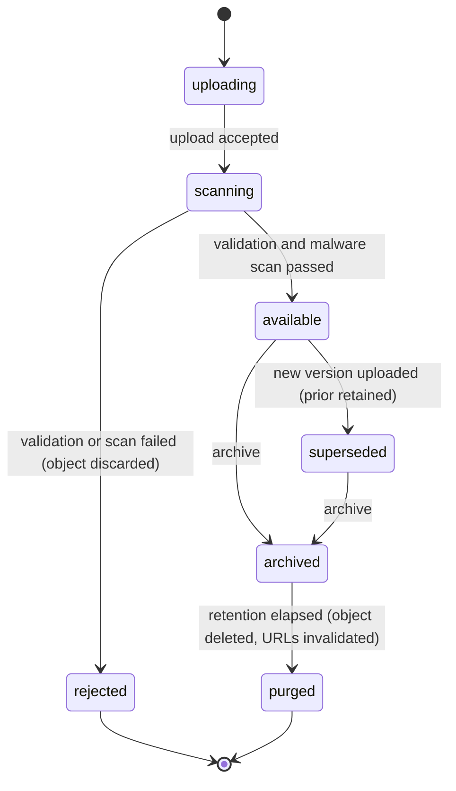

# 13 — Reports, Calendars, and Documents

**Status: `PROPOSED`.** Implements CAP-045..CAP-049.

> **REVISED 2026-08-01 (CAR-012).** Reports previously captured tenant context but **no input snapshot**, were never re-authorized at execution, and had no distinction between creation and download authorization, no share ACLs, and no revocation. All four are specified in [SPEC-09](specs/SPEC-09-report-snapshot-and-artifact-authorization.md) and [ADR-0018](decisions/ADR-0018-report-snapshot-semantics.md).

---

## 1. Reports and statistics

### 1.1 Report families

| Family | Content | Capability |
|---|---|---|
| **Fairness statistics** | Credits vs. target vs. actual, normalised by `workPercentage`; variance view | CAP-045 |
| **Shift statistics** | Per shift type across a range | CAP-045 |
| **Staff statistics** | Per member across a range | CAP-045 |
| **Schedule report** | The published schedule, printable | CAP-046 |
| **Picklist report** | A picklist's participants, work items, and outcomes | CAP-046 |
| **Stipend report** | Assignments on stipend-flagged shift types | CAP-046 |
| **Request report** | Requests and decisions across a range | CAP-046 |

**Fairness reporting is not a nice-to-have.** Demonstrable fairness is the product's core value proposition — a scheduling engine nobody trusts is a scheduling engine nobody uses. Credits remain independently movable from assignments ([06](06-data-architecture.md) §3.3), so the fairness numerator and the work denominator are genuinely separable.

### 1.2 Generation

| Aspect | Design |
|---|---|
| **Asynchronous, always** | A report is a queued job producing a stored artifact. **Never generated inline in a request** — a long report must not occupy a request thread |
| **Configure then generate** | Parameters are chosen, validated, then submitted. Not an instant download |
| **Tenant-scoped** | Generated under the requester's resolved tenant context |
| **Read-only** | The reports module writes to **no domain table** ([04](04-domain-boundaries.md) §3) |
| **Versioned reference** | A report names the schedule version it was generated against, so it stays interpretable |
| **Access control** | Re-checked **at download**, not only at generation |
| **Expiry** | Artifacts expire by default; expired artifacts are purged and their URLs invalidated |
| **Audit** | Generation, download, and sharing all audited |

### 1.3 Sharing

Recipients resolve **only from the group roster** — never free-text addresses. A share creates a notification intent ([11](11-notifications-and-communications.md)); the reports module never calls a provider.

### 1.4 Leakage prevention

| Risk | Prevention |
|---|---|
| Cross-tenant report content | Generated under server-resolved tenant context; RLS applies to every query |
| Cross-tenant artifact access | Storage key prefixed `org/{id}/group/{id}/`; access re-checked at download |
| Stale-URL access after purge | Signed URLs are short-lived; purge invalidates |
| Over-broad aggregation | Reports respect the requester's field-level PII minimisation |

---

## 2. Calendar feeds (CAP-047)

**The source's mechanism is explicitly superseded.** Its feed URL carries the user's email address *and* a long-lived bearer token in query parameters — and the product actively encourages sharing that URL with family. URLs land in logs, browser history, and `Referer` headers.

### 2.1 Design

| Property | Design |
|---|---|
| **Token storage** | **Hash only.** Plaintext shown once at issue, never retrievable |
| **No PII in the URL** | The URL carries an opaque identifier. **No email, no name** |
| **Scope** | Read-only, **one membership**. Never usable for API access |
| **Rotation** | Issues a new token and **invalidates the old immediately** — no window in which both work |
| **Revocation** | Immediate |
| **Entropy** | High-entropy random, not derived from user data |
| **Lifecycle** | Revoked on membership end |
| **Notification** | Owner notified on issue, rotation, and revocation — **a token change they did not initiate is a security signal** |

```mermaid
stateDiagram-v2
    [*] --> none
    none --> active: issue (hash stored; plaintext shown once)
    active --> active: external client fetches (read-only, one membership)
    active --> rotated: rotate (old invalidated immediately)
    rotated --> revoked: revoke
    active --> revoked: revoke
    revoked --> [*]
```

### 2.2 Feed content and caching

Reflects the **current published version** for that membership. Feeds are generated on request with a short cache window and a validator; a schedule change is visible on the client's next poll. **No push is needed** — calendar clients poll, and pretending otherwise would add machinery for no benefit.

**Content is minimal:** shift code, times, location. **No patient-level content, no colleague personal data.**

---

## 3. Documents (CAP-048)

### 3.1 Lifecycle

### 3.2 Design

| Aspect | Design |
|---|---|
| **Upload validation** | Content-type allowlist, size limits, filename sanitisation |
| **Malware scanning** | Before an object becomes `available`. A failed scan discards the object |
| **Versioning** | New uploads supersede; **prior versions retained** |
| **Provenance** | **Uploader and timestamp recorded** — the source records only an upload date |
| **Search** | Across categories, by name/type/date — **the source has none, and its absence was a documented usability gap** |
| **Storage isolation** | Key prefix `org/{id}/group/{id}/` |
| **Download authorization** | Re-checked at download; **signed short-lived URLs**, never public objects |
| **Category visibility** | Role-based |
| **Retention** | Policy-driven per organization; **PO-DEC-22 pending** |
| **Purge** | Deletes the object **and** invalidates outstanding URLs |
| **Audit** | Upload, download, supersession, archive, purge |
| **Orphan cleanup** | If metadata write fails after an object write, a reaper removes the orphan |

---

## 4. Calendar events on the schedule (CAP-049)

Non-shift entries — meetings, education — attached to schedule dates. Title, location, all-day flag, start/end. Group-scoped, audited, and **excluded from fairness accounting** — a departmental meeting is not work to be balanced.

---

## 5. Capability and gate mapping

| Capability | Coverage | Gate |
|---|---|---|
| CAP-045 Fairness statistics | §1.1 | `G-PROD` |
| CAP-046 Reports | §1.2, §1.3 | `G-PROD` |
| CAP-047 Calendar feeds | §2 | `G-BETA` |
| CAP-048 Documents | §3 | `G-BETA` |
| CAP-049 Calendar events | §4 | `G-BETA` |

**ADR:** [ADR-0014](decisions/ADR-0014-file-and-report-storage.md). **Tests:** SBX-031a, SBX-031b, SBX-031c. **None executed.**
