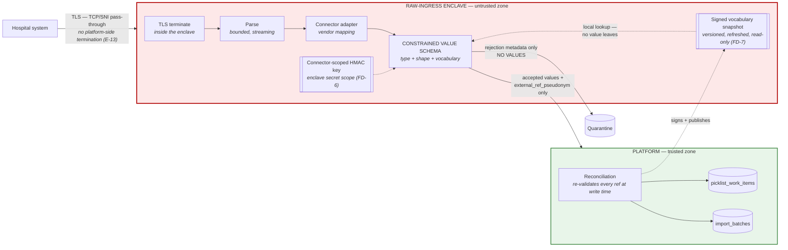

# SPEC-03 — Raw-Ingress Trust Boundary and Constrained Value Schema

**Status: `PROPOSED`.** Remediates **CAR-004** (Critical).
**Supersedes:** [12](../12-integrations-and-ingestion-privacy.md) §§2, 4.1–4.2; [06](../06-data-architecture.md) §3.5 `picklist_work_items.description` and §3.7 `quarantined_records`; [10](../10-picklist-and-realtime.md) opening invariant and §2.
**New invariant:** **I-17**. **New enclave properties (2026-08-01):** **E-13** (ingress pass-through, V-17), **E-14** (pseudonymisation key custody, V-16 / FD-6). **ADRs:** [ADR-0011](../decisions/ADR-0011-ingestion-privacy-boundary.md) (revised), [ADR-0021](../decisions/ADR-0021-raw-ingress-enclave.md) (new).

> **What was wrong — two independent holes.**
>
> **(1) Boundary placement.** The flow was `source → connector adapter → canonical DTO → boundary`. Everything before the boundary — TLS termination, the HTTP body buffer, the JSON parser, the adapter, process memory, exception objects, APM spans, retry queues, crash dumps — is ordinary application infrastructure that logs, traces, persists, and reports. **The raw payload was already inside the platform before the "boundary" saw it.**
>
> **(2) Key allowlisting is not value validation.** A positive list of *field names* cannot stop a patient name being written into `title`, `externalReference`, `category`, or `location`. A faulty or hostile adapter relabels and passes. The certification suite reported success because the prohibited *key* was absent.
>
> **(3) A third hole the review named separately:** manual picklist entry accepted a free-text `description` promised to be "sanitised." **No general sanitizer can prove that property.**

---

## 1. The corrected invariant

**I-17 — Raw external payloads exist only inside a minimal ingress enclave that cannot log, trace, persist, queue, dump, or export them. Only values that satisfy a constrained value schema leave the enclave. Nothing else, ever, in any form.**

**Replaces I-07's implicit claim** that a key allowlist keeps patient data out. I-07 is retained but re-scoped ([01](../01-architecture-overview.md) §4).

---

## 2. Where the boundary now sits

> **AMENDED 2026-08-01 (V-15 / FD-7, V-16 / FD-6, V-17)** — [rationale](../remediation/internal-verification-corrections.md) §1 FD-6/FD-7 and §2. Three additions to this diagram and the sections that follow:
> 1. **FD-7 (V-15).** The enclave's two most important constraints are vocabulary lookups, and E-10 gives it no database credential. It now validates against a **signed, versioned vocabulary snapshot** held inside the enclave. **No candidate value is ever transmitted for resolution**, a stale-snapshot miss **quarantines and never accepts**, and the platform-side ingestion module **re-validates resolution authoritatively at write time**.
> 2. **FD-6 (V-16) — the `external_reference` field is amended away and withdrawn.** As previously written it admitted MRN- and health-card-shaped values by the spec's own reasoning. The enclave now emits **`external_ref_pseudonym`** — a keyed HMAC computed inside the enclave — and the source-assigned reference never crosses the boundary in any form.
> 3. **V-17.** Connector ingress reaches the enclave over **TCP/SNI pass-through** with no platform-side TLS termination. New enclave property **E-13**.

**The enclave is the trust boundary. Everything upstream of the arrow labelled "accepted values only" is untrusted and instrumented as such.**

**TLS terminates inside the enclave, and nothing upstream terminates it first** *(added 2026-08-01, V-17)*. The connector's TLS session is carried to the enclave by **TCP/SNI pass-through** — the platform load balancer routes on the TLS SNI header without decrypting, and performs no body logging, no buffering, no WAF body inspection, and no request/response capture on that path. This is **E-13** below and a normative requirement of [SPEC-10](SPEC-10-deployment-topology.md) §2. Without it, every managed container platform's default behaviour puts the raw payload through platform infrastructure that logs and buffers it *before* the enclave exists — which is CAR-004's boundary-placement hole exactly.

---

## 3. Enclave properties

**A separately packaged, minimally-dependent process.** Not a module inside the web application — an application module inherits the application's logging, tracing, error reporting, and crash behaviour, which is precisely the defect.

| # | Property | Enforcement |
|---|---|---|
| E-1 | **No body logging** | The enclave's logger has **no** API that accepts a payload value. Log lines carry batch id, connection id, counts, field *paths*, and outcome codes only |
| E-2 | **No distributed tracing of payload** | Span attributes are drawn from a fixed allowlist of non-payload keys. The tracing SDK is configured with a **deny-all** attribute processor plus that allowlist |
| E-3 | **No error reporting of payload** | Exceptions are caught at the parse and map boundaries and **re-raised as value-free typed errors** carrying only a field path and a rejection code. The error-reporting SDK is **absent from the enclave image** |
| E-4 | **No crash dumps** | Core dumps disabled (`RLIMIT_CORE = 0`); heap-snapshot and post-mortem debugging flags disabled; the runtime's on-crash diagnostic writer disabled |
| E-5 | **No disk** | Read-only root filesystem. The only writable mount is `tmpfs` sized to the streaming buffer, and **nothing is written to it deliberately** |
| E-6 | **No durable queue and no DLQ payload** | The enclave never enqueues a raw payload. A failed batch produces a **metadata-only** dead-letter record; **replay re-fetches from the source**, it does not replay a stored body |
| E-7 | **No retry buffering of bodies** | Transport-level retries happen *upstream of* the enclave (the source re-sends) or are re-fetched by the connector. The enclave holds nothing across a failure |
| E-8 | **Bounded memory, streaming parse** | Payload size and nesting depth are capped; the parser streams and rejects on limit rather than buffering an unbounded body |
| E-9 | **No outbound network except the source and the platform ingress API** | Egress allowlist. Blocks SSRF and exfiltration alike ([SPEC-11](SPEC-11-audit-assurance-and-security-boundaries.md) §5). *(amended 2026-08-01, V-15 / FD-7)* The **vocabulary-snapshot channel is the platform ingress API** — already permitted, no new egress. It carries snapshots **inbound** and never carries a candidate value outbound |
| E-10 | **Distinct credentials and no database access** | The enclave holds **no** database credential. It cannot write a table even if compromised. *(unchanged 2026-08-01 — FD-7 preserves this: the snapshot is a pushed artefact, not a query)* |
| E-11 | **Separate image, separate patch stream, separate SBOM** | Minimal dependency set; each dependency reviewed against E-1..E-4 |
| E-12 | **Memory zeroed after each batch** | Best-effort scrubbing of the buffer between batches. Best-effort is stated honestly: a managed runtime cannot guarantee it |
| **E-13** **NEW** *(2026-08-01, V-17)* | **No platform-side TLS termination, body logging, buffering, or body inspection on the connector ingress path** | Connector traffic reaches the enclave by **TCP/SNI pass-through**: the platform load balancer routes on the unencrypted SNI header and forwards the TLS stream byte-for-byte. **Prohibited on this path:** TLS termination or re-encryption at the edge; HTTP-layer access logs carrying any part of the body, path, or query; request/response body buffering to disk or memory outside the enclave; WAF or IDS body inspection; API-gateway request capture, mirroring, or replay. Enforced by a dedicated listener and network path, verified by **C-4** attestation, and swept as surface **S-17** in §7.2 |
| **E-14** **NEW** *(2026-08-01, V-16 / FD-6)* | **The pseudonymisation key never leaves the enclave's secret scope** | The connector-scoped HMAC key lives in a secret scope **separate from the application trust domain** ([SPEC-15](SPEC-15-technology-decision-gates.md) TDG-13). The application role cannot read it, so the platform cannot reverse a pseudonym to a source reference even with full database access |

**Deployment:** the enclave is a distinct process class — a fifth alongside the four in [ADR-0001](../decisions/ADR-0001-application-topology.md). See [SPEC-10](SPEC-10-deployment-topology.md) §2.

### 3.1 What the enclave hands over

A **canonical import record** containing only values that passed §4, plus batch metadata. It is transmitted to the platform ingress API over an authenticated internal channel. **The raw payload is not transmitted, referenced, hashed, or summarised.**

*(amended 2026-08-01, V-16 / FD-6)* The record carries **`external_ref_pseudonym`** in place of any source-assigned reference (§4.4). The source reference itself is one of the values the sentence above already covers: it is not transmitted, not referenced, not hashed with an unkeyed digest, and not summarised.

### 3.2 Vocabulary distribution *(new subsection, 2026-08-01, V-15 / FD-7)*

> **AMENDED 2026-08-01 (V-15 / FD-7)** — I-17 requires that only values satisfying the constrained value schema leave the enclave, and §4's two strongest constraints are lookups against `work_item_labels` and `locations`. With E-10 forbidding a database credential, no mechanism was stated. This is that mechanism ([rationale](../remediation/internal-verification-corrections.md) §1 FD-7).

| Property | Rule |
|---|---|
| **Artefact** | A **signed, versioned vocabulary snapshot** per connector: `snapshot_version`, `group_id`, the active `work_item_labels` keys, the active `locations` keys, the `service_category` enum, `generated_at`, and a signature over the whole |
| **Channel** | Pushed and pulled over the **existing platform-ingress-API channel** (E-9). No new egress path, no database credential (E-10) |
| **Signature** | Signed by the platform with a key the enclave verifies. **An unsigned or signature-invalid snapshot is refused**, and the enclave continues on its last valid snapshot |
| **Refresh** | On a stated interval **and** on a vocabulary-change notification from the platform. Refresh is inbound-only |
| **Stale-snapshot miss** | **Quarantines. Never accepts.** A key absent from the enclave's snapshot is treated exactly as an unknown key: `UNKNOWN_VOCABULARY`, batch quarantined, operator notified. A snapshot race can therefore delay a valid import; it can never admit an unresolved reference |
| **No candidate value is ever transmitted for resolution** | The enclave resolves **locally against the snapshot**. It never calls the platform to ask "is this value known?", because the question *is* the value crossing the boundary |
| **Authoritative re-validation at write time** | The platform-side ingestion module **re-resolves every `work_item_label_ref` and `location_ref` against the live tables inside the write transaction** and rejects the record if resolution fails. Defence in depth: the snapshot is an *enclave-side filter*, the database is the *authority*. A stale snapshot that somehow contained a retired key cannot produce a written row |
| **Snapshot freshness is observable** | `snapshot_version` and `generated_at` accompany every import batch, so an operator investigating a quarantine can see immediately whether staleness explains it |

---

## 4. Constrained value schema

**A field is accepted only if its *value* satisfies a type, a shape, and — where applicable — a controlled vocabulary. Names alone are never sufficient.**

> **AMENDED 2026-08-01 (V-16 / FD-6, V-15 / FD-7)** — the source-assigned reference field is **withdrawn** and replaced by an enclave-computed pseudonym (§4.4); the two reference constraints resolve against the **signed snapshot** of §3.2, with authoritative re-validation platform-side at write time.

| Canonical field | Type | Value constraint | Why a patient identifier cannot pass |
|---|---|---|---|
| **`external_ref_pseudonym`** *(replaces the source-assigned reference field, 2026-08-01, V-16 / FD-6)* | **enclave-computed keyed pseudonym** | `HMAC-SHA256(connector-scoped enclave key, source reference)`, rendered as a fixed-length hex token. **The enclave computes it and discards the input**; the platform never receives, stores, or logs the source-assigned reference in any form. See §4.4 | **The source value never crosses the boundary at all.** An MRN, health-card number, or accession number supplied by the source is consumed inside the enclave and leaves only as a keyed MAC that is not reversible without the enclave-held key (E-14) |
| `work_item_label_ref` | **vocabulary reference** | Must resolve to an active key in the enclave's **signed vocabulary snapshot** (§3.2), **and** re-resolve to an active `work_item_labels` row for the target group in the platform write transaction *(amended 2026-08-01, V-15 / FD-7)* | **Free text cannot be supplied at all.** An unrecognised label — including one absent only because the snapshot is stale — quarantines the batch for human review |
| `location_ref` | **entity reference** | Must resolve to an active key in the **signed vocabulary snapshot** (§3.2), **and** re-resolve to an existing `locations` row in the target group in the platform write transaction *(amended 2026-08-01, V-15 / FD-7)* | Same: a value that is not an established location is not a location |
| `service_category` | **platform enum** | Fixed, platform-owned list | Closed set |
| `procedure_count` | integer | `0 <= n <= 200` | A number carries no identity |
| `service_date` | date | Within the connection's configured horizon | — |
| `starts_at` / `ends_at` | time | Valid, `ends_at > starts_at` | — |
| `expected_duration_minutes` | integer | `1 <= n <= 1440` | — |
| `display_order` | integer | `>= 0` | — |

**Every other field in the payload is discarded inside the enclave without inspection, logging, or counting by value.** Only the field *path* and an occurrence count are recorded.

### 4.1 The controlled vocabulary

`work_item_labels` **(NEW table)**: `group_id`, `key`, `display_text`, `state`, `approved_by`, `approved_at`.

| Property | Rule |
|---|---|
| **Group-owned, human-approved** | An administrator with `picklist.manage_vocabulary` adds entries; each is reviewed before activation |
| **Reviewed for content** | The review step is where a human confirms the label is operational, not clinical or identifying |
| **Connectors reference, never create** | A connector supplying an unknown label **quarantines the batch**. It cannot mint vocabulary |
| **Manual entry references, never types** | See §5 |
| **Auditable** | Every addition, edit, and retirement is audited with the approving actor |

**This is the "provable safe contract" the review required.** The property is provable because the set of possible values is finite, enumerated, and human-approved — not because a sanitizer inspected a string.

### 4.2 Detectors are a secondary alarm, never the control

Human-name shapes, date-of-birth patterns, health-card and MRN formats, and long digit runs are checked **in addition** to §4, and a match **rejects**. But:

> **No detector is claimed to be complete, and no design decision depends on one.** Detectors catch a mis-specified constraint; they are not the reason the constraint holds. If detectors were removed entirely, §4 would still bound what can pass.

### 4.3 Rejection, never sanitization

**The enclave never repairs a value.** Trimming, stripping, masking, and redacting all assert a property no general implementation can prove. A value either satisfies the constraint or the record is quarantined.

**Normalisation is limited to case folding and Unicode NFC on values already constrained to a closed vocabulary or a token shape** — operations that cannot turn a rejected value into an accepted one.

### 4.4 `external_ref_pseudonym` — enclave-side pseudonymisation *(new subsection, 2026-08-01, V-16 / FD-6)*

> **AMENDED 2026-08-01 (V-16 / FD-6)** — the previous field accepted any `^[A-Za-z0-9._:-]{1,64}$` token with no whitespace, which admits a hospital MRN (`A0041739`), an NHS number, a health-card number, and an accession number completely. §4.2 explicitly refuses to lean on detectors, so §4 alone did not bound the field to non-identifying values. The review's instruction was *reject rather than sanitize*; the resolution is that **the source-assigned reference never crosses the boundary** ([rationale](../remediation/internal-verification-corrections.md) §1 FD-6).

| Property | Rule |
|---|---|
| **Computation** | `external_ref_pseudonym = HMAC-SHA256(K_connector, source_reference)`, computed **inside the enclave**, on the raw value, before anything else sees it |
| **Key custody** | `K_connector` is held in the **enclave's own secret scope**, a trust domain separate from the application ([SPEC-15](SPEC-15-technology-decision-gates.md) TDG-13, and **E-14**). The application role never holds it |
| **What leaves the enclave** | The pseudonym only. The source reference is **not** transmitted, stored, logged, traced, quarantined, or hashed with any unkeyed digest |
| **Why a keyed MAC and not a bare hash** | The review's objection to hashing was correct and is preserved: an **unkeyed** hash of a publicly-enumerable input (an MRN drawn from a small space, a date of birth) is a re-identifiable pseudonym, because an attacker with the database can enumerate candidates and match. A **keyed** MAC whose key sits outside the application trust domain cannot be enumerated by anyone who compromises the database alone. §6's prohibition on storing hashes of **rejected** content is untouched and unaffected |
| **Why not a platform-minted opaque token** | The alternative — mint an identifier and store no source correlation — was considered and rejected: with no stable correlation, a source updating a record produces a second work item instead of an update, and reconciliation, replay, and idempotent re-import all break. Determinism is the operational requirement, and a keyed MAC is the minimal construction that satisfies it |
| **Reconciliation and replay still work** | The same source record yields the same pseudonym for the lifetime of a key, so update-matching, deduplication, and batch replay are unchanged |
| **Key rotation** | Rotation uses a **dual-pseudonym overlap window**: during rotation the enclave emits both the outgoing and incoming pseudonyms, reconciliation matches on either, and the outgoing value is retired once every live record carries the incoming one. Rotation is audited |
| **Residual risk, stated** | **Compromise of `K_connector` re-identifies references** for an attacker who also holds the pseudonym set. This is mitigated by trust-domain isolation (E-14), rotation, and the fact that the raw references are not themselves stored anywhere in the platform. It is **recorded in the risk register** ([19](../19-risks-and-decisions.md)) rather than left implicit |
| **Reversibility** | R2 — the field is a column and a computation; changing the construction changes reconciliation but no invariant |

---

## 5. Manual entry and the removal of free text

**`picklist_work_items.description` is REMOVED.** So is every other unrestricted text field on the protected work-item path.

| Old | New |
|---|---|
| `description` free text, "sanitised" | **Deleted.** No replacement free-text field |
| `title` free text | `work_item_label_ref` → `work_item_labels` |
| — | `location_ref`, `service_category`, `procedure_count`, timing fields, `display_order` |
| — | `scheduler_note_ref?` → **optional** reference to a group-approved note vocabulary, same review discipline |

**A scheduler composing a work item selects from vocabulary and fills typed fields. There is no box in which a patient name can be typed.**

| Consequence | Position |
|---|---|
| **Operational cost is real** | Schedulers lose ad-hoc annotation. This is a deliberate trade, taken because the alternative is an unprovable privacy claim on the product's highest-risk surface |
| **Vocabulary growth is the pressure valve** | Adding a reviewed label is a fast administrative action, not a code change |
| **This is not a scope reduction** | CAP-030 and CAP-060 retain every user outcome: items are described, distinguishable, and orderable. **The mechanism changed; the capability did not** |
| **Free text elsewhere is unaffected** | Request comments, document names, and broadcast bodies are *not* on the protected ingestion path and keep their existing controls. **They carry their own prohibition on clinical content, enforced by policy and review, and that difference is stated rather than hidden** |

---

## 6. Quarantine metadata

`quarantined_records` **(REVISED)** stores, per rejected field occurrence:

| Stored | Not stored |
|---|---|
| Field **path** (`items[].title`) | The value |
| Rejection **code** (`UNKNOWN_VOCABULARY`, `SHAPE_VIOLATION`, `DETECTOR_MATCH`, `UNRESOLVED_REFERENCE`) | Any substring of the value |
| Occurrence **count** | **Any hash of the value** — a hash of a patient name is still a re-identifiable pseudonym |
| Value **class only** (`string` / `number` / `object` / `array`) | Length, character composition, or any other statistic |
| Batch, connection, timestamp | — |

**An operator sees: "field `items[].title` produced `UNKNOWN_VOCABULARY` 14 times in batch B."** That is enough to act — add the label, or fix the mapping — and carries nothing about a patient.

---

## 7. Whole-platform zero-persistence evidence

**SBX-029 is redefined.** The old test asserted the absence of prohibited *keys*, which the review correctly called non-evidentiary.

### 7.1 Canary method

1. Generate unique high-entropy **canary tokens** — one per field, per position, per encoding variant. Canaries are **fabricated**; no real identifier is ever used.
   **Every sweep must additionally include identifier-*shaped* canaries** *(added 2026-08-01, V-16 / FD-6)*: **MRN-shaped** (e.g. `A0041739`), **health-card-shaped**, **NHS-number-shaped**, and **accession-number-shaped** fabricated values, placed specifically in the reference field and in every other token-shaped field. A canary that is high-entropy but not identifier-shaped does not test the case V-16 identified. These canaries are fabricated and must not collide with any real number space.
2. Submit payloads placing canaries in: prohibited keys; **allowed keys** (the relabeling attack); nested structures; arrays; malformed encodings; oversized bodies; archives; and payloads engineered to cause parse errors, adapter exceptions, timeouts, and connection resets.
   *(added 2026-08-01, V-16 / FD-6)* For the reference field the required outcome is **not** rejection but **non-appearance of the input**: the sweep asserts that the **source value** appears on **zero** surfaces while the **pseudonym** appears only where §4.4 permits it.
3. Exercise **both** success and every failure path.
4. Then **search every surface** for every canary.

### 7.2 Surfaces that must be searched

| # | Surface | Access required |
|---|---|---|
| S-1 | All database tables, all columns, all rows | Direct |
| S-2 | Object storage, all prefixes, **all versions** | Direct |
| S-3 | Application logs, all levels, all processes | Log platform |
| S-4 | Enclave logs | Log platform |
| S-5 | Traces and span attributes | Tracing backend |
| S-6 | Metrics labels | Metrics backend |
| S-7 | Error-reporting platform | Vendor API |
| S-8 | Queue and **dead-letter** contents | Direct |
| S-9 | Quarantine records | Direct |
| S-10 | **Database backups and PITR archives** | **Restore into an isolated environment and scan** |
| S-11 | Container filesystems and `tmpfs` after a run | Direct |
| S-12 | Crash artifacts and core dumps | Direct |
| S-13 | Generated reports and exports | Direct |
| S-14 | Notification bodies and provider request logs | Direct + provider sandbox |
| S-15 | Support tooling output and admin surfaces | Direct |
| S-16 | Real-time event payloads | Captured socket transcript |
| **S-17** *(added 2026-08-01, V-17)* | **Platform ingress surfaces on the connector path** — load-balancer and edge access logs, TLS-termination logs, API-gateway request/response capture and mirroring, WAF/IDS inspection records, and any edge request buffer or disk spool | Cloud provider log export + edge configuration dump |

**A single canary occurrence on any surface is a hard failure of `G-CONN`.**

**S-17 is the surface E-13 exists to make empty** *(added 2026-08-01, V-17)*. If the deployment terminates TLS at a platform load balancer, canaries appear here even when every enclave property holds — which is precisely the CAR-004 hole the enclave was built to close, reintroduced by infrastructure defaults rather than by code.

### 7.3 Honest statement of dependency

**S-10, S-7, and S-14 require access the project does not yet have** — a restorable backup, the error-reporting vendor's API, and provider sandboxes. **`G-CONN` therefore cannot pass until those exist.** This is recorded as blocking evidence in [SPEC-16](SPEC-16-sbx-evidence-contracts.md), not glossed over.

---

## 8. Connector certification additions

Added to the `G-CONN` checklist in [12](../12-integrations-and-ingestion-privacy.md) §7:

| # | Requirement |
|---|---|
| C-1 | **Adversarial relabeling fixture** — the vendor mapping is tested with canaries in every allowed field |
| C-2 | **Vocabulary mapping review** — every source value mapped to `work_item_labels` is reviewed and recorded, field by field |
| C-3 | **Failure-surface fixture** — parse errors, timeouts, resets, oversized and malformed payloads, each followed by a §7.2 sweep |
| C-4 | **Enclave configuration attestation** — **E-1..E-14** verified for the deployed image, with evidence *(amended 2026-08-01, V-17 / V-16)*. The attestation explicitly covers **E-13**: the deployed ingress path is TCP/SNI pass-through, with edge TLS termination, body logging, body buffering, and WAF body inspection each shown disabled by configuration dump — and **E-14**: the pseudonymisation key is resolvable only from the enclave's secret scope |
| C-5 | **Egress allowlist verification** — the enclave cannot reach any host but the source and the platform ingress |
| C-6 | **No real payload, ever** — every fixture wholly fabricated |

---

## 9. Relationship to C-09 — unchanged

**C-09 remains `UNPROVEN IN BOTH DIRECTIONS`.** Nothing in this specification asserts whether iSchedule.MD did or did not hold patient-identifying information. SchedulePoint's obligation is discharged independently of that question — which is exactly why the boundary is platform-enforced and value-constrained rather than trust-based.

---

## 10. Test contract

| # | Test | Required outcome |
|---|---|---|
| I-01 | Canary in a **prohibited** key | Rejected; absent from all **17** surfaces *(amended 2026-08-01, V-17 — S-17 added)* |
| I-02 | **Canary in an allowed key** (`title`, `externalReference`, `category`, `location`) | **Rejected** by vocabulary/shape; absent from all **17** surfaces *(amended 2026-08-01, V-17)* |
| I-03 | Canary in a value that also triggers a detector | Rejected; detector match recorded **without the value** |
| I-04 | Malformed encoding, deep nesting, oversized body, archive bomb | Rejected at the parser; nothing persisted |
| I-05 | Adapter exception mid-map | Value-free typed error; no payload in the error platform |
| I-06 | Timeout / connection reset mid-stream | No partial persistence; no DLQ body |
| I-07 | Forced enclave crash | **No core dump; no heap snapshot; nothing on disk** |
| I-08 | Backup restored and scanned after all of the above | **Zero canaries** |
| I-09 | Manual entry: attempt to submit free text | **No field accepts it** — the API rejects unknown properties |
| I-10 | Manual entry: unknown vocabulary key | Rejected with `UNKNOWN_VOCABULARY` |
| I-11 | Quarantine record inspection | Field paths, codes, counts only. **No values, no hashes** |
| I-12 | Enclave egress to an unapproved host | Blocked and alerted |
| I-13 | **MRN-, health-card-, NHS- and accession-shaped canaries in the source reference field** *(added 2026-08-01, V-16 / FD-6)* | The **source value** is absent from all 17 surfaces. Only `external_ref_pseudonym` is persisted, and it is not equal to, nor derivable from, the input without `K_connector` |
| I-14 | Same source record imported twice, and again after a key rotation *(added 2026-08-01, V-16 / FD-6)* | Same pseudonym before rotation → the record is **updated, not duplicated**. Across the rotation window both pseudonyms are emitted and reconciliation matches on either; after retirement only the incoming value remains |
| I-15 | Attempt to read `K_connector` using the application role and using a compromised application process *(added 2026-08-01, V-16 / FD-6)* | Refused. The key is resolvable only from the enclave's secret scope (E-14) |
| I-16 | Import a label valid in the live table but **absent from a deliberately stale snapshot** *(added 2026-08-01, V-15 / FD-7)* | **Quarantined** with `UNKNOWN_VOCABULARY`. Never accepted. `snapshot_version` on the batch shows staleness as the cause |
| I-17t | Import a label present in a **tampered or unsigned** snapshot *(added 2026-08-01, V-15 / FD-7)* | Snapshot refused at signature verification; the enclave continues on its last valid snapshot; the unknown key quarantines |
| I-18 | Network capture of the enclave's egress during a batch containing unknown values *(added 2026-08-01, V-15 / FD-7)* | **No candidate value appears on the wire.** Resolution is local to the snapshot; no resolution request is ever made |
| I-19 | A record whose label was **retired** between snapshot generation and the platform write *(added 2026-08-01, V-15 / FD-7)* | Rejected by the platform-side authoritative re-validation inside the write transaction. No row is written |
| I-20 | Full canary sweep with the deployment's real edge configuration, inspecting **S-17** *(added 2026-08-01, V-17)* | **Zero canaries** in load-balancer logs, gateway capture, WAF records, and edge buffers. E-13 attested by configuration dump |

---

## 11. Traceability

**Capabilities:** CAP-030, CAP-055, CAP-060, CAP-061, CAP-062, CAP-063, CAP-064, CAP-065, CAP-068.
**Decisions:** PO-DEC-08 (approved).
**ADRs:** [ADR-0011](../decisions/ADR-0011-ingestion-privacy-boundary.md) (revised), [ADR-0012](../decisions/ADR-0012-connector-architecture.md), **[ADR-0021](../decisions/ADR-0021-raw-ingress-enclave.md) (new)**.
**Gates:** `G-ARCH`, **`G-CONN`**, `G-PROD`. **None passed; `G-CONN` additionally blocked on the §7.3 access dependencies.**
