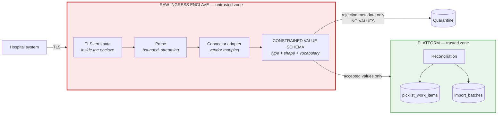

# SPEC-03 — Raw-Ingress Trust Boundary and Constrained Value Schema

**Status: `PROPOSED`.** Remediates **CAR-004** (Critical).
**Supersedes:** [12](../12-integrations-and-ingestion-privacy.md) §§2, 4.1–4.2; [06](../06-data-architecture.md) §3.5 `picklist_work_items.description` and §3.7 `quarantined_records`; [10](../10-picklist-and-realtime.md) opening invariant and §2.
**New invariant:** **I-17**. **ADRs:** [ADR-0011](../decisions/ADR-0011-ingestion-privacy-boundary.md) (revised), [ADR-0021](../decisions/ADR-0021-raw-ingress-enclave.md) (new).

> **What was wrong — two independent holes.**
>
> **(1) Boundary placement.** The flow was `source → connector adapter → canonical DTO → boundary`. Everything before the boundary — TLS termination, the HTTP body buffer, the JSON parser, the adapter, process memory, exception objects, APM spans, retry queues, crash dumps — is ordinary application infrastructure that logs, traces, persists, and reports. **The raw payload was already inside the platform before the "boundary" saw it.**
>
> **(2) Key allowlisting is not value validation.** A positive list of *field names* cannot stop a patient name being written into `title`, `externalReference`, `category`, or `location`. A faulty or hostile adapter relabels and passes. The certification suite reported success because the prohibited *key* was absent.
>
> **(3) A third hole the review named separately:** manual picklist entry accepted a free-text `description` promised to be "sanitised." **No general sanitizer can prove that property.**

---

## 1. The corrected invariant

**I-17 — Raw external payloads exist only inside a minimal ingress enclave that cannot log, trace, persist, queue, dump, or export them. Only values that satisfy a constrained value schema leave the enclave. Nothing else, ever, in any form.**

**Replaces I-07's implicit claim** that a key allowlist keeps patient data out. I-07 is retained but re-scoped ([01](../01-architecture-overview.md) §4).

---

## 2. Where the boundary now sits

**The enclave is the trust boundary. Everything upstream of the arrow labelled "accepted values only" is untrusted and instrumented as such.**

---

## 3. Enclave properties

**A separately packaged, minimally-dependent process.** Not a module inside the web application — an application module inherits the application's logging, tracing, error reporting, and crash behaviour, which is precisely the defect.

| # | Property | Enforcement |
|---|---|---|
| E-1 | **No body logging** | The enclave's logger has **no** API that accepts a payload value. Log lines carry batch id, connection id, counts, field *paths*, and outcome codes only |
| E-2 | **No distributed tracing of payload** | Span attributes are drawn from a fixed allowlist of non-payload keys. The tracing SDK is configured with a **deny-all** attribute processor plus that allowlist |
| E-3 | **No error reporting of payload** | Exceptions are caught at the parse and map boundaries and **re-raised as value-free typed errors** carrying only a field path and a rejection code. The error-reporting SDK is **absent from the enclave image** |
| E-4 | **No crash dumps** | Core dumps disabled (`RLIMIT_CORE = 0`); heap-snapshot and post-mortem debugging flags disabled; the runtime's on-crash diagnostic writer disabled |
| E-5 | **No disk** | Read-only root filesystem. The only writable mount is `tmpfs` sized to the streaming buffer, and **nothing is written to it deliberately** |
| E-6 | **No durable queue and no DLQ payload** | The enclave never enqueues a raw payload. A failed batch produces a **metadata-only** dead-letter record; **replay re-fetches from the source**, it does not replay a stored body |
| E-7 | **No retry buffering of bodies** | Transport-level retries happen *upstream of* the enclave (the source re-sends) or are re-fetched by the connector. The enclave holds nothing across a failure |
| E-8 | **Bounded memory, streaming parse** | Payload size and nesting depth are capped; the parser streams and rejects on limit rather than buffering an unbounded body |
| E-9 | **No outbound network except the source and the platform ingress API** | Egress allowlist. Blocks SSRF and exfiltration alike ([SPEC-11](SPEC-11-audit-assurance-and-security-boundaries.md) §5) |
| E-10 | **Distinct credentials and no database access** | The enclave holds **no** database credential. It cannot write a table even if compromised |
| E-11 | **Separate image, separate patch stream, separate SBOM** | Minimal dependency set; each dependency reviewed against E-1..E-4 |
| E-12 | **Memory zeroed after each batch** | Best-effort scrubbing of the buffer between batches. Best-effort is stated honestly: a managed runtime cannot guarantee it |

**Deployment:** the enclave is a distinct process class — a fifth alongside the four in [ADR-0001](../decisions/ADR-0001-application-topology.md). See [SPEC-10](SPEC-10-deployment-topology.md) §2.

### 3.1 What the enclave hands over

A **canonical import record** containing only values that passed §4, plus batch metadata. It is transmitted to the platform ingress API over an authenticated internal channel. **The raw payload is not transmitted, referenced, hashed, or summarised.**

---

## 4. Constrained value schema

**A field is accepted only if its *value* satisfies a type, a shape, and — where applicable — a controlled vocabulary. Names alone are never sufficient.**

| Canonical field | Type | Value constraint | Why a patient identifier cannot pass |
|---|---|---|---|
| `external_reference` | opaque token | `^[A-Za-z0-9._:-]{1,64}$`; **no whitespace**; must not match a configured human-name shape | `"John Smith"` contains a space → rejected. `"SMITH,J"` matches the comma-name detector → rejected |
| `work_item_label_ref` | **vocabulary reference** | Must resolve to an active row in `work_item_labels` for the target group | **Free text cannot be supplied at all.** An unrecognised label quarantines the batch for human review |
| `location_ref` | **entity reference** | Must resolve to an existing `locations` row in the target group | Same: a value that is not an established location is not a location |
| `service_category` | **platform enum** | Fixed, platform-owned list | Closed set |
| `procedure_count` | integer | `0 <= n <= 200` | A number carries no identity |
| `service_date` | date | Within the connection's configured horizon | — |
| `starts_at` / `ends_at` | time | Valid, `ends_at > starts_at` | — |
| `expected_duration_minutes` | integer | `1 <= n <= 1440` | — |
| `display_order` | integer | `>= 0` | — |

**Every other field in the payload is discarded inside the enclave without inspection, logging, or counting by value.** Only the field *path* and an occurrence count are recorded.

### 4.1 The controlled vocabulary

`work_item_labels` **(NEW table)**: `group_id`, `key`, `display_text`, `state`, `approved_by`, `approved_at`.

| Property | Rule |
|---|---|
| **Group-owned, human-approved** | An administrator with `picklist.manage_vocabulary` adds entries; each is reviewed before activation |
| **Reviewed for content** | The review step is where a human confirms the label is operational, not clinical or identifying |
| **Connectors reference, never create** | A connector supplying an unknown label **quarantines the batch**. It cannot mint vocabulary |
| **Manual entry references, never types** | See §5 |
| **Auditable** | Every addition, edit, and retirement is audited with the approving actor |

**This is the "provable safe contract" the review required.** The property is provable because the set of possible values is finite, enumerated, and human-approved — not because a sanitizer inspected a string.

### 4.2 Detectors are a secondary alarm, never the control

Human-name shapes, date-of-birth patterns, health-card and MRN formats, and long digit runs are checked **in addition** to §4, and a match **rejects**. But:

> **No detector is claimed to be complete, and no design decision depends on one.** Detectors catch a mis-specified constraint; they are not the reason the constraint holds. If detectors were removed entirely, §4 would still bound what can pass.

### 4.3 Rejection, never sanitization

**The enclave never repairs a value.** Trimming, stripping, masking, and redacting all assert a property no general implementation can prove. A value either satisfies the constraint or the record is quarantined.

**Normalisation is limited to case folding and Unicode NFC on values already constrained to a closed vocabulary or a token shape** — operations that cannot turn a rejected value into an accepted one.

---

## 5. Manual entry and the removal of free text

**`picklist_work_items.description` is REMOVED.** So is every other unrestricted text field on the protected work-item path.

| Old | New |
|---|---|
| `description` free text, "sanitised" | **Deleted.** No replacement free-text field |
| `title` free text | `work_item_label_ref` → `work_item_labels` |
| — | `location_ref`, `service_category`, `procedure_count`, timing fields, `display_order` |
| — | `scheduler_note_ref?` → **optional** reference to a group-approved note vocabulary, same review discipline |

**A scheduler composing a work item selects from vocabulary and fills typed fields. There is no box in which a patient name can be typed.**

| Consequence | Position |
|---|---|
| **Operational cost is real** | Schedulers lose ad-hoc annotation. This is a deliberate trade, taken because the alternative is an unprovable privacy claim on the product's highest-risk surface |
| **Vocabulary growth is the pressure valve** | Adding a reviewed label is a fast administrative action, not a code change |
| **This is not a scope reduction** | CAP-030 and CAP-060 retain every user outcome: items are described, distinguishable, and orderable. **The mechanism changed; the capability did not** |
| **Free text elsewhere is unaffected** | Request comments, document names, and broadcast bodies are *not* on the protected ingestion path and keep their existing controls. **They carry their own prohibition on clinical content, enforced by policy and review, and that difference is stated rather than hidden** |

---

## 6. Quarantine metadata

`quarantined_records` **(REVISED)** stores, per rejected field occurrence:

| Stored | Not stored |
|---|---|
| Field **path** (`items[].title`) | The value |
| Rejection **code** (`UNKNOWN_VOCABULARY`, `SHAPE_VIOLATION`, `DETECTOR_MATCH`, `UNRESOLVED_REFERENCE`) | Any substring of the value |
| Occurrence **count** | **Any hash of the value** — a hash of a patient name is still a re-identifiable pseudonym |
| Value **class only** (`string` / `number` / `object` / `array`) | Length, character composition, or any other statistic |
| Batch, connection, timestamp | — |

**An operator sees: "field `items[].title` produced `UNKNOWN_VOCABULARY` 14 times in batch B."** That is enough to act — add the label, or fix the mapping — and carries nothing about a patient.

---

## 7. Whole-platform zero-persistence evidence

**SBX-029 is redefined.** The old test asserted the absence of prohibited *keys*, which the review correctly called non-evidentiary.

### 7.1 Canary method

1. Generate unique high-entropy **canary tokens** — one per field, per position, per encoding variant. Canaries are **fabricated**; no real identifier is ever used.
2. Submit payloads placing canaries in: prohibited keys; **allowed keys** (the relabeling attack); nested structures; arrays; malformed encodings; oversized bodies; archives; and payloads engineered to cause parse errors, adapter exceptions, timeouts, and connection resets.
3. Exercise **both** success and every failure path.
4. Then **search every surface** for every canary.

### 7.2 Surfaces that must be searched

| # | Surface | Access required |
|---|---|---|
| S-1 | All database tables, all columns, all rows | Direct |
| S-2 | Object storage, all prefixes, **all versions** | Direct |
| S-3 | Application logs, all levels, all processes | Log platform |
| S-4 | Enclave logs | Log platform |
| S-5 | Traces and span attributes | Tracing backend |
| S-6 | Metrics labels | Metrics backend |
| S-7 | Error-reporting platform | Vendor API |
| S-8 | Queue and **dead-letter** contents | Direct |
| S-9 | Quarantine records | Direct |
| S-10 | **Database backups and PITR archives** | **Restore into an isolated environment and scan** |
| S-11 | Container filesystems and `tmpfs` after a run | Direct |
| S-12 | Crash artifacts and core dumps | Direct |
| S-13 | Generated reports and exports | Direct |
| S-14 | Notification bodies and provider request logs | Direct + provider sandbox |
| S-15 | Support tooling output and admin surfaces | Direct |
| S-16 | Real-time event payloads | Captured socket transcript |

**A single canary occurrence on any surface is a hard failure of `G-CONN`.**

### 7.3 Honest statement of dependency

**S-10, S-7, and S-14 require access the project does not yet have** — a restorable backup, the error-reporting vendor's API, and provider sandboxes. **`G-CONN` therefore cannot pass until those exist.** This is recorded as blocking evidence in [SPEC-16](SPEC-16-sbx-evidence-contracts.md), not glossed over.

---

## 8. Connector certification additions

Added to the `G-CONN` checklist in [12](../12-integrations-and-ingestion-privacy.md) §7:

| # | Requirement |
|---|---|
| C-1 | **Adversarial relabeling fixture** — the vendor mapping is tested with canaries in every allowed field |
| C-2 | **Vocabulary mapping review** — every source value mapped to `work_item_labels` is reviewed and recorded, field by field |
| C-3 | **Failure-surface fixture** — parse errors, timeouts, resets, oversized and malformed payloads, each followed by a §7.2 sweep |
| C-4 | **Enclave configuration attestation** — E-1..E-12 verified for the deployed image, with evidence |
| C-5 | **Egress allowlist verification** — the enclave cannot reach any host but the source and the platform ingress |
| C-6 | **No real payload, ever** — every fixture wholly fabricated |

---

## 9. Relationship to C-09 — unchanged

**C-09 remains `UNPROVEN IN BOTH DIRECTIONS`.** Nothing in this specification asserts whether iSchedule.MD did or did not hold patient-identifying information. SchedulePoint's obligation is discharged independently of that question — which is exactly why the boundary is platform-enforced and value-constrained rather than trust-based.

---

## 10. Test contract

| # | Test | Required outcome |
|---|---|---|
| I-01 | Canary in a **prohibited** key | Rejected; absent from all 16 surfaces |
| I-02 | **Canary in an allowed key** (`title`, `externalReference`, `category`, `location`) | **Rejected** by vocabulary/shape; absent from all 16 surfaces |
| I-03 | Canary in a value that also triggers a detector | Rejected; detector match recorded **without the value** |
| I-04 | Malformed encoding, deep nesting, oversized body, archive bomb | Rejected at the parser; nothing persisted |
| I-05 | Adapter exception mid-map | Value-free typed error; no payload in the error platform |
| I-06 | Timeout / connection reset mid-stream | No partial persistence; no DLQ body |
| I-07 | Forced enclave crash | **No core dump; no heap snapshot; nothing on disk** |
| I-08 | Backup restored and scanned after all of the above | **Zero canaries** |
| I-09 | Manual entry: attempt to submit free text | **No field accepts it** — the API rejects unknown properties |
| I-10 | Manual entry: unknown vocabulary key | Rejected with `UNKNOWN_VOCABULARY` |
| I-11 | Quarantine record inspection | Field paths, codes, counts only. **No values, no hashes** |
| I-12 | Enclave egress to an unapproved host | Blocked and alerted |

---

## 11. Traceability

**Capabilities:** CAP-030, CAP-055, CAP-060, CAP-061, CAP-062, CAP-063, CAP-064, CAP-065, CAP-068.
**Decisions:** PO-DEC-08 (approved).
**ADRs:** [ADR-0011](../decisions/ADR-0011-ingestion-privacy-boundary.md) (revised), [ADR-0012](../decisions/ADR-0012-connector-architecture.md), **[ADR-0021](../decisions/ADR-0021-raw-ingress-enclave.md) (new)**.
**Gates:** `G-ARCH`, **`G-CONN`**, `G-PROD`. **None passed; `G-CONN` additionally blocked on the §7.3 access dependencies.**
