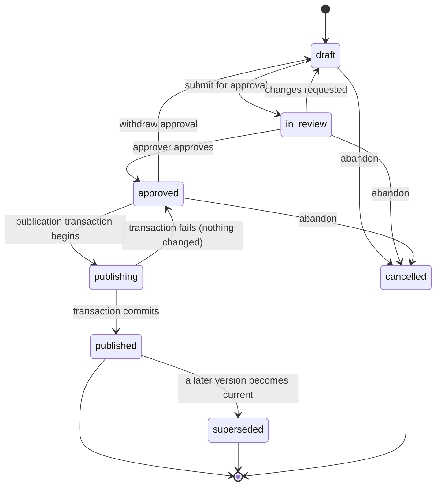

# SPEC-05 — Schedule Version Identity, Coexistence, and Publication

**Status: `PROPOSED`.** Remediates **CAR-007** (High).
**Supersedes:** [06](../06-data-architecture.md) §3.3, invariant **D-1**, and the `assignments` / `assignment_versions` tables; [07](../07-schedule-and-publication.md) §§1–4.
**New invariants:** **I-18**, and database invariants **D-1a**, **D-1b**, **D-14**, **D-15**, **D-16**.
**ADR:** [ADR-0007](../decisions/ADR-0007-schedule-versioning.md) (revised).

> **What was wrong.** `D-1` was an exclusion constraint forbidding overlapping *active* assignments per membership **with no version in the equality columns**. Cloning a published V1 into a draft V2 therefore collided with V1's own identical rows. The only escapes were to mark V1's rows `superseded` — mutating history, so historical reports and calendars no longer show what staff saw — or to abandon cloning. Published immutability was **prose only**: no database rule stopped an ORM `UPDATE` on a published child row. `locked` existed twice (as a status value *and* as `is_locked`). The table's status list omitted the approval and publishing states the state diagram showed. And `assignment_versions` implied mutable assignments inside supposedly immutable versions.

---

## 1. Identity versus snapshot

**The root error was treating "an assignment" as one thing. It is two.**

| Concept | Meaning | Lifetime |
|---|---|---|
| **Assignment identity** | *"Dr A works the Monday day shift in this period"* — the stable thing a human means when they say "that assignment changed" | Spans versions |
| **Assignment snapshot** | *"In version 3, that assignment had these exact values"* | Belongs to **exactly one** version; **immutable once its version is published** |

**Two tables replace one:**

| Table | Key fields | Constraints |
|---|---|---|
| **`assignment_identities`** *(NEW)* | `id`, `organization_id`, `group_id`, `period_id`, `origin`, `created_at` | Composite FK to `groups`. **Never deleted.** Carries no schedule values |
| **`assignment_snapshots`** *(REPLACES `assignments`)* | `id`, `assignment_identity_id`, **`version_id`**, `membership_id`, `shift_id`, `starts_at`, `ends_at`, `origin`, `pick_position?`, `status`, `supersedes_snapshot_id?` | **`UNIQUE (version_id, assignment_identity_id)` (D-14)** — one snapshot per identity per version |

**`assignment_versions` is deleted.** Its purpose — "history of an assignment" — is now served correctly by *querying snapshots of one identity across versions*, which is both the honest model and a cheaper query. A per-assignment mutation log inside an immutable version was a contradiction.

---

## 2. Version-scoped conflict constraints

| # | Invariant | Mechanism |
|---|---|---|
| **D-1a** | **No overlapping assignments for one membership *within a single version*, including across midnight** | `EXCLUDE USING gist (version_id WITH =, membership_id WITH =, tstzrange(starts_at, ends_at) WITH &&) WHERE (status = 'active')` |
| **D-1b** | **No overlapping assignments for one membership across the *current published* versions of *different* periods** | Same exclusion evaluated over a materialised view restricted to current-published versions, refreshed inside the publication transaction |

**`version_id` in the equality columns is the entire fix for cloning.** V1 and V2 now hold identical assignment sets without conflicting, because the constraint asks "does this membership double-book *within this version*" — which is the question that was always meant.

**D-1b is what D-1 was reaching for and getting wrong.** A person must not be double-booked in reality; reality is the set of *currently published* versions, one per period. Draft and candidate versions are proposals and are deliberately allowed to conflict with published ones — that is what a proposal is.

---

## 3. Version states and locking

### 3.1 Complete state set

The table's status list now matches the state machine exactly. **The previous mismatch was itself a defect** — a reviewer could not tell which was authoritative.



`state ∈ {draft, in_review, approved, publishing, published, superseded, cancelled}`.

**`publishing` is a real, durable state**, not a moment. It is what makes a failed publication diagnosable and a concurrent attempt detectable.

### 3.2 Lock is one orthogonal concept

**`locked` is removed from the state enum.** It was never a lifecycle state; it is an editability flag, and representing it twice guaranteed the two would disagree.

| Field | Meaning |
|---|---|
| `lock_state ∈ {unlocked, locked}` on `schedule_versions` | An administrator has frozen editing of a **draft**. Meaningless — and rejected by a `CHECK` — on a published version, which is immutable regardless |
| `assignment_snapshots.is_pinned` | This snapshot is a **fixed assignment**: the solver must preserve it. **Renamed from `is_locked`**, because it is a solver input, not an editing control |

**CAP-017's traceability referenced `is_fixed` while the schema said `is_locked` (CAR-020). Both names are retired in favour of `is_pinned`, and the trace is corrected.**

---

## 4. Database-enforced published immutability

**I-18 — Once a version reaches `published`, its row and every child row are immutable in the database. Immutability is enforced by database rules, not by application discipline.**

| # | Mechanism | Covers |
|---|---|---|
| **D-15a** | `BEFORE UPDATE OR DELETE` trigger on `assignment_snapshots`, `shifts`, `schedule_conflicts`, and `credits` that **raises** when the parent version's state is `published` or `superseded` | ORM writes, ad-hoc SQL, well-meaning repair scripts |
| **D-15b** | `BEFORE UPDATE` trigger on `schedule_versions` permitting **only** `published → superseded`, and `superseded_at`/`superseded_by_version_id` being set. **Every other column is frozen** | Version-row tampering |
| **D-15c** | `BEFORE DELETE` trigger on `schedule_versions` that **always raises** for `published` and `superseded` | Deletion of history |
| **D-15d** | `publication_records` and `version_supersessions` have no `UPDATE`/`DELETE` grant for any runtime role | Rewriting the publication record |

**Why triggers rather than grants.** Grants are per-table, and the application legitimately needs `UPDATE` on `assignment_snapshots` — for **draft** versions. The permission depends on the *parent row's state*, which only a trigger can evaluate. The `app_migrator` role can still perform a reviewed corrective migration; that is deliberate, and such a migration is itself an audited, two-person event ([SPEC-11](SPEC-11-audit-assurance-and-security-boundaries.md) §3).

---

## 5. Current version selection

| # | Invariant | Mechanism |
|---|---|---|
| **D-16** | **Exactly one current version per period** | `UNIQUE (period_id) WHERE is_current` on `schedule_versions` |
| **D-9** *(retained)* | Version numbers gapless per period | `UNIQUE (period_id, version_number)`, allocated inside the publication transaction |

`is_current` is set and cleared **only inside the publication transaction**, so there is never an instant with zero or two current versions. Calendars, reports, and the on-call feed resolve "the schedule" through `is_current`; historical reads resolve through an explicit `version_id`.

---

## 6. The publication transaction

```
PUBLISH (period_id, version_id, publication_idempotency_key, expected_version_state)

withUnitOfWork(ctx):                                   -- SPEC-01 §4
  01 INSERT publication_records (period_id, publication_idempotency_key, ...)
       ON CONFLICT (period_id, publication_idempotency_key) DO NOTHING
     -- zero rows => replay: return the recorded result, emit nothing
  02 SELECT ... FROM schedule_periods WHERE id = :period FOR UPDATE
     -- single-writer point for this period
  03 assert version.state = :expected_version_state = 'approved'
  04 UPDATE schedule_versions SET state = 'publishing' WHERE id = :version
  05 assert no schedule_conflicts with severity='hard-breach' and state='open'
  06 assert every HARD rule re-validated                      -- SPEC-04 §3.3
  07 version_number := max(version_number)+1 for the period            [D-9]
  08 UPDATE schedule_versions SET is_current = false WHERE period_id = :p AND is_current
  09 UPDATE schedule_versions SET state='published', is_current=true,
                                  published_at, published_by
  10 INSERT version_supersessions (prior_current, this_version)   -- if a prior existed
  11 UPDATE prior version SET state='superseded', superseded_at
  12 refresh the D-1b current-published projection; the exclusion constraint
     rejects the publication if it would double-book anyone in reality
  13 INSERT outbox_events (SchedulePublished, affected_membership_ids)   -- ADR-0009
  14 INSERT audit_events
  15 UPDATE publication_records SET outcome='published', ...
COMMIT
-- notifications dispatch after commit, never inside                     -- I-11
```

| Property | Design |
|---|---|
| **Idempotent** | Step 01. **A retried publication publishes once** (D-17: `UNIQUE (period_id, publication_idempotency_key)`) |
| **Atomic** | Steps 08–11 are one transaction. There is no instant with two current versions |
| **Concurrent publication** | Both contend on step 02. The first commits; the second finds `state != 'approved'` at step 03 and fails with an explicit conflict. **Exactly one outbox event** |
| **Failure** | `publishing → approved`, nothing else changed, failure recorded and surfaced |
| **Failover mid-publication** | The transaction either committed or did not. A `publishing` row observed after failover with no committed outcome is resolved by the reconciler ([SPEC-10](SPEC-10-deployment-topology.md) §5) back to `approved` |

### 6.1 Amendment, revert, and supersession

| Operation | Mechanism |
|---|---|
| **Amend** | Clone the current version into a new `draft` (§7), edit **the clone**, approve, publish. The prior version becomes `superseded` and **is not modified in any other way** |
| **Revert** | **Publish forward.** Clone the target historical version into a new draft, publish it as V(n+1). History stays a straight line and the revert is itself a recorded act |
| **Supersede** | A consequence of publication, never an independent operation |
| **Delete** | **Does not exist.** D-15c makes it impossible |

---

## 7. Cloning

```
CLONE (source_version_id) -> new draft version
  INSERT schedule_versions (period_id, state='draft', cloned_from_version_id, ...)
  INSERT shifts               SELECT ... FROM shifts WHERE version_id = :source
  INSERT assignment_snapshots SELECT assignment_identity_id,      -- identity PRESERVED
                                     :new_version_id, membership_id, shift_id,
                                     starts_at, ends_at, origin, pick_position,
                                     'active', id AS supersedes_snapshot_id
                              FROM assignment_snapshots WHERE version_id = :source
```

**No row in the source version is read for update, modified, or marked superseded.** The clone succeeds because D-1a is scoped by `version_id`. This is the operation that was impossible before.

**Identity is preserved across the clone**, which is what makes "what changed between V2 and V3?" a join on `assignment_identity_id` rather than a heuristic diff.

---

## 8. The required proof (CAR-007 regression test)

**A database-level design test. Not executed.**

| # | Step | Assertion |
|---|---|---|
| V-01 | Create period, build, approve, **publish V1** | V1 `published`, `is_current`, `version_number = 1` |
| V-02 | Capture `sha256` of every V1 row and of a generated report and calendar feed | Baseline recorded |
| V-03 | **Clone V1 → V2 (draft), unchanged** | **Clone succeeds.** *(Impossible under old D-1)* |
| V-04 | Re-hash V1 | **Byte-identical to V-02** |
| V-05 | Amend one assignment in V2 | Only V2 changes |
| V-06 | Attempt `UPDATE` on a V1 snapshot | **Trigger raises (D-15a)** |
| V-07 | Attempt `DELETE` on the V1 version row | **Trigger raises (D-15c)** |
| V-08 | Approve and **publish V2** | V2 current; V1 `superseded`; **V1 rows still byte-identical** |
| V-09 | Regenerate the V1 report and calendar feed by `version_id` | **Byte-identical to V-02** |
| V-10 | **Revert: clone V1 → V3, publish** | V3 current; V1 and V2 both unchanged and both readable |
| V-11 | Re-hash V1 and V2 | **Both byte-identical** |
| V-12 | Publish V2 and V3 concurrently | **Exactly one current version; exactly one outbox event**; the loser fails explicitly |
| V-13 | Replay a publication with the same idempotency key | Publishes once |
| V-14 | Double-book a membership within one version | **Rejected by D-1a** |
| V-15 | Publish a version double-booking a membership already committed in another period | **Rejected by D-1b** |
| V-16 | Kill the process mid-publication, restart | No partial state; reconciler returns the version to `approved` |

**Earliest execution point: schema/prototype stage**, per CAR-025.

---

## 9. Downstream reconstruction

| Consumer | Binding |
|---|---|
| **Reports** | Bind an explicit `version_id` in the input snapshot ([SPEC-09](SPEC-09-report-snapshot-and-artifact-authorization.md)) |
| **Calendar feeds** | Resolve `is_current` at render; the response records which `version_id` it rendered |
| **Daily assignment sheet** | `is_current` at render, `version_id` printed on the artifact |
| **Audit** | Names the `version_id` and the `assignment_identity_id`, so "what changed for this assignment" is answerable across versions |
| **Picklist corrections** | Produce a **new version** ([SPEC-02](SPEC-02-picklist-turn-transaction.md) §7), never an in-place edit |
| **Vacation commit** | Targets a **draft** version and is idempotent by `(selection, version)` |
| **Marketplace** | Binds `assignment_identity_id` **and** the source `version_id` ([SPEC-13](SPEC-13-marketplace-version-binding.md)) |

---

## 10. Traceability

**Capabilities:** CAP-014, CAP-017, CAP-018, CAP-019, CAP-020, CAP-023, CAP-027, CAP-045, CAP-046, CAP-047, CAP-049.
**Decisions:** none pending on this path.
**ADR:** [ADR-0007](../decisions/ADR-0007-schedule-versioning.md) (revised).
**Gates:** `G-BETA`, `G-PROD` (SBX-017, SBX-018). **Neither executed.**
