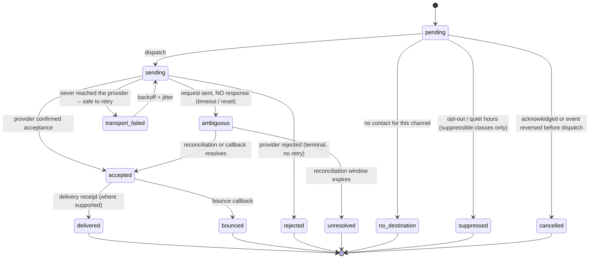

# SPEC-07 — Notification Delivery, Push Storage, and Processor Boundary

**Status: `PROPOSED`.** Remediates **CAR-009** (High), **CAR-010** (High), **CAR-019** (Medium).
**Supersedes:** [06](../06-data-architecture.md) §3.1 `push_registrations` and §3.6; [11](../11-notifications-and-communications.md) §§2, 4–7; [14](../14-security-and-privacy.md) §1 sensitivity class `PII` handling.
**New invariant:** **I-20**. **ADR:** [ADR-0010](../decisions/ADR-0010-notification-architecture.md) (revised).

---

## 1. Three defects

| | CAR-009 | CAR-010 | CAR-019 |
|---|---|---|---|
| **Was** | `push_registrations` stored `token_hash` only | Dedup key included `attempt`, so every retry was a new key; delivery called "exactly-once apparent" | Sensitivity table said `PII` is "never sent to third parties" |
| **Why wrong** | **Verified S-05:** Web Push needs the **endpoint**, **`p256dh`**, and **`auth`** retained to address and encrypt. A hash can deduplicate; it cannot deliver | After an accepted-but-response-lost outcome, a retry duplicates the *external* message. No callback authentication, no acknowledgement state, no escalation cancellation predicate | Email, SMS, voice, push, object storage, identity, and observability providers **necessarily** process contact or user data. The rule made a coherent design impossible and made "approved subprocessor" indistinguishable from "exfiltration" |
| **Effect** | CAP-041 could never operate | Duplicate calls to clinicians; audit cannot say what was received | Implementers either cannot send SMS, or ignore the rule entirely |

---

## 2. The honest delivery guarantee

**I-20 — Domain state is exactly-once. External delivery is at-least-once with a bounded ambiguity window that is explicitly recorded. SchedulePoint does not claim exactly-once external delivery on any channel where the provider cannot guarantee it.**

| Layer | Guarantee | Mechanism |
|---|---|---|
| **Domain event → intent** | **Exactly once** | Transactional outbox + `UNIQUE (outbox_event_id, recipient_membership_id, notification_class)` |
| **Intent → logical delivery** | **Exactly once** | Stable `logical_delivery_id`; retries reuse it |
| **Logical delivery → provider** | **At-least-once**, deduplicated where the provider supports it | Provider idempotency key = `logical_delivery_id` |
| **Provider → recipient** | **Provider-dependent. Not guaranteed by us** | Recorded truthfully, including `ambiguous` |

---

## 3. Push storage (CAR-009)

**`push_registrations` is redesigned.** Delivery material is **encrypted and retrievable**; a hash is retained separately, for lookup only.

| Column | Content | Access |
|---|---|---|
| `id`, `membership_id`, `platform` | Identity | Application |
| **`subscription_lookup_hash`** | Salted hash of the endpoint — **deduplication and lookup only** | Application |
| **`delivery_material_ref`** | Reference to a secret-store entry, **or** an envelope-encrypted blob holding `endpoint`, `p256dh`, `auth` (S-05) | **Delivery worker role only** |
| **`key_version`** | Envelope key version | Delivery worker |
| `endpoint_origin` | Push-service host **only** — no path, no token | Application (for provider routing metrics) |
| `consent_granted_at`, `consent_source` | Explicit consent record | Application |
| `state` | `consent-pending / active / stale / invalid / revoked` | Application |
| `last_success_at`, `consecutive_failures` | Health | Application |

| Control | Rule |
|---|---|
| **Separation of duties** | `app_runtime` **cannot** read `delivery_material_ref`'s contents. Only the delivery worker's role can decrypt. A database reader without that role recovers nothing |
| **Never logged, never traced, never in an error** | Endpoint, `p256dh`, and `auth` are prohibited in logs, spans, metrics, error reports, and audit payloads. The endpoint is redacted to its origin wherever it must be referenced |
| **Rotation** | Envelope keys rotate on a schedule; re-encryption is a background job. Key version is stored per row |
| **Invalidation** | A provider `404`/`410` sets `invalid` and **purges the delivery material immediately** |
| **Revocation** | User revocation purges material and records the revocation |
| **Backups** | Encrypted at rest; **restoring a backup without the current key version yields nothing usable** |
| **Consent** | Required before any material is stored. Withdrawal purges |

**Applies equally to any other channel whose delivery material is a secret** — not only Web Push.

---

## 4. Provider contracts and the ambiguity boundary (CAR-010)

### 4.1 Revised tables

| Table | Change |
|---|---|
| `notification_intents` *(NEW, formalised)* | `outbox_event_id`, `recipient_membership_id`, `notification_class`, `created_at`; **`UNIQUE (outbox_event_id, recipient_membership_id, notification_class)`** |
| `logical_deliveries` *(NEW)* | `intent_id`, **`logical_delivery_id`**, `channel`, `escalation_step?`, `state`, `acknowledged_at?`, `terminal_outcome?`; **`UNIQUE (intent_id, channel, escalation_step)`** |
| `delivery_attempts` *(CHANGED)* | `logical_delivery_id`, `attempt_number`, `provider`, `provider_message_ref?`, `request_sent_at`, `response_received_at?`, **`outcome ∈ {accepted, rejected, ambiguous, transport_failed}`**, `error_code?` |
| `provider_callbacks` *(NEW)* | `provider`, **`provider_event_id`**, `provider_message_ref`, `status`, `signature_verified`, `received_at`, `nonce`; **`UNIQUE (provider, provider_event_id)`** — replay-safe |

**`attempt` is removed from the deduplication key.** The provider idempotency key is `logical_delivery_id` — stable across every retry, which is the entire point.

### 4.2 The ambiguity state

| Outcome | Retry? | Rationale |
|---|---|---|
| `transport_failed` | **Yes** | Provably never reached the provider |
| **`ambiguous`** | **Only with provider idempotency** (§4.3) | The message may already have been delivered |
| `rejected` | No | Terminal |
| `accepted` | No | Done |
| **`unresolved`** | No | **Recorded as genuinely unknown.** Surfaced in the delivery ledger and to the operator |

**`unresolved` is the honest outcome the previous design lacked.** "We do not know whether this was delivered" is a real state, and pretending otherwise is what produced duplicate calls.

### 4.3 Per-provider capability declaration

**Every provider adapter declares its capabilities. Behaviour follows the declaration; nothing is assumed.**

| Declared capability | If **supported** | If **not supported** |
|---|---|---|
| **Stable idempotency key** | Retry an `ambiguous` attempt with the same `logical_delivery_id`; the provider deduplicates | **Do not retry.** Reconcile (§4.4); if unresolvable, terminate `unresolved` |
| **Delivery receipts** | Record `delivered` | State stops at `accepted`; **`delivered` is never inferred** |
| **Message-status query** | Reconcile ambiguous attempts by polling | Rely on callbacks and the window |
| **Signed callbacks** | Verify signature (§4.5) | **Callbacks are not accepted at all** — an unauthenticated callback is not evidence |

**A channel used for safety-critical notification whose provider supports neither idempotency nor status query is a procurement problem, not an engineering one, and is recorded as a selection criterion in [SPEC-15](SPEC-15-technology-decision-gates.md) TDG-06.**

### 4.4 Reconciliation

A worker sweeps attempts left `ambiguous` beyond a grace period: query provider status where supported; correlate against `provider_callbacks` by `provider_message_ref`; resolve to `accepted`/`rejected`/`delivered`, else terminate `unresolved` at the window's end. **Every transition is audited. The window is per-provider configuration.**

### 4.5 Callback authentication and replay defence

| Control | Rule |
|---|---|
| **Signature verification** | Provider signature verified before parsing. **Failure → discard and raise a security event** |
| **Timestamp window** | Outside tolerance → rejected |
| **Nonce / event-id uniqueness** | `UNIQUE (provider, provider_event_id)` makes replay a no-op |
| **Correlation** | To `logical_delivery_id` via `provider_message_ref`. An uncorrelatable callback is quarantined, **never applied speculatively** |
| **Reordering** | Callbacks carry provider timestamps; an older status never overwrites a newer one |
| **Transport** | HTTPS, dedicated endpoint, rate-limited, **no session cookie accepted** |

---

## 5. Acknowledgement and escalation cancellation

**The review's scenario: the user acknowledges the SMS while the escalation worker has already claimed the voice step, so the call goes out anyway.**

| Mechanism | Design |
|---|---|
| **Acknowledgement is durable state** | `logical_deliveries.acknowledged_at`, set by an explicit user action or by the domain resolution that made the notification moot (turn picked, request decided) |
| **Conditional escalation claim** | An escalation step is dispatched only by a conditional update that **fails if the intent is already acknowledged, cancelled, or resolved**: `UPDATE logical_deliveries SET state='sending' WHERE id=:x AND state='pending' AND intent NOT acknowledged` — zero rows means do not send |
| **Acknowledgement cancels pending steps in one transaction** | All later steps for that intent move to `cancelled` atomically |
| **The residual window is bounded and stated** | If acknowledgement lands *after* the claim commits but *before* the provider call, **the call goes out.** This window is milliseconds, is documented, and is **not claimed to be zero** |
| **Exhaustion** | Raises an operational alert; never silent |

---

## 6. Notification-class matrix

**Which rules may suppress which messages — normative, not per-implementer judgement.**

| Class | Examples | Quiet hours | Channel opt-out | Escalation |
|---|---|---|---|---|
| **`safety-critical`** | Picklist turn start; turn expiring | **Overridden** | **Cannot be disabled**; the *channel* may be chosen, but at least one must remain | Full ladder |
| **`mandatory-operational`** | Your published schedule changed; your request was decided; credential expired | **Overridden** for same-day impact, otherwise deferred to the next window | Cannot be fully disabled; **in-app always delivered** | Limited |
| **`suppressible-operational`** | Opportunity posted; broadcast; digest | **Honoured** | Fully honoured | None |
| **`administrative`** | Import quarantined; dead-letter backlog | Honoured | Honoured; routed by operational role | Per policy |
| **`security`** | Credential changed; MFA reset; new sign-in; feed token issued/rotated/revoked | **Overridden** | **Cannot be disabled** | None |

| Rule | Detail |
|---|---|
| **Class is set by the domain event, not by the recipient** | A user cannot reclassify their way out of a safety notice |
| **A suppressed message is recorded**, never silently dropped | `suppressed` with the rule that suppressed it |
| **Minimum payload** | Enough to act, no more (§7) |
| **Proxy delivery** | A `notifications-only` or `act-on-behalf` proxy receives `safety-critical` and `mandatory-operational` copies **in addition to** the principal, marked as proxy copies. **`security` class is never proxied** |
| **Group identity delivery** | Broadcasts resolve recipients **only** from the roster; per-recipient class rules still apply |

---

## 7. Processor boundary (CAR-019)

**The blanket "PII is never sent to third parties" is withdrawn and replaced by an explicit processor model.** It was unimplementable and made an approved subprocessor indistinguishable from exfiltration.

### 7.1 Two distinct rules, previously conflated

| Rule | Scope |
|---|---|
| **CAP-068 / T-23 — strict prohibition** | **The browser and client telemetry.** No email, email-derived hash, or equivalent identifier may reach *any* third-party host from the client. **A CI guard fails the build on a new outbound client host.** Unchanged and absolute |
| **Approved processor boundary — governed permission** | **Server-side subprocessors** may process the minimum data required, under contract, with a declared payload schema, residency, retention, and deletion terms |

**Confusing these two is what produced the contradiction.**

### 7.2 Processor classes and permitted payloads

| Class | May receive | Must never receive |
|---|---|---|
| **Email** | Recipient address, subject, body, sender identity | Clinical content; patient data; other members' PII |
| **SMS** | Recipient number, short body | Same, plus schedule detail beyond what the message needs |
| **Voice** | Recipient number, TTS script or template ref | Same |
| **Push** | Endpoint, encrypted payload | Cleartext beyond the minimum; **body encrypted per RFC 8291** |
| **Object storage** | Encrypted objects, tenant-prefixed keys | Identifiers in key names |
| **Identity provider (OIDC)** | Subject identifier, email | Schedule data |
| **Observability** | Metrics, traces, structured logs | **Payload bodies, contact values, delivery material, ingestion content** |
| **Malware scanning** | Uploaded document bytes | — (the document is the payload; contract terms govern) |

### 7.3 Register

**A `processor_register` artifact is required before production**, one row per processor: legal entity, purpose, data elements, lawful basis, contract reference, processing region, retention, deletion mechanism, sub-processors, security posture, breach-notification terms, and exit plan.

| Requirement | Status |
|---|---|
| Register exists | **Not created — no provider selected** ([SPEC-15](SPEC-15-technology-decision-gates.md)) |
| Data-processing agreements | **Not executed** |
| Residency per processor | **Open** — depends on [SPEC-10](SPEC-10-deployment-topology.md) §9 |

**These are named as owner-input gaps, not designed around.**

### 7.4 Test distinction

| Test | Asserts |
|---|---|
| **Client host allowlist** | The browser contacts **only** first-party origins. Any third-party host fails the build (CAP-068) |
| **Server egress allowlist** | Server processes contact **only** registered processors. An unregistered host fails |
| **Payload conformance** | For each processor, the outbound payload matches its declared schema exactly — **no extra field is transmitted** |
| **Redaction** | Provider request logs contain no delivery material and no clinical content |

---

## 8. Test contract

**Extends SBX-030a and SBX-030b.**

| # | Scenario | Required outcome |
|---|---|---|
| N-01 | Register, deliver, rotate, invalidate, revoke a real **test** push subscription | Delivery succeeds; material never appears in logs, traces, or errors |
| N-02 | Database reader **without** the delivery role attempts to recover material | **Cannot** |
| N-03 | Provider accepts, response lost | `ambiguous`; **no blind retry** unless idempotency is declared |
| N-04 | Same, provider **supports** idempotency | Retry with the same key; **exactly one external message** |
| N-05 | Same, provider **does not** | Reconcile; else `unresolved`. **Never a duplicate** |
| N-06 | Duplicate callback | Second is a no-op (unique `provider_event_id`) |
| N-07 | Reordered callbacks | Older status never overwrites newer |
| N-08 | **Forged callback** | Rejected; security event raised |
| N-09 | Acknowledgement races escalation claim | Either cancelled, or sent within the documented window. **Never both branches** |
| N-10 | Preference change mid-flight | Applies to steps not yet claimed |
| N-11 | `safety-critical` during quiet hours | **Delivered** |
| N-12 | `suppressible-operational` during quiet hours | Suppressed **and recorded** |
| N-13 | Provider outage throughout | Bounded retries, dead-letter, alert. **No duplicate domain state** |
| N-14 | Worker crash mid-dispatch | Resumes; at most one additional external message, correctly classified |
| N-15 | Payload conformance per processor | No extra field transmitted |
| N-16 | Client loads any third-party host | **Build fails** (CAP-068) |

**All tests use controlled endpoints. No real person is ever contacted.**

---

## 9. Traceability

**Capabilities:** CAP-024, CAP-027, CAP-031, CAP-040, CAP-041, CAP-042, CAP-043, CAP-046, CAP-048, CAP-051, CAP-056, CAP-068.
**Decisions:** PO-DEC-07, PO-DEC-15, PO-DEC-21, PO-DEC-22 — **all pending.**
**ADRs:** [ADR-0009](../decisions/ADR-0009-job-and-event-reliability.md), [ADR-0010](../decisions/ADR-0010-notification-architecture.md) (revised), [ADR-0014](../decisions/ADR-0014-file-and-report-storage.md).
**Gates:** `G-BETA`, `G-PROD`. **None passed.**
