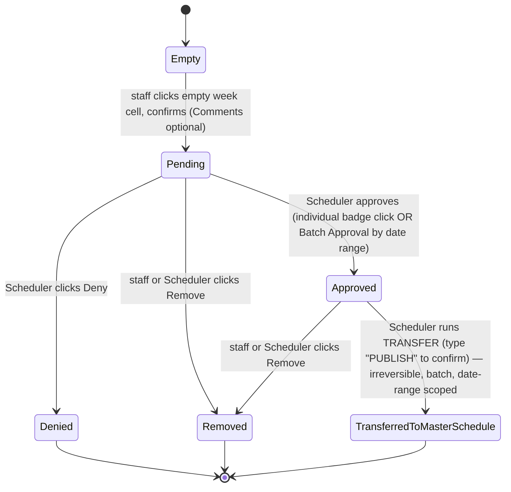
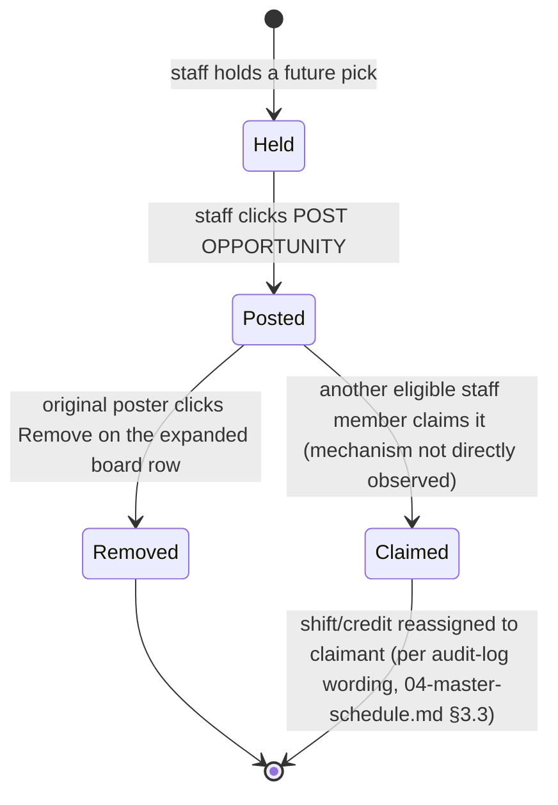
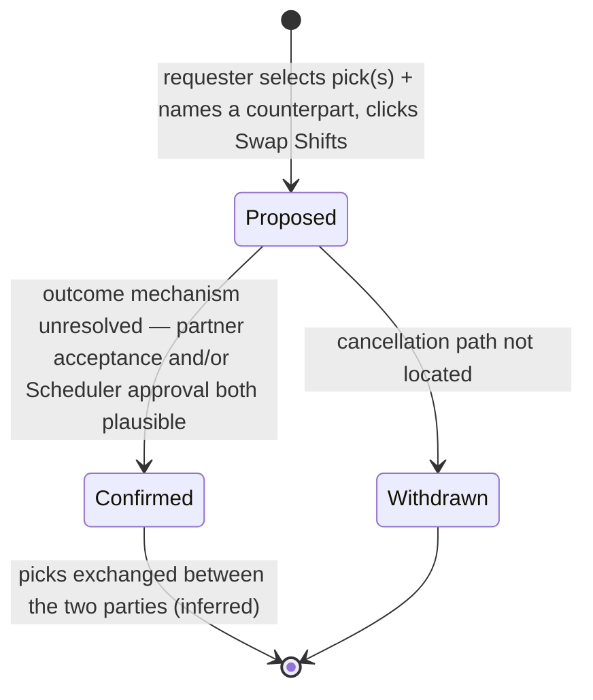

# 06 — Requests, Vacation, Opportunities, Swaps & Approvals: ischedule.MD

**Phase:** 7 — lifecycle audit of every request-like workflow.

**Method:** Read-only per [RESEARCH-RULES.md](../RESEARCH-RULES.md). Every creation/approval/transfer surface was opened to inspect fields and confirmation copy; none was submitted. Merges by stable ID into [01-application-map.md](01-application-map.md) (VAC-01/02, ADM-08), [03-user-workflows.md](03-user-workflows.md) (WF-08 through WF-13), and [05-scheduling-engine.md](05-scheduling-engine.md) rather than redescribing already-covered ground; this report's job is the **lifecycle view** — creation rules, statuses, transitions, and diagrams.

**Evidence labels:** **[OBSERVED]** · **[INFERRED]** · **[UNRESOLVED]**.

**Exclusions honored:** no real names reproduced.

---

## LC-01 — Vacation request lifecycle

- **Creation rules [OBSERVED]:** any staff member with a row on the Vacation grid may click an **empty** week-column cell in their **own** row, within the active Vacation Block's date range.
- **Eligible dates:** bounded by the active Vacation Block (`Active vacation block <Start> to <End>`, configured on VAC-02); each clickable column is a fixed calendar week (Sat–Sun boundaries observed).
- **Deadlines:** Group Settings' **Request Until Date** (ADM-01) is the group-wide deadline after which the request-status panel on My Schedule shows "(CLOSED)" instead of "(UNTIL `<date>`)" — **[INFERRED]** this gates *new* request submission generally, not confirmed to specifically gate this Vacation-grid interaction (the Vacation grid itself showed no visible lockout when tested, since testing was done within an open window).
- **Fields:** a single optional **"Comments for Scheduler"** free-text field.
- **Required values:** none beyond the implicit week selection (the clicked cell).
- **Statuses:** `(none/empty)` → **pending** (amber badge, color convention observed on the grid; **[INFERRED]** this is the pending color, not directly labeled as such) → **approved** (green badge, confirmed via VAC-01's badge-click modal showing existing green-badge entries) or **removed/denied** (badge disappears).
- **Valid transitions:**
  - empty → pending (Confirm on creation modal)
  - pending → approved (Scheduler action; **[UNRESOLVED]** exact click path — likely either the individual badge or the **Batch Approval** tool, see LC-01a)
  - pending → denied (Scheduler clicks **Deny** on the badge's modal)
  - pending or approved → removed (staff or Scheduler clicks **Remove** on the badge's modal)
- **Actors:** requester (create, and per the badge modal, apparently also Remove); Scheduler (Approve/Deny, per "Approval Required By Scheduler" = Yes in this tenant; **[INFERRED]** a tenant with that setting = No would presumably auto-approve, not observed since this tenant has it enabled).
- **Approval requirements:** gated by VAC-02's **Approval Required By Scheduler** toggle (observed Yes).
- **Notifications:** **[UNRESOLVED]** — no explicit "notify on approve/deny" toggle found; plausible given the product's broader notification infrastructure.
- **Cancellation/rejection:** see Remove/Deny above (same modal, both buttons present regardless of the badge's current status in the one instance inspected).
- **Expiry:** **[UNRESOLVED]** — no visible auto-expiry mechanism found for a pending request that's never actioned.
- **Editing:** the **Save Comment** action on the badge modal edits the comment without resolving the request — the only observed "edit" capability; the week itself does not appear editable (would require Remove + re-create).
- **Deletion:** Remove (see above).
- **Assignment effects:** an approved vacation week should render as the group's configured **Vacation shift** code (Group Settings, ADM-01) on the Master Schedule and count against **Weekly Quota**/staff **Avail** balance (VAC-01 header rows) — **[OBSERVED the counters; INFERRED the causal mechanism, not verified by watching a real approval propagate]**.
- **Statistics effects:** the Requested/Avail/Grant counters update in real time as entries are added (**[OBSERVED]** the counters exist and are clearly derived from the grid's own badge data; not verified live by creating a real entry).
- **Conflicts/concurrency risks:** the Weekly Quota vs. Requested variance row (turns negative/red when over-quota, per Phase 1) is a visible **soft-conflict indicator** — **[OBSERVED]** — but nothing in the UI suggested the system *blocks* an over-quota request outright; it appears to be advisory, leaving the Scheduler to decide whether to approve anyway. **[INFERRED]**

### LC-01a — Vacation batch approval (new this phase)

- **Actor:** Scheduler
- **Starting control:** Vacation grid's **Approve** button (distinct from per-badge approval, if that exists)
- **Fields [OBSERVED]:** "Batch Approval" modal — explanatory text *"You can approve individual vacations by clicking on them. This function approves all vacations requests between the dates below."* + **Date Start** / **Date End** (defaulted to the active block's full range) + **Cancel** / **APPROVE VACATIONS**.
- **Effect [INFERRED, not executed]:** approves every pending vacation request whose week falls inside the given date range, in one action — a bulk alternative to clicking each badge individually.
- Not exercised.

### LC-01b — Vacation → Master Schedule transfer/publish (major finding, high consequence)

- **Actor:** Scheduler (button labeled **TRANSFER**, green, in the Vacation toolbar)
- **Modal title [OBSERVED]:** **"TRANSFER VACATIONS TO MASTER SCHEDULE"**
- **Fields:** Date Start / Date End (defaulted to the active block's range), and a **type-to-confirm** text field requiring the literal word **"PUBLISH"** to be typed before the **PUBLISH** button becomes actionable.
- **Confirmation copy [OBSERVED, verbatim]:** *"Please type PUBLISH into the box below to confirm writing vacations to the master schedule. It can NOT be undone."*
- **Significance:** this is the mechanism that actually **writes approved vacation entries into the live Master Schedule** as OFF/vacation cells — a batch, irreversible, explicitly-labeled-as-permanent operation. It is the single most consequential control found in the Vacation module, on par with Builds' "Erase Master Schedule" in terms of blast radius. The type-to-confirm UX pattern (must type the exact action word, not just click a colored button) is a deliberate friction mechanism worth carrying into SchedulePoint's own design for any similarly irreversible, wide-blast-radius action.
- **Not exercised:** neither the confirmation text was typed nor was PUBLISH clicked.
- **Unresolved:** whether this operation is idempotent (safe to re-run over an already-transferred range) or would create duplicate/conflicting entries; whether it can be scoped to fewer than the full active block; whether "TRANSFER" happens automatically on some schedule or is purely manual. **[UNRESOLVED]**

### Mermaid — Vacation request lifecycle

### Given/When/Then

> **Given** the active Vacation Block has "Approval Required By Scheduler" = Yes
> **When** a staff member selects an empty week in their own row
> **Then** the entry enters a pending state and does not count as a firm day off until a Scheduler approves it

> **Given** one or more vacation weeks are Approved within a date range
> **When** a Scheduler opens TRANSFER and types "PUBLISH" to confirm
> **Then** those weeks are written into the Master Schedule as the group's configured vacation shift code, and this action cannot be undone through any control found in the product

---

## LC-02 — Shift-group-scoped "OFF {X}" request lifecycle

- **Evidence source:** the My Schedule "My Requests" panel's full history (WF-10), which showed multiple **APPROVED** entries of the exact shape `"OFF {All Call}"`, dated across several years.
- **Creation:** **[UNRESOLVED]** — not located. Thoroughly searched My Schedule and the Vacation grid; no distinct "request off a specific call type" creation control was found. Two hypotheses, neither confirmed:
  1. The Vacation grid's week-cell click (LC-01) is reused against a different "shift" column scoped to a Shift Group rather than the tenant's plain vacation code — **[INFERRED, plausible]** given Shift Groups (ADM-08) explicitly carry an **Allow Request** flag and a **Request Off Text** field (e.g., literally "Request off All Calls.") that would otherwise have no visible consumer.
  2. A separate, not-yet-found screen exists for this request type specifically.
- **Statuses:** APPROVED confirmed; PENDING/DENIED presumed by symmetry with LC-01. **[INFERRED]**
- **Deletion:** a **DELETE** button is present per row in the My Requests panel, including on already-APPROVED rows — **[OBSERVED]** — meaning a user can apparently retract even a resolved request through this panel. **[UNRESOLVED]** whether this is the same underlying delete path as LC-01's Remove, or a separate one specific to this request type.
- **Given/When/Then (confirmed portion only):**
  > **Given** a user has an APPROVED "OFF {`<Shift Group>`}" request in their history
  > **When** they view the My Requests panel with the ALL filter active
  > **Then** the row displays its status, target date, the shift-group-scoped description, and a DELETE control — regardless of the request's age (history observed back to 2022)

---

## LC-03 — Opportunity (give-away) lifecycle

- **Creation:** staff member with a future, unresolved-or-resolved pick clicks the date cell on My Schedule → **POST OPPORTUNITY** button (future dates only — confirmed absent on past/today cells).
- **Eligible dates:** any future date the poster currently holds a pick for.
- **Fields:** none beyond the implicit date/pick (button click itself appears to be the entire creation action — no modal was observed to open from this button in this session; **[UNRESOLVED]** whether a confirmation step exists, since the button was identified but not clicked to avoid actually posting a real opportunity).
- **Statuses:** not-posted → **posted** (appears on the Opportunity Board, with a ❤ heart icon on the corresponding calendar date) → **removed** (poster clicks Remove on the expanded board row) or **claimed** (by another eligible staff member — the claim side of this lifecycle was never observed, since every entry inspected belonged to the reviewing account itself).
- **Valid transitions:** posted → removed (self-service, confirmed control exists); posted → claimed (**[UNRESOLVED]**, inferred to exist from the very concept of an "opportunity board" plus the audit-log wording seen in 04-master-schedule.md — `"<Shift> moved as opportunity to Staff-B by Staff-B"` — which shows the log attributes the change to the *claiming* party, strongly implying a claim action exists and is what generates that log line).
- **Confirmation requirements:** **[UNRESOLVED]** for posting; for removal, the interaction is a single click on an already-expanded row's Remove button with no visible secondary confirmation (**[OBSERVED]** — contrast with LC-01b's much heavier type-to-confirm friction for a batch/irreversible action, suggesting the product scales its confirmation friction to the action's blast radius: a single give-away retraction is low-stakes, a mass vacation-to-schedule transfer is not).
- **Locum restrictions:** **[UNRESOLVED]** — no explicit rule was found restricting Locum-role staff from posting or claiming opportunities; Locum-specific constraints observed elsewhere (Locum Lockout Hours on Group Settings, ADM-01) are framed generically around lockout/notice periods rather than opportunity-specific eligibility, so it's plausible the same lockout-hours rule applies uniformly to any hand-off, not specifically opportunities. **[INFERRED, low confidence]**
- **Notifications:** **[UNRESOLVED]**.
- **Assignment effects:** presumably reassigns the shift/pick to the claimant and updates that person's Master Schedule row (consistent with the audit-log wording). **[INFERRED]**
- **Concurrency risk:** if two eligible staff attempt to claim the same posted opportunity near-simultaneously, **[UNRESOLVED]** what resolves the race (first-click-wins is the most common pattern for this kind of feature, but nothing in the UI confirms it).

### Mermaid — Opportunity lifecycle

---

## LC-04 — Shift swap lifecycle

- **Creation:** staff member clicks **SWAP SHIFT** on My Schedule (available on both past-today and future dates, unlike POST OPPORTUNITY).
- **Fields:** checklist of the requester's own upcoming picks (multi-select), a **"Staff for swap"** combobox naming the proposed counterpart, Cancel/Swap Shifts.
- **Statuses/transitions:** **[UNRESOLVED]** end-to-end — the form was opened but not submitted, so no post-submission state (pending-partner-acceptance? pending-scheduler-approval? immediate?) was observed. Two plausible models, not distinguished by available evidence:
  1. **Partner-acceptance model:** the named colleague must separately confirm before the swap takes effect (true two-sided negotiation).
  2. **Scheduler-approval model:** similar to vacation, an admin approves it (no distinct "Approval Required" toggle was found specifically for swaps, unlike vacation's explicit one, which slightly favors the partner-acceptance model being at least equally likely — **[INFERRED, low confidence]**).
- **Cancellation:** presumably possible before the counterpart acts, via some mechanism not located this phase (no swap-specific entry was seen in the My Requests panel's history, which only ever showed vacation/OFF-shaped entries — **[UNRESOLVED]** whether swaps even surface there under a different status string, or live in a wholly separate, unlocated status view).
- **Assignment effects:** presumably exchanges the two named picks between the two parties. **[INFERRED]**
- **Concurrency risk:** **[UNRESOLVED]**.

### Mermaid — Shift swap lifecycle (largely inferred shape)

---

## LC-05 — Batch vacation entry (admin-side, brief)

- **Controls [OBSERVED]:** Vacation toolbar's **Batch Entry Off ▾** menu → **Batch Entry Off** / **Batch Entry On** — two distinct bulk actions, presumably mass-creating or mass-clearing vacation/availability entries across a staff selection and date range, mirroring the Master Schedule's own Batch Add/Batch Delete pattern (04-master-schedule.md §7). Neither sub-item was opened past the menu label, to avoid any risk of a bulk mutating form being partially filled and accidentally submitted.
- **[UNRESOLVED]** exact field structure of either sub-action.

---

## Cross-cutting observations

- **Confirmation friction scales with blast radius:** a single Remove/Cancel is a plain click; a per-request approval carries a Comments box and named actors (Approve/Deny/Remove/Save Comment); a **batch** approval requires an explicit date range; and the single most consequential action found in this entire lifecycle family (TRANSFER/Publish vacations into the Master Schedule) requires literally typing the word "PUBLISH." This graduated-friction pattern is a strong design cue worth deliberately replicating in SchedulePoint for any equivalently irreversible, wide-blast-radius action.
- **Two request "shapes" coexist and are incompletely reconciled by this research:** the vacation-block week request (LC-01, fully mapped) and the shift-group-scoped "OFF {X}" request (LC-02, creation path still unresolved). A future pass should prioritize locating LC-02's creation surface, since it's the one significant gap remaining in the requests family after four phases of otherwise-thorough coverage.
- **The claim/accept side of both Opportunities (LC-03) and Swaps (LC-04) was never directly observed**, because the single-account nature of this research means every opportunity or swap inspected was one the reviewing account itself had created. This is a structural limitation of single-session, single-role research, not a gap in effort — a genuine second account would be needed to observe the "receiving end" of either lifecycle.

---

## Master checklist — Phase 7 topics

| Topic | Status |
|---|---|
| ON requests | **[UNRESOLVED]** creation surface (see LC-02); presumed same shape as OFF |
| OFF requests | **[OBSERVED]** for vacation (LC-01); **[UNRESOLVED]** creation for shift-group-scoped (LC-02) |
| Shift-group requests | **[UNRESOLVED]** creation; **[OBSERVED]** history/status (LC-02) |
| Vacation selection | **[OBSERVED]** — LC-01 |
| Vacation quotas | **[OBSERVED]** (recap from Phase 1) |
| Vacation grants | **[OBSERVED]** (recap) |
| Vacation approval | **[OBSERVED]** — individual (badge) + batch (LC-01a) |
| Vacation transfers | **[OBSERVED]** — LC-01b, major finding (irreversible, type-to-confirm) |
| Vacation administration | **[OBSERVED]** — Batch Entry Off/On menu exists (LC-05), content unresolved |
| Opportunity creation | **[OBSERVED]** trigger; **[UNRESOLVED]** confirmation step — LC-03 |
| Opportunity acceptance | **[UNRESOLVED]** — never observed from the claimant side |
| Locum restrictions | **[UNRESOLVED]** — no opportunity/swap-specific rule found |
| Confirmation requirements | **[OBSERVED]** — graduated friction pattern documented in Cross-cutting observations |
| Shift swaps | **[OBSERVED]** form; **[UNRESOLVED]** full lifecycle — LC-04 |
| Transfer approval | **[UNRESOLVED]** — conflated with LC-01b (vacation transfer) and LC-04 (swap); neither's approval mechanics fully confirmed |
| Related lifecycles | LC-05 (batch vacation entry) noted, not detailed |

---

## Safety & boundary notes

- Batch Approval's date range was viewed but **APPROVE VACATIONS** was never clicked.
- TRANSFER's confirmation field was **never typed into**, and **PUBLISH** was never clicked — this is the highest-consequence control encountered across all seven phases of this research, and it was handled with the most caution accordingly.
- Batch Entry Off/On were only opened to the menu-label level, never into whatever form lies behind either item.
- POST OPPORTUNITY, SWAP SHIFT's "Swap Shifts," and every Vacation badge's Remove/Deny were left unclicked (recap from Phase 4, restated here since this report is the canonical lifecycle record).

## Evidence & follow-up

- Screenshots not yet exported to disk (standing limitation across all phases).
- Findings merged into [source-page-index.md](source-page-index.md), [unresolved-questions.md](unresolved-questions.md), [evidence-register.md](evidence-register.md), [manifest.json](manifest.json).
