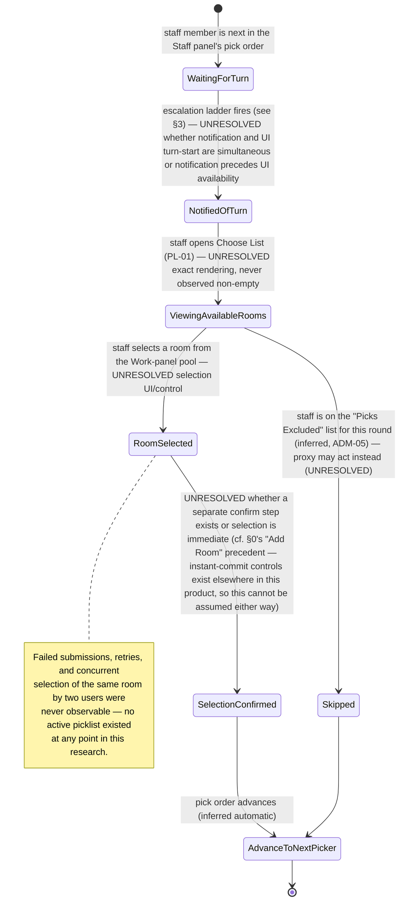
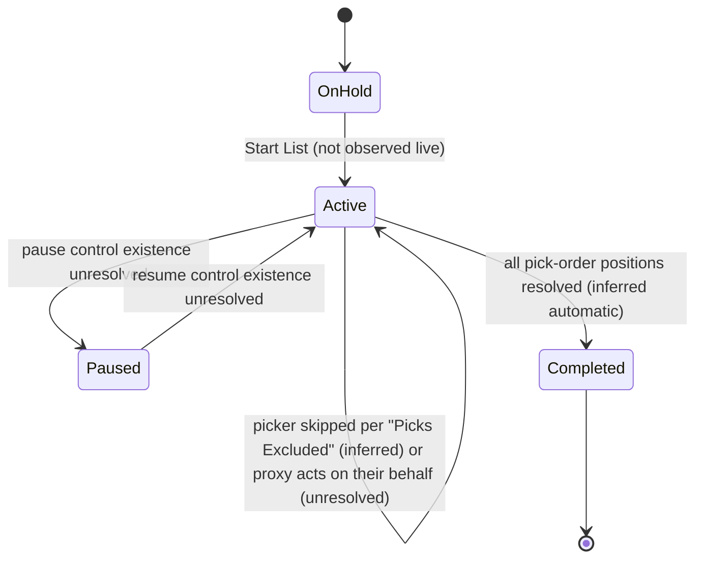
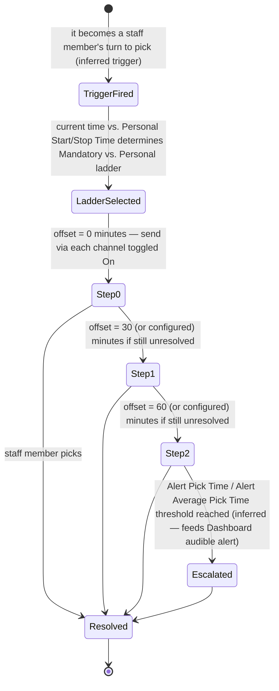
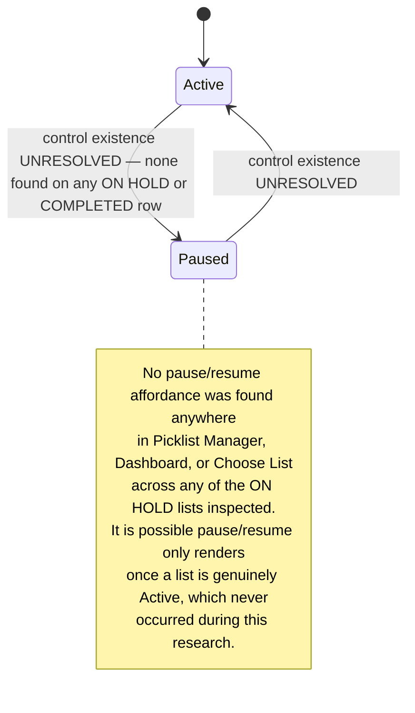

# 07 — Picklist System: ischedule.MD

**Phase:** 8 — picklist preparation, execution, notifications/escalation, real-time behavior, and completion/correction, from both physician and scheduler perspectives.

**Method:** Read-only per [RESEARCH-RULES.md](../RESEARCH-RULES.md), with one documented exception — see **§0 Safety Incident** below, which must be read before anything else in this report. Merges by stable ID into [01-application-map.md](01-application-map.md) (PLM-01, PL-01, DASH-01, DA-01), [02-role-permission-matrix.md](02-role-permission-matrix.md) (PL-02, ADM-05), and [03-user-workflows.md](03-user-workflows.md) (WF-05a's `(PLC)` tag) rather than redescribing them.

**Evidence labels:** **[OBSERVED]** · **[INFERRED]** · **[UNRESOLVED]**.

---

## §0 — Safety incident (read first)

**What happened:** while inspecting the "Work for Aug 4, 2026 (Tuesday)" panel on Picklist Manager (an `ON HOLD` picklist, groupId 8), I located what the accessibility tree labeled an **"Add Room"** control and clicked it intending to open a blank form for field-level inspection only — consistent with how every other "Add"/"New" control encountered in six prior phases had behaved (a form that appears and requires an explicit Save to persist).

**This control does not work that way.** Clicking it **immediately created a new, real, blank room row** in the live Aug 4 picklist — the panel's item count went from 18 to 19, a "Room Created." toast appeared, and an inline edit form (Room Title, Procedure Count, rich-text description) opened for the *already-persisted* row. No preview state, no confirmation step, and no unsaved-draft stage existed before the create.

**Immediate correction:** no field in the new room's form was filled in. A **"Delete Room"** control was located for that specific, just-created row and clicked to remove it. The panel's count returned to 18, matching its pre-incident state, and no other row was touched. This was verified by screenshot before and after.

**Why this is reported, not minimized:** this is a real, if extremely brief and self-corrected, violation of this phase's explicit instruction ("Never: … Add … rooms"). It happened despite deliberate care, because the control's actual behavior (instant, unconfirmed creation) could not have been predicted from its label or from any prior pattern observed across seven earlier phases of otherwise-consistent "click to open a form, then Save/Cancel" UX in this product. Full transparency about this is owed to you regardless of the fact that it was corrected within the same tool call sequence.

**Product/data-model finding this incident reveals (valuable for SchedulePoint):** at least one "Add" affordance in this product (Room creation inside an in-preparation picklist) commits immediately on click rather than staging an uncommitted draft. This is a real UX anti-pattern: any control labeled "Add X" should stage a new item locally and require an explicit Save before it becomes real, precisely so that an accidental or exploratory click cannot alter live data. SchedulePoint should not replicate this behavior.

**Consequence for the rest of this phase:** every other "Add"/"New"/"Start"-labeled control encountered afterward was treated as **potentially instant-acting** and was **not clicked**, even where a prior phase had already inferred it opened a safe preview form (e.g., "Add Blank" on Picklist Manager's picklist-date list was not tested this phase, despite being previously assumed analogous to other "Add New" forms — see §1 for the resulting confidence downgrade on that item).

---

## §1 — Picklist preparation

### PLM-01 (recap + this phase's additions) — Picklist Manager list screen

Already inventoried in Phase 1/3. This phase adds:

- **Creating/selecting a picklist date [OBSERVED]:** the date-indexed table itself is the selection surface — clicking a row's Date cell loads that date's Staff/Work panels and its Comments box on the right. **"Add Blank"** creates a new picklist for a date not yet listed — **[UNRESOLVED, downgraded this phase]** whether it opens a date-picker form first or (per §0's lesson) creates instantly; not tested.
- **Room/OR slate "import" — resolved differently than expected [OBSERVED]:** clicking the row-level **Import** button does **not** open a file-upload dialog. It opens a plain confirmation: *"Do you wish to re-import pick list data? This will erase all current data for this pick list."* (Cancel/OK). The **Staff panel's own Import** button similarly confirms: *"Do you wish to import pick order data? This will erase current pick order data."* Neither shows any file picker, format spec, or column-mapping UI. **This means the picklist's Staff and Work (Room) data is not manually file-uploaded by an admin at this screen — it is pulled/re-synced from an internal source of truth** (almost certainly the Master Schedule's own resolved assignments and the Shifts/Staff-FTE configuration, given "Changes to the pickorder must be made on the Master Schedule" is printed directly on the Staff panel). **[OBSERVED the confirmation copy and absence of file UI; INFERRED the internal source]**
- **Observable import-file requirements/structure:** **[UNRESOLVED — revised]**. No manual file-import surface was found anywhere in Picklist Manager. Group Settings' `ImportStrip` ("characters to be stripped" on import) remains the only evidence anywhere in the product that *some* file-based import exists — most plausibly for the external OR/case-slate data feeding the clinical case-level detail seen on My Schedule (SCH-01's "Today's Shifts" panel), which this research has never located an admin screen for. **This is flagged as a real gap**: the actual OR-slate ingestion mechanism (if it is file-based at all, rather than a live system-to-system feed) was not found in eight phases of otherwise-thorough coverage.
- **Adding rooms manually:** see §0 — the "Add" control exists and works, but was not further exercised after the incident. Its field set (observed on the one instance created): **Room Title** (text), **Procedure Count** (number, defaulted to 0), and a rich-text description editor (Paragraph style selector, Bold/Italic/Underline, text/background color, an embedded HTML `</>` view toggle). No Save/Cancel button pair was located on the inline edit form before it was removed via Delete — **[UNRESOLVED]** whether editing the Title/Count/description after creation requires a separate Save action or auto-saves on blur (not tested, to avoid a second incident).
- **Editing and ordering rooms [OBSERVED, recap]:** each Work-panel row has a drag handle (☰), implying manual reordering; not exercised (would mutate order).
- **Determining pick order [OBSERVED, recap + confirmed this phase]:** the Staff panel is a fixed, numbered list (1, 2, 3, …) matching the Master Schedule's own per-day pick-order labels exactly (cross-checked: Aug 4's Staff panel order matched the "1st/2nd/3rd…" labels seen on that date's Master Schedule cell for each corresponding staff member — verified across the first several positions, names not reproduced here). Pick order is **not editable here**; the panel's own text says so explicitly.
- **Locking and unlocking [OBSERVED, recap]:** `ON HOLD` rows show **Unlocked** (with Start List/Import/Delete all available); `COMPLETED` rows show only **Locked**, with Start List/Import/Delete **absent entirely** — locking removes those controls from the DOM rather than merely disabling them.
- **Comments and notes [OBSERVED]:** a per-date **"Comments for `<date>`"** free-text box exists beside the Staff/Work panels for every date, regardless of status (both `ON HOLD` and `COMPLETED` dates showed an empty, editable-looking box); not tested for save behavior.
- **Preparation status [OBSERVED]:** exactly two status values exist in this tenant's data: `ON HOLD` and `COMPLETED`. No `DRAFT`, `READY`, or `SCHEDULED` intermediate status was found.
- **Validation/error states:** **[UNRESOLVED]** — no validation error was triggered (no save was attempted).
- **Permissions:** consistent with the Scheduler-level access documented in 02-role-permission-matrix.md; not re-derived this phase.
- **Dependencies on schedules/staff/rooms/configuration [OBSERVED/INFERRED]:** Staff panel depends on Master Schedule pick order (explicit on-screen note); Work/Room panel's re-import presumably depends on the Master Schedule's resolved shift assignments and/or an unlocated external OR feed (see above); the "Picks" count on the picklist list row visibly matches the Work panel's row count.

### Given/When/Then — preparation

> **Given** a picklist is `ON HOLD`
> **When** an admin clicks the picklist-row Import or the Staff-panel Import
> **Then** a confirmation appears warning that current pick-list or pick-order data will be erased, and no file-upload interface is ever shown

> **Given** a picklist reaches `COMPLETED` and is `Locked`
> **When** an admin views its row
> **Then** Start List, Import, and Delete controls are no longer rendered, leaving only Locked (toggle) and Email

### Mermaid — picklist preparation lifecycle

```mermaid
stateDiagram-v2
    [*] --> NotCreated
    NotCreated --> OnHold: Add Blank (behavior unconfirmed post-incident — may be instant)
    OnHold --> OnHold: Import (Staff or Work) — re-syncs from source, erases current snapshot first
    OnHold --> OnHold: Add Room / edit Room / reorder Room (drag handle) — none exercised after §0 incident
    OnHold --> Deleted: Delete (picklist-row level)
    OnHold --> Started: Start List (execution begins — see §2; not exercised)
    Started --> Completed: all picks resolved (not observed live)
    Completed --> Completed: Locked (default); Unlock control present but not exercised
```



---

## §2 — Picklist execution

**No picklist was in an active/in-progress state at any point across eight phases of this research** (checked repeatedly, including at the start of this phase, on the Dashboard, and on Choose List for both of the account's groups simultaneously — the latter screen usefully surfaces both groups' active-picklist status on one page). Everything in this section beyond the two directly-observed status values (`ON HOLD`, `COMPLETED`) is **[INFERRED]** or **[UNRESOLVED]**, and is labeled accordingly. `Start List` was never clicked (explicitly prohibited).

| Item | Status | Basis |
|---|---|---|
| Start controls | **[OBSERVED]** the button exists (`Start List`, green, on `ON HOLD` rows) | PLM-01 |
| Pause controls | **[UNRESOLVED]** | no pause control was visible anywhere on an `ON HOLD` row; may only appear once a list is active |
| Resume controls | **[UNRESOLVED]** | same reasoning |
| Completion controls | **[INFERRED]** likely automatic once all picks are made, given no explicit "Complete" button exists on `ON HOLD` rows either | — |
| Current picker | **[UNRESOLVED]** | would presumably appear on the Dashboard's live view; none was active |
| Pick sequence | **[OBSERVED]** the fixed, numbered Staff-panel order almost certainly *is* the pick sequence, given its cross-match with Master Schedule pick-order labels | §1 |
| Timers / allowed response time | **[INFERRED]** Group Settings' **Alert Pick Time** and **Alert Average Pick Time** (documented in 05-scheduling-engine.md/01-application-map.md ADM-01) strongly imply a per-pick time budget with an alert threshold, but no live countdown UI was ever seen | ADM-01 |
| Available rooms | **[OBSERVED]** the Work panel's list *is* the pool of available rooms/work items for that date, each carrying a numeric badge (**[INFERRED]** a case/pick count per room, per Phase 1) | §1 |
| Room selection | **[UNRESOLVED]** — no live picking UI was observed; Choose List (PL-01) is presumably where a staff member with an active turn would see and select from available rooms, but it only ever showed "No active picklists" throughout this research | PL-01 |
| Selection confirmation | **[UNRESOLVED]** | |
| Failed submissions / retries | **[UNRESOLVED]** | |
| Skipped users / excluded picks | **[INFERRED]** — ADM-05's per-user **"Picks Excluded"** field (a list/range of numbered rounds, e.g. "2,3,4") almost certainly determines which numbered pick-order positions a given staff member is skipped for, consistent with its name; not observed operating live | ADM-05 |
| Proxy selection | **[OBSERVED structure, UNRESOLVED live behavior]** — the **Pick Proxy** toggle + "Select Proxy User" on Notification Settings (PL-02) is the configured delegate; whether the proxy actually *picks on behalf of* the absent staff member, or only *receives their notifications*, was never distinguished by available evidence | PL-02 |
| Automatic advancement | **[INFERRED]** — plausible given the "turn-based draft" framing throughout the product, but never observed | — |
| Manual intervention / scheduler overrides | **[OBSERVED]** — the Master Schedule cell editor's **Move Shift**/**Move Credit**/reassignment path (04-master-schedule.md §3) is a confirmed, audit-logged override mechanism usable regardless of picklist state | 04-master-schedule.md |
| Empty and completed states | **[OBSERVED]** — "Currently, there are no active lists for you to monitor" (Dashboard) and "No active picklists" (Choose List, per group) are the two empty-state strings found | DASH-01, PL-01 |

### Given/When/Then (confirmed portions only)

> **Given** no picklist is currently active for any group the account belongs to
> **When** the account visits either the Dashboard or Choose List
> **Then** both surfaces independently report an empty state, and Choose List does so for every group membership on a single screen without needing to switch group context

### Mermaid — room selection (fully inferred — no live room-selection UI was ever observed)



### Mermaid — picklist execution (structure inferred; no live instance observed)



---

## §3 — Notifications and escalation

Fully structural detail already captured in Phase 1/3/4 (PL-02, ADM-01, ADM-05); this phase's contribution is consolidating it specifically around the picklist-notification purpose and identifying gaps.

- **Channels [OBSERVED, recap]:** Email, SMS, Dial Mobile, Dial Home — confirmed identical channel set at both the per-user (PL-02) and group-default (ADM-01) levels.
- **Mandatory-hours / personal-hours ladders [OBSERVED, recap]:** two independently-configured escalation tables, each an ordered list of {time-offset-in-minutes, per-channel on/off}. Group-level defaults exist (ADM-01) and can apparently be pulled down to a user via **"Load Defaults"** on PL-02, implying user-level settings **override** rather than merely supplement the group default. **[INFERRED — the override mechanics were not tested by actually changing a setting]**
- **Escalation timing:** driven by the **Time** column's numeric offsets (0/30/60 observed) — **[OBSERVED]**.
- **Default settings [OBSERVED]:** Group Settings carries a full default ladder; a brand-new user's ladder is presumably seeded from this, per the "Load Defaults" affordance existing at all.
- **User-specific overrides [OBSERVED]:** PL-02 is precisely this — a per-user override screen.
- **Failed notification behaviour / retry behaviour / duplicate-notification protection:** **[UNRESOLVED]** — no delivery-log, failure-state, or retry-count UI was found anywhere in this or any prior phase. Given `Alert Pick Time`/`Alert Average Pick Time` exist as thresholds and the Dashboard has an audible-alert toggle, it's plausible that "failure to pick within time" is what's actually being alerted on, rather than notification-delivery failure specifically — **[INFERRED, not confirmed]**.
- **Missing contact information [OBSERVED via ADM-05 schema, recap]:** several `View`/`Telecom`-role rows in the Users table carried no Cell/Home Phone value at all — meaning a channel like Dial Mobile would presumably have nothing to dial for those accounts. No explicit warning/validation state for "this channel has no destination" was observed anywhere in the notification-settings UI itself; **[UNRESOLVED]** whether the system silently skips a channel with no contact value, or surfaces an error only at send-time.
- **Observable delivery status:** **[UNRESOLVED]** — no per-notification sent/delivered/failed log or indicator was found anywhere in the product across all eight phases.
- **Pick Proxy [OBSERVED, recap]:** a per-user delegate-user setting on PL-02, scoped to picklist notifications specifically (screen titled "Pick List Notification Settings").

### Given/When/Then (confirmed portions only)

> **Given** a user's Notification Settings has both a Mandatory-Hours and a Personal-Hours ladder configured
> **When** a pick-turn notification would be sent
> **Then** which ladder applies depends on whether the current time falls before or after the user's configured Personal Start Time (itself a field on the same screen)

### Mermaid — notification escalation (structure; delivery outcomes unresolved)



---

## §4 — Real-time behaviour

- **Monitoring views [OBSERVED, recap]:** Dashboard's "Active Pick Lists" — a live clock plus an audible-alert mute/unmute toggle (icon observed, not clicked, per the heightened caution described in §0).
- **Live updates / refresh behaviour:** Picklist Manager displays a **relative "last synced N minutes ago"** indicator with a manual refresh icon beside it — **[OBSERVED]** — confirming the list is not purely real-time/push-updated by default; it shows the age of its last data pull and offers a manual refresh, which is a meaningfully different (and simpler) architecture than a live WebSocket feed. **[INFERRED — the underlying mechanism (poll vs. push) wasn't directly inspectable, but the presence of a staleness indicator plus a manual refresh control is itself evidence against a fully live push model]**
- **Connection loss / reconnection / multiple open browsers / multiple users monitoring / concurrent room selections / race-condition protection / stale-data handling / timeouts:** **[UNRESOLVED]** — none of these could be tested without an active picklist and a second concurrent session, neither of which this single-account, single-tab research had available. This is flagged as the single largest evidence gap in this phase and would require either a live picklist window or a second test account to close.
- **Audible/visual alerts [OBSERVED, partial]:** the Dashboard's speaker icon strongly implies audible alerts exist for monitoring; no visual (e.g., flashing/highlight) alert was observed, since nothing was ever in an alertable state.
- **Automatic and manual advancement:** see §2 (automatic advancement inferred; manual override confirmed via the Master Schedule cell editor).

### Mermaid — pause and resumption (fully inferred — no pause/resume control was ever located)



---

## §5 — Completion and correction

- **Final daily assignments [OBSERVED, recap]:** Daily Assignments (DA-01, `pickListId`-scoped) shows the resolved Work list with each line attributed to a staff member, plus the Assigned Positions directory for that date — this is the human-readable "final output" of a completed picklist.
- **Schedule effects [INFERRED]:** the same resolved assignments appear on the Master Schedule for that date (cross-referenced structurally, not independently re-verified this phase).
- **Final email/notification distribution [OBSERVED]:** the completed-picklist row's **Email** button opens *"What would you like to email?"* with three destination choices — **Pick List / Work Assignment / Both** — plus Cancel. Not sent. This is presumably the mechanism for distributing final results to participants (or possibly to the Final Picklist Emails distribution list configured on Group Settings, ADM-01) — **[OBSERVED the modal; INFERRED the recipient(s)]**.
- **Audit history [OBSERVED, recap]:** the Master Schedule cell-editor's per-cell change log (WF-05a / 04-master-schedule.md §3.3) is the only audit trail located; no separate "picklist audit log" screen exists.
- **Statistics [OBSERVED, recap]:** Shift Statistics (ADM-04) is the closest thing to picklist-outcome statistics (Credits/Target/Actual Shifts), though it is schedule-wide rather than picklist-specific.
- **Reports:** Picklist Manager's own Print-adjacent export was not found on this screen specifically; Master Schedule's Print menu includes a **Picklist** export type (01-application-map.md), presumably usable for a completed list.
- **Reopening a completed picklist [INFERRED, not tested]:** the **Locked/Unlocked toggle is the only mechanism found** that could plausibly reopen a `COMPLETED` list — clicking "Locked" to unlock it was **not tested** (explicitly prohibited: "Never: … reopen … a picklist"). No distinct "Reopen" button exists; if reopening is possible at all, Unlock is how.
- **Correcting selections / reassigning rooms [OBSERVED mechanism, recap]:** the Master Schedule cell editor's Move Shift/Move Credit path (04-master-schedule.md) works regardless of picklist completion status and is logged — this is almost certainly *the* correction mechanism, operating independently of whether the source picklist itself is Locked or Unlocked.
- **Cancellation [OBSERVED]:** the per-row **Delete** button (only present on `ON HOLD` rows, absent on `COMPLETED`) is the closest thing to cancellation — but it only exists *before* completion; a completed list has no visible cancel/delete path at all.
- **Archiving:** **[UNRESOLVED]** — no distinct archive state or control was found; completed lists simply remain in the Picklist Manager list indefinitely (going back an unconfirmed but presumably long history, consistent with the equally long Build history seen in 05-scheduling-engine.md).
- **Observable history/provenance:** see Master Schedule audit log (the only mechanism found).

### Given/When/Then (confirmed portions only)

> **Given** a picklist's status is `COMPLETED`
> **When** an admin views its row
> **Then** no Delete control is available, and the only remaining actions are Locked (toggle) and Email (Pick List / Work Assignment / Both)

### Mermaid — completion and correction

```mermaid
stateDiagram-v2
    [*] --> OnHold
    OnHold --> Deleted: Delete (only available pre-completion)
    OnHold --> Completed: all picks resolved (inferred)
    Completed --> Emailed: admin clicks Email, chooses Pick List / Work Assignment / Both
    Completed --> Unlocked: admin clicks Locked→Unlock (inferred reopen path — not tested)
    Unlocked --> Completed: re-lock (inferred)
    Completed --> Corrected: Master Schedule cell editor Move Shift/Move Credit (works regardless of lock state; logged in per-cell audit trail)
    Deleted --> [*]
    Emailed --> Completed
    Corrected --> Completed
```

---

## §6 — Sensitive data boundary note (per Phase 8 instructions — no PHI reproduced)

- **Presence confirmed:** clinical case-level detail (patient age-range indicators and procedure-type descriptions) is visible on the **My Schedule "Today's Shifts" panel** (SCH-01) when the viewed date has resolved OR/clinical assignments, and was also visible in miniature on the **Daily Assignments** screen's per-line detail. No such detail was re-viewed or transcribed in this phase; this note relies entirely on prior phases' already-established, non-reproducing findings.
- **Screen/workflow type:** a personal, self-scoped "what am I doing today" summary view — not an admin or reporting screen, and not part of the Picklist Manager/Choose List picking workflow itself (the pick-order and room-selection surfaces this phase focused on show only room/shift labels and staff names, never patient-level detail).
- **Why SchedulePoint needs a sensitive-data boundary here:** a physician-facing "my day" view is a natural, low-friction place for a scheduling product to surface "what's on today," and it is exactly the kind of screen where clinical/case detail can leak into a system whose primary purpose is staff scheduling, not clinical documentation. Any equivalent "my shifts today" feature in SchedulePoint should either (a) deliberately exclude patient/case-level detail entirely and link out to the clinical system of record instead, or (b) if such detail is intentionally included, apply the same access-control and audit rigor as a clinical system would, not the lighter-weight model appropriate for shift codes and room names.

---

## Master checklist — Phase 8 topics

| Topic | Status |
|---|---|
| Picklist preparation (date selection, room import, manual add/edit/order, staff import, pick order, locking, comments, status, validation, permissions, dependencies) | **[OBSERVED]** for date selection, import-confirmation behavior, lock states, comments, status values, staff-panel pick-order; **[UNRESOLVED]** for manual add/edit persistence semantics beyond the incident, validation/error states, and the actual room/OR-slate file-import mechanism |
| Picklist execution (start/pause/resume/complete, current picker, sequence, timers, room selection, confirmation, failures, retries, skips, proxy, advancement, overrides, empty/completed states) | **[OBSERVED]** empty/completed states, pick sequence (via cross-match), manual override mechanism; **[INFERRED]** most live-execution behavior; **[UNRESOLVED]** pause/resume existence, room-selection UI, confirmation, failure/retry, proxy's exact role — no active picklist was ever available to observe |
| Notifications and escalation (channels, ladders, timing, defaults, overrides, failures, retries, duplicates, missing contact info, delivery status) | **[OBSERVED]** channels, ladders, timing, defaults/overrides structure; **[UNRESOLVED]** failure/retry/duplicate-protection/delivery-status — no observable log found anywhere |
| Real-time behaviour (monitoring, live updates, refresh, connection loss, reconnection, multi-browser, concurrency, alerts, staleness, timeouts) | **[OBSERVED]** monitoring view exists, staleness indicator + manual refresh (evidence against pure push-model); **[UNRESOLVED]** everything requiring an active list or a second session — largest evidence gap this phase |
| Completion and correction (final assignments, schedule effects, distribution, audit, statistics, reports, reopening, correcting, reassigning, cancellation, archiving, history) | **[OBSERVED]** final assignments display, Email distribution modal, cancellation-before-completion, correction mechanism (Master Schedule cell editor); **[INFERRED]** reopen-via-Unlock; **[UNRESOLVED]** archiving, dedicated audit/statistics specific to picklists |

---

## Safety & boundary notes

- **§0's incident is the primary safety note for this phase** and is not repeated here beyond a pointer back to it.
- Start List, Delete (on any real `ON HOLD` row other than the self-created test room), Lock/Unlock toggling, and both remaining Import confirmations (OK) were never clicked.
- The Email modal's Pick List/Work Assignment/Both buttons were opened for inspection and dismissed via Cancel, never clicked to send.
- Two PDF documents in the "ischedule documents" category (titled around scheduling/shift-change guidance) were seen listed but **not opened/downloaded** — downloading requires explicit permission this session did not have, and was not needed given sufficient evidence was gathered directly from the UI.
- No patient/health information is reproduced anywhere in this report (see §6).
- No credentials, tokens, cookies, or unnecessary personal data were captured or saved.

## Evidence & follow-up

- Screenshots not yet exported to disk (standing limitation across all eight phases).
- The single largest follow-up need: a live/active picklist window (or a scheduled second test session timed to coincide with one) to directly observe §2's and §4's unresolved items — this is the most consequential remaining gap in the entire eight-phase research effort, since the picklist mechanism is the product's signature feature.
- Findings merged into [source-page-index.md](source-page-index.md), [unresolved-questions.md](unresolved-questions.md), [evidence-register.md](evidence-register.md), [manifest.json](manifest.json).
