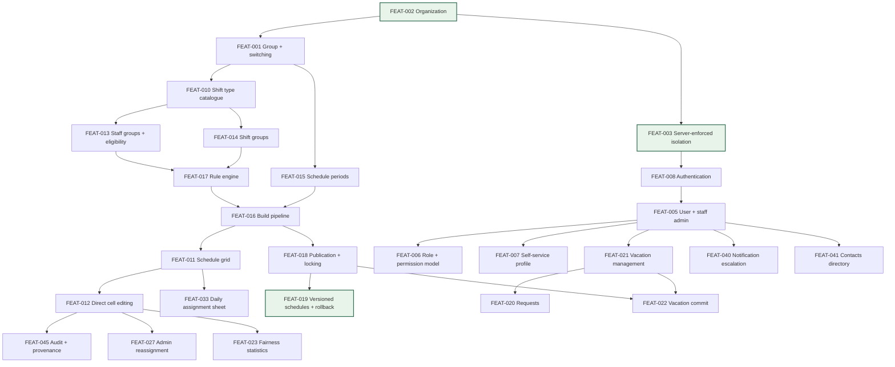

# 13 — Feature Inventory: iSchedule.MD → SchedulePoint

**Phase:** 13 — research consolidation. **Source:** reports 01–11 plus the final coverage audit. **No source-site navigation was performed in this phase.**

> ## ⚠ AMENDED AFTER PUBLIC-SOURCE RECONCILIATION — this version is authoritative
>
> **Amended 2026-07-30.** Updated after [17-public-source-gap-addendum.md](17-public-source-gap-addendum.md); now part of the production-capability baseline ([19-schedulepoint-production-capability-baseline.md](19-schedulepoint-production-capability-baseline.md)).
>
> **Applied here:** AMD-01, 02, 03, 09, 10, 11, 12, 13, 14, 17 — eight new features **FEAT-055..FEAT-062** in §6a, extensions recorded against existing features, and the **disposition corrections in §8a**.
>
> **⚠ Disposition vocabulary superseded.** The original `MVP` / `POST-MVP` / `EXCLUDED` / `DEFERRED` vocabulary in §"Classification and disposition keys" described **development sequencing**, and was read as though it described production scope. It does not. Production dispositions are now defined in §8a and in [19-schedulepoint-production-capability-baseline.md](19-schedulepoint-production-capability-baseline.md). **The original per-feature `Disp:` lines are retained as historical sequencing evidence and are superseded for scope purposes by §8a.**
>
> **No existing feature ID was renumbered or removed.**
>
> **Product name:** `SchedulePoint` — **PO-DEC-00 APPROVED**.

**Purpose:** the definitive, deduplicated inventory of what the researched product does, and what SchedulePoint should do about each capability. Features are merged by stable ID — a capability appearing in five source reports gets **one** entry here, not five.

---

## Classification and disposition keys

**Evidence classification** (applies to the *source behaviour* described, not to the disposition):

| Code | Meaning |
|---|---|
| **OBS** | OBSERVED directly in iSchedule.MD |
| **INF** | INFERRED from strong indirect evidence |
| **UNR** | UNRESOLVED — exists but its behaviour was never established |
| **SP-REQ** | SCHEDULEPOINT REQUIREMENT — intentional, not a source observation |
| **SP-REC** | SCHEDULEPOINT RECOMMENDATION — proposed improvement, needs approval |

**SchedulePoint disposition:**

| Disposition | Meaning |
|---|---|
| `MVP` | Required for first production release |
| `POST-MVP` | Valuable, deliberately sequenced after MVP |
| `DEFERRED` | Revisit later; not scheduled |
| `EXCLUDED` | Deliberately out of scope |
| `REQUIRES DECISION` | Cannot be scoped until a product owner decides |
| `SOURCE DEFECT — DO NOT REPLICATE` | Observed behaviour that must not be copied |
| `REPLACE WITH ORIGINAL SCHEDULEPOINT DESIGN` | Keep the need, discard the source's approach |

**Field key:** **Mod** = source module · **Purpose** · **Actors** · **Dep** = feature dependencies · **Flow** = primary workflow · **Perm** = permissions · **States** · **Rules** = business rules · **Notif** = notifications · **Audit** · **Sens** = sensitive-data considerations · **Ev** = evidence · **Conf** = confidence · **Gaps** = known gaps · **QA** = related QA cases · **Disp** = disposition.

---

## 1. Tenancy and identity

#### FEAT-001 · Multi-group tenancy and group switching
**Mod:** Navigation / Group Settings · **Class:** OBS · **Conf:** High · **Disp:** `MVP`
**Purpose:** Scope all data, permissions, and configuration to a Group; let a multi-group user switch active context without re-authenticating.
**Actors:** all · **Dep:** — · **Perm:** any authenticated membership
**Flow:** top-bar site dropdown → select group → every data-bound screen re-scopes silently on next load.
**States:** active group (session-scoped) vs. default group (persisted, FEAT-007).
**Rules:** each Group has an independent roster, request window, vacation block, shift catalogue, rules, and picklists. Role is per-membership (TERM-007), not global.
**Notif:** none. **Audit:** group switches not audited in the source. **Sens:** the group boundary *is* the primary data boundary.
**Ev:** 01-app §1; 02-role §4 (GRP-01); 10-technical §4 · **QA:** QA-TEN-001..012, QA-AUTH-006
**Gaps:** whether lower-privileged roles see the same switcher is UNRESOLVED (#28). Server-side enforcement of group scoping was never tested (prohibited).
**Disp rationale:** `MVP` — but SchedulePoint adds an Organization layer above Group (TERM-001), which the source lacks entirely.

#### FEAT-002 · Organization layer
**Mod:** *(none in source)* · **Class:** SP-REQ · **Conf:** n/a · **Disp:** `MVP`
**Purpose:** Provide a billing/security root above Group, enabling cross-group staff identity and org-level administration.
**Actors:** platform operator, org admin · **Dep:** FEAT-001 · **Perm:** org admin
**Flow:** *(to be designed)* · **States:** active / suspended.
**Rules:** every Group belongs to exactly one Organization; no data crosses an Organization boundary under any circumstance.
**Notif:** none. **Audit:** all org-level changes audited. **Sens:** the outermost isolation boundary.
**Ev:** 02-role §4 (absence of any parent); 10-technical §4 · **QA:** QA-TEN-001, QA-TEN-005, QA-TEN-006
**Gaps:** none — this is a deliberate addition.
**Disp rationale:** `MVP`. Retrofitting a tenancy root later is prohibitively expensive.

#### FEAT-003 · Server-enforced tenant isolation
**Mod:** *(architectural)* · **Class:** SP-REQ · **Conf:** n/a · **Disp:** `MVP`
**Purpose:** Guarantee isolation at the server and database layer, not merely by hiding UI.
**Actors:** platform · **Dep:** FEAT-002 · **Perm:** n/a
**Flow:** every request resolves tenant context server-side from the session, never from a client-supplied parameter alone.
**Rules:** deny by default; a route without an explicit authorization policy fails the build.
**Audit:** all authorization denials logged. **Sens:** critical.
**Ev:** 10-technical §4 (groupId carried in hash + query + cookie simultaneously — three client-controllable sources) · **QA:** QA-TEN-005, QA-TEN-006, QA-TEN-012, QA-SEC-008
**Gaps:** the source's actual server-side behaviour is UNRESOLVED — never tested, by instruction.
**Disp rationale:** `MVP`. Carried architectural requirement.

#### FEAT-004 · Site (physical location) modelling
**Mod:** *(none in source)* · **Class:** SP-REC · **Conf:** Low · **Disp:** `REQUIRES DECISION`
**Purpose:** Represent physical locations separately from scheduling scope.
**Actors:** scheduler · **Dep:** FEAT-001 · **Perm:** admin
**Ev:** 01-app §1; 02-role §4 (Group and Site coincide 1:1 in the observed tenant, but nothing enforces this) · **QA:** —
**Gaps:** no evidence either way about whether real customers need this split.
**Disp rationale:** `REQUIRES DECISION` — see TERM-003. Deferring costs little; guessing wrong costs a migration.

#### FEAT-005 · User and staff administration
**Mod:** Scheduling → Staff (`ADM-05`) · **Class:** OBS · **Conf:** High · **Disp:** `MVP`
**Purpose:** Create, edit, and deactivate the people and accounts in a Group's roster.
**Actors:** administrator · **Dep:** FEAT-001 · **Perm:** Scheduler+ (INF)
**Flow:** roster table (paginated, 20/page) → inline row edit → Update/Cancel; Add User; Remove.
**States:** active membership; removal path exists but its semantics (hard delete vs. deactivate) are UNRESOLVED.
**Rules:** the roster holds real people, shared/functional accounts, and placeholder slots in one undifferentiated table (TERM-020, TERM-021).
**Notif:** unknown. **Audit:** not observed for user changes. **Sens:** contains names, personal email, mobile, home phone, pager.
**Ev:** 01-app ADM-05; 02-role §5, §6 · **QA:** QA-AUTH-005, QA-AUTH-011, QA-SEC-014
**Gaps:** deactivation vs. deletion semantics UNRESOLVED; effect on a live session UNRESOLVED.
**Disp rationale:** `MVP`, but SchedulePoint must distinguish account types explicitly and minimise PII by role.

#### FEAT-006 · Role and permission model
**Mod:** Scheduling → Staff · **Class:** OBS · **Conf:** Med · **Disp:** `REPLACE WITH ORIGINAL SCHEDULEPOINT DESIGN`
**Purpose:** Control what each member of a Group may see and do.
**Actors:** administrator · **Dep:** FEAT-005 · **Perm:** Scheduler+
**Flow:** set an Access Level (6 values) plus up to 8 independent flags per membership.
**Rules:** role is per-membership; admin-surface access appears gated by Access Level, not by the `Picklist Admin` flag.
**Audit:** none observed. **Sens:** privilege configuration.
**Ev:** 02-role §5, §8; 01-app ADM-05 · **QA:** QA-AUTH-006, QA-AUTH-007, QA-AUTH-008, QA-TEN-003, QA-TEN-012
**Gaps:** **C-02 (BLOCKING)** — an account with `Picklist Admin: No` had full picklist-admin access. Capabilities of View/Telecom/Genius are UNRESOLVED (no session ever available). `Genius` vs `Scheduler` difference UNRESOLVED (#22).
**Disp rationale:** The observed model has a flag that demonstrably does not gate the capability it names. **SchedulePoint must design permissions from first principles.** See C-02 below.

#### FEAT-007 · Self-service profile, password, and default group
**Mod:** `/users/profile` · **Class:** OBS · **Conf:** High · **Disp:** `MVP`
**Purpose:** Let a user maintain their own contact details, password, and preferred landing group.
**Actors:** any user · **Dep:** FEAT-005 · **Perm:** self only
**Flow:** three independent forms with separate submit buttons (Update Contact Info / Change password / Save Default Group).
**Rules:** account email is displayed read-only — identity is not self-editable. "Calendar days to keep" is a per-user retention preference.
**Notif:** unknown (a password-change confirmation would be expected). **Audit:** not observed. **Sens:** personal contact details, credentials.
**Ev:** 01-app PL-03; 03-user WF-18/19/20 · **QA:** QA-AUTH-004, QA-SEC-011
**Gaps:** password policy, validation, and confirmation behaviour never observed (never submitted).
**Disp rationale:** `MVP`.

#### FEAT-008 · Authentication
**Mod:** *(unobserved)* · **Class:** UNR · **Conf:** Low · **Disp:** `MVP`
**Purpose:** Establish an authenticated session.
**Actors:** all · **Dep:** — · **Perm:** public
**Ev:** 03-user WF-01/WF-02 — **deliberately never observed**; signing out would have ended all research access with no recovery credentials · **QA:** QA-AUTH-001..005, QA-AUTH-012, QA-AUTH-013
**Gaps:** login form, MFA, lockout, password reset, session/idle timeout (#75), and anti-forgery mechanism (#76) are all UNRESOLVED.
**Disp rationale:** `MVP` — must be designed entirely from scratch. The research provides no reusable evidence here, which is a clean-room advantage rather than a loss.

#### FEAT-009 · Impersonation ("Sign In As")
**Mod:** `/admin/signas` · **Class:** OBS · **Conf:** Med · **Disp:** `REQUIRES DECISION`
**Purpose:** Let an administrator operate as another user for support or on-behalf-of data entry.
**Actors:** Scheduler+ (visible in that session's menu) · **Dep:** FEAT-006 · **Perm:** UNRESOLVED
**Flow:** two-step form — select Group, select Staff, optional "Stay signed in", SIGN IN. **Never submitted.**
**Rules:** impersonation is scoped per-group, consistent with membership-scoped roles.
**Audit:** **no evidence any audit trail exists for impersonation** — a significant gap given its power. **Sens:** critical.
**Ev:** 02-role §3 (SYS-05) · **QA:** QA-AUTH-010
**Gaps:** whether the impersonator assumes the target's permissions or retains their own is UNRESOLVED (#24); whether lower roles can reach it is UNRESOLVED.
**Disp rationale:** `REQUIRES DECISION`. Genuinely useful for support, genuinely dangerous. If built: mandatory audit, banner, time limit, and no access to credential-changing screens.

---

## 2. Schedule viewing and management

#### FEAT-010 · Shift type catalogue
**Mod:** Scheduling → Shifts (`ADM-07`) · **Class:** OBS · **Conf:** High · **Disp:** `MVP`
**Purpose:** Define every kind of work that can be scheduled.
**Actors:** administrator · **Dep:** FEAT-001 · **Perm:** Scheduler+
**Flow:** table of shift types → New / Edit / Delete; a separate "Picks" sub-editor per row.
**Rules:** each type carries a full name, short code, start/end time, and four orthogonal flags — Call, Manually (assign by hand only), DailyPick (offered in drafts), Stipend. These flags determine where the type surfaces across the whole product.
**Audit:** none observed. **Sens:** none.
**Ev:** 01-app ADM-07; 05-engine ADM-07 · **QA:** QA-SCH-006, QA-SCH-013
**Gaps:** the per-row "Picks" sub-editor was never opened.
**Disp rationale:** `MVP`. The four-flag orthogonality is a good design worth keeping.

#### FEAT-011 · Schedule grid (three views)
**Mod:** Master Schedule (`SCH-02/03/04`) · **Class:** OBS · **Conf:** High · **Disp:** `MVP`
**Purpose:** Show the whole group's assignments across a date range, three ways.
**Actors:** all (visibility by role UNRESOLVED) · **Dep:** FEAT-010, FEAT-016 · **Perm:** Scheduler confirmed; others UNRESOLVED
**Flow:** Date View (staff × dates) / Staff View (dates × staff) / Shift View (slots × dates); 1–8 week range; date stepper; client-side filters; font-size control.
**States:** view state carried in URL hash (`view`, `weeks`, `begin`, `batch`, `buildState`).
**Rules:** summary rows per date — Notes/Holiday, Calendar events, Staff Balance, Operating Rooms, Pick List Control, Requests. Staff Balance = Staff Available − Daily Picks − Operating Rooms.
**Notif:** none. **Audit:** per-cell provenance log (FEAT-045). **Sens:** displays the full staff roster and their assignments.
**Ev:** 01-app SCH-02/03/04; 04-master §1–§7 · **QA:** QA-SCH-010, QA-SCH-013, QA-SCH-014, QA-PERF-008, QA-A11Y-006, QA-A11Y-012
**Gaps:** the "Calendar events" row was never seen populated (#39, partially addressed by FEAT-046).
**Disp rationale:** `MVP`. This is the product's central screen. Accessibility must be rebuilt (zero headings, no focus indicators, unlabeled navigation — F-01/F-02/F-03).

#### FEAT-012 · Direct cell editing (move shift / move credit / add)
**Mod:** Master Schedule cell editor · **Class:** OBS · **Conf:** High · **Disp:** `MVP`
**Purpose:** Let a scheduler correct an individual assignment outside the generation pipeline.
**Actors:** scheduler · **Dep:** FEAT-011 · **Perm:** Scheduler+ (INF)
**Flow:** click a cell → modal with a Display selector (Shifts | Credits) → Move Shift or Move Credit to another staff member; or type a shift to Add.
**Rules:** **shift and credit move independently** (TERM-041). The UI itself steers users toward the picklist for add/delete ("Move picks when possible, use Picklist Control to add or delete picks").
**Notif:** no per-change notification toggle exists. **Audit:** every change appears in the per-cell log with actor, action, timestamp, and a mechanism tag. **Sens:** none.
**Ev:** 03-user WF-05/WF-05a; 04-master §3 · **QA:** QA-SCH-008, QA-SCH-011, QA-SCH-015, QA-CON-001
**Gaps:** whether edits commit immediately or need a save is INFERRED (immediate); whether a locked Build blocks cell edits is UNRESOLVED (#38).
**Disp rationale:** `MVP`. The Shifts/Credits split must be preserved.

#### FEAT-013 · Staff groups and per-shift eligibility
**Mod:** Staff Groups (`ADM-06`), Staff Shift FTE (`ADM-03`) · **Class:** OBS · **Conf:** Med · **Disp:** `MVP`
**Purpose:** Define who may work what, and how often.
**Actors:** administrator · **Dep:** FEAT-005, FEAT-010 · **Perm:** Scheduler+
**Flow:** named staff subsets; plus a per-shift-type matrix of Active / Max Shifts / per-weekday quota columns.
**Rules:** eligibility and caps are both per-staff and per-shift-type, broken out by weekday including holidays.
**Ev:** 01-app ADM-03, ADM-06; 05-engine §1 · **QA:** QA-SCH-006
**Gaps:** none significant.
**Disp rationale:** `MVP`. Qualification enforcement is a scheduling-integrity requirement.

#### FEAT-014 · Shift groups
**Mod:** Shift Groups (`ADM-08`) · **Class:** OBS · **Conf:** High · **Disp:** `MVP`
**Purpose:** Bundle shift types for fairness weighting **and** for grouped time-off requests.
**Actors:** administrator, staff member · **Dep:** FEAT-010 · **Perm:** Scheduler+ to configure
**Rules:** each group carries an Equation & Weight (`Hard(0)` or `Linear(1000)`), an `Allow Request` flag, and the exact `Request Off Text` shown to staff. The Allow Request flag is a genuine server-side filter, not display-only.
**Ev:** 01-app ADM-08; 10-technical API-11 · **QA:** QA-REQ-003
**Gaps:** none significant.
**Disp rationale:** `MVP`. Consider splitting its two roles (TERM-025).

#### FEAT-015 · Schedule periods
**Mod:** *(implicit in Builds)* · **Class:** INF · **Conf:** Med · **Disp:** `MVP`
**Purpose:** Bound the date range a schedule is planned and published for.
**Actors:** scheduler · **Dep:** FEAT-001 · **Perm:** Scheduler+
**Rules:** observed ranges ≈166–182 days; start must be a Monday, end a Sunday.
**Ev:** 05-engine ADM-02 · **QA:** QA-SCH-001, QA-DATE-010
**Gaps:** the source has no standalone period entity — this is a SchedulePoint structuring decision.
**Disp rationale:** `MVP`. Needed so multiple builds and versions can reference one period.

#### FEAT-016 · Schedule build pipeline
**Mod:** Builds (`ADM-02`) · **Class:** OBS · **Conf:** Med · **Disp:** `MVP`
**Purpose:** Generate a schedule from staff, shifts, and rules through a staged, versioned, reviewable pipeline.
**Actors:** scheduler · **Dep:** FEAT-010, FEAT-013, FEAT-014, FEAT-017 · **Perm:** Scheduler+
**Flow:** Setup → Planner → Build → Fix Picks → Publish → Lock/Unlock, per build row.
**States:** Locked (shows only Unlock) vs. unlocked/in-pipeline. **No Draft/Running/Failed/Complete status label exists.**
**Rules:** Build Setup scopes staff, shifts, shift groups, pattern rules, staff rules, and valid groups per build; `Progressive Build` chains builds; changing staff/shifts requires regenerating the Planner; previous-period statistics can carry forward with an explicit "do NOT overlap dates" constraint.
**Notif:** unknown. **Audit:** build history is retained (sequential IDs per period). **Sens:** none.
**Ev:** 01-app ADM-02; 05-engine ADM-02, §2, §3 · **QA:** QA-SCH-001, QA-SCH-002, QA-SCH-007, QA-CON-002
**Gaps:** Planner's screen never opened (#41); Fix Picks never opened; failure states never encountered (#43); whether the engine auto-excludes vacationing staff is UNRESOLVED (#42).
**Disp rationale:** `MVP`. **The staged, versioned, iterative approach is a genuine strength.** The generation algorithm itself must be written clean-room.

#### FEAT-017 · Rule engine (pattern, staff, and position rules)
**Mod:** Pattern Rules (`ADM-10`), Staff Rules (`ADM-11`), Valid Groups (`ADM-09`) · **Class:** OBS · **Conf:** High · **Disp:** `MVP`
**Purpose:** Express fairness, spacing, eligibility, and exclusion constraints declaratively.
**Actors:** administrator · **Dep:** FEAT-010, FEAT-013, FEAT-014 · **Perm:** Scheduler+
**Rules:** three layers — Pattern Rules (shift/group-scoped spacing, weekday-scoped, Hard or Weighted, explicit day-offset or Optimal Spacing); Staff Rules (named-individual, five THEN-actions: Assign/Penalty/Exclude/Linked/Staff-Shift, with negation and Staff-Balance-conditioned IF clauses); Valid Groups (restrict which pick positions are legal for a shift set).
**Audit:** none observed for rule changes. **Sens:** Staff Rules name specific individuals and encode judgements about them — a mild privacy consideration.
**Ev:** 01-app ADM-10; 02-role ADM-11; 05-engine ADM-09/10/11 · **QA:** QA-SCH-005, QA-SCH-006
**Gaps:** runtime effect never observed (no build was ever run); restrictive Valid Group case never seen (#44); whether Hard rules block or merely penalize is UNRESOLVED.
**Disp rationale:** `MVP` for the rule *model*. The authoring form reveals more expressiveness than any live rule uses — treat that as the floor.

#### FEAT-018 · Schedule publication and locking
**Mod:** Builds pipeline · **Class:** OBS (controls) / UNR (effects) · **Conf:** Low · **Disp:** `MVP` + `REPLACE WITH ORIGINAL SCHEDULEPOINT DESIGN`
**Purpose:** Make a generated schedule live, then freeze it.
**Actors:** scheduler · **Dep:** FEAT-016 · **Perm:** Scheduler+
**Flow:** Publish button per build row, then Lock.
**States:** unlocked → locked; **no rollback or unpublish control exists anywhere in the product.**
**Notif:** the Publish icon suggests distribution, but this was never confirmed. **Audit:** whether publication appears in the per-cell log is UNRESOLVED (#36).
**Ev:** 01-app ADM-02; 04-master §8; 05-engine §3 · **QA:** QA-SCH-001, QA-SCH-002, QA-SCH-009, QA-SCH-012, QA-CON-002
**Gaps:** publication was never executed. Its actual effect is INFERRED throughout.
**Disp rationale:** `MVP` for the capability, but SchedulePoint must add **versioned publication with retained history and a real rollback path** (FEAT-019) — the source's lack of one is a genuine architectural gap.

#### FEAT-019 · Versioned published schedules and rollback
**Mod:** *(none in source)* · **Class:** SP-REQ · **Conf:** n/a · **Disp:** `MVP`
**Purpose:** Retain every published state so history is never silently overwritten, and support reverting.
**Actors:** scheduler, auditor · **Dep:** FEAT-018 · **Perm:** Scheduler+
**Rules:** publishing supersedes but never deletes the prior version; revert is itself an audited, forward-moving operation.
**Audit:** mandatory. **Sens:** none.
**Ev:** 04-master §8 (no rollback control found, #40); 05-engine §2 (builds are versioned, published output is not) · **QA:** QA-SCH-012, QA-SCH-015, QA-CON-010
**Gaps:** none — deliberate addition.
**Disp rationale:** `MVP`. Carried architectural requirement.

#### FEAT-046 · Calendar events on the schedule
**Mod:** Master Schedule "Calendar events" row · **Class:** OBS (form) / UNR (behaviour) · **Conf:** Low · **Disp:** `POST-MVP`
**Purpose:** Attach non-shift calendar entries (meetings, education) to schedule dates.
**Actors:** scheduler · **Dep:** FEAT-011 · **Perm:** Scheduler+ (INF)
**Flow:** a hidden dialog with Title, Location, All-day, Starts, Ends (found passively; never opened).
**Ev:** final-coverage-audit CAL-01; 04-master §5 · **QA:** —
**Gaps:** the row was never seen populated across twelve phases; the dialog was never opened.
**Disp rationale:** `POST-MVP`. A real capability but peripheral to scheduling integrity.

---

## 3. Requests, vacation, and the shift marketplace

#### FEAT-020 · Time-off and shift-group requests
**Mod:** My Schedule (My Requests), Vacation grid, Shift Groups · **Class:** OBS (status) / UNR (creation) · **Conf:** Med · **Disp:** `MVP` + `REQUIRES DECISION`
**Purpose:** Let staff ask not to be assigned particular work, and let schedulers decide.
**Actors:** staff member, scheduler · **Dep:** FEAT-014, FEAT-021 · **Perm:** self-create; Scheduler approves
**Flow:** *(vacation type)* Vacation grid empty-cell click → confirm modal with optional comment. *(shift-group type)* **creation surface never located.**
**States:** pending → approved / denied / removed. History observed back to 2022 with no truncation.
**Rules:** a group-wide "Request Until Date" gates the submission window ("(CLOSED)" vs "(UNTIL `<date>`)"). Requests target a Shift Group when `Allow Request` is set.
**Notif:** UNRESOLVED (#50). **Audit:** request rows carry status and timestamps; comment edits are separately saveable. **Sens:** comments are free text visible to schedulers.
**Ev:** 01-app SCH-01, ADM-08; 03-user WF-08/09/10; 06-requests LC-01, LC-02 · **QA:** QA-REQ-001..014
**Gaps:** **C-03** — LC-02's creation surface unlocated after four phases (#16/#30/#47); whether the two withdrawal surfaces hit one record or two is UNRESOLVED (#31).
**Disp rationale:** `MVP` for the capability; `REQUIRES DECISION` on whether SchedulePoint models one Request entity with a type discriminator (recommended) or two.

#### FEAT-021 · Vacation management
**Mod:** Vacation (`VAC-01`), Vacation Settings (`VAC-02`) · **Class:** OBS · **Conf:** High · **Disp:** `MVP`
**Purpose:** Track vacation entitlement, weekly capacity, requests, and approvals within a bounded period.
**Actors:** staff member, scheduler · **Dep:** FEAT-005 · **Perm:** self-request; Scheduler approves/configures
**Flow:** week-column grid per staff row → click empty cell to request, click badge to withdraw/deny; Approve (individual or batch by date range); Settings configures the whole policy.
**States:** empty → pending (amber) → approved (green) / denied / removed.
**Rules:** block start must be a Monday, end a Friday; configurable Open Vacation Mode, Approval Required By Scheduler, Include Weekend Before/After, Include Holidays, Allow Negative Avail/Grant; per-week quota vs. requested variance is **advisory, not blocking**.
**Notif:** UNRESOLVED. **Audit:** comments carry timestamps. **Sens:** absence data.
**Ev:** 01-app VAC-01/02; 06-requests LC-01, LC-01a · **QA:** QA-REQ-002, QA-REQ-007..014
**Gaps:** amber/green semantics INFERRED (#6); Remove vs. Deny server effects UNRESOLVED; Batch Entry Off/On forms never opened (#46).
**Disp rationale:** `MVP`. Well-evidenced and coherent. **Do not replicate** the delete-by-default badge click (see FEAT-047).

#### FEAT-022 · Vacation-to-schedule commit
**Mod:** Vacation → TRANSFER · **Class:** OBS · **Conf:** High · **Disp:** `MVP` + `REPLACE WITH ORIGINAL SCHEDULEPOINT DESIGN`
**Purpose:** Write approved vacation weeks into the live schedule as OFF assignments.
**Actors:** scheduler · **Dep:** FEAT-021, FEAT-018 · **Perm:** Scheduler+
**Flow:** TRANSFER → date range → **type the literal word "PUBLISH"** → confirm. Explicitly labelled irreversible.
**Rules:** batch, date-range scoped, one-way. *"It can NOT be undone."*
**Audit:** unknown. **Sens:** none.
**Ev:** 06-requests LC-01b — the highest-consequence single control found in the entire product · **QA:** QA-REQ-010, QA-CON-003, QA-CON-010
**Gaps:** idempotency UNRESOLVED (#45) — re-running over an already-transferred range might duplicate.
**Disp rationale:** Keep the capability and **keep the type-to-confirm friction pattern** (excellent design). Replace the irreversibility: SchedulePoint's version must be idempotent and reversible via versioning (FEAT-019). Rename it (TERM-052).

#### FEAT-025 · Opportunity board (shift give-away)
**Mod:** My Schedule · **Class:** OBS (post/retract) / UNR (claim) · **Conf:** Med · **Disp:** `POST-MVP`
**Purpose:** Let a staff member offer a future assignment to any eligible colleague.
**Actors:** staff member · **Dep:** FEAT-011 · **Perm:** own future assignments only
**Flow:** future date cell → POST OPPORTUNITY → appears on the board with a ❤ marker on the calendar; poster can Remove.
**States:** held → posted → claimed / removed.
**Rules:** future dates only (button confirmed absent on past/today). Server-side terminology uses "opportunity" (confirmed via audit-log wording).
**Notif:** UNRESOLVED whether posting notifies anyone. **Audit:** claims appear in the per-cell log. **Sens:** none.
**Ev:** 01-app SCH-01; 03-user WF-11/12; 06-requests LC-03; 04-master §3.3 · **QA:** QA-OPP-001..008
**Gaps:** **the claim side was never observed** (single-account limitation); simultaneous-claim race resolution UNRESOLVED (#49); Locum eligibility restrictions UNRESOLVED.
**Disp rationale:** `POST-MVP`. Valuable but not required for a first schedule to function; needs concurrency design (QA-OPP-001, QA-CON-004).

#### FEAT-026 · Shift swap
**Mod:** My Schedule → Swap Shift · **Class:** OBS (form) / UNR (lifecycle) · **Conf:** Low · **Disp:** `REQUIRES DECISION`
**Purpose:** Exchange assignments between two named staff members.
**Actors:** staff member · **Dep:** FEAT-011 · **Perm:** own assignments
**Flow:** SWAP SHIFT → checklist of own eligible picks + counterpart combobox → Swap Shifts. **Never submitted.**
**Rules:** available on both past-today and future dates, unlike opportunities.
**Ev:** 03-user WF-13; 06-requests LC-04 · **QA:** QA-OPP-009, QA-OPP-010, QA-OPP-011
**Gaps:** **whether a swap needs the counterpart's acceptance, a scheduler's approval, both, or neither is entirely UNRESOLVED** (#32, #48). No swap-shaped entry ever appeared in request history.
**Disp rationale:** `REQUIRES DECISION`. The acceptance model is a product question the research cannot answer.

#### FEAT-027 · Administrative reassignment
**Mod:** Master Schedule cell editor · **Class:** OBS · **Conf:** Med · **Disp:** `MVP`
**Purpose:** Let a scheduler move work between people directly, overriding self-service flows.
**Actors:** scheduler · **Dep:** FEAT-012 · **Perm:** Scheduler+
**Rules:** works regardless of picklist state or completion; always audited.
**Ev:** 04-master §3.3 ("reassigned to X by Y" entries); 07-picklist §5 · **QA:** QA-SCH-011, QA-SCH-015
**Gaps:** none significant.
**Disp rationale:** `MVP`. The correction mechanism of last resort must exist and must be audited.

---

## 4. Picklist system

#### FEAT-030 · Picklist preparation
**Mod:** Picklist Manager (`PLM-01`) · **Class:** OBS · **Conf:** Med · **Disp:** `POST-MVP`
**Purpose:** Assemble a day's draft — participants in order, and the pool of work items.
**Actors:** scheduler · **Dep:** FEAT-011, FEAT-018 · **Perm:** Scheduler+ *(see C-02)*
**Flow:** date-indexed table → select a date → Comments / Staff (numbered, read-only here) / Work (drag-reorderable) panels; Add Blank; per-row Import, Email, Delete, Lock toggle.
**States:** `ON HOLD`, `COMPLETED` (only two ever observed; an active state necessarily exists).
**Rules:** pick order is derived from the Master Schedule and explicitly not editable here. "Import" is an **erase-and-resync from an internal source, not a file upload**. Locking removes Start/Import/Delete from the DOM entirely rather than disabling them.
**Notif:** per-list Email (Pick List / Work Assignment / Both). **Audit:** no picklist-specific audit log exists. **Sens:** none at this layer.
**Ev:** 07-picklist §0, §1 · **QA:** QA-PICK-001..004, QA-PICK-015
**Gaps:** the actual OR-slate ingestion mechanism was never located (#52); "Add Blank" behaviour downgraded to UNRESOLVED after the §0 incident.
**Disp rationale:** `POST-MVP` — the picklist is the product's signature feature but is not required for a schedule to exist. Its concurrency requirements are severe and its execution mechanics are the largest evidence gap.

#### FEAT-031 · Staff-facing picklist participation
**Mod:** Choose List (`PL-01`) · **Class:** OBS · **Conf:** Med · **Disp:** `POST-MVP`
**Purpose:** Show a staff member their picklist status across all their group memberships at once.
**Actors:** staff member · **Dep:** FEAT-030 · **Perm:** self
**Flow:** one block per group membership; shows either "No active picklists" or a live progress indicator; entry points to phone-number and notification settings.
**Rules:** **aggregates across group memberships without requiring a context switch** — a genuinely good design.
**Ev:** 01-app PL-01; 07-picklist §1; final-coverage-audit §6 (live "pick N of M" progress state confirmed to exist) · **QA:** QA-PICK-004, QA-PICK-013
**Gaps:** the "it's your turn" state was never opened (deliberately, per the coverage audit's brief).
**Disp rationale:** `POST-MVP`, with FEAT-030.

#### FEAT-032 · Picklist execution (turn-based drafting)
**Mod:** Picklist Manager / Choose List / Dashboard · **Class:** UNR · **Conf:** Low · **Disp:** `POST-MVP` + `REQUIRES DECISION`
**Purpose:** Run the live draft — advance turns, present available work, record selections.
**Actors:** staff member, scheduler · **Dep:** FEAT-030, FEAT-034, FEAT-040 · **Perm:** *(see C-02)*
**Flow:** **never observed.** Start List begins it; the rest is inferred.
**Rules:** turn order from the Staff panel; `Picks Excluded` skips positions (INF); Alert Pick Time thresholds imply a per-turn budget (INF).
**Notif:** the escalation ladder (FEAT-040) fires on turn start (INF). **Audit:** picks appear in the per-cell log tagged `PLC`. **Sens:** none.
**Ev:** 07-picklist §2 (every row INFERRED or UNRESOLVED) · **QA:** QA-PICK-005..014, QA-CON-004
**Gaps:** **This is the single largest evidence gap in the entire research effort.** Current-picker UI, timers, room-selection control, confirmation step, failure/retry, pause/resume, and automatic advancement are all unobserved. A live picklist was confirmed to exist during the coverage audit but was deliberately not opened.
**Disp rationale:** `POST-MVP`. **Requires a live-simulation environment before it can be specified.** See C-04 for the real-time architecture blocker.

#### FEAT-033 · Daily assignment sheet
**Mod:** Daily Assignments (`DA-01`) · **Class:** OBS · **Conf:** High · **Disp:** `MVP`
**Purpose:** Publish one day's finalized work in an operationally readable form.
**Actors:** all staff · **Dep:** FEAT-011 · **Perm:** all (INF)
**Flow:** date picker → Work list (numbered, per-person) + Assigned Positions role directory + per-day comments.
**Rules:** scoped to a specific picklist ID.
**Sens:** **this screen and the personal "Today's Shifts" panel are where clinical case detail appears** — see FEAT-051.
**Ev:** 01-app DA-01; 07-picklist §5 · **QA:** QA-PICK-016, QA-SEC-006
**Gaps:** the per-line numeric badge's meaning is UNRESOLVED (#9).
**Disp rationale:** `MVP` — but **without** clinical case detail.

#### FEAT-034 · Pick proxy delegation
**Mod:** Notification Settings (`PL-02`) · **Class:** OBS (structure) / UNR (semantics) · **Conf:** Low · **Disp:** `REQUIRES DECISION`
**Purpose:** Let a user delegate picklist participation or notification to a colleague.
**Actors:** staff member · **Dep:** FEAT-040 · **Perm:** self; lockable by admin (`Proxy Locked`)
**Ev:** 01-app PL-02; 03-user WF-22; 07-picklist §2 · **QA:** QA-AUTH-008
**Gaps:** **whether a proxy picks or merely receives notifications was never distinguished** — materially different authorization consequences. Eligible-proxy scope UNRESOLVED (#27).
**Disp rationale:** `REQUIRES DECISION`. See TERM-019: this must be split into two explicit capabilities.

#### FEAT-035 · Live picklist monitoring dashboard
**Mod:** Dashboard (`DASH-01`) · **Class:** OBS (empty state) / UNR (active state) · **Conf:** Low · **Disp:** `POST-MVP`
**Purpose:** Let a scheduler watch a draft progress in real time.
**Actors:** scheduler · **Dep:** FEAT-032 · **Perm:** Scheduler+
**Flow:** live clock, audible-alert mute toggle, and either an empty state or a live feed.
**Ev:** 01-app DASH-01; 07-picklist §4 · **QA:** QA-PICK-013, QA-PERF-010
**Gaps:** the active state was never observed — including during the coverage audit, when it was deliberately not opened.
**Disp rationale:** `POST-MVP`, with FEAT-032.

---

## 5. Notifications, reporting, and supporting modules

#### FEAT-040 · Notification escalation
**Mod:** Notification Settings (`PL-02`), Group Settings (`ADM-01`) · **Class:** OBS · **Conf:** High · **Disp:** `MVP`
**Purpose:** Reach a staff member reliably and progressively when action is needed.
**Actors:** all · **Dep:** FEAT-005 · **Perm:** self-configure; admin sets defaults and can lock
**Flow:** two ordered ladders (Mandatory Hours / Personal Hours), each a list of `{offset-minutes, channel-set}` steps across Email, SMS, Dial Mobile, Dial Home; Load Defaults pulls the group template.
**Rules:** two-tier override (group default → per-user); which ladder applies depends on the user's configured Personal Start/Stop times.
**Audit:** **no delivery log, status, failure, or retry indicator exists anywhere in the product.** **Sens:** contact channels are PII.
**Ev:** 01-app PL-02, ADM-01; 07-picklist §3 · **QA:** QA-NOT-001..012
**Gaps:** delivery status, failure handling, retry, and duplicate protection are **entirely UNRESOLVED** (#53). Accounts with no phone number would have nothing to dial, with no observed warning.
**Disp rationale:** `MVP` for email; voice channels `POST-MVP`. SchedulePoint must add delivery tracking — its absence in the source is a real operational gap.

#### FEAT-041 · Contacts directory and bulk messaging
**Mod:** Contacts (`CON-01`) · **Class:** OBS · **Conf:** High · **Disp:** `MVP` (directory) / `POST-MVP` (bulk send)
**Purpose:** Find colleagues; message groups of them.
**Actors:** all staff · **Dep:** FEAT-005 · **Perm:** UNRESOLVED whether bulk send is admin-gated
**Flow:** All/Staff/Locum/None filters (client-side), row checkboxes, then Send Email / Send SMS / Export / Print. Email form: To, Cc, Subject, an unlabeled select, Body. SMS form: a single message field.
**Rules:** **C-06** — Contacts shows ~30–35% fewer rows than the Users table in *both* groups (66 vs 94; 61 vs 103), via an undocumented filter.
**Sens:** **exposes personal mobile, home phone, and personal email broadly** to whatever roles can reach it.
**Ev:** 01-app CON-01; 08-supporting SM-03/SM-04; final-coverage-audit SM-13 · **QA:** QA-SEC-013, QA-SEC-014
**Gaps:** the filter rule is UNRESOLVED (#60); row-click behaviour never tested (#59); the unlabeled select's purpose unknown (#79).
**Disp rationale:** Directory `MVP` **with field-level data minimisation**. Bulk messaging `POST-MVP` with rate limiting and roster-only recipients.

#### FEAT-024 · Reports and statistics
**Mod:** Shift Statistics (`ADM-04`), Print menus · **Class:** OBS (existence) / UNR (output) · **Conf:** Med · **Disp:** `POST-MVP`
**Purpose:** Demonstrate fairness and produce operational documents.
**Actors:** scheduler · **Dep:** FEAT-011, FEAT-023 · **Perm:** Scheduler+
**Flow:** six "Create `<Type>` Report" configuration dialogs (Schedule, Picklist, Stipend, Requests, DayXShift, On Call Schedule) plus a separate "Sharing Statistics Report" with recipient targeting.
**Rules:** configuration precedes output — not an instant download. Shift Statistics compares Credits / Target / Actual with a configurable credit weight and a variance view.
**Sens:** reports may aggregate PII and, if scoped wrongly, cross tenant boundaries.
**Ev:** 01-app ADM-04; 08-supporting SM-02; 09-responsive RA-12; final-coverage-audit SM-11/SM-12 · **QA:** QA-RPT-001..012
**Gaps:** **dialog internals UNRESOLVED for 4 of 6 types** — all discovered passively, never opened.
**Disp rationale:** `POST-MVP`, except a basic schedule export which is `MVP`.

#### FEAT-023 · Fairness statistics
**Mod:** Shift Statistics (`ADM-04`) · **Class:** OBS · **Conf:** Med · **Disp:** `MVP`
**Purpose:** Show whether work is being divided fairly.
**Actors:** scheduler, staff member · **Dep:** FEAT-012, FEAT-014 · **Perm:** Scheduler+ confirmed
**Rules:** Credits vs. Target vs. Actual Shifts, weighted by a configurable per-shift credit value; Show Variance.
**Ev:** 01-app ADM-04; 04-master §3.1 · **QA:** QA-RPT-002
**Gaps:** Target's computation is UNRESOLVED.
**Disp rationale:** `MVP`. Fairness transparency is the product's core value proposition; hiding it would undercut the whole system.

#### FEAT-042 · Calendar subscription feed
**Mod:** My Schedule → Subscribe · **Class:** OBS · **Conf:** High · **Disp:** `POST-MVP` + `REPLACE WITH ORIGINAL SCHEDULEPOINT DESIGN`
**Purpose:** Let staff see their schedule in an external calendar app.
**Actors:** staff member · **Dep:** FEAT-011 · **Perm:** self
**Rules:** a `webcal://` URL carrying the user's email and a long-lived bearer token **in query-string parameters**.
**Sens:** **the URL itself is a credential containing PII.**
**Ev:** 03-user WF-23 (token never captured) · **QA:** QA-SEC-005, QA-SEC-009, QA-DATE-008
**Gaps:** token stability, revocability, and rotation are UNRESOLVED (#35).
**Disp rationale:** Keep the capability; **redesign the mechanism** — revocable, rotatable, membership-scoped tokens with no PII in the URL.

#### FEAT-050 · Document library
**Mod:** Documents (`DOC-01`) · **Class:** OBS · **Conf:** High · **Disp:** `POST-MVP`
**Purpose:** Share policies, guidance, and reference files within a group.
**Actors:** all staff, administrator · **Dep:** FEAT-001 · **Perm:** upload likely admin-gated (INF)
**Flow:** category tree → file list (Name / Size / Upload Date); Add Category; UpLoad File.
**Rules:** **no search or filter exists anywhere** — navigation is exclusively by category.
**Sens:** categories include financial/billing labels; role-based visibility is UNRESOLVED.
**Ev:** 01-app DOC-01; 08-supporting SM-05 · **QA:** QA-RPT-009, QA-RPT-010, QA-RPT-011, QA-RPT-012, QA-SEC-010
**Gaps:** only "Upload Date" provenance — no uploaded-by, no versioning. Two PDFs were never opened across any phase.
**Disp rationale:** `POST-MVP`. Add search and provenance, which the source lacks.

#### FEAT-045 · Audit and provenance
**Mod:** Master Schedule cell editor · **Class:** OBS · **Conf:** High · **Disp:** `MVP`
**Purpose:** Make every schedule change attributable, timestamped, and human-readable.
**Actors:** scheduler, auditor · **Dep:** FEAT-012 · **Perm:** Scheduler confirmed; staff visibility UNRESOLVED
**Rules:** entries name the actor and action, and tag the mechanism (`PLC` = picklist-driven vs. untagged = admin-driven).
**Ev:** 03-user WF-05a; 04-master §3.3, §11 · **QA:** QA-SCH-015, QA-AUTH-009, QA-CON-011
**Gaps:** scope UNRESOLVED (does it capture Publish, Erase Master Schedule?) (#36); no aggregate or queryable view exists; staff self-visibility UNRESOLVED (#37).
**Disp rationale:** `MVP`. **One of the best ideas in the source product.** SchedulePoint must extend it to every entity and make it queryable — a carried architectural requirement.

#### FEAT-051 · Clinical case detail on personal views
**Mod:** My Schedule "Today's Shifts", Daily Assignments · **Class:** OBS · **Conf:** High · **Disp:** `SUPERSEDED BY SAFER SCHEDULEPOINT BEHAVIOUR` *(corrected — was `EXCLUDED`, which is not a valid production disposition)*
**Purpose:** *(source)* show a clinician what cases they have today.
**Actors:** staff member · **Dep:** FEAT-033 · **Perm:** self
**Sens:** **patient-identifiable content — age indicators and procedure descriptions — confirmed present.** Never transcribed in any research artifact.
**Ev:** 07-picklist §6 · **QA:** QA-SEC-006, QA-PICK-017
**Gaps:** the ingestion path for this data was never located (#52).
**Disp rationale (corrected).** The **user outcome is preserved**: a clinician still sees what work they have and where, via FEAT-033 Daily Assignments. What does not enter the product is **patient-level content**, which is positively barred at the ingestion boundary by FEAT-062. A scheduling product carrying clinical data inherits clinical-system obligations without clinical-system controls, so the *mechanism* is superseded — the capability is not discarded. See CAP-062 and contradiction C-09, which preserves the distinction between patient-identifying information and non-identifying operational case metadata.

---

## 6. Source defects — do not replicate

#### FEAT-047 · Delete-by-default inspection click *(anti-pattern)*
**Mod:** Vacation grid badge · **Class:** OBS · **Conf:** High · **Disp:** `SOURCE DEFECT — DO NOT REPLICATE`
**Purpose:** Document an observed interaction pattern that must not be carried into SchedulePoint.
**Actors:** staff member, scheduler
**Behaviour:** clicking a status badge — the natural "show me details" gesture — opens a modal defaulting straight to *"Do you wish to delete the week of vacation…?"* with Remove and Deny buttons. There is no neutral detail view.
**Ev:** 01-app VAC-01, §7 (recorded as a Phase 1 near-miss); 03-user WF-09 · **QA:** QA-REQ-006
**SchedulePoint requirement:** inspection and destruction must never share a click target. Viewing details is always safe.

#### FEAT-048 · Instant-commit "Add" control *(anti-pattern)*
**Mod:** Picklist Manager → Add Room · **Class:** OBS · **Conf:** High · **Disp:** `SOURCE DEFECT — DO NOT REPLICATE`
**Purpose:** Document an observed persistence behaviour that must not be carried into SchedulePoint.
**Actors:** scheduler
**Behaviour:** a control labelled "Add" **created a real, live record on a single click** — no draft, no preview, no confirmation — contrary to every other Add control observed across seven prior phases. **This caused the only safety incident of the entire research effort** (self-corrected within the same tool-call sequence).
**Ev:** 07-picklist §0 · **QA:** QA-PICK-003 · **Contradiction:** C-05
**SchedulePoint requirement:** no control labelled Add/New/Create may persist anything before an explicit, separate Save. Enforced by component contract and tested for every such control.

#### FEAT-049 · Duplicate-request amplification *(defect)*
**Mod:** Picklist Manager row selection · **Class:** OBS · **Conf:** High · **Disp:** `SOURCE DEFECT — DO NOT REPLICATE`
**Purpose:** Document an observed request-amplification defect that must not be carried into SchedulePoint.
**Actors:** scheduler
**Behaviour:** selecting one picklist row fired **~25–40 identical GET requests** in immediate succession, from at least two distinct code paths using different parameter names for the same value.
**Ev:** 10-technical §5 (API-14), §10 (T-01) · **QA:** QA-PERF-001..004 · **Hard requirement:** **SP-HR-2**
**SchedulePoint requirement:** one user action, one request. Enforced by request coalescing, a CI request budget, server-side rate limiting, and a monitored requests-per-interaction metric.

#### FEAT-052 · Third-party avatar identifier leak *(privacy defect)*
**Mod:** all pages · **Class:** OBS · **Conf:** High · **Disp:** `SOURCE DEFECT — DO NOT REPLICATE`
**Purpose:** Document an observed third-party privacy leak that must not be carried into SchedulePoint.
**Actors:** all users (every page load)
**Behaviour:** a hashed user identifier (per the provider's documented convention, derived from the email address) is sent to a third-party avatar service **on every page load, for every user**, with no observed consent mechanism — leaking "this email uses this healthcare scheduling product" to an external party, reversible via public lookup services.
**Ev:** 10-technical §3, §14 (T-05) · **QA:** QA-SEC-001, QA-SEC-002, QA-SEC-003 · **Hard requirement:** **SP-HR-1**
**SchedulePoint requirement:** never transmit an email address, email hash, or equivalent identifier to a third-party avatar service. Use locally generated initials, org-managed uploads, or a privacy-reviewed first-party service.

#### FEAT-053 · Silently broken third-party widget *(reliability defect)*
**Mod:** all pages (support widget) · **Class:** OBS · **Conf:** High · **Disp:** `SOURCE DEFECT — DO NOT REPLICATE`
**Purpose:** Document an observed silent third-party failure that must not be carried into SchedulePoint.
**Actors:** all users
**Behaviour:** the embedded support widget's assets returned HTTP 503 on **every** page load tested, with no user-visible fallback — a support channel invisibly unavailable, discoverable only by traffic inspection.
**Ev:** 10-technical §3, §12 (T-08) · **QA:** QA-SEC-002
**SchedulePoint requirement:** third-party embeds must fail visibly with a usable fallback, and be covered by synthetic monitoring.

#### FEAT-054 · Accessibility baseline failures *(defects)*
**Mod:** product-wide · **Class:** OBS · **Conf:** High · **Disp:** `SOURCE DEFECT — DO NOT REPLICATE`
**Purpose:** Document observed accessibility baseline failures that must not be carried into SchedulePoint.
**Actors:** all users, especially keyboard and assistive-technology users
**Behaviour:** global `outline-style: none` with no replacement focus indicator on every element sampled; icon-only Prev/Next date-navigation buttons with no accessible name on nearly every schedule screen; zero `h1`/`h2`/`h3` on the busiest screen; 8 of 9 dialogs lacking `aria-labelledby` and none setting `aria-modal`; status conveyed by fill colour alone; no skip link; page-level horizontal overflow on Contacts at phone width.
**Ev:** 09-responsive RA-03, RA-07, RA-12, RA-13, RA-14, RA-16, F-01..F-07 · **QA:** QA-A11Y-001..016 · **Hard requirements:** **SP-HR-3, SP-HR-4, SP-HR-5, SP-HR-6**
**Positive findings to preserve:** modal focus trapping and Escape-to-close both work correctly (F-08); focus order is logical; real `<th>` elements exist.
**SchedulePoint requirement:** the four accessibility hard requirements are MVP blockers, enforced in CI.

---

## 7. Feature dependency map (MVP only)

**Reading the map:** everything descends from tenancy and authentication. The **critical path to a usable first release** is `FEAT-002 → FEAT-003 → FEAT-008 → FEAT-005 → FEAT-010 → FEAT-013/014 → FEAT-017 → FEAT-016 → FEAT-011 → FEAT-018 → FEAT-019`. Green nodes are SchedulePoint additions with no source equivalent. Vacation (FEAT-021) and notifications (FEAT-040) branch independently off user administration and can be built in parallel. The picklist family (FEAT-030..035) is deliberately absent from the MVP map — see §8.

---

## 8. Disposition summary

| Disposition | Count | Features |
|---|---|---|
| `MVP` | 25 | FEAT-001, FEAT-002, FEAT-003, FEAT-005, FEAT-007, FEAT-008, FEAT-010, FEAT-011, FEAT-012, FEAT-013, FEAT-014, FEAT-015, FEAT-016, FEAT-017, FEAT-018, FEAT-019, FEAT-020, FEAT-021, FEAT-022, FEAT-023, FEAT-027, FEAT-033, FEAT-040, FEAT-041, FEAT-045 |
| `POST-MVP` | 10 | FEAT-024, FEAT-025, FEAT-030, FEAT-031, FEAT-032, FEAT-035, FEAT-041, FEAT-042, FEAT-046, FEAT-050 |
| `DEFERRED` | 0 | *(none)* |
| `EXCLUDED` *(invalid — corrected)* | 0 | *(none; FEAT-051 reclassified to `SUPERSEDED BY SAFER SCHEDULEPOINT BEHAVIOUR`)* |
| `REQUIRES DECISION` | 6 | FEAT-004, FEAT-009, FEAT-020, FEAT-026, FEAT-032, FEAT-034 |
| `SOURCE DEFECT — DO NOT REPLICATE` | 6 | FEAT-047, FEAT-048, FEAT-049, FEAT-052, FEAT-053, FEAT-054 |
| `REPLACE WITH ORIGINAL SCHEDULEPOINT DESIGN` | 4 | FEAT-006, FEAT-018, FEAT-022, FEAT-042 |

A feature appears under more than one disposition where its capability and its *mechanism* are dispositioned differently — this is deliberate, and the counts above are computed from the blocks rather than hand-tallied (46 distinct features, 52 disposition assignments):

- **FEAT-041** Contacts — directory `MVP`, bulk messaging `POST-MVP`.
- **FEAT-020** Requests — capability `MVP`, entity model `REQUIRES DECISION` pending **C-03**.
- **FEAT-032** Picklist execution — `POST-MVP`, and `REQUIRES DECISION` pending **C-04**.
- **FEAT-006** Role model — `REPLACE WITH ORIGINAL SCHEDULEPOINT DESIGN` because of **C-02**.
- **FEAT-018 / FEAT-022 / FEAT-042** — the capability is in scope, the source's mechanism is not.

No feature carries the `DEFERRED` disposition: every capability found was either scoped, excluded, flagged as a defect, or routed to a named product-owner decision.

---

## 9. Features blocked by an unresolved contradiction

| Feature | Contradiction | Why it blocks | Options | Recommended direction | Status |
|---|---|---|---|---|---|
| FEAT-006 Role/permission model; FEAT-030/032 picklist administration | **C-02** — `Picklist Admin: No` account had full picklist-admin access | The observed permission model cannot be copied because one of its own flags demonstrably does not gate the capability it names. Any SchedulePoint permission design that mirrors it inherits an untested, possibly meaningless control. | (a) Discard the flag model entirely and use role-based capability grants only; (b) keep granular flags but require every flag to have a tested, observable capability difference; (c) reproduce the source model as-is | **(b)** — granular flags are genuinely useful for a product with six roles, but SchedulePoint must ship **no vestigial flag**: every flag gets an authorization test (QA-AUTH-007) or it does not exist. Option (c) is rejected. | **PENDING PRODUCT-OWNER APPROVAL** |
| FEAT-032 picklist execution; FEAT-035 dashboard | **C-04** — a SignalR real-time hub connects on every page load, yet the UI shows a staleness indicator and a manual refresh control | The real-time architecture cannot be specified. Push and poll imply different server topology, different failure modes, different concurrency guarantees, and different cost. | (a) Full push for all picklist state; (b) full polling with explicit refresh; (c) **split** — push for turn-critical state, explicit refresh for administrative list views | **(c)** — staleness has real consequences during a live turn (a missed turn is a real operational failure) but none on an admin list screen. Make the split deliberate and documented, and scope real-time connections per-page (QA-PERF-006). | **PENDING PRODUCT-OWNER APPROVAL** |
| FEAT-020 requests | **C-03** — two withdrawal surfaces; unclear whether one record or two | The request domain model cannot be finalized. | (a) One Request entity with a type discriminator; (b) two separate entities | **(a)** — one entity, one lifecycle, multiple views. Every view exposes the same state machine and the same withdrawal semantics. | **PENDING PRODUCT-OWNER APPROVAL** |
| FEAT-041 contacts | **C-06** — Contacts shows ~30–35% fewer rows than Users in both groups | Identity model is unclear: "user", "staff member", and "directory contact" appear to be three different populations. | (a) Explicit account types with explicit directory-membership rules; (b) emergent filtering as in the source | **(a)** — make the distinction explicit in the data model (see TERM-020, TERM-021, ENT-004). | **PENDING PRODUCT-OWNER APPROVAL** |

**C-01, C-05, and C-07 are recorded but do not block:** C-01 was resolved by supersession (a methodology lesson), C-05 has an unambiguous recommended resolution (FEAT-048), and C-07 was resolved in favour of the later, better-instrumented measurement.

---

## 10. Cross-references

- Term IDs (`TERM-###`) — [12-product-glossary.md](12-product-glossary.md)
- Entity IDs (`ENT-###`) — [14-domain-model.md](14-domain-model.md)
- State-machine IDs (`STM-###`) — [15-state-machines.md](15-state-machines.md)
- QA cases, contradictions `C-01`..`C-07`, and hard requirements `SP-HR-1`..`SP-HR-6` — [11-edge-cases-and-qa.md](11-edge-cases-and-qa.md)
- Screen/workflow IDs (`SCH-`, `ADM-`, `WF-`, `LC-`, `RA-`, `API-`, `T-`, `SM-`) — reports 01–10 and the final coverage audit

**Feature count: 46.** Every feature carries at least one source-report reference or an explicit SP-REQ classification.

---

## 6a. Features added by the public-source reconciliation (2026-07-30)

Eight features added by AMD-01, AMD-02, AMD-03, and the "at minimum" completeness list. Each uses the same field set as §1–§6. **Production disposition is stated directly; the legacy MVP/post-MVP vocabulary is not used here.**

#### FEAT-055 · Hospital surgical-booking integration and import pipeline
**Mod:** *(none in the observed application)* · **Class:** PUBLIC SOURCE CLAIM · **Conf:** Low · **Disp:** `REQUIRED PLATFORM CAPABILITY AND NAMED CONNECTOR`
**Purpose:** Ingest operating-room/work-item data from a hospital's surgical booking system so picklist work items need not be entered by hand.
**Actors:** platform service, hospital IT, scheduler · **Dep:** FEAT-060, FEAT-062 · **Perm:** platform service account; no end-user path
**Flow:** connector fetches or receives a payload → canonical schema validation → **de-identification boundary (FEAT-062)** → reconciliation against existing work items → import batch committed or quarantined → audit.
**States:** see STM-023 (import batch lifecycle).
**Rules:** imports are **idempotent** (re-importing an identical payload creates nothing new); atomic (no partial batch persists); reconciled against manually-created items, which are never silently destroyed; normalisation controls apply (`ImportStrip`, lowercase conversion — GAP-19).
**Notif:** import failures alert the group's administrators; silent failure is prohibited. **Audit:** every batch, outcome, and quarantine decision.
**Sens:** **the single highest-risk data path in the product** — see FEAT-062.
**Ev:** PUB-032, PUB-033, PUB-034, PUB-036; GAP-12, GAP-19 · **QA:** QA-CON-003, QA-CON-009, QA-CON-010 · **SBX:** SBX-028
**Gaps:** no import surface was ever located; direction (pull vs. push), scheduling, authentication, and reconciliation semantics are all `EXTERNAL SPECIFICATION REQUIRED`.
**Disp rationale:** the **platform** capability is required for production; each **named connector** (ORSOS, Cerner/Surginet, Meditech) requires an external specification and certification before release.

#### FEAT-056 · Group communication identity
**Mod:** *(none in the observed application)* · **Class:** PUBLIC SOURCE CLAIM · **Conf:** Low · **Disp:** `REQUIRED FOR PRODUCTION`
**Purpose:** Give each group a managed sending/receiving identity for broadcasts, so group communication is not tied to an individual's mailbox.
**Actors:** scheduler, administrator, all staff (recipients) · **Dep:** FEAT-041, FEAT-040 · **Perm:** permitted-sender list, explicitly configured
**Flow:** authorised sender composes → recipient filter applied → delivery via FEAT-040 → archived with audit metadata.
**Rules:** recipients resolve **only** from the group roster; opt-outs honoured where operationally and legally permitted; rate-limited; sender identity unambiguous in the message.
**Notif:** is a notification surface. **Audit:** every broadcast with sender, recipient count, and filter applied. **Sens:** `PII` — recipient lists.
**Ev:** PUB-053, PUB-063; GAP-15, **C-11** · **QA:** QA-SEC-013 · **SBX:** SBX-030a
**Gaps:** no such field exists in Group Settings; most plausibly provisioned out of band by the vendor. Unproven.
**Disp rationale:** a standard-edition inclusion in the source's own commercial definition — it cannot be absent from a complete product.

#### FEAT-057 · Entitlement and feature gating
**Mod:** *(none in the observed application)* · **Class:** PUBLIC SOURCE CLAIM · **Conf:** Med · **Disp:** `REQUIRED FOR PRODUCTION`
**Purpose:** Activate product modules per organization or group, independently of user permissions.
**Actors:** platform operator, org administrator · **Dep:** FEAT-002 · **Perm:** platform/org administration only
**Flow:** entitlement granted → dependent modules validated → feature surfaces activate → deactivation hides surfaces **without destroying data**.
**States:** see STM-024.
**Rules:** **an entitlement is not a permission.** Entitlement answers "does this organization have the module"; permission answers "may this person use it". Dependencies validated (e.g. integrated picklist mode requires the integration entitlement). Disabling never deletes data.
**Audit:** every grant, revocation, and dependency override. **Sens:** `INTERNAL`.
**Ev:** PUB-062, PUB-063, PUB-064; GAP-16, GAP-18, **C-12** · **QA:** QA-TEN-005, QA-AUTH-007 · **SBX:** SBX-002
**Gaps:** the application exposes no entitlement surface; commercial packaging remains a product-owner decision (PO-DEC-04).
**Disp rationale:** cross-cutting and expensive to retrofit; keeping it separate from permissions also protects the C-02 resolution.

#### FEAT-058 · Qualifications, credentials, and eligibility
**Mod:** *(none in the observed application)* · **Class:** PUBLIC SOURCE CLAIM · **Conf:** Low · **Disp:** `REQUIRED FOR PRODUCTION`
**Purpose:** Ensure only appropriately qualified staff are scheduled to shift types or sites that require a competency.
**Actors:** administrator, scheduler, engine · **Dep:** FEAT-005, FEAT-010 · **Perm:** administrator to define and grant
**Flow:** define qualification → grant to a membership with optional expiry → engine, manual edit, opportunity claim, swap, and picklist pick all consult eligibility.
**States:** see STM-022 (credential validity).
**Rules:** **eligibility is evaluated against the assignment date, not today.** An expired credential does not confer eligibility. **Every** assignment path enforces it — engine, manual, marketplace, and picklist.
**Notif:** upcoming-expiry warnings to the holder and the scheduler. **Audit:** grants, revocations, expiries, and any override. **Sens:** `SENSITIVE-PII` — credentials are personal data.
**Ev:** PUB-018; **GAP-06** — a direct term search found **no** credential, certification, licence, competency, or expiry vocabulary anywhere in the application · **QA:** QA-SCH-006 · **SBX:** SBX-019
**Gaps:** the source's "skill sets" claim has no visible representation; Staff Groups is the closest mechanism and is not a qualification.
**Disp rationale:** **production-blocking.** Scheduling an unqualified clinician is a patient-safety-adjacent failure, not a feature gap.

#### FEAT-059 · Conflict detection and build-quality verification
**Mod:** Planner / workbench *(never rendered)* · **Class:** PUBLIC SOURCE CLAIM · **Conf:** Low · **Disp:** `REQUIRED FOR PRODUCTION`
**Purpose:** Let a scheduler see **why** a generated schedule looks as it does, what is wrong with it, and how severe each problem is — before publishing.
**Actors:** scheduler · **Dep:** FEAT-016, FEAT-017, FEAT-058 · **Perm:** Scheduler+
**Flow:** generation completes → findings produced with severity, explanation, and remediation → scheduler reviews, corrects, and re-verifies → sign-off blocked while unresolved hard violations remain.
**States:** feeds STM-002 (schedule review).
**Rules:** every hard-constraint breach, unmet demand, eligibility failure, and fairness outlier is surfaced and attributed. **Sign-off is blocked while any unresolved hard violation exists.**
**Audit:** findings and their resolution. **Sens:** `INTERNAL`.
**Ev:** PUB-016, PUB-057; **GAP-05** — the Planner screen never rendered; Fix Picks was never opened · **QA:** QA-SCH-002, QA-SCH-005 · **SBX:** SBX-016
**Gaps:** the product's headline "verify quality / identify conflicts" capability is entirely unobserved.
**Disp rationale:** **production-blocking.** An automated engine whose output cannot be reviewed cannot be trusted with a real department's schedule.

#### FEAT-060 · Picklist operating modes
**Mod:** Picklist Manager · **Class:** PUBLIC SOURCE CLAIM · **Conf:** Med · **Disp:** `REQUIRED FOR PRODUCTION` *(paper mode: `ADMINISTRATIVE FALLBACK OR OVERRIDE`)*
**Purpose:** Support the three ways groups actually run a picklist, matching the source's own commercial structure.
**Actors:** scheduler, staff · **Dep:** FEAT-030, FEAT-055 · **Perm:** Scheduler+ to select a mode
**Flow:** group selects mode → **paper**: list produced offline, results recorded afterwards; **manual-entry**: mobile picking with hand-entered work items; **integrated**: mobile picking with imported work items (requires FEAT-055 and the integration entitlement).
**Rules:** mode is a group-level configuration; imported and manually-created work items coexist in one pool (PUB-036); switching mode must not destroy an in-flight list.
**Audit:** mode changes. **Sens:** `INTERNAL`.
**Ev:** PUB-030, PUB-031, PUB-032; **GAP-11** · **QA:** QA-PICK-001..003 · **SBX:** SBX-020
**Gaps:** no mode switch was ever observed in the application.
**Disp rationale:** paper mode is a genuine fallback for groups without mobile adoption and an offline recovery path; the other two are core product.

#### FEAT-061 · Push notification channel
**Mod:** Notification Settings · **Class:** SOURCE CONTRADICTION · **Conf:** High · **Disp:** `REQUIRED FOR PRODUCTION`
**Purpose:** Deliver time-critical picklist and schedule notifications to a registered device or browser without polling.
**Actors:** all · **Dep:** FEAT-040 · **Perm:** self-managed registration and consent
**Flow:** user grants consent → device/browser registers → notification dispatched via push → falls back to other ladder channels on failure or absence.
**States:** see STM-025 (push registration lifecycle).
**Rules:** **explicit consent required**; invalid tokens cleaned up; deduplicated; retried with expiry; participates in the escalation ladder like any other channel.
**Audit:** registration, revocation, delivery outcome. **Sens:** `PII` — device tokens.
**Ev:** homepage "Notifications" pillar vs. the authenticated screen's four channels and **zero occurrences of "push"** — **C-10** · **QA:** QA-NOT-001..012 · **SBX:** SBX-030b
**Gaps:** publicly claimed, absent from the application. `POSSIBLY LEGACY` is **not** asserted — no evidence of removal exists.
**Disp rationale:** the product's value proposition depends on timely mobile contact; push is the cheapest and most reliable such channel.

#### FEAT-062 · De-identification and ingestion privacy boundary
**Mod:** *(none in the observed application)* · **Class:** SOURCE CONTRADICTION · **Conf:** Med · **Disp:** `EXTERNAL SPECIFICATION REQUIRED BEFORE CONNECTOR CERTIFICATION`
**Purpose:** Guarantee that no patient-identifying information enters SchedulePoint, regardless of what any connector sends.
**Actors:** platform · **Dep:** FEAT-055 · **Perm:** platform only
**Flow:** payload arrives → validated against a **positive allow-list** schema → unexpected or identifying fields rejected or quarantined → only minimum-necessary operational data persists.
**Rules:** **no patient names, no medical-record numbers, no dates of birth, no health-card or insurance identifiers, no unrestricted clinical free text.** Allow-list, never deny-list. Rejected content never reaches storage, logs, or audit payloads. Encrypted in transit and at rest; retention-controlled; access-controlled; fully audited.
**Audit:** every rejection and quarantine. **Sens:** `EXCLUDED` — this feature exists to keep a category of data out.
**Ev:** PUB-035 vs. 07-picklist §6 — **C-09** · **QA:** QA-SEC-006, QA-PICK-017 · **SBX:** SBX-029
**Gaps:** the source publicly claims de-identification while clinical detail was observed in-product; **which category that content fell into was never established** and must not be assumed.
**Disp rationale:** **no hospital connector may enter production until this boundary is demonstrated with test evidence.**

---

## 8a. Production dispositions — authoritative (supersedes §8)

§8's `MVP` / `POST-MVP` / `DEFERRED` / `EXCLUDED` vocabulary described **development sequencing**. This section states **production scope**. Where the two conflict, this section governs. Full per-capability detail: [19-schedulepoint-production-capability-baseline.md](19-schedulepoint-production-capability-baseline.md).

| Production disposition | Features |
|---|---|
| `REQUIRED FOR PRODUCTION` | FEAT-001, 002, 003, 005, 006, 007, 008, 010, 011, 012, 013, 014, 015, 016, 017, 018, 019, 020, 021, 022, 023, 024, 025, 026, 027, 030, 031, 032, 033, 035, 040, 041, 042, 045, 046, 050, 056, 057, 058, 059, 060, 061 |
| `REQUIRED PLATFORM CAPABILITY AND NAMED CONNECTOR` | FEAT-055 |
| `ADMINISTRATIVE FALLBACK OR OVERRIDE` | FEAT-012ᵃ, FEAT-027ᵃ, FEAT-060 (paper mode only) |
| `SUPERSEDED BY SAFER SCHEDULEPOINT BEHAVIOUR` | FEAT-047, FEAT-048, FEAT-049, FEAT-051ᶜ, FEAT-052, FEAT-053, FEAT-054, FEAT-009ᵇ |
| `EXTERNAL SPECIFICATION REQUIRED BEFORE CONNECTOR CERTIFICATION` | FEAT-062 |

ᵃ FEAT-012 (direct cell editing) and FEAT-027 (administrative reassignment) are **also** `REQUIRED FOR PRODUCTION` as capabilities — they are required to *exist*, and are dispositioned as fallback/override to record that **they are not a substitute for the production scheduling engine**. They additionally serve as the mechanism for fixed manual assignments feeding progressive builds (FEAT-016).
ᵇ FEAT-009 (impersonation) is superseded by a safer design: audited, banner-visible, time-limited, and barred from credential-changing screens.
ᶜ FEAT-051 (clinical case detail) — the *user outcome* ("what am I doing today") is preserved via FEAT-033 Daily Assignments; the **patient-level content is superseded by the de-identification boundary (FEAT-062)** and does not enter the product.

**Corrections applied (AMD-17).** The following were previously `POST-MVP` or `REQUIRES DECISION` and are now **`REQUIRED FOR PRODUCTION`**, because each is a standard-edition inclusion in the source's own commercial definition or is its paid differentiator: **FEAT-024** (reports/statistics), **FEAT-025** (opportunity board), **FEAT-026** (shift swaps), **FEAT-042** (calendar feed), **FEAT-050** (documents), **FEAT-030/031/032/035** (picklist family), **FEAT-046** (calendar events), and **FEAT-040** voice/SMS channels. **No capability was removed.** Sequencing may still place any of these after an internal milestone.

**The terms `EXCLUDED`, `abandoned`, `optional because difficult`, `indefinitely deferred`, and `post-MVP with no production gate` are not used in this section and are not valid production dispositions in this corpus.**

**Amended feature count: 54** (FEAT-001..062 with gaps, 46 original + 8 added). No existing feature ID was renumbered or removed.
