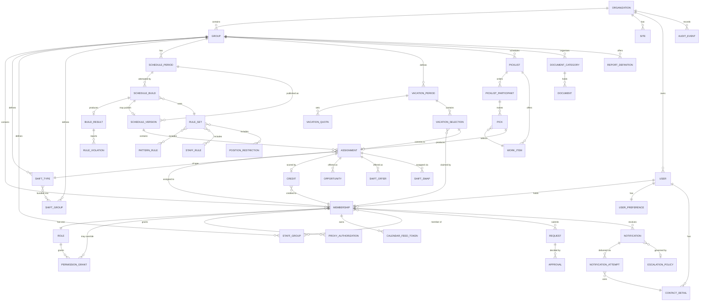

# 14 — Domain Model: iSchedule.MD (inferred) and SchedulePoint (proposed)

**Phase:** 13 — research consolidation. **Source:** reports 01–11 plus the final coverage audit. **No source-site navigation was performed in this phase.**

> ## ⚠ AMENDED AFTER PUBLIC-SOURCE RECONCILIATION — this version is authoritative
>
> **Amended 2026-07-30.** Updated after [17-public-source-gap-addendum.md](17-public-source-gap-addendum.md); now part of the production-capability baseline ([19-schedulepoint-production-capability-baseline.md](19-schedulepoint-production-capability-baseline.md)).
>
> **Applied here:** AMD-03, 06, 07, 08, 13, 15 — eight new entities **ENT-041..ENT-048** in §2.7, and field additions to ENT-002, ENT-006, ENT-010, ENT-018, ENT-034/035b recorded in §2.8.
> **No existing entity ID was renumbered or removed.** This remains a **conceptual product model**, not a database schema.
>
> **Product name:** `SchedulePoint` — **PO-DEC-00 APPROVED**.

**Scope boundary:** this is a **conceptual product model**, not a database schema and not the final technical architecture. Field types are indicative only, included where they clarify meaning. No table design, index strategy, storage engine, or API contract is proposed here — those belong to the architecture phase, which has not begun.

---

## 1. The inferred source-product domain model

This section records what iSchedule.MD's data model **appears** to be, based on observable screens, URL parameters, and API route shapes. It is largely **INFERRED** — no schema, source code, or API response body was ever accessed.

### 1.1 What the source demonstrably has

| Source concept | Evidence | Confidence |
|---|---|---|
| `Group` as the sole tenancy scope, carried as `groupId` | 10-technical §4 — present in every data-bound route, as a hash fragment, a query parameter, **and** a cookie simultaneously | High |
| A `User` account keyed by email, able to hold membership in several groups | 02-role §5 — the same email appears on two rosters with **different Access Levels** | High |
| An implicit membership join carrying role + 8 permission flags | 02-role §5 — role varies per group for the same person | High |
| A `Shift` catalogue with four orthogonal flags | 01-app ADM-07 | High |
| `Works` / `Workdays` as distinct API resources | 10-technical API-05, API-07 — the grid composes from **at least two parallel fetches**: cell data and per-day summary data | High |
| Shift assignment and fairness **credit** as independently movable values | 04-master §3.1 — the cell editor's Display selector | High |
| `Build` as a versioned, chainable generation run | 05-engine ADM-02 — sequential IDs per period, `Progressive Build` chip list | High |
| Three rule families: pattern, staff, position | 05-engine ADM-09/10/11 | High |
| `VacationYear` as a distinct, paginated resource | 10-technical API-12 | Med |
| `Picklist` = {date, ordered staff queue, work-item pool, status, lock} | 07-picklist §1 | High |
| An immutable per-cell audit log with actor, action, timestamp, mechanism tag | 04-master §3.3 | High |
| A `jobs` resource of unknown purpose | 10-technical API-03/04 | Low — **UNRESOLVED** (#78) |

### 1.2 What the source's model appears to lack

- **No organization above Group.** The two observed groups behave as fully independent silos.
- **No published-schedule versioning.** Builds are versioned; the *published output* is not. No rollback or unpublish control exists anywhere (#40).
- **No separation between account types.** Real people, shared departmental mailboxes, and unfilled placeholder slots all occupy the same roster table with no distinguishing flag (02-role §6).
- **No schedule-period entity.** A date range is a property of a Build, so several builds for one period have no shared parent.
- **No notification delivery record.** No log, status, failure, or retry indicator exists anywhere in the product (#53).
- **No aggregate audit view.** The audit log is per-cell only and cannot be queried across cells (04-master §3.3).
- **Inconsistent identifier conventions.** Three different date-serialization formats across sibling endpoints; `pickListId` and `Id` used for the same value in different call sites (10-technical §4, §5).

### 1.3 Source concepts deliberately **not** carried forward

| Source concept | Why not |
|---|---|
| Patient/clinical case detail on personal views | Regulatory exposure without clinical-system controls — FEAT-051, QA-SEC-006 |
| The `Picklist Admin` flag as observed | **C-02** — the flag does not gate the capability it names |
| Irreversible vacation-to-schedule transfer | Replaced by versioned, idempotent commit — FEAT-022, ENT-016 |
| Instant-commit "Add" persistence | **C-05**, FEAT-048 — a source defect |
| Third-party avatar identifier transmission | **SP-HR-1**, FEAT-052 |
| Increase-only pick-position count | An irreversible structural constraint with no evident justification (05-engine ADM-07) |

---

## 2. Proposed SchedulePoint conceptual domain model

**Classification key:** **OBS** (observed in source) · **INF** (inferred) · **UNR** (unresolved) · **SP-REQ** (SchedulePoint requirement, no source equivalent) · **SP-REC** (recommendation, needs approval).

**Sensitivity key:** `NONE` · `INTERNAL` (business data, no personal content) · `PII` (personal data) · `SENSITIVE-PII` (personal contact details, absence/health-adjacent) · `SECRET` (credentials/tokens) · `EXCLUDED` (must not exist in the MVP).

**Field key:** **Own** = ownership scope · **Life** = lifecycle/status · **Audit** · **Retain** = archive/retention · **Sens** = sensitivity · **Ev** = source evidence · **Conf** = confidence · **Feat** = related features · **QA** = related QA cases · **Open** = unresolved decisions.

---

### 2.1 Tenancy and identity

#### ENT-001 · Organization
**Purpose:** the customer/tenant root — billing entity and outermost security boundary.
**Fields:** `id`, `name`, `status` (active|suspended), `createdAt`, `settings` (json), `dataRegion?`
**Required:** id, name, status · **Optional:** dataRegion
**Relationships:** has many ENT-002 Group; has many ENT-004 User (via ENT-006 Membership)
**Own:** self (root) · **Life:** active → suspended → closed · **Audit:** all changes · **Retain:** indefinite; closure archives rather than deletes
**Sens:** `INTERNAL` · **Class:** SP-REQ · **Conf:** n/a
**Ev:** 02-role §4 (no such layer exists in the source); 10-technical §4 · **Feat:** FEAT-002 · **QA:** QA-TEN-001, QA-TEN-005, QA-TEN-006
**Open:** whether one User may belong to two Organizations (recommendation: **no** for the MVP — it materially complicates isolation).

#### ENT-002 · Group
**Purpose:** the scheduling and permission scope; the unit a schedule is built for.
**Fields:** `id`, `organizationId`, `name` (short/medium/full — the source carries three), `timezone`, `requestUntilDate`, `scheduleEndDate`, `pickWindowStart/End`, `personalHoursStart/End`, `locumLockoutHours`, `lockoutMinimumHours`, `vacationShiftTypeId`, `settings` (json)
**Required:** id, organizationId, name, timezone · **Optional:** the rest
**Relationships:** belongs to ENT-001; has many ENT-006 Membership, ENT-011 ShiftType, ENT-015 SchedulePeriod, ENT-020 VacationPeriod, ENT-029 Picklist, ENT-021/022/023 rules
**Own:** Organization · **Life:** active → archived · **Audit:** all settings changes · **Retain:** indefinite
**Sens:** `INTERNAL` · **Class:** OBS · **Conf:** High
**Ev:** 01-app ADM-01; 02-role §4 · **Feat:** FEAT-001 · **QA:** QA-TEN-002..012
**Open:** **`timezone` is a SchedulePoint addition** — the source carries no timezone anywhere (10-technical §6), treating dates as timezone-naive. This is a deliberate correctness fix (QA-DATE-004).

#### ENT-003 · Site
**Purpose:** a physical location where work is performed.
**Fields:** `id`, `organizationId`, `name`, `address?`, `timezone?`
**Relationships:** belongs to ENT-001; referenced by ENT-031 WorkItem and optionally ENT-014 Assignment
**Own:** Organization · **Life:** active → archived · **Audit:** changes · **Retain:** indefinite
**Sens:** `INTERNAL` · **Class:** SP-REC · **Conf:** Low
**Ev:** 01-app §1; 02-role §4 — Group and Site coincide 1:1 in the observed tenant but nothing enforces this · **Feat:** FEAT-004 · **QA:** —
**Open:** **whether Site exists at all in the MVP is an open product decision** (TERM-003). Recommendation: defer — the cost of adding it later is low; the cost of guessing wrong now is a migration.

#### ENT-004 · User
**Purpose:** an authenticable identity.
**Fields:** `id`, `email` (unique), `firstName`, `lastName`, `accountType` (person|functional|placeholder), `status` (invited|active|suspended|deactivated|archived), `passwordHash`, `mfaEnrolled?`, `lastLoginAt?`
**Required:** id, email, accountType, status · **Optional:** names (a placeholder slot may have none)
**Relationships:** has many ENT-006 Membership; has one ENT-009 UserPreference; has many ENT-010 ProxyAuthorization, ENT-037 CalendarFeedToken
**Own:** Organization · **Life:** see STM-017/STM-018 · **Audit:** creation, status change, credential change, role change
**Sens:** `PII` (`SECRET` for credential fields) · **Class:** OBS · **Conf:** High
**Ev:** 01-app ADM-05; 02-role §5, §6 · **Feat:** FEAT-005, FEAT-007, FEAT-008 · **QA:** QA-AUTH-004, QA-AUTH-005, QA-AUTH-011, QA-SEC-014
**Open:** **`accountType` is a SchedulePoint addition.** The source conflates real people, shared mailboxes, and placeholder slots in one undifferentiated table (02-role §6) — with real audit consequences (an audit entry attributed to a shared account names nobody).

#### ENT-005 · ContactDetail
**Purpose:** a user's reachable contact channels, separated from identity so they can be permissioned independently.
**Fields:** `id`, `userId`, `kind` (email|mobile|home|pager), `value`, `verified`, `visibility` (self|schedulers|group)
**Relationships:** belongs to ENT-004; used by ENT-034 Notification
**Own:** User · **Life:** active → superseded · **Audit:** changes · **Retain:** purge on account archive
**Sens:** `SENSITIVE-PII` · **Class:** OBS (fields) / SP-REQ (the separation) · **Conf:** High
**Ev:** 01-app PL-03, CON-01; 02-role §8 · **Feat:** FEAT-007, FEAT-041 · **QA:** QA-SEC-014, QA-NOT-005
**Open:** the source exposes personal mobile, home phone, and personal email broadly across Contacts, On Call, and the admin roster (02-role §8). **`visibility` is a SchedulePoint addition** enabling field-level minimisation.

#### ENT-006 · Membership
**Purpose:** **the join carrying a person's role in a specific group.** This is where role actually lives.
**Fields:** `id`, `userId`, `groupId`, `roleId`, `status` (active|suspended|ended), `showInSchedule`, `pickPositionExclusions` (int[]), `turnTimeLimitSeconds?`, `joinedAt`, `endedAt?`
**Required:** userId, groupId, roleId, status
**Relationships:** belongs to ENT-004 and ENT-002; has one ENT-007 Role; has many ENT-008 PermissionGrant; referenced by ENT-014, ENT-018, ENT-019, ENT-030
**Own:** Group · **Life:** invited → active → suspended → ended · **Audit:** **every role and permission change**
**Sens:** `INTERNAL` · **Class:** INF · **Conf:** High
**Ev:** 02-role §5 — the same individual held **different Access Levels in each group**, corroborated across multiple people · **Feat:** FEAT-005, FEAT-006 · **QA:** QA-TEN-003, QA-AUTH-006, QA-AUTH-007
**Open:** none — this is one of the best-evidenced structural findings of the research.

#### ENT-007 · Role
**Purpose:** a named capability tier held by a Membership.
**Fields:** `id`, `organizationId?`, `key`, `name`, `description`, `isSystemRole`
**Relationships:** has many ENT-008 PermissionGrant; referenced by ENT-006
**Own:** Organization (or system-defined) · **Life:** active → deprecated · **Audit:** definition changes
**Sens:** `INTERNAL` · **Class:** OBS · **Conf:** High
**Ev:** 02-role §5 — six values: Staff, Locum, View, Telecom, Scheduler, Genius · **Feat:** FEAT-006 · **QA:** QA-AUTH-006, QA-AUTH-007, QA-TEN-003
**Open:** **the six source roles are not cleanly ordered** — Telecom and View are sideways from Staff, not below it. SchedulePoint should not assume a linear hierarchy. Capabilities of View/Telecom/Genius are UNRESOLVED (no session was ever available).

#### ENT-008 · PermissionGrant
**Purpose:** a discrete, independently testable capability attached to a Role or a Membership.
**Fields:** `id`, `subjectType` (role|membership), `subjectId`, `capabilityKey`, `granted` (bool), `grantedBy`, `grantedAt`
**Relationships:** belongs to ENT-007 or ENT-006
**Own:** Group · **Life:** granted → revoked · **Audit:** **mandatory, both directions**
**Sens:** `INTERNAL` · **Class:** OBS (the flags) / SP-REQ (the model) · **Conf:** Med
**Ev:** 01-app ADM-05 (8 flags: Admin Emails, Picklist Admin, Show In Grid, Proxy Locked, Notification Locked, Start Tour, Picks Excluded, Action Time); 02-role §5 · **Feat:** FEAT-006 · **QA:** QA-AUTH-007, QA-AUTH-008
**Open:** **C-02 (BLOCKING).** The source's eight flags mix at least four unrelated concepts — permission grants, display preferences, admin locks, and scheduling parameters — and at least one (`Picklist Admin`) demonstrably does not gate the capability it names. SchedulePoint's model separates these: true capabilities become PermissionGrants; display preferences move to ENT-009; scheduling parameters move to ENT-006. **Every grant must have a passing authorization test or it does not ship.**

#### ENT-009 · UserPreference
**Purpose:** per-user, non-security display and behaviour settings.
**Fields:** `id`, `userId`, `defaultGroupId`, `calendarRetentionDays`, `personalHoursStart/End`, `locale?`, `theme?`
**Relationships:** belongs to ENT-004
**Own:** User · **Life:** created with account · **Audit:** not required · **Retain:** purge on account archive
**Sens:** `INTERNAL` · **Class:** OBS · **Conf:** High
**Ev:** 01-app PL-03 ("Calendar days to keep", Save Default Group), PL-02 (Personal Start/Stop Time) · **Feat:** FEAT-007 · **QA:** —
**Open:** none.

#### ENT-010 · ProxyAuthorization
**Purpose:** a delegation letting one user act for, or receive notifications on behalf of, another.
**Fields:** `id`, `grantorMembershipId`, `granteeMembershipId`, `scope` (**notifications-only | act-on-behalf**), `status`, `validFrom`, `validUntil?`, `lockedByAdmin`
**Relationships:** two references to ENT-006
**Own:** Group · **Life:** see STM-019 · **Audit:** **mandatory** — grant, use, and revocation
**Sens:** `INTERNAL` · **Class:** OBS (structure) / UNR (semantics) · **Conf:** Low
**Ev:** 01-app PL-02; 03-user WF-22; 07-picklist §2 · **Feat:** FEAT-034 · **QA:** QA-AUTH-008
**Open:** **`scope` is a SchedulePoint addition and a REQUIRES-DECISION item.** The source never distinguished whether a proxy *picks* or merely *receives notifications* — materially different authorization consequences (TERM-019). SchedulePoint must make this explicit. Eligible-grantee scope is also UNRESOLVED (#27).

---

### 2.2 Shifts, schedules, and assignments

#### ENT-011 · ShiftType
**Purpose:** the catalogue definition of a kind of work. **A template, never an instance.**
**Fields:** `id`, `groupId`, `code` (short), `name` (full), `startTime`, `endTime`, `crossesMidnight` (derived), `isOnCall`, `isManualOnly`, `isDailyPick`, `attractsStipend`, `creditWeight`, `status`
**Required:** id, groupId, code, name · **Optional:** times (some codes are markers, e.g. OFF/POST)
**Relationships:** belongs to ENT-002; many-to-many with ENT-013 ShiftGroup; referenced by ENT-014 Assignment and ENT-021 PatternRule
**Own:** Group · **Life:** active → retired (never hard-deleted — historical assignments reference it) · **Audit:** definition changes
**Sens:** `NONE` · **Class:** OBS · **Conf:** High
**Ev:** 01-app ADM-07; 05-engine ADM-07 · **Feat:** FEAT-010 · **QA:** QA-SCH-004, QA-SCH-006, QA-SCH-013
**Open:** **`crossesMidnight` is a SchedulePoint addition.** The source stores start/end times with no evident overnight handling (QA-SCH-004, QA-DATE-002) — a real correctness risk for on-call shifts.

#### ENT-012 · StaffGroup
**Purpose:** a named subset of people, for scoping eligibility and rules.
**Fields:** `id`, `groupId`, `name`, `description?`
**Relationships:** belongs to ENT-002; many-to-many with ENT-006 Membership; referenced by ENT-022 StaffRule
**Own:** Group · **Life:** active → archived · **Audit:** membership changes · **Sens:** `INTERNAL`
**Class:** OBS · **Conf:** High · **Ev:** 01-app ADM-06 · **Feat:** FEAT-013 · **QA:** QA-SCH-006
**Open:** naming collision with ENT-013 and ENT-023 (three "…Group" concepts) — see TERM-024.

#### ENT-013 · ShiftGroup
**Purpose:** a named bundle of ShiftTypes, used for fairness weighting **and** as the target of grouped time-off requests.
**Fields:** `id`, `groupId`, `name`, `scoringMode` (hard|weighted), `weight`, `allowRequest`, `requestOffLabel`
**Relationships:** belongs to ENT-002; many-to-many with ENT-011; referenced by ENT-018 Request and ENT-021 PatternRule
**Own:** Group · **Life:** active → archived · **Audit:** changes · **Sens:** `NONE`
**Class:** OBS · **Conf:** High
**Ev:** 01-app ADM-08; 10-technical API-11 — `allowRequest` is a **genuine server-side filter**, not display-only · **Feat:** FEAT-014, FEAT-020 · **QA:** QA-REQ-003
**Open:** serves two unrelated purposes through one entity; splitting is a `SP-REC`.

#### ENT-015 · SchedulePeriod
**Purpose:** the bounded date range a schedule is planned and published for.
**Fields:** `id`, `groupId`, `name`, `startDate`, `endDate`, `status` (planning|published|closed)
**Relationships:** belongs to ENT-002; has many ENT-024 ScheduleBuild and ENT-016 ScheduleVersion
**Own:** Group · **Life:** planning → published → closed · **Audit:** status transitions · **Retain:** indefinite
**Sens:** `NONE` · **Class:** INF · **Conf:** Med
**Ev:** 05-engine ADM-02 — observed ranges ≈166–182 days, start must be a Monday, end a Sunday · **Feat:** FEAT-015 · **QA:** QA-SCH-001, QA-DATE-010, QA-DATE-011
**Open:** **the source has no such entity** — a date range is a property of a Build, so several builds for one period share no parent. This is a SchedulePoint structuring decision enabling FEAT-019.

#### ENT-016 · ScheduleVersion
**Purpose:** **an immutable snapshot of a published schedule.** Publishing supersedes but never deletes.
**Fields:** `id`, `schedulePeriodId`, `versionNumber`, `sourceBuildId?`, `publishedAt`, `publishedBy`, `supersededAt?`, `supersededBy?`, `isLocked`, `changeSummary`
**Relationships:** belongs to ENT-015; references ENT-024; has many ENT-014 Assignment
**Own:** Group · **Life:** see STM-003/STM-004 · **Audit:** **mandatory** — publication, supersession, lock, revert
**Retain:** **indefinite — never hard-deleted.** · **Sens:** `INTERNAL`
**Class:** SP-REQ · **Conf:** n/a
**Ev:** 04-master §8 — **no rollback or unpublish control exists anywhere in the source** (#40); 05-engine §2 — builds are versioned, published output is not · **Feat:** FEAT-018, FEAT-019 · **QA:** QA-SCH-009, QA-SCH-012, QA-SCH-015, QA-CON-010
**Open:** none. **This is a carried architectural requirement:** published schedules must be versioned and auditable, never silently overwritten.

#### ENT-014 · Assignment
**Purpose:** **one person, scheduled to one shift type, on one date.** The instance, never the template.
**Fields:** `id`, `scheduleVersionId`, `membershipId`, `shiftTypeId`, `date`, `startsAt`, `endsAt`, `origin` (build|picklist|manual|vacation-commit|opportunity|swap), `pickPosition?`, `status`, `siteId?`
**Required:** scheduleVersionId, membershipId, shiftTypeId, date, origin
**Relationships:** belongs to ENT-016, ENT-006, ENT-011; has zero-or-one ENT-017 Credit; referenced by ENT-026/027/028
**Own:** Group (via version) · **Life:** active → superseded → cancelled · **Audit:** **every mutation**, with actor and mechanism
**Sens:** `INTERNAL` · **Class:** OBS · **Conf:** High
**Ev:** 01-app SCH-02/03/04; 04-master §3, §4; 10-technical API-05/06 · **Feat:** FEAT-011, FEAT-012, FEAT-027 · **QA:** QA-SCH-003..016, QA-CON-001
**Open:** **`origin` is a SchedulePoint addition**, generalising the source's `PLC` audit tag (04-master §3.3) so provenance is a first-class field rather than a parseable string.

#### ENT-017 · Credit
**Purpose:** **the fairness-scoring value for an assignment, movable independently of the assignment itself.**
**Fields:** `id`, `assignmentId`, `creditedMembershipId`, `weight`, `reason?`, `movedBy?`, `movedAt?`
**Relationships:** belongs to ENT-014; references ENT-006 (the credited person, who **may differ** from the assignee)
**Own:** Group · **Life:** created with assignment → reassigned → voided · **Audit:** **every move**
**Sens:** `INTERNAL` · **Class:** OBS · **Conf:** High
**Ev:** 04-master §3.1 — the cell editor's Display selector (Shifts | Credits) with separate Move Shift / Move Credit actions; 01-app ADM-04 (Credits vs. Actual Shifts reported separately) · **Feat:** FEAT-012, FEAT-023 · **QA:** QA-RPT-002
**Open:** none. **This must not be flattened into Assignment** — "who works it" and "who is scored for it" are legitimately different, and the source models this deliberately. It is one of the more sophisticated ideas found in the research.

#### ENT-031 · WorkItem
**Purpose:** an assignable unit of work in a picklist pool — a room, location, or duty slot for a date.
**Fields:** `id`, `picklistId`, `title`, `description?`, `procedureCount?`, `siteId?`, `displayOrder`, `status` (available|taken|withdrawn)
**Relationships:** belongs to ENT-029; referenced by ENT-032 Pick
**Own:** Group · **Life:** available → taken; withdrawn · **Audit:** creation, edit, reorder, deletion
**Sens:** `INTERNAL` — **must not carry patient-level content** · **Class:** OBS · **Conf:** Med
**Ev:** 07-picklist §0 (field set observed during the incident: Room Title, Procedure Count, rich-text description), §1 · **Feat:** FEAT-030 · **QA:** QA-PICK-002, QA-PICK-003, QA-SEC-012
**Open:** the free-text/rich-text description is a **stored-XSS surface** (QA-SEC-012) and a place clinical detail could leak in. Both need explicit controls.

---

### 2.3 Requests, vacation, and the marketplace

#### ENT-018 · Request
**Purpose:** **one entity covering all staff-initiated scheduling asks**, with a type discriminator.
**Fields:** `id`, `membershipId`, `type` (**time-off | availability | shift-group-off**), `targetDate` or `targetRange`, `shiftTypeId?`, `shiftGroupId?`, `status`, `comment?`, `submittedAt`, `decidedAt?`, `decidedByMembershipId?`, `withdrawnAt?`
**Relationships:** belongs to ENT-006; optionally references ENT-011 or ENT-013; has many ENT-025 Approval
**Own:** Group · **Life:** see STM-005/STM-006 · **Audit:** submission, decision, withdrawal, comment edits
**Sens:** `SENSITIVE-PII` — absence data · **Class:** OBS (status) / UNR (creation) · **Conf:** Med
**Ev:** 01-app SCH-01, ADM-08; 03-user WF-08/09/10; 06-requests LC-01, LC-02 · **Feat:** FEAT-020 · **QA:** QA-REQ-001..014
**Open:** **C-03 (blocking product definition).** The source has two request shapes with two withdrawal surfaces, and it is unresolved whether they act on one record or two. **Recommendation: one entity, one lifecycle, multiple views — every view exposes the same state machine and the same withdrawal semantics.** Pending product-owner approval. Also: the `availability` (ON-request) type has **no observed source evidence** (TERM-048) and is included only as a placeholder.

#### ENT-019 · VacationSelection
**Purpose:** one staff member's claim on one vacation week.
**Fields:** `id`, `membershipId`, `vacationPeriodId`, `weekStartDate`, `status` (pending|approved|denied|withdrawn|committed), `comment?`, `decidedBy?`, `decidedAt?`, `committedToVersionId?`
**Relationships:** belongs to ENT-006 and ENT-020; produces ENT-014 Assignment on commit
**Own:** Group · **Life:** see STM-007 · **Audit:** every transition, especially commit
**Sens:** `SENSITIVE-PII` · **Class:** OBS · **Conf:** High
**Ev:** 01-app VAC-01; 06-requests LC-01, LC-01b · **Feat:** FEAT-021, FEAT-022 · **QA:** QA-REQ-007..014
**Open:** **`committedToVersionId` is a SchedulePoint addition** making the vacation→schedule commit **idempotent and traceable**, replacing the source's explicitly irreversible one-way transfer (#45).

#### ENT-020 · VacationPeriod
**Purpose:** the bounded window within which vacation is requested, quota'd, and approved.
**Fields:** `id`, `groupId`, `startDate` (Monday), `endDate` (Friday), `selectionOpen`, `openMode`, `approvalRequired`, `includeWeekendBefore/After`, `includeHolidays`, `allowNegativeBalance`, `allowNegativeEntitlement`
**Relationships:** belongs to ENT-002; has many ENT-019, ENT-021b VacationQuota
**Own:** Group · **Life:** draft → open → closed → archived · **Audit:** settings changes · **Sens:** `NONE`
**Class:** OBS · **Conf:** High · **Ev:** 01-app VAC-02 · **Feat:** FEAT-021 · **QA:** QA-REQ-002, QA-DATE-010
**Open:** none.

#### ENT-021b · VacationQuota
**Purpose:** the two distinct numbers governing vacation: a personal entitlement and an org-wide weekly capacity.
**Fields:** `id`, `vacationPeriodId`, `kind` (**personal-entitlement | weekly-capacity**), `membershipId?`, `weekStartDate?`, `value`
**Relationships:** belongs to ENT-020; optionally ENT-006
**Own:** Group · **Life:** set per period · **Audit:** changes · **Sens:** `INTERNAL`
**Class:** OBS · **Conf:** High
**Ev:** 01-app VAC-01/02 — Grant (personal), Avail (derived balance), Weekly Quota (org-wide), Requested (derived) · **Feat:** FEAT-021 · **QA:** QA-REQ-002
**Open:** the source's over-quota indicator is **advisory, not blocking** (turns red but does not prevent approval) — a deliberate design choice worth preserving explicitly.

#### ENT-025 · Approval
**Purpose:** a recorded decision on a request or selection, individually or as part of a batch.
**Fields:** `id`, `subjectType` (request|vacation-selection|swap|transfer), `subjectId`, `decision` (approved|denied), `decidedByMembershipId`, `decidedAt`, `comment?`, `batchId?`
**Relationships:** polymorphic to ENT-018/019/027/028
**Own:** Group · **Life:** terminal once recorded (a reversal is a new record) · **Audit:** **is itself the audit record**
**Sens:** `INTERNAL` · **Class:** OBS · **Conf:** High
**Ev:** 01-app VAC-01; 06-requests LC-01, LC-01a (Batch Approval by date range) · **Feat:** FEAT-021 · **QA:** QA-REQ-008, QA-REQ-009
**Open:** the source shows **Remove** and **Deny** side by side on the same modal with **UNRESOLVED** differing server effects (03-user WF-09). SchedulePoint separates them: *withdraw* (by the requester) and *deny* (by the approver) are distinct, separately-audited transitions.

#### ENT-026 · Opportunity
**Purpose:** an assignment offered to **any** eligible colleague — one-to-many.
**Fields:** `id`, `assignmentId`, `postedByMembershipId`, `postedAt`, `status` (posted|claimed|withdrawn|expired), `claimedByMembershipId?`, `claimedAt?`, `eligibilityRule?`
**Relationships:** belongs to ENT-014; two references to ENT-006
**Own:** Group · **Life:** see STM-008 · **Audit:** post, claim, withdraw
**Sens:** `INTERNAL` · **Class:** OBS (post/withdraw) / UNR (claim) · **Conf:** Med
**Ev:** 01-app SCH-01; 03-user WF-11/12; 06-requests LC-03; 04-master §3.3 (audit wording confirms server-side "opportunity" terminology) · **Feat:** FEAT-025 · **QA:** QA-OPP-001..008
**Open:** **the claim side was never observed** (single-account limitation). Simultaneous-claim resolution requires an atomic conditional claim (QA-OPP-001, QA-CON-004).

#### ENT-027 · ShiftOffer
**Purpose:** an assignment offered to **one named** colleague — one-to-one, requiring their response.
**Fields:** `id`, `assignmentId`, `fromMembershipId`, `toMembershipId`, `status` (proposed|accepted|declined|withdrawn|expired), `expiresAt?`, `respondedAt?`
**Relationships:** belongs to ENT-014; two references to ENT-006
**Own:** Group · **Life:** see STM-009 · **Audit:** all transitions · **Sens:** `INTERNAL`
**Class:** INF · **Conf:** Low
**Ev:** 03-user WF-13; 06-requests LC-04 · **Feat:** FEAT-026 · **QA:** QA-OPP-009, QA-OPP-010
**Open:** **the source conflates offer, swap, and transfer under "Swap"/"TRANSFER"** (TERM-055). Whether acceptance, scheduler approval, both, or neither is required is entirely UNRESOLVED (#32, #48). **REQUIRES DECISION.**

#### ENT-028 · ShiftSwap
**Purpose:** a **mutual** exchange — two assignments trading holders atomically.
**Fields:** `id`, `initiatorAssignmentId`, `counterpartAssignmentId`, `initiatorMembershipId`, `counterpartMembershipId`, `status`, `requiresApproval`, `approvalId?`
**Relationships:** two references to ENT-014 and ENT-006; optionally ENT-025
**Own:** Group · **Life:** see STM-010 · **Audit:** all transitions · **Sens:** `INTERNAL`
**Class:** INF · **Conf:** Low
**Ev:** 03-user WF-13 (own-picks checklist + counterpart combobox — a multi-select implies a genuine exchange, not a give-away) · **Feat:** FEAT-026 · **QA:** QA-OPP-009, QA-OPP-011
**Open:** **must be atomic** — both legs commit or neither (QA-OPP-011). Approval model UNRESOLVED.

---

### 2.4 Rules and generation

#### ENT-021 · PatternRule
**Purpose:** a declarative spacing/fairness constraint scoped by shift or shift group and by weekday.
**Fields:** `id`, `groupId`, `name`, `triggerShiftTypeId?`, `triggerShiftGroupId?`, `daysOfWeek` (incl. holidays), `dateScope` (all|range), `segments` (ordered: match target, offsetMode `day-offset|optimal-spacing`, offsetDays?, penaltyMode `hard|weighted`, weight?)
**Relationships:** belongs to ENT-002; references ENT-011/ENT-013; referenced by ENT-023b RuleSet
**Own:** Group · **Life:** active → disabled → archived · **Audit:** definition changes
**Sens:** `NONE` · **Class:** OBS · **Conf:** High
**Ev:** 01-app ADM-10 (11 rules); 05-engine ADM-10 (full authoring form) · **Feat:** FEAT-017 · **QA:** QA-SCH-005
**Open:** whether a hard rule blocks generation or merely scores infinitely is UNRESOLVED (no build was ever run).

#### ENT-022 · StaffRule
**Purpose:** a named-individual constraint layered above pattern rules.
**Fields:** `id`, `groupId`, `name`, `daysOfWeek`, `dateScope`, `conditions` (shift/group, offset, subject membership or staff group, negated?, staffBalanceComparison?), `action` (**assign | penalty | exclude | linked | staff-shift**), `actionParams`
**Relationships:** belongs to ENT-002; references ENT-006/ENT-012/ENT-011
**Own:** Group · **Life:** active → disabled → archived · **Audit:** definition changes
**Sens:** `INTERNAL` — **rules name specific individuals and encode judgements about them** · **Class:** OBS · **Conf:** High
**Ev:** 02-role ADM-11 (6 rules, all the simplest shape); 05-engine ADM-11 (authoring form reveals **five action types**, negation, and Staff-Balance conditions) · **Feat:** FEAT-017 · **QA:** QA-SCH-005, QA-SCH-006
**Open:** the tenant's live rules exercise only a fraction of the expressible language — **treat the observed examples as a floor, not a ceiling.**

#### ENT-023 · PositionRestriction
**Purpose:** restricts which pick positions are legal for a given set of shift types. *(Source name: "Valid Group".)*
**Fields:** `id`, `groupId`, `name`, `shiftTypeIds` (set), `allowedPickPositions` (int set)
**Relationships:** belongs to ENT-002; references ENT-011 and ENT-030
**Own:** Group · **Life:** active → archived · **Audit:** changes · **Sens:** `NONE`
**Class:** OBS · **Conf:** Med
**Ev:** 05-engine ADM-09 — Group One = shift codes, Group Two = pick positions · **Feat:** FEAT-017 · **QA:** QA-PICK-007
**Open:** the single observed instance was **unrestricted** (all 30 positions), so the restrictive case is structurally supported but never seen in effect (#44).

#### ENT-023b · RuleSet
**Purpose:** the named collection of rules opted into a specific build.
**Fields:** `id`, `groupId`, `name`, `patternRuleIds`, `staffRuleIds`, `positionRestrictionIds`
**Relationships:** belongs to ENT-002; referenced by ENT-024
**Own:** Group · **Life:** active → archived · **Audit:** composition changes · **Sens:** `NONE`
**Class:** INF · **Conf:** Med
**Ev:** 05-engine ADM-02 — Build Setup's chip lists opt specific rules into each build · **Feat:** FEAT-016, FEAT-017 · **QA:** —
**Open:** the source expresses this as per-build chip lists rather than a reusable named set; making it reusable is a SchedulePoint simplification.

#### ENT-024 · ScheduleBuild
**Purpose:** a versioned, chainable generation run.
**Fields:** `id`, `schedulePeriodId`, `name`, `status` (draft|planning|generating|generated|failed|reviewed|published|locked), `parentBuildIds` (chain), `usePreviousStatistics`, `previousStatsRange?`, `scopedMembershipIds`, `scopedShiftTypeIds`, `ruleSetId`, `solverOptions` (json), `createdBy`, `createdAt`, `completedAt?`
**Relationships:** belongs to ENT-015; references ENT-023b; produces ENT-025b BuildResult and ENT-016 ScheduleVersion
**Own:** Group · **Life:** see STM-001 · **Audit:** all stage transitions · **Retain:** indefinite — build history is never overwritten
**Sens:** `INTERNAL` · **Class:** OBS · **Conf:** Med
**Ev:** 01-app ADM-02; 05-engine ADM-02, §2 · **Feat:** FEAT-016 · **QA:** QA-SCH-001, QA-SCH-002, QA-SCH-007, QA-CON-002
**Open:** **the source exposes only two statuses (locked / not-locked)** — no Draft, Running, Failed, or Complete label exists (#43). The richer status set above is a SchedulePoint requirement, not an observation.

#### ENT-025b · BuildResult
**Purpose:** the outcome of one generation run, including diagnostics.
**Fields:** `id`, `buildId`, `outcome` (success|partial|failed), `assignmentCount`, `unfilledCount`, `startedAt`, `finishedAt`, `solverLog?`
**Relationships:** belongs to ENT-024; has many ENT-026b RuleViolation
**Own:** Group · **Life:** terminal · **Audit:** creation · **Sens:** `INTERNAL`
**Class:** SP-REQ · **Conf:** n/a
**Ev:** 05-engine §2 — **no failure state was ever encountered** because no build was ever run (#43) · **Feat:** FEAT-016 · **QA:** QA-SCH-007
**Open:** entirely a SchedulePoint addition. The source surfaces no build diagnostics at all.

#### ENT-026b · RuleViolation
**Purpose:** a recorded instance of a rule not satisfied by a generated schedule.
**Fields:** `id`, `buildResultId`, `ruleType`, `ruleId`, `severity` (hard|weighted), `affectedMembershipId?`, `affectedDate?`, `explanation`
**Relationships:** belongs to ENT-025b
**Own:** Group · **Life:** terminal · **Audit:** none needed · **Sens:** `INTERNAL`
**Class:** SP-REQ · **Conf:** n/a
**Ev:** 05-engine §3 — rule *runtime effect* was never observed · **Feat:** FEAT-016, FEAT-017 · **QA:** QA-SCH-005
**Open:** a SchedulePoint addition. Explaining *why* a schedule looks the way it does is essential to trust in an automated scheduler, and the source offers nothing here.

---

### 2.5 Picklist

#### ENT-029 · Picklist
**Purpose:** one day's turn-based draft.
**Fields:** `id`, `groupId`, `date`, `status` (**draft|ready|active|paused|completed|cancelled**), `isLocked`, `turnTimeLimitSeconds?`, `alertThresholdSeconds?`, `currentPositionIndex?`, `comment?`, `startedAt?`, `completedAt?`
**Relationships:** belongs to ENT-002; has many ENT-030 Participant, ENT-031 WorkItem, ENT-032 Pick
**Own:** Group · **Life:** see STM-012/STM-013 · **Audit:** all transitions and every pick
**Sens:** `INTERNAL` · **Class:** OBS (2 statuses) / INF (the rest) · **Conf:** Low
**Ev:** 07-picklist §1, §2 — **only `ON HOLD` and `COMPLETED` were ever observed**; final-coverage-audit §12 (a live picklist was confirmed to exist but deliberately not opened) · **Feat:** FEAT-030, FEAT-032 · **QA:** QA-PICK-001..017
**Open:** **the richer status set is inferred, not observed.** Pause/resume controls were never located. **C-04 (blocking architecture)** governs how state reaches clients.

#### ENT-030 · PicklistParticipant
**Purpose:** one membership's place in a draft's turn order.
**Fields:** `id`, `picklistId`, `membershipId`, `position` (int), `status` (waiting|active|picked|skipped|excluded|proxied), `turnStartedAt?`, `turnEndsAt?`, `actingProxyMembershipId?`
**Relationships:** belongs to ENT-029 and ENT-006
**Own:** Group · **Life:** waiting → active → picked/skipped · **Audit:** turn start, pick, skip, proxy action
**Sens:** `INTERNAL` · **Class:** OBS (order) / INF (states) · **Conf:** Med
**Ev:** 07-picklist §1 — the numbered Staff panel cross-matched exactly to Master Schedule pick labels; pick order is **derived from the Master Schedule and not editable here** · **Feat:** FEAT-030, FEAT-032 · **QA:** QA-PICK-006, QA-PICK-007, QA-PICK-008
**Open:** whether skipping is automatic on timeout is UNRESOLVED — no timer UI was ever seen.

#### ENT-032 · Pick
**Purpose:** one selection event — a participant choosing a work item on their turn.
**Fields:** `id`, `picklistId`, `participantId`, `workItemId`, `pickedAt`, `pickedByMembershipId` (may be a proxy), `resultingAssignmentId?`, `idempotencyKey`
**Relationships:** belongs to ENT-029, ENT-030, ENT-031; produces ENT-014
**Own:** Group · **Life:** terminal once recorded · **Audit:** **mandatory**
**Sens:** `INTERNAL` · **Class:** UNR · **Conf:** Low
**Ev:** 07-picklist §2 — **the entire execution flow is unobserved**; 04-master §3.3 (`PLC`-tagged audit entries confirm picks reach the schedule) · **Feat:** FEAT-032 · **QA:** QA-PICK-005, QA-PICK-009, QA-PICK-011, QA-PICK-016
**Open:** **`idempotencyKey` and `pickedByMembershipId` are SchedulePoint additions** — the first to prevent double-submission (SP-HR-2), the second so a proxy-made pick is attributable to the actual actor, not silently to the grantor.

---

### 2.6 Notifications, documents, and audit

#### ENT-034 · Notification
**Purpose:** one logical message to one recipient about one event.
**Fields:** `id`, `groupId`, `recipientMembershipId`, `eventType`, `subjectType`, `subjectId`, `createdAt`, `status` (pending|sending|delivered|failed|cancelled), `escalationPolicyId?`, `idempotencyKey`
**Relationships:** belongs to ENT-006; has many ENT-035b NotificationAttempt
**Own:** Group · **Life:** see STM-015 · **Audit:** creation and final outcome
**Sens:** `PII` — **message bodies must never contain clinical detail** · **Class:** INF · **Conf:** Med
**Ev:** 01-app PL-02, ADM-01; 07-picklist §3 · **Feat:** FEAT-040 · **QA:** QA-NOT-001..012
**Open:** **the source has no notification record at all** — no log, status, failure, or retry indicator exists anywhere (#53). This entity is a SchedulePoint requirement.

#### ENT-035b · NotificationAttempt
**Purpose:** one delivery attempt on one channel.
**Fields:** `id`, `notificationId`, `channel` (email|sms|voice-mobile|voice-home), `contactDetailId`, `attemptNumber`, `sentAt`, `outcome` (delivered|failed|bounced|no-destination), `providerRef?`, `errorCode?`
**Relationships:** belongs to ENT-034 and ENT-005
**Own:** Group · **Life:** terminal · **Audit:** implicit · **Sens:** `PII`
**Class:** SP-REQ · **Conf:** n/a
**Ev:** 07-picklist §3 — **delivery status, failure handling, and retry are entirely UNRESOLVED in the source** · **Feat:** FEAT-040 · **QA:** QA-NOT-004, QA-NOT-005, QA-NOT-007, QA-NOT-011
**Open:** the source has accounts with **no phone number at all**, which would leave a voice channel with nothing to dial and no observed warning. `no-destination` is an explicit outcome here.

#### ENT-035 · EscalationPolicy
**Purpose:** the ordered ladder governing how an unanswered notification escalates.
**Fields:** `id`, `scopeType` (group-default|membership-override), `scopeId`, `window` (**business-hours | personal-hours**), `steps` (ordered: offsetMinutes, channels[]), `lockedByAdmin`
**Relationships:** belongs to ENT-002 or ENT-006
**Own:** Group · **Life:** active → superseded · **Audit:** changes · **Sens:** `INTERNAL`
**Class:** OBS · **Conf:** High
**Ev:** 01-app PL-02, ADM-01 — identical structure at both group-default and per-user level; "Load Defaults" implies override semantics · **Feat:** FEAT-040 · **QA:** QA-NOT-002, QA-NOT-003
**Open:** two-tier override is **inferred** from the Load Defaults affordance, never tested by changing a setting.

#### ENT-037 · CalendarFeedToken
**Purpose:** a revocable credential granting read-only calendar access to one membership's schedule.
**Fields:** `id`, `membershipId`, `tokenHash` (**never the plaintext**), `createdAt`, `lastUsedAt?`, `revokedAt?`, `rotatedFromId?`, `scope` (read-only, single membership)
**Relationships:** belongs to ENT-006
**Own:** User · **Life:** see STM-021 · **Audit:** issue, use, rotate, revoke · **Retain:** revoked tokens retained for audit
**Sens:** `SECRET` · **Class:** OBS (existence) / SP-REQ (the design) · **Conf:** Med
**Ev:** 03-user WF-23 — the source's feed URL carries **the user's email and a long-lived bearer token in query-string parameters** · **Feat:** FEAT-042 · **QA:** QA-SEC-005, QA-SEC-009, QA-DATE-008
**Open:** **SchedulePoint stores only a hash and puts no PII in the URL** — a deliberate divergence. Source token stability/revocability is UNRESOLVED (#35).

#### ENT-038 · Document
**Purpose:** a shared file within a group.
**Fields:** `id`, `groupId`, `categoryId`, `filename`, `contentType`, `sizeBytes`, `storageKey`, `uploadedByMembershipId`, `uploadedAt`, `version`, `status`
**Relationships:** belongs to ENT-002 and ENT-038b DocumentCategory
**Own:** Group · **Life:** active → archived → purged · **Audit:** upload, download, deletion · **Retain:** policy-driven
**Sens:** `INTERNAL` — may contain sensitive operational content · **Class:** OBS · **Conf:** High
**Ev:** 01-app DOC-01; 08-supporting SM-05 · **Feat:** FEAT-050 · **QA:** QA-RPT-009..012, QA-SEC-010
**Open:** **`uploadedByMembershipId` and `version` are SchedulePoint additions** — the source records only an upload date, with no uploader and no versioning.

#### ENT-038b · DocumentCategory
**Purpose:** the group-scoped folder structure organising documents.
**Fields:** `id`, `groupId`, `name`, `parentId?`, `visibilityRoleIds?`
**Relationships:** belongs to ENT-002; has many ENT-038
**Own:** Group · **Life:** active → archived · **Audit:** changes · **Sens:** `INTERNAL`
**Class:** OBS · **Conf:** High · **Ev:** 01-app DOC-01 · **Feat:** FEAT-050 · **QA:** QA-RPT-009
**Open:** role-based category visibility is UNRESOLVED in the source; `visibilityRoleIds` is a SchedulePoint addition.

#### ENT-039 · ReportDefinition
**Purpose:** a named, parameterised report a user can generate.
**Fields:** `id`, `groupId?`, `key`, `name`, `parameters` (schema), `outputFormats`, `requiredCapability`
**Relationships:** belongs to ENT-002 or system-defined
**Own:** Group · **Life:** active → deprecated · **Audit:** generation events · **Sens:** `INTERNAL`
**Class:** OBS (six types) / UNR (internals) · **Conf:** Med
**Ev:** 09-responsive RA-12 (5 types via hidden headings); final-coverage-audit SM-11 (a 6th), SM-12 (a recipient-targeted sharing report) · **Feat:** FEAT-024 · **QA:** QA-RPT-001..008
**Open:** **dialog internals remain UNRESOLVED for 4 of 6 types** — all found passively, never opened.

#### ENT-040 · AuditEvent
**Purpose:** the immutable, queryable record of every consequential action.
**Fields:** `id`, `organizationId`, `groupId?`, `actorMembershipId?`, `actorUserId`, `onBehalfOfMembershipId?`, `action`, `subjectType`, `subjectId`, `occurredAt`, `mechanism` (ui|picklist|build|api|system|import), `before?`, `after?`, `correlationId`
**Relationships:** references any entity polymorphically
**Own:** Organization · **Life:** **append-only; never updated or deleted** · **Audit:** is the audit · **Retain:** indefinite
**Sens:** `INTERNAL` — **must not embed PII or clinical content in `before`/`after` payloads** · **Class:** OBS (per-cell log) / SP-REQ (generalisation) · **Conf:** High
**Ev:** 03-user WF-05a; 04-master §3.3, §11 — the source's per-cell log carries actor, action, timestamp, and a mechanism tag (`PLC`) · **Feat:** FEAT-045 · **QA:** QA-SCH-015, QA-AUTH-009, QA-CON-011
**Open:** **the source's log is per-cell only and cannot be queried in aggregate** (#36); whether it captures publication or bulk operations is UNRESOLVED. `onBehalfOfMembershipId` is a SchedulePoint addition so proxy and impersonation actions are attributable to the real actor.

---

## 3. Entity-relationship diagram

**Note:** `SITE` is drawn but is `REQUIRES DECISION` (ENT-003). No patient-level entity appears anywhere in this diagram — that exclusion is deliberate and carried as an architectural requirement.

---

## 4. Tenant-ownership matrix

Every entity must resolve to exactly one Organization. "Own" answers: *whose data is this, and what boundary must a query never cross?*

| Entity | Org | Group | User | Notes |
|---|:--:|:--:|:--:|---|
| ENT-001 Organization | ● (root) | | | The isolation root |
| ENT-002 Group | ● | ● (self) | | |
| ENT-003 Site | ● | | | May be shared across groups in one org |
| ENT-004 User | ● | | ● (self) | Org-scoped; MVP recommendation is one org per user |
| ENT-005 ContactDetail | ● | | ● | Visibility further restricted by role |
| ENT-006 Membership | ● | ● | ● | **The bridge — every group-scoped query joins here** |
| ENT-007 Role | ● | | | Org-defined or system-defined |
| ENT-008 PermissionGrant | ● | ● | | |
| ENT-009 UserPreference | ● | | ● | |
| ENT-010 ProxyAuthorization | ● | ● | ● | Both parties must be in the same group |
| ENT-011 ShiftType | ● | ● | | |
| ENT-012 StaffGroup | ● | ● | | |
| ENT-013 ShiftGroup | ● | ● | | |
| ENT-014 Assignment | ● | ● | | Via ScheduleVersion |
| ENT-015 SchedulePeriod | ● | ● | | |
| ENT-016 ScheduleVersion | ● | ● | | |
| ENT-017 Credit | ● | ● | | |
| ENT-018 Request | ● | ● | ● | |
| ENT-019 VacationSelection | ● | ● | ● | |
| ENT-020 VacationPeriod | ● | ● | | |
| ENT-021 PatternRule | ● | ● | | |
| ENT-021b VacationQuota | ● | ● | | |
| ENT-022 StaffRule | ● | ● | | References named individuals |
| ENT-023 PositionRestriction | ● | ● | | |
| ENT-023b RuleSet | ● | ● | | |
| ENT-024 ScheduleBuild | ● | ● | | |
| ENT-025 Approval | ● | ● | | |
| ENT-025b BuildResult | ● | ● | | |
| ENT-026 Opportunity | ● | ● | | |
| ENT-026b RuleViolation | ● | ● | | |
| ENT-027 ShiftOffer | ● | ● | | Both parties same group |
| ENT-028 ShiftSwap | ● | ● | | Both parties same group |
| ENT-029 Picklist | ● | ● | | |
| ENT-030 PicklistParticipant | ● | ● | ● | |
| ENT-031 WorkItem | ● | ● | | |
| ENT-032 Pick | ● | ● | ● | |
| ENT-034 Notification | ● | ● | ● | |
| ENT-035 EscalationPolicy | ● | ● | ● | Group default or user override |
| ENT-035b NotificationAttempt | ● | ● | ● | |
| ENT-037 CalendarFeedToken | ● | ● | ● | Scoped to **one** membership |
| ENT-038 Document | ● | ● | | |
| ENT-038b DocumentCategory | ● | ● | | |
| ENT-039 ReportDefinition | ● | ○ | | May be system-wide |
| ENT-040 AuditEvent | ● | ○ | | Org-scoped; group-tagged where applicable |

**Rule:** no query may return a row whose Organization differs from the caller's resolved organization — enforced server-side and at the database layer, never by UI filtering alone (FEAT-003, QA-TEN-006, QA-TEN-012).

---

## 5. Sensitive-data matrix

| Sensitivity | Entities | Handling requirement |
|---|---|---|
| `SECRET` | ENT-004 (credential fields), ENT-037 CalendarFeedToken | Never logged, never returned by an API, never placed in a URL. Tokens stored hashed. Rotation and revocation mandatory. **QA-SEC-005, QA-SEC-009** |
| `SENSITIVE-PII` | ENT-005 ContactDetail, ENT-018 Request, ENT-019 VacationSelection | Field-level minimisation by role. Absence data is health-adjacent. Never sent to third parties. **QA-SEC-014, SP-HR-1** |
| `PII` | ENT-004 User, ENT-034 Notification, ENT-035b NotificationAttempt | Message bodies must not contain clinical content. No email-derived identifier may leave the platform. **SP-HR-1, QA-SEC-001..003** |
| `INTERNAL` | most scheduling entities | Tenant-isolated; not personal but commercially sensitive |
| `NONE` | ENT-011 ShiftType, ENT-013 ShiftGroup, ENT-020 VacationPeriod, ENT-021 PatternRule, ENT-023 PositionRestriction | Configuration only |
| `EXCLUDED` | **patient/clinical case data** | **No entity may store patient-level information in the MVP.** Observed in the source on personal daily views (FEAT-051); deliberately absent from this model. **QA-SEC-006, QA-PICK-017** |

**Additional constraints:**
- ENT-031 WorkItem's free-text description is both a stored-XSS surface (QA-SEC-012) and a plausible leak path for clinical detail — it needs server-side sanitisation and content review.
- ENT-022 StaffRule encodes judgements about named individuals; access should be narrower than general scheduling configuration.
- ENT-040 AuditEvent's `before`/`after` payloads must not become a backdoor store of PII.

---

## 6. Audit-requirement matrix

| Level | Entities | What must be recorded |
|---|---|---|
| **Mandatory, every mutation** | ENT-014 Assignment, ENT-016 ScheduleVersion, ENT-017 Credit, ENT-019 VacationSelection, ENT-025 Approval, ENT-032 Pick, ENT-008 PermissionGrant, ENT-010 ProxyAuthorization | actor, on-behalf-of, action, before/after, timestamp, mechanism, correlation id |
| **Mandatory, lifecycle transitions** | ENT-004 User, ENT-006 Membership, ENT-018 Request, ENT-024 ScheduleBuild, ENT-026/027/028 marketplace, ENT-029 Picklist, ENT-037 CalendarFeedToken | each transition with actor and reason |
| **Mandatory, access events** | ENT-038 Document (download), ENT-039 ReportDefinition (generation), impersonation (FEAT-009) | who accessed what, when |
| **Configuration changes** | ENT-002 Group, ENT-011 ShiftType, ENT-013 ShiftGroup, ENT-020 VacationPeriod, ENT-021/022/023 rules, ENT-035 EscalationPolicy | before/after diff |
| **Not required** | ENT-009 UserPreference, ENT-026b RuleViolation, ENT-025b BuildResult | derived or non-consequential |

**Carried architectural requirement:** complete audit history. The source's per-cell log (04-master §3.3) proves the value of the idea; SchedulePoint generalises it to every entity above and makes it **queryable**, which the source's cannot be.

---

## 7. Source-to-SchedulePoint entity mapping

| Source concept | SchedulePoint entity | Relationship |
|---|---|---|
| *(none)* | ENT-001 Organization | **Added** — no tenancy root exists in the source |
| Group / Site | ENT-002 Group (+ ENT-003 Site, deferred) | **Split** — scheduling scope vs. physical location |
| Staff / User (one table) | ENT-004 User + ENT-006 Membership + `accountType` | **Split three ways** — account, group-scoped role, and person/functional/placeholder type |
| Access Level | ENT-007 Role | Renamed; six values retained, hierarchy assumption dropped |
| 8 permission flags | ENT-008 PermissionGrant + ENT-009 UserPreference + fields on ENT-006 | **Split by concept** — capabilities, preferences, and scheduling parameters were conflated |
| Pick Proxy | ENT-010 ProxyAuthorization with explicit `scope` | Clarified — notification vs. acting authority |
| Shift (catalogue) | ENT-011 ShiftType | Renamed for clarity |
| Shift / Work / Pick (instance) | ENT-014 Assignment | **Merged** — three source words, one concept |
| Credits | ENT-017 Credit | Retained as first-class and independently movable |
| Staff Group | ENT-012 StaffGroup | Retained (rename recommended) |
| Shift Group | ENT-013 ShiftGroup | Retained |
| Valid Group | ENT-023 PositionRestriction | Renamed — the source name describes nothing |
| Pattern Rule | ENT-021 PatternRule | Retained |
| Staff Rule | ENT-022 StaffRule | Retained, full five-action language |
| Build | ENT-024 ScheduleBuild (+ ENT-025b BuildResult, ENT-026b RuleViolation) | **Extended** — the source surfaces no diagnostics |
| *(implicit build date range)* | ENT-015 SchedulePeriod | **Added** — gives builds and versions a shared parent |
| Master Schedule (live state) | ENT-016 ScheduleVersion | **Added versioning** — the source cannot roll back |
| Requests ("OFF {X}", vacation) | ENT-018 Request (typed) | **Merged** pending C-03 |
| Vacation grid | ENT-019 VacationSelection + ENT-020 VacationPeriod + ENT-021b VacationQuota | **Split** — selection, period policy, and the two quota kinds |
| TRANSFER (vacation → schedule) | ENT-019 `committedToVersionId` | **Made idempotent and reversible** via versioning |
| Opportunity Board | ENT-026 Opportunity | Retained |
| Swap Shift | ENT-027 ShiftOffer + ENT-028 ShiftSwap | **Split** — 1:1 offer vs. mutual exchange |
| Picklist / Choose List | ENT-029 Picklist (one entity, two views) | **Merged** — Choose List is a view, not an entity |
| Staff panel order | ENT-030 PicklistParticipant | Made explicit |
| Room / Work item | ENT-031 WorkItem | Renamed generically |
| *(pick event)* | ENT-032 Pick with `idempotencyKey` | Made explicit and idempotent |
| Notification ladder | ENT-035 EscalationPolicy | Named; structure retained |
| *(none)* | ENT-034 Notification + ENT-035b NotificationAttempt | **Added** — the source has no delivery record at all |
| `webcal://` feed | ENT-037 CalendarFeedToken | **Redesigned** — hashed, revocable, no PII in URL |
| Documents | ENT-038 + ENT-038b | Extended with uploader and versioning |
| "Create X Report" dialogs | ENT-039 ReportDefinition | Generalised |
| Per-cell change log | ENT-040 AuditEvent | **Generalised and made queryable** |
| Clinical case detail | *(none)* | **Deliberately excluded** — FEAT-051 |
| `jobs` API resource | *(none)* | Purpose never established (#78); nothing carried forward |

---

## 8. Concepts intentionally redesigned rather than copied

| # | Source approach | SchedulePoint approach | Why |
|---|---|---|---|
| 1 | Role as a global-looking account property | Role on Membership | The source *already* behaves this way; making it explicit removes a whole class of bugs — 02-role §5 |
| 2 | Eight mixed-purpose permission flags | Separated capabilities, preferences, and parameters; every capability tested | **C-02** — a flag that does not gate what it names is worse than no flag |
| 3 | Published schedule overwritten in place | Immutable ScheduleVersion with supersession and revert | **No rollback control exists anywhere in the source** (#40) — a real operational risk |
| 4 | Irreversible vacation transfer | Idempotent commit recorded against a version | *"It can NOT be undone"* is not an acceptable property for a batch write |
| 5 | One roster table for people, mailboxes, and placeholders | Explicit `accountType` | Audit entries attributed to a shared mailbox name nobody — 02-role §6 |
| 6 | No notification delivery record | Notification + NotificationAttempt with outcomes | A notification system with no delivery visibility cannot be operated |
| 7 | Per-cell, non-queryable audit log | Generalised, queryable AuditEvent | The idea is excellent; the scope is too narrow |
| 8 | Feed token + email in a URL query string | Hashed, revocable, membership-scoped token; no PII in URL | URLs land in logs, history, and `Referer` headers — QA-SEC-005 |
| 9 | Timezone-naive dates | Explicit group timezone; canonical date handling | Three date formats coexist across sibling endpoints; no timezone anywhere — QA-DATE-001..004 |
| 10 | Increase-only pick-position count | Ordinary configurable capacity | An irreversible structural constraint with no evident justification |
| 11 | "Swap" covering three operations | Offer, Swap, and Transfer as distinct entities | Their authorization and atomicity requirements genuinely differ |
| 12 | Clinical case detail on personal views | Excluded from the MVP | Regulatory exposure without clinical-system controls — FEAT-051 |

---

## 9. Open decisions arising from this model

| # | Decision | Depends on | Recommendation | Status |
|---|---|---|---|---|
| D-01 | Does ENT-003 Site exist in the MVP? | — | Defer; add later if a customer needs it | **Pending product owner** |
| D-02 | Permission model shape (roles only vs. roles + tested grants) | **C-02** | Roles + grants, with **no vestigial flags** | **BLOCKING — pending product owner** |
| D-03 | One Request entity or two? | **C-03** | One entity, typed, one lifecycle | **Pending product owner** |
| D-04 | Proxy scope: notifications only, or acting authority? | — | Model both explicitly; ship notifications-only first | **Pending product owner** |
| D-05 | Swap/offer acceptance model | — | Counterpart acceptance required; scheduler approval configurable | **Pending product owner** |
| D-06 | May one User belong to multiple Organizations? | — | No, for the MVP | **Pending product owner** |
| D-07 | Real-time delivery of picklist state | **C-04** | Push for turn-critical state, explicit refresh for admin lists | **BLOCKING — pending product owner** |

---

## 10. Hard-requirement applicability

The six SchedulePoint hard requirements are carried across all Phase 13 outputs, but they do not all bind a *conceptual data model*. Recording which apply here, and where the others are enforced, keeps the cross-report validation meaningful rather than cosmetic:

| Requirement | Applies to this model? | Where enforced |
|---|---|---|
| **SP-HR-1** Avatar privacy | **Yes** — ENT-004/ENT-005 must never expose an email-derived identifier to a third party; no avatar-hash field exists anywhere in this model | This model + FEAT-052 + QA-SEC-001..003 |
| **SP-HR-2** Request deduplication | **Yes** — ENT-032 Pick carries `idempotencyKey`; ENT-034 Notification carries `idempotencyKey`; ENT-019 carries `committedToVersionId` for idempotent commit | This model + FEAT-049 + QA-PERF-001..004, QA-CON-003 |
| **SP-HR-3** Visible keyboard focus | No — a presentation-layer requirement with no data-model expression | [15-state-machines.md](15-state-machines.md), QA-A11Y-001, FEAT-054 |
| **SP-HR-4** Accessible names | No — presentation layer | QA-A11Y-002, FEAT-054 |
| **SP-HR-5** Keyboard-operable workflows | No — presentation layer, but every state transition in [15-state-machines.md](15-state-machines.md) must be reachable by keyboard | QA-A11Y-003, FEAT-054 |
| **SP-HR-6** Programmatic status communication | **Partially** — the status fields on ENT-014/018/019/024/029/034 are what must be announced; the announcement itself is presentation-layer | This model (status vocabulary) + QA-A11Y-004, FEAT-054 |

**Carried architectural requirements**, all expressed structurally in this model: server-side and database-supported tenant isolation (§4); versioned and auditable published schedules (ENT-016); server-enforced state transitions (see [15-state-machines.md](15-state-machines.md)); concurrency protection (ENT-014, ENT-026, ENT-032); idempotent operations (ENT-019, ENT-032, ENT-034); complete audit history (ENT-040, §6); and no patient-level information in the MVP (§5).

---

## 11. Cross-references

- Term IDs (`TERM-###`) — [12-product-glossary.md](12-product-glossary.md)
- Feature IDs (`FEAT-###`) — [13-feature-inventory.md](13-feature-inventory.md)
- State-machine IDs (`STM-###`) — [15-state-machines.md](15-state-machines.md)
- QA cases, contradictions `C-01`..`C-07`, hard requirements `SP-HR-1`..`SP-HR-6` — [11-edge-cases-and-qa.md](11-edge-cases-and-qa.md)

**Entity count: 44.** Every entity carries at least one source-report reference or an explicit SP-REQ/SP-REC classification. **No patient-level entity exists in this model.**

---

## 2.7 Entities added by the public-source reconciliation (2026-07-30)

Nine entities added by AMD-03, AMD-08, and the completeness list. Same field set as §2.1–§2.6.

#### ENT-041 · Entitlement
**Purpose:** an organization- or group-scoped activation of a product module. **Not a permission.**
**Fields:** `id`, `scopeType` (organization|group), `scopeId`, `moduleKey`, `state` (active|suspended|revoked), `dependsOn` (moduleKey[]), `activatedAt`, `activatedBy`, `revokedAt?`
**Required:** scopeType, scopeId, moduleKey, state
**Relationships:** belongs to ENT-001 or ENT-002; consulted by every gated feature surface
**Own:** Organization · **Life:** STM-024 · **Audit:** every grant, suspension, revocation, dependency override · **Retain:** indefinite
**Sens:** `INTERNAL` · **Class:** PUBLIC SOURCE CLAIM · **Conf:** Med
**Ev:** PUB-062..064; GAP-16, GAP-18 (`Payment Due Date`); **C-12** · **Feat:** FEAT-057 · **QA:** QA-TEN-005, QA-AUTH-007
**Open:** commercial packaging is a product-owner decision (PO-DEC-04). **Disabling a module must never destroy data** — it hides surfaces only.

#### ENT-042 · Qualification
**Purpose:** a named competency, certification, licence, or privilege required for eligibility.
**Fields:** `id`, `groupId`, `key`, `name`, `description?`, `requiresExpiry` (bool), `issuingBody?`, `status`
**Relationships:** belongs to ENT-002; many-to-many with ENT-011 ShiftType (required-for) and ENT-003 Site; held via ENT-043
**Own:** Group · **Life:** active → retired (never hard-deleted while holdings reference it) · **Audit:** definition changes · **Sens:** `INTERNAL`
**Class:** PUBLIC SOURCE CLAIM · **Conf:** Low
**Ev:** PUB-018; **GAP-06** — no credential vocabulary exists anywhere in the application · **Feat:** FEAT-058 · **QA:** QA-SCH-006 · **SBX:** SBX-019
**Open:** the source's "skill sets" claim has no visible representation; this entity is a SchedulePoint introduction.

#### ENT-043 · QualificationHolding
**Purpose:** one membership's hold on one qualification, with validity dates.
**Fields:** `id`, `membershipId`, `qualificationId`, `grantedAt`, `validFrom`, `validUntil?`, `evidenceRef?`, `status` (valid|expiring|expired|revoked), `revokedBy?`
**Required:** membershipId, qualificationId, validFrom, status
**Relationships:** belongs to ENT-006 and ENT-042
**Own:** Group · **Life:** STM-022 · **Audit:** grant, renewal, expiry, revocation, and **any override that assigns despite an invalid holding** · **Retain:** retained after expiry for audit
**Sens:** `SENSITIVE-PII` — credentials are personal data · **Class:** SCHEDULEPOINT DECISION · **Conf:** n/a
**Ev:** derived from ENT-042 · **Feat:** FEAT-058 · **QA:** QA-SCH-006 · **SBX:** SBX-019
**Open:** **eligibility is evaluated against the assignment date, never "today"** — a shift six months out must be checked against the credential's validity on that date.

#### ENT-044 · IntegrationConnector
**Purpose:** a named, certifiable adapter between one external system and the canonical import schema.
**Fields:** `id`, `organizationId`, `kind` (named external system), `version`, `direction` (pull|push), `schedule?`, `authRef` (**reference only — never a secret**), `state` (draft|certified|active|suspended|retired), `certifiedAt?`, `lastRunAt?`
**Relationships:** belongs to ENT-001; produces ENT-045
**Own:** Organization · **Life:** draft → certified → active → suspended → retired · **Audit:** certification, activation, every configuration change · **Retain:** indefinite
**Sens:** `INTERNAL` (`authRef` points to a secret store; **no credential is stored on this entity**) · **Class:** PUBLIC SOURCE CLAIM · **Conf:** Low
**Ev:** PUB-032..034; **GAP-12** · **Feat:** FEAT-055 · **SBX:** SBX-028
**Open:** direction, scheduling, authentication, and payload contract are all `EXTERNAL SPECIFICATION REQUIRED` per named system.

#### ENT-045 · ImportBatch
**Purpose:** one ingestion attempt, its outcome, and its reconciliation result.
**Fields:** `id`, `connectorId`, `groupId`, `receivedAt`, `sourceRef`, `idempotencyKey`, `state`, `recordsAccepted`, `recordsRejected`, `recordsQuarantined`, `reconciliation` (created/updated/unchanged/conflicted counts), `failureReason?`
**Relationships:** belongs to ENT-044 and ENT-002; produces/updates ENT-031 WorkItem
**Own:** Group · **Life:** STM-023 · **Audit:** mandatory — every batch and every rejection reason · **Retain:** policy-driven; rejected payload content is **not** retained
**Sens:** `INTERNAL` — **must never contain patient-level content** (enforced by FEAT-062) · **Class:** SCHEDULEPOINT DECISION · **Conf:** n/a
**Ev:** PUB-034, PUB-036; GAP-12, GAP-19 · **Feat:** FEAT-055, FEAT-062 · **QA:** QA-CON-003, QA-CON-009 · **SBX:** SBX-028, SBX-029
**Open:** **`idempotencyKey` is mandatory** — re-importing an identical payload must create nothing new.

#### ENT-046 · GroupCommunicationIdentity
**Purpose:** a group-scoped sending/receiving identity for broadcasts.
**Fields:** `id`, `groupId`, `displayName`, `addressLocalPart`, `permittedSenderPolicy`, `recipientPolicy`, `archiveRetentionDays`, `state`
**Relationships:** belongs to ENT-002; used by ENT-034 Notification
**Own:** Group · **Life:** active → suspended → retired · **Audit:** configuration changes and **every broadcast sent through it** · **Retain:** archive per policy
**Sens:** `PII` — recipient lists · **Class:** PUBLIC SOURCE CLAIM · **Conf:** Low
**Ev:** PUB-053; GAP-15, **C-11** · **Feat:** FEAT-056 · **QA:** QA-SEC-013
**Open:** whether the source provisions this in-product or out of band is unresolved. Recipients must resolve **only** from the group roster — never free-text.

#### ENT-047 · PushRegistration
**Purpose:** one consented device or browser endpoint for push delivery.
**Fields:** `id`, `membershipId`, `platform`, `tokenHash` (**never plaintext**), `consentGrantedAt`, `lastSeenAt`, `state` (active|stale|revoked|invalid), `revokedAt?`
**Relationships:** belongs to ENT-006; used by ENT-035b NotificationAttempt
**Own:** User · **Life:** STM-025 · **Audit:** registration, revocation, invalidation · **Retain:** purge on account archive
**Sens:** `PII` / `SECRET` (token) · **Class:** SCHEDULEPOINT DECISION · **Conf:** n/a
**Ev:** **C-10** — push is publicly claimed but absent from the application · **Feat:** FEAT-061 · **QA:** QA-NOT-005 · **SBX:** SBX-030b
**Open:** **explicit consent is required before registration**; invalid tokens are cleaned up automatically rather than retried indefinitely.

#### ENT-048 · AssignmentTemplate
**Purpose:** a repeating multi-week rotation pattern.
**Fields:** `id`, `groupId`, `name`, `cycleLengthWeeks`, `entries` (weekIndex, dayOfWeek, shiftTypeId, targetMembershipId? or staffGroupId?), `dateScope`, `status`
**Relationships:** belongs to ENT-002; references ENT-011, ENT-006/ENT-012; consumed by ENT-023b RuleSet
**Own:** Group · **Life:** active → disabled → archived · **Audit:** definition changes · **Sens:** `NONE`
**Class:** PUBLIC SOURCE CLAIM · **Conf:** Med
**Ev:** PUB-007; **GAP-02** — no template authoring surface was ever located · **Feat:** FEAT-017 · **STM:** STM-001
**Open:** a distinct rule family from Pattern Rules (spacing) and Staff Rules (named-individual conditions).

#### ENT-049 · ScheduleConflict
**Purpose:** a detected, severity-classified problem in a candidate or published schedule, carrying an explanation and — where possible — a remediation suggestion.
**Fields:** `id`, `scheduleVersionId?`, `buildResultId?`, `severity` (hard-breach | unmet-demand | eligibility-failure | fairness-outlier), `ruleType?`, `ruleId?`, `affectedMembershipId?`, `affectedDate?`, `affectedShiftTypeId?`, `explanation`, `remediationSuggestion?`, `state` (open | accepted | resolved), `resolvedBy?`, `resolvedAt?`
**Required:** severity, explanation, state
**Relationships:** belongs to ENT-016 ScheduleVersion or ENT-025b BuildResult; references ENT-006, ENT-011, and the rule entities ENT-021/ENT-022/ENT-023
**Own:** Group · **Life:** open → accepted (deliberately tolerated, with a recorded reason) → resolved · **Audit:** every acceptance and resolution, with actor and reason · **Retain:** retained with the version it describes
**Sens:** `INTERNAL` · **Class:** PUBLIC SOURCE CLAIM · **Conf:** Low
**Ev:** PUB-016, PUB-057; **GAP-05** — the Planner screen never rendered and Fix Picks was never opened, so the product's headline verification capability is entirely unobserved · **Feat:** FEAT-059 · **QA:** QA-SCH-002, QA-SCH-005
**Open:** the severity taxonomy is a SchedulePoint decision (PO-DEC-13) — the source exposes none. **Sign-off is blocked while any `hard-breach` conflict remains `open`** (STM-002).

---

## 2.8 Field additions to existing entities (2026-07-30)

Recorded as amendments; **no entity was renumbered**.

| Entity | Added fields | Driver |
|---|---|---|
| **ENT-002 Group** | `pickListAccessEnabled` (bool — the newly-observed group-level checkbox), `paymentDueDate` (**administrative/subscription metadata — explicitly *not* a clinical scheduling input**), `importNormalisation` (`stripCharacters`, `convertToLowercase`) | AMD-15; GAP-17, GAP-18, GAP-19 |
| **ENT-006 Membership** | `workPercentage` (contracted workload fraction — TERM-087), `preferences` (attribute bag readable by staff rules, e.g. a shift-length preference), `qualificationHoldings` (→ ENT-043) | AMD-07, AMD-08; GAP-01, GAP-03 |
| **ENT-010 ProxyAuthorization** | `scope` default changed to **`act-on-behalf`** as the primary scope, with `notifications-only` retained as a narrower variant | AMD-06; PUB-041 |
| **ENT-011 ShiftType** | `requiredQualificationIds` (→ ENT-042) | AMD-08 |
| **ENT-018 Request** | `type` enumeration extended with **`no-call`** and **`shift-preference`**; `availability` (ON request) reclassified from speculative to `PUBLIC SOURCE CLAIM` | AMD-04; PUB-021, GAP-07 |
| **ENT-029 Picklist** | `mode` (paper \| manual-entry \| integrated) | AMD-11; GAP-11 |
| **ENT-031 WorkItem** | `origin` (imported \| manual), `importBatchId?` | AMD-01; PUB-036 |
| **ENT-034 Notification / ENT-035b NotificationAttempt** | `channel` enumeration extended with **`push`** | AMD-13; C-10 |
| **ENT-016 ScheduleVersion** | `circulationState` (none \| circulated-for-review) — supports partial-schedule circulation without publication | AMD-10; TERM-088, GAP-04 |
| **ENT-024 ScheduleBuild** | `protectedAssignmentIds` (locked manual/prior-solver assignments preserved across progressive stages) | AMD-10; PUB-013 |

**On `paymentDueDate`:** recorded as **administrative/subscription metadata on the Group**, and explicitly **not** a clinical scheduling input. It informs the entitlement model (ENT-041) and nothing in the scheduling engine reads it.

**Amended entity count: 53** (44 original + 9 added). No existing entity ID was renumbered or removed. **No patient-level entity exists in this model** — that exclusion is unchanged and is now positively enforced by FEAT-062.
