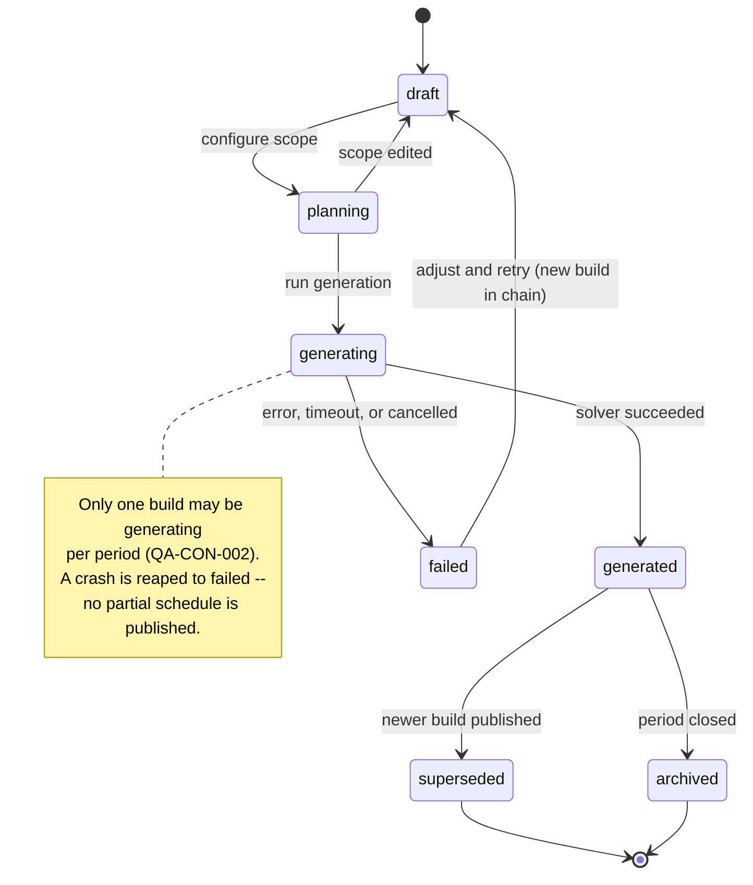
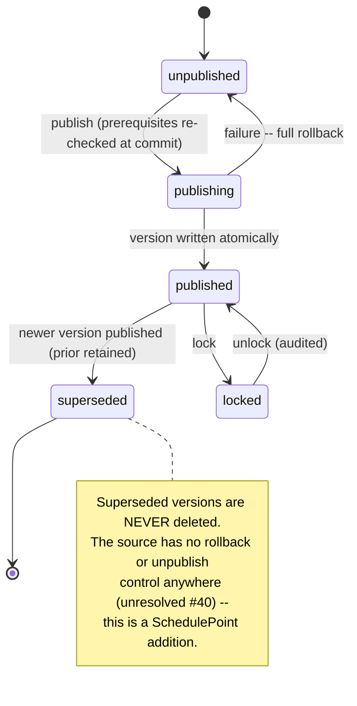
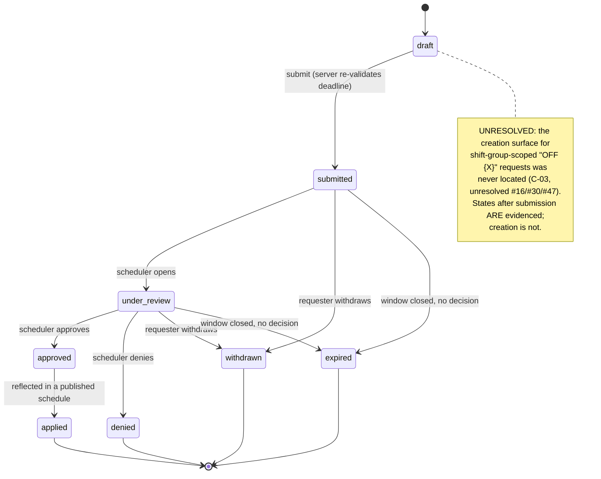
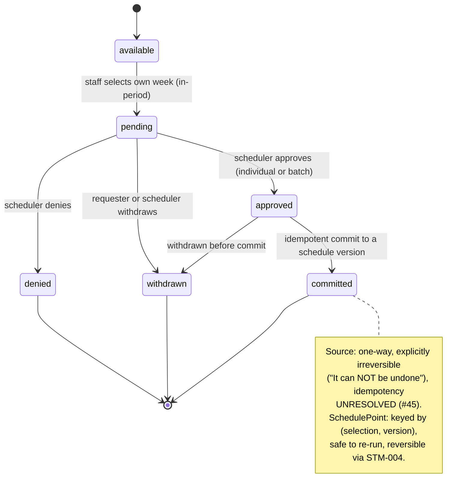
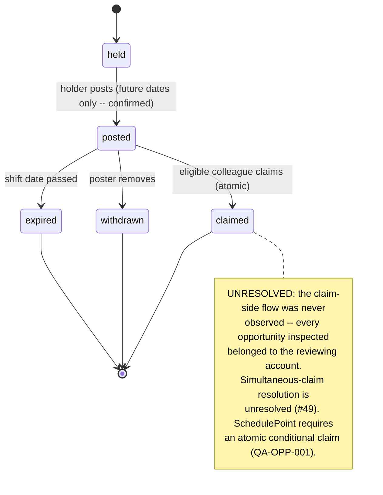
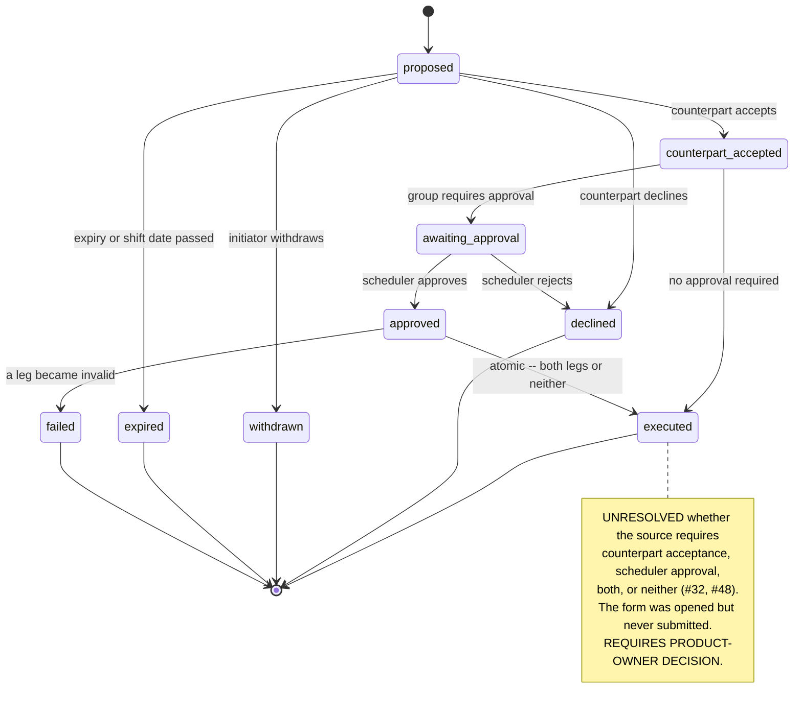
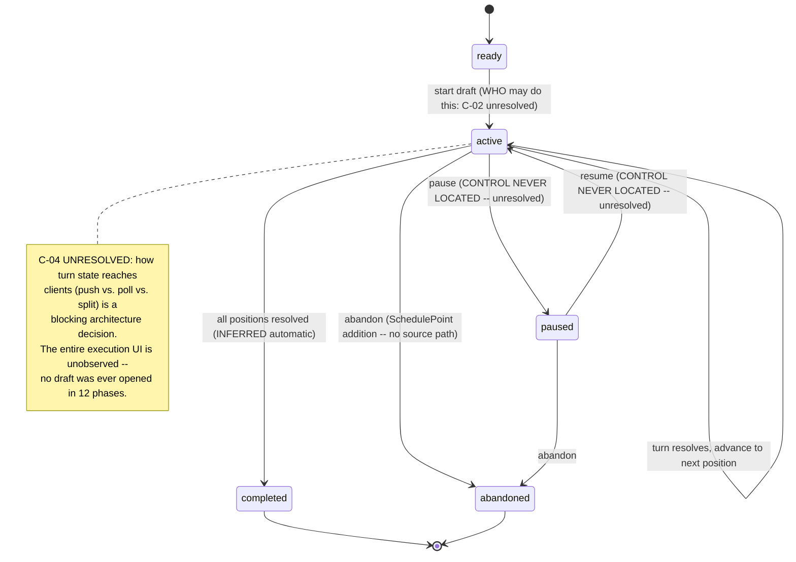
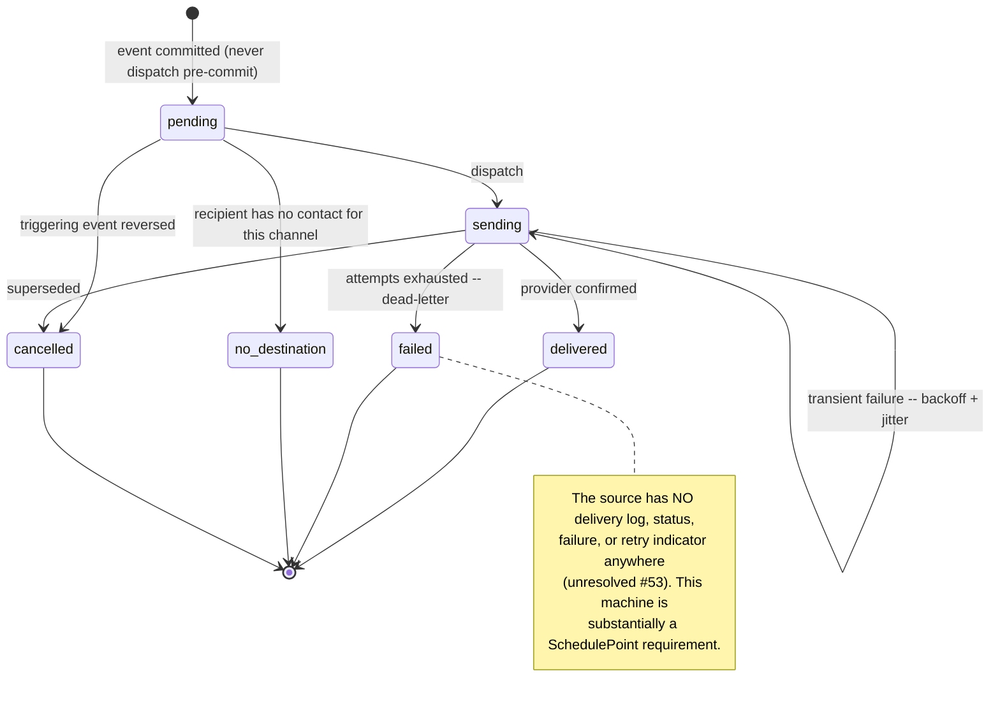
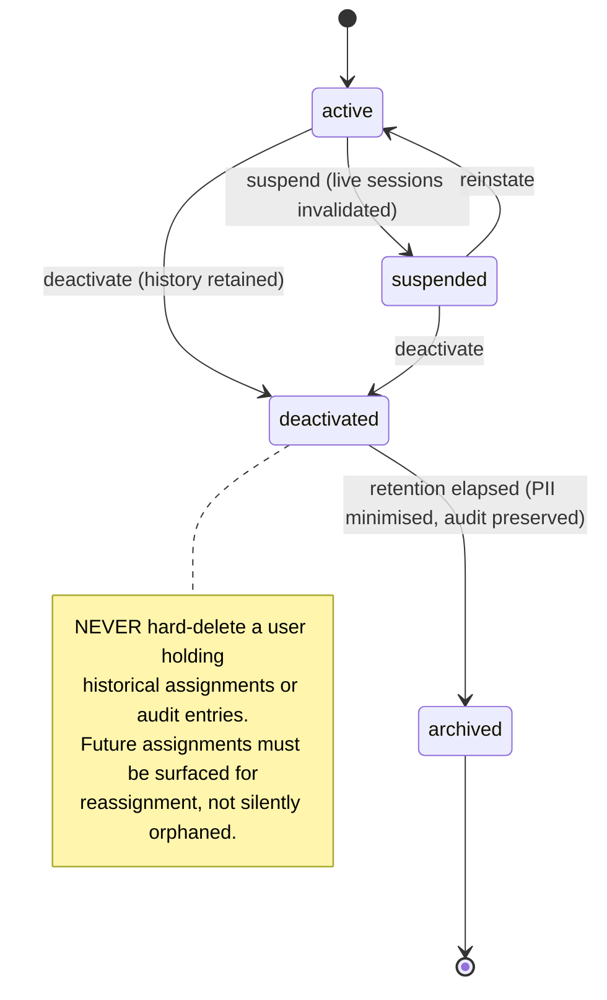

# 15 — State Machines: SchedulePoint (conceptual)

**Phase:** 13 — research consolidation. **Source:** reports 01–11 plus the final coverage audit. **No source-site navigation was performed in this phase.**

**Scope boundary:** these are **conceptual lifecycles**, not implementation designs. No API, endpoint, storage mechanism, or framework is specified.

**Honesty rule applied throughout:** where source behaviour was never observed, the diagram says so. **No transition was invented to make a diagram look complete.** Every machine separates (a) the confirmed portion, (b) the unresolved portion, (c) the recommended SchedulePoint design, and (d) any decision still owed by the product owner.

---

## Reading these machines

**Field key:** **Purpose** · **Actors** · **States** · **Initial** · **Terminal** · **Transitions** (with actor, precondition, server guard) · **Side effects** · **Audit** · **Notif** · **Invalid** = transitions that must be rejected · **Cancel** · **Expiry** · **Retry** · **Recovery** · **Concurrency** · **Idempotency** · **Ev** = source evidence · **Conf** = confidence · **Open** = unresolved decisions · **QA** = related QA cases.

**Universal rules** applying to every machine below, carried from the architectural requirements:

1. **Every transition is server-enforced.** A client may request a transition; only the server may effect one. No transition is ever authorised by UI state alone.
2. **Every transition is authorised against the actor's Membership** (ENT-006) in the owning Group, never against a client-supplied identifier (QA-TEN-005, QA-TEN-012).
3. **Every transition listed under "Audit" writes an AuditEvent** (ENT-040) naming actor, on-behalf-of, before/after, mechanism, and correlation id.
4. **Every state-changing transition is idempotent** under retry, keyed by an idempotency key (**SP-HR-2**, QA-CON-003).
5. **Every transition must be reachable by keyboard** and its outcome announced programmatically (**SP-HR-5**, **SP-HR-6**, QA-A11Y-003, QA-A11Y-004).
6. **Invalid transitions fail closed** with a generic user-facing message and a correlation id — never a stack trace (QA-SEC-007).

---

## Group 1 — Schedule generation and publication

### STM-001 · Schedule build
**Purpose:** take a Schedule Period from configuration to a generated candidate schedule.
**Actors:** scheduler · **Entity:** ENT-024 ScheduleBuild · **Feature:** FEAT-016
**States:** `draft` · `planning` · `generating` · `generated` · `failed` · `superseded` · `archived`
**Initial:** `draft` · **Terminal:** `superseded`, `archived`

| From → To | Actor | Precondition | Server guard |
|---|---|---|---|
| `draft` → `planning` | scheduler | scope (staff, shifts, rules) non-empty | period exists, not closed; caller has build capability |
| `planning` → `generating` | scheduler | plan current w.r.t. scope | **reject if scope changed since plan** |
| `generating` → `generated` | system | solver completed | writes BuildResult (ENT-025b) |
| `generating` → `failed` | system | solver error/timeout | records diagnostics; never partially persists |
| `draft`/`planning`/`generated` → `superseded` | system | a newer build in the chain published | prior build retained, never deleted |
| any → `archived` | scheduler | period closed | irreversible; content retained |

**Side effects:** `generated` produces a BuildResult plus RuleViolations (ENT-026b) — **why** the schedule looks as it does, which the source surfaces nowhere.
**Audit:** every transition. **Notif:** completion/failure to the initiating scheduler only.
**Invalid:** `generated` → `generating` without a new run; publishing a `failed` build; editing scope of a `generating` build.
**Cancel:** a `generating` build may be cancelled → `failed` with reason `cancelled`. **Expiry:** none.
**Retry:** re-running creates a **new** build in the chain, never mutates the old one.
**Recovery:** a crash during `generating` leaves the build in `generating`; a reaper transitions it to `failed` after a timeout. No partial schedule is ever published.
**Concurrency:** **only one build may be `generating` per period at a time** (QA-CON-002). **Idempotency:** re-submitting the same generate request returns the in-flight build.
**Ev:** 01-app ADM-02; 05-engine ADM-02, §2 · **Conf:** Med (controls OBSERVED; **no build was ever run**)
**Open:** the source exposes **only locked/not-locked** — no Draft/Running/Failed/Complete label exists (#43). The richer state set is a SchedulePoint requirement. `Planner` (#41) and `Fix Picks` were never opened; STM-002 replaces them with an explicit review stage.
**QA:** QA-SCH-001, QA-SCH-002, QA-SCH-007, QA-CON-002



### STM-002 · Schedule review
**Purpose:** let a human inspect, correct, and sign off a generated schedule before publication.
**Actors:** scheduler · **Entity:** ENT-024 + ENT-014 · **Feature:** FEAT-016, FEAT-012
**States:** `awaiting-review` · `in-review` · `changes-requested` · `approved-for-publication` · `rejected`
**Initial:** `awaiting-review` (on build `generated`) · **Terminal:** `approved-for-publication`, `rejected`

| From → To | Actor | Precondition | Server guard |
|---|---|---|---|
| `awaiting-review` → `in-review` | scheduler | build `generated` | review capability |
| `in-review` → `changes-requested` | scheduler | ≥1 correction made | corrections recorded as auditable edits |
| `changes-requested` → `in-review` | scheduler | corrections applied | re-validates hard rules |
| `in-review` → `approved-for-publication` | scheduler | **zero unresolved hard-rule violations** | **blocks if any hard violation remains** |
| `in-review` → `rejected` | scheduler | — | build → `failed`/`superseded` |

**Side effects:** corrections write Assignments with `origin = manual` and full provenance.
**Audit:** every correction and the sign-off. **Notif:** none until publication.
**Invalid:** approving with unresolved hard violations; editing after approval without returning to `in-review`.
**Concurrency:** two schedulers reviewing the same build must not silently overwrite — optimistic concurrency on each assignment (QA-SCH-008, QA-CON-001).
**Idempotency:** sign-off is idempotent; a repeated approval of the same build returns the existing approval rather than creating a second.
**Cancel:** a review may be abandoned by returning the build to `awaiting-review`; no partial sign-off is retained.
**Ev:** 01-app ADM-02 (`Fix Picks` stage exists as a label); 04-master §3 (the cell editor is the correction mechanism) · **Conf:** Low
**Open:** **the `Fix Picks` screen was never opened** — its actual capabilities are UNRESOLVED. This machine is a **SchedulePoint requirement** built on the sound idea the source's stage name implies, not on observed behaviour.
**QA:** QA-SCH-002, QA-SCH-005, QA-SCH-008

### STM-003 · Schedule publication
**Purpose:** make a reviewed schedule live and visible, as an immutable version.
**Actors:** scheduler · **Entity:** ENT-016 ScheduleVersion · **Feature:** FEAT-018, FEAT-019
**States:** `unpublished` · `publishing` · `published` · `superseded` · `locked`
**Initial:** `unpublished` · **Terminal:** `superseded`, `locked`

| From → To | Actor | Precondition | Server guard |
|---|---|---|---|
| `unpublished` → `publishing` | scheduler | review `approved-for-publication` | **re-checks prerequisites at commit time, not just at request time** (QA-SCH-002) |
| `publishing` → `published` | system | version written atomically | assigns `versionNumber`; prior version → `superseded` |
| `publishing` → `unpublished` | system | failure | **full rollback — no partial publication** |
| `published` → `superseded` | system | newer version published | **prior version retained, never deleted** |
| `published` → `locked` | scheduler | — | further edits blocked pending unlock |
| `locked` → `published` | scheduler | unlock capability | audited |

**Side effects:** staff-visible schedule changes; notifications to affected staff only (QA-NOT-008).
**Audit:** publication, supersession, lock, unlock — all mandatory.
**Notif:** **only after the transaction commits** (QA-NOT-009) — never from inside the transaction.
**Invalid:** publishing an incomplete or unreviewed schedule (QA-SCH-001); deleting a superseded version; two concurrent publications of the same period.
**Cancel:** possible only before `published`. **Expiry:** none.
**Retry:** idempotent on the same request key — a retry returns the existing version rather than creating a second one (QA-CON-003).
**Recovery:** a crash mid-publish rolls back entirely; the period remains on its prior published version.
**Concurrency:** **period-scoped serialisation** — two schedulers publishing the same period concurrently must not both succeed (QA-SCH-009, QA-CON-002).
**Idempotency:** **required.**
**Ev:** 01-app ADM-02; 04-master §8; 05-engine §3 · **Conf:** Low — **the Publish control was never clicked; its actual effect is INFERRED throughout**
**Open:** whether the source's Publish notifies anyone is UNRESOLVED. **SchedulePoint adds versioning and supersession, which the source lacks entirely.**
**QA:** QA-SCH-001, QA-SCH-002, QA-SCH-009, QA-SCH-012, QA-CON-002, QA-CON-010



### STM-004 · Published-schedule revision
**Purpose:** change an already-published schedule safely, preserving history.
**Actors:** scheduler · **Entity:** ENT-016 + ENT-014 · **Feature:** FEAT-019, FEAT-027
**States:** `stable` · `amending` · `amended` · `reverting` · `reverted`
**Initial:** `stable` · **Terminal:** `amended`, `reverted` (each returning to `stable`)

| From → To | Actor | Precondition | Server guard |
|---|---|---|---|
| `stable` → `amending` | scheduler | version `published`, not `locked` | amend capability |
| `amending` → `amended` | scheduler | changes valid | **creates a new version; the prior version is retained** |
| `amending` → `stable` | scheduler | cancelled | no changes persisted |
| `stable` → `reverting` | scheduler | a prior version exists | revert capability |
| `reverting` → `reverted` | system | — | **revert publishes a new version whose content matches the old one — it never deletes forward history** |

**Side effects:** targeted re-notification of affected staff only, never a broadcast (QA-SCH-011, QA-NOT-008).
**Audit:** every amendment and revert, with a diff.
**Invalid:** editing a `locked` version in place; reverting by deleting versions; silent amendment with no notification to affected staff.
**Concurrency:** optimistic concurrency per assignment; a stale amendment is rejected, not merged blindly (QA-CON-001).
**Idempotency:** amendment and revert are both keyed by request so a retry produces one new version, never two.
**Notif:** affected staff only, on `amended` or `reverted` — never a group-wide broadcast (QA-SCH-011, QA-NOT-008).
**Cancel:** an in-progress amendment may be discarded before commit, persisting nothing.
**Ev:** 04-master §8 — **no rollback or unpublish control was found anywhere in the source** (#40); post-publication cell edits *are* possible and audited · **Conf:** Med for the need, **SP-REQ** for the mechanism
**Open:** whether a locked build also blocks direct cell edits is UNRESOLVED (#38, deliberately untested).
**QA:** QA-SCH-011, QA-SCH-012, QA-SCH-015, QA-CON-001

---

## Group 2 — Requests, vacation, and approvals

### STM-005 · ON / OFF request (availability and shift-group requests)
**Purpose:** let staff ask to be (or not be) assigned particular work.
**Actors:** staff member, scheduler · **Entity:** ENT-018 Request · **Feature:** FEAT-020
**States:** `draft` · `submitted` · `under-review` · `approved` · `denied` · `withdrawn` · `expired` · `applied`
**Initial:** `draft` · **Terminal:** `approved`/`applied`, `denied`, `withdrawn`, `expired`

| From → To | Actor | Precondition | Server guard |
|---|---|---|---|
| `draft` → `submitted` | staff member | **within the request window** | **server re-validates the deadline — never trusts the client** (QA-REQ-001) |
| `submitted` → `under-review` | scheduler | — | approval capability in the same group |
| `under-review` → `approved` | scheduler | — | records Approval (ENT-025) |
| `under-review` → `denied` | scheduler | — | reason recorded |
| `submitted`/`under-review` → `withdrawn` | **requester only** | — | **distinct from `denied`** |
| `approved` → `applied` | system | schedule published for that date | assignment reflects the decision |
| `submitted`/`under-review` → `expired` | system | window closed without decision | configurable; must be explicit, not silent |

**Side effects:** an approved request constrains generation or produces an assignment change.
**Audit:** submission, decision, withdrawal, comment edits. **Notif:** requester on decision; scheduler on submission.
**Invalid:** approving one's own request without a separate capability; deciding after `withdrawn`; submitting after the deadline; a requester denying (only an approver denies) or an approver withdrawing (only a requester withdraws).
**Cancel:** `withdrawn` by the requester at any pre-terminal state.
**Expiry:** governed by the group's request deadline.
**Concurrency:** **two schedulers deciding the same request concurrently — first decision wins, second is rejected with a clear conflict message** (QA-REQ-005). Where approval consumes limited capacity, the check and the decision must be atomic (QA-REQ-008).
**Idempotency:** required — a double-submitted request must not create two records (**SP-HR-2**, QA-REQ-013).
**Ev:** 01-app SCH-01, ADM-08; 03-user WF-08/09/10; 06-requests LC-01, LC-02 · **Conf:** Med for status, **Low for creation**
**Open:** **C-03 (blocking product definition).** Two request shapes exist; the shift-group-scoped "OFF {X}" **creation surface was never located after four phases of search** (#16/#30/#47), and it is unresolved whether the two withdrawal surfaces act on one record or two (#31). *Confirmed:* the status vocabulary and full history (back to 2022, untruncated). *Unresolved:* creation, and whether one entity or two. *Recommended:* one entity, typed, one lifecycle, multiple views. **Pending product-owner approval.**
**QA:** QA-REQ-001..006, QA-REQ-013



### STM-006 · Time-off request
**Purpose:** the time-off-typed instance of STM-005, distinguished by its interaction with vacation entitlement.
**Actors:** staff member, scheduler · **Entity:** ENT-018 (`type = time-off`) · **Feature:** FEAT-020, FEAT-021
**States:** `draft` · `submitted` · `under-review` · `approved` · `denied` · `withdrawn` · `expired` · `applied` *(identical to STM-005 — this is the time-off-typed instance, not a separate vocabulary)*
**Initial:** `draft` · **Terminal:** `approved`/`applied`, `denied`, `withdrawn`, `expired`
**Transitions:** as STM-005, with two additional guards:
- `draft` → `submitted` additionally checks **remaining entitlement** (ENT-021b) unless negative balances are permitted by policy.
- `under-review` → `approved` additionally checks **weekly capacity**, which in the source is **advisory, not blocking** — over-quota turns red but does not prevent approval.

**Side effects:** on approval, decrements the requester's balance; on withdrawal or denial after approval, restores it.
**Audit:** as STM-005, **plus every balance adjustment** with its triggering decision — an entitlement change with no audit trail is indistinguishable from a bug.
**Invalid:** approving beyond entitlement when the group forbids negative balances; decrementing a balance twice for one decision; approving a request whose vacation period has closed.
**Concurrency:** **balance decrement and approval must be atomic** — two approvals racing on the last unit of entitlement must not both succeed (QA-REQ-008, QA-CON-004).
**Idempotency:** balance adjustments keyed to the decision, never applied twice on retry.
**Notif:** as STM-005 — requester on decision, scheduler on submission.
**Cancel:** `withdrawn` by the requester at any pre-terminal state, restoring any decremented balance.
**Ev:** 01-app VAC-01/02; 06-requests LC-01 · **Conf:** High
**Open:** whether approval notifies anyone is UNRESOLVED (#50).
**QA:** QA-REQ-002, QA-REQ-007, QA-REQ-008, QA-CON-004

### STM-007 · Vacation selection and approval
**Purpose:** the full lifecycle of one staff member's claim on one vacation week, through to its commit into the schedule.
**Actors:** staff member, scheduler · **Entity:** ENT-019 VacationSelection · **Feature:** FEAT-021, FEAT-022
**States:** `available` · `pending` · `approved` · `denied` · `withdrawn` · `committed`
**Initial:** `available` (an empty week cell) · **Terminal:** `denied`, `withdrawn`, `committed`

| From → To | Actor | Precondition | Server guard |
|---|---|---|---|
| `available` → `pending` | staff member | week within the open Vacation Period; own row only | **server validates period bounds and row ownership** |
| `pending` → `approved` | scheduler | — | individually **or via date-range batch** |
| `pending` → `denied` | scheduler | — | reason recorded |
| `pending`/`approved` → `withdrawn` | requester or scheduler | not yet `committed` | **`withdrawn` ≠ `denied`; both are separately audited** |
| `approved` → `committed` | scheduler | commit operation over a date range | **idempotent** — see below |

**Side effects:** `committed` writes OFF Assignments into a new ScheduleVersion (ENT-016).
**Audit:** every transition; **the commit especially**, recording which version received it.
**Notif:** requester on decision (UNRESOLVED in the source).
**Invalid:** committing a `pending` selection; withdrawing after commit (that requires a schedule revision, STM-004); selecting on another person's row.
**Cancel:** `withdrawn` pre-commit. **Expiry:** the period closing may expire undecided selections — must be explicit.
**Retry / Idempotency:** **critical.** The source's transfer is explicitly irreversible (*"It can NOT be undone"*) and its idempotency is **UNRESOLVED** (#45) — re-running over an already-transferred range might duplicate. **SchedulePoint's commit is keyed by (selection, target version) and is safe to re-run.**
**Recovery:** because commit produces a new version, an erroneous commit is corrected by STM-004 revert — not by a destructive undo.
**Concurrency:** batch approval and individual approval racing on the same selection — first wins, second is a no-op (QA-REQ-009).
**Idempotency:** **mandatory on commit** — keyed by (selection, target version), so re-running a range commit cannot duplicate OFF assignments. This is the direct fix for the source's unresolved idempotency (#45).
**Ev:** 01-app VAC-01/02; 06-requests LC-01, LC-01a, LC-01b · **Conf:** High for selection/approval, Med for commit
**Open:** amber/green badge semantics INFERRED (#6); `Remove` vs `Deny` server effects UNRESOLVED (WF-09). **The source couples inspection and deletion on one click target (FEAT-047) — SchedulePoint must not.**
**QA:** QA-REQ-007..014, QA-CON-003



---

## Group 3 — Shift marketplace

### STM-008 · Shift opportunity (one-to-many give-away)
**Purpose:** offer an assignment to any eligible colleague.
**Actors:** staff member (poster), staff member (claimant), scheduler · **Entity:** ENT-026 Opportunity · **Feature:** FEAT-025
**States:** `held` · `posted` · `claimed` · `withdrawn` · `expired`
**Initial:** `held` · **Terminal:** `claimed`, `withdrawn`, `expired`

| From → To | Actor | Precondition | Server guard |
|---|---|---|---|
| `held` → `posted` | assignment holder | **future date only** | server re-validates the date and ownership |
| `posted` → `claimed` | eligible colleague | **eligibility + rule compliance re-checked at claim time** | **atomic conditional claim** — see concurrency |
| `posted` → `withdrawn` | original poster | not yet claimed | |
| `posted` → `expired` | system | shift date passed | |

**Side effects:** `claimed` reassigns the Assignment (and, per policy, the Credit — ENT-017) and writes provenance.
**Audit:** post, claim, withdraw, expiry. **Notif:** poster on claim; eligible staff on post (UNRESOLVED in the source).
**Invalid:** posting a past assignment (**confirmed: the source hides the control on past dates**); claiming one's own posting; claiming after withdrawal; a claim that would violate rest, qualification, or overlap rules.
**Cancel:** `withdrawn` by the poster pre-claim.
**Concurrency:** **the critical case.** Two colleagues claiming simultaneously must resolve to exactly one winner via an atomic conditional update; the loser gets a clear "already claimed" message, **not** a silent failure or a double assignment (QA-OPP-001, QA-CON-004).
**Idempotency:** a double-clicked claim must not produce two claims (**SP-HR-2**, QA-OPP-008).
**Ev:** 01-app SCH-01; 03-user WF-11/12; 06-requests LC-03; 04-master §3.3 (audit wording confirms server-side "opportunity" terminology) · **Conf:** Med for post/withdraw, **Low for claim**
**Open:** *Confirmed:* posting trigger, future-date restriction, the board, poster-side removal, and that claiming produces an audit entry. *Unresolved:* **the entire claim-side UI and flow were never observed** — every opportunity inspected belonged to the reviewing account (a single-account limitation, not an effort gap). Race resolution is UNRESOLVED (#49); Locum eligibility restrictions UNRESOLVED. *Recommended:* atomic conditional claim with re-validation at claim time.
**QA:** QA-OPP-001..008, QA-CON-004



### STM-009 · Shift offer (directed, one-to-one)
**Purpose:** offer an assignment to one named colleague who must respond.
**Actors:** offerer, recipient, scheduler · **Entity:** ENT-027 ShiftOffer · **Feature:** FEAT-026
**States:** `proposed` · `accepted` · `declined` · `withdrawn` · `expired`
**Initial:** `proposed` · **Terminal:** all others

| From → To | Actor | Precondition | Server guard |
|---|---|---|---|
| `proposed` → `accepted` | recipient only | **eligibility re-validated at acceptance** | reassignment must not violate rules |
| `proposed` → `declined` | recipient only | | |
| `proposed` → `withdrawn` | offerer only | not yet answered | |
| `proposed` → `expired` | system | expiry or shift date passed | |

**Audit:** all transitions. **Notif:** recipient on proposal; offerer on response.
**Invalid:** a third party accepting; accepting after withdrawal; accepting when it would breach rest/qualification rules (QA-OPP-010).
**Concurrency:** offerer withdrawal racing recipient acceptance — exactly one wins.
**Idempotency:** required — a double-clicked acceptance must produce one acceptance (**SP-HR-2**).
**Cancel:** `withdrawn` by the offerer while still `proposed`.
**Ev:** 03-user WF-13; 06-requests LC-04 · **Conf:** **Low**
**Open:** **the source conflates offer, swap, and transfer** (TERM-055). *Confirmed:* a Swap Shift modal exists with an own-picks checklist and a counterpart selector. *Unresolved:* **whether acceptance, scheduler approval, both, or neither is required was never determined** (#32, #48) — the form was never submitted, and no swap-shaped record ever appeared in request history. *Recommended:* counterpart acceptance required; scheduler approval configurable per group. **REQUIRES DECISION.**
**QA:** QA-OPP-009, QA-OPP-010

### STM-010 · Shift swap (mutual exchange)
**Purpose:** two staff members exchange assignments atomically.
**Actors:** initiator, counterpart, scheduler · **Entity:** ENT-028 ShiftSwap · **Feature:** FEAT-026
**States:** `proposed` · `counterpart-accepted` · `awaiting-approval` · `approved` · `executed` · `declined` · `withdrawn` · `expired` · `failed`
**Initial:** `proposed` · **Terminal:** `executed`, `declined`, `withdrawn`, `expired`, `failed`

| From → To | Actor | Precondition | Server guard |
|---|---|---|---|
| `proposed` → `counterpart-accepted` | counterpart | — | both legs re-validated |
| `counterpart-accepted` → `awaiting-approval` | system | group requires approval | skipped if not required |
| `awaiting-approval` → `approved` | scheduler | — | |
| `approved`/`counterpart-accepted` → `executed` | system | **both legs still valid** | **atomic — both assignments swap or neither does** |
| any pre-terminal → `declined`/`withdrawn`/`expired` | respective actor / system | — | |
| `executed` attempt → `failed` | system | a leg became invalid | **no partial swap is ever persisted** |

**Side effects:** two Assignments exchange holders in one transaction; both are audited.
**Audit:** every transition, and **both assignment legs on execution**, each naming the swap that caused it.
**Invalid:** **any outcome where one leg moved and the other did not.**
**Concurrency:** either assignment being independently reassigned mid-flow must invalidate the swap rather than produce a half-swap (QA-OPP-011).
**Idempotency:** required on execution.
**Notif:** counterpart on proposal; initiator on response; both parties on execution or failure.
**Cancel:** `withdrawn` by the initiator before the counterpart accepts; either party may decline.
**Ev:** 03-user WF-13 (the multi-select checklist implies a genuine exchange, not a give-away) · **Conf:** Low
**Open:** as STM-009 — the approval model is **UNRESOLVED**. **REQUIRES DECISION.**
**QA:** QA-OPP-009, QA-OPP-010, QA-OPP-011



### STM-011 · Transfer approval
**Purpose:** the approval sub-lifecycle shared by offers, swaps, and administrative transfers.
**Actors:** scheduler · **Entity:** ENT-025 Approval · **Feature:** FEAT-021, FEAT-026, FEAT-027
**States:** `not-required` · `pending` · `approved` · `rejected` · `auto-approved`
**Initial:** `not-required` or `pending` (policy-determined) · **Terminal:** `approved`, `rejected`, `auto-approved`

| From → To | Actor | Precondition | Server guard |
|---|---|---|---|
| `pending` → `approved` | scheduler | approval capability | **the approver must not be the requester** unless explicitly permitted |
| `pending` → `rejected` | scheduler | | reason recorded |
| `pending` → `auto-approved` | system | policy permits | policy decision recorded, not silent |

**Audit:** every decision, including auto-approvals — an auto-approval that leaves no record is indistinguishable from a missing check.
**Invalid:** approving one's own request unless explicitly permitted by policy; deciding an already-decided item; auto-approving without recording the policy that permitted it.
**Concurrency:** two approvers deciding concurrently — first wins (QA-REQ-005).
**Idempotency:** a resubmitted decision returns the recorded one rather than overwriting it.
**Notif:** requester on decision; approver on a pending item entering their queue.
**Cancel:** a pending approval is cancelled if its underlying subject is withdrawn.
**Ev:** 01-app VAC-01/02 ("Approval Required By Scheduler"); 06-requests LC-01a · **Conf:** Med for vacation, **Low elsewhere**
**Open:** the source has an explicit approval toggle for **vacation only**; **no equivalent was found for swaps or transfers** (06-requests LC-04), which is part of why STM-009/STM-010 remain undecided.
**QA:** QA-REQ-005, QA-REQ-009, QA-OPP-010

---

## Group 4 — Picklist system

> **⚠ Both blocking contradictions live in this group.** `C-02` (permission model) governs *who may operate* these machines; `C-04` (real-time vs. polling) governs *how state reaches clients*. **Neither is resolved.** Every machine below is specified as far as the evidence allows and stops honestly where it does not.

### STM-012 · Picklist preparation
**Purpose:** assemble a day's draft — participants in turn order, and the pool of work items — before execution begins.
**Actors:** scheduler · **Entity:** ENT-029 Picklist · **Feature:** FEAT-030
**States:** `draft` · `ready` · `cancelled`
**Initial:** `draft` · **Terminal:** `cancelled` (or handoff to STM-013 at `ready`)

| From → To | Actor | Precondition | Server guard |
|---|---|---|---|
| *(none)* → `draft` | scheduler | date not already drafted | **must stage, never commit on click** — see below |
| `draft` → `draft` | scheduler | — | add/edit/reorder work items; re-sync participants |
| `draft` → `ready` | scheduler | ≥1 participant **and** ≥1 work item | **validates completeness before allowing execution** |
| `draft`/`ready` → `cancelled` | scheduler | not yet started | audited; **no delete control exists post-completion in the source** |

**Side effects:** participant order is **derived from the published schedule**, not authored here — the source states this explicitly on screen.
**Audit:** creation, every work-item change, participant re-sync, cancellation.
**Notif:** none until execution. **Invalid:** starting with zero work items or zero participants; editing after `ready` without returning to `draft`.
**Concurrency:** two schedulers editing the same draft — optimistic concurrency per work item (QA-PICK-002).
**Idempotency:** **critical for the create path — see below.**
**Cancel:** `cancelled` while `draft` or `ready`; **the source offers no delete path once a picklist completes.**
**Ev:** 07-picklist §0, §1 · **Conf:** Med
**Open:** *(confirmed / unresolved / recommended)*
- *Confirmed:* two statuses exist in live data (`ON HOLD`, `COMPLETED`); import is an **erase-and-resync from an internal source, not a file upload**; locking removes controls from the DOM entirely; participant order is derived from the schedule and not editable here.
- *Unresolved:* the actual OR-slate ingestion mechanism was never located (#52); `Add Blank`'s behaviour was downgraded to UNRESOLVED after the §0 incident.
- **Recommended (from the safety incident):** **no control labelled Add/New/Create may persist anything before an explicit, separate Save.** The source's "Add Room" created a live record on a single click with no draft stage — contradiction **C-05**, feature **FEAT-048**, the cause of the only safety incident in the entire research effort.
**QA:** QA-PICK-001, QA-PICK-002, QA-PICK-003, QA-PICK-015

```mermaid
stateDiagram-v2
    [*] --> draft: create (MUST stage, not commit -- C-05/FEAT-048)
    draft --> draft: add/edit/reorder work items; re-sync participants
    draft --> ready: validate (>=1 participant AND >=1 work item)
    ready --> draft: reopen for editing
    draft --> cancelled: cancel
    ready --> cancelled: cancel
    cancelled --> [*]
    ready --> [*]: hand off to STM-013 execution
    note right of draft
        SOURCE DEFECT: "Add Room" committed a live
        record on a single click, no draft state.
        SchedulePoint must stage then Save.
    end note
```

### STM-013 · Picklist execution ⚠ **C-02 and C-04 both unresolved**
**Purpose:** run the live turn-based draft.
**Actors:** participant, proxy, scheduler · **Entity:** ENT-029 + ENT-030 · **Feature:** FEAT-032
**States:** `ready` · `active` · `paused` · `completed` · `abandoned`
**Initial:** `ready` · **Terminal:** `completed`, `abandoned`

| From → To | Actor | Precondition | Server guard |
|---|---|---|---|
| `ready` → `active` | scheduler | preparation valid | **⚠ who may do this depends on C-02** |
| `active` → `active` | system | a turn resolves | advance to the next eligible position |
| `active` → `paused` | scheduler | — | **⚠ no pause control was ever located** |
| `paused` → `active` | scheduler | — | **⚠ unresolved** |
| `active` → `completed` | system | all positions resolved | INFERRED automatic — no explicit Complete control exists |
| `active`/`paused` → `abandoned` | scheduler | — | **SchedulePoint requirement**; the source has no such path |

**Side effects:** each resolved turn produces a Pick (ENT-032) and ultimately an Assignment tagged with picklist provenance.
**Audit:** start, every turn start, every pick, every skip, every proxy action, completion.
**Notif:** the escalation ladder (STM-015/STM-016) fires on turn start.
**Invalid:** picking out of turn; picking after the turn expires; two participants active simultaneously; completing with unresolved positions.
**Cancel:** `abandoned` — **a SchedulePoint addition**; the source offers no way to abandon a started draft.
**Expiry:** per-turn time limits are **INFERRED** from the existence of `Alert Pick Time` / `Alert Average Pick Time` / `Action Time` settings — **no timer UI was ever observed.**
**Retry / Recovery:** a client disconnecting mid-turn must not lose the turn; the server, not the client, owns turn state and the clock (QA-PICK-012).
**Concurrency:** severe. Turn ownership must be server-authoritative; two clients acting for one participant (user + proxy) must resolve to one pick (QA-PICK-005, QA-PICK-011).
**Idempotency:** **mandatory** — a double-submitted pick must produce one Pick (**SP-HR-2**, QA-PICK-011).
**Ev:** 07-picklist §2 — **every row of that section is INFERRED or UNRESOLVED**; final-coverage-audit §12 (a live picklist was confirmed to exist but deliberately not opened) · **Conf:** **Low**
**Open:**
- *Confirmed:* `Start List` exists on non-started rows; participant order matches the schedule's pick positions exactly; two terminal-ish statuses exist in live data; a live draft renders an aggregate "pick N of M" progress state on the staff-facing screen.
- *Unresolved:* **the entire execution UI.** Current-picker presentation, timer display, room-selection control, confirmation step, failure/retry, skip-on-timeout, pause/resume existence, and automatic advancement were **never observed** — across twelve phases no draft was ever open, and when one finally was (during the coverage audit) it was deliberately left untouched per that phase's brief.
- **⚠ C-02 (BLOCKING):** *who* may start, pause, or intervene in a draft cannot be specified, because the source's own `Picklist Admin` flag demonstrably did not gate picklist administration. **Options:** (a) role-only capability; (b) role + tested granular grant; (c) copy the source model. **Recommended: (b)** — every grant must have a passing authorization test or it does not ship. **(c) is rejected.** **Pending product-owner approval.**
- **⚠ C-04 (BLOCKING):** *how* turn state reaches clients cannot be specified. A real-time hub named `picklist` connects on every page load, yet the UI presents a staleness indicator and a manual refresh control. **Options:** (a) full push; (b) full polling with explicit refresh; (c) split — push for turn-critical state, explicit refresh for administrative lists. **Recommended: (c)**, with real-time connections scoped per page rather than opened globally. **Pending product-owner approval.**
**QA:** QA-PICK-005..014, QA-CON-004, QA-A11Y-014



### STM-014 · Room (work-item) selection
**Purpose:** the per-turn lifecycle by which one participant claims one work item.
**Actors:** participant or their proxy · **Entity:** ENT-030 + ENT-031 + ENT-032 · **Feature:** FEAT-032
**States:** `waiting` · `turn-active` · `selecting` · `pick-recorded` · `skipped` · `timed-out`
**Initial:** `waiting` · **Terminal:** `pick-recorded`, `skipped`, `timed-out`

| From → To | Actor | Precondition | Server guard |
|---|---|---|---|
| `waiting` → `turn-active` | system | prior turn resolved; participant not excluded | **server owns the turn clock**, never the client |
| `turn-active` → `selecting` | participant/proxy | — | presentation only |
| `selecting` → `pick-recorded` | participant/proxy | item still available | **atomic conditional claim on the work item** |
| `turn-active` → `skipped` | system/scheduler | position excluded, or scheduler skips | audited with reason |
| `turn-active` → `timed-out` | system | turn limit elapsed | **INFERRED — no timer was ever observed** |

**Side effects:** `pick-recorded` marks the work item `taken` and produces an Assignment.
**Audit:** turn start, the selection itself (naming both the participant and the acting proxy where they differ), skips with reason, and timeouts.
**Invalid:** selecting an already-taken item; selecting outside one's turn; a proxy acting without an `act-on-behalf` authorization (ENT-010) — **which the source never distinguished** (TERM-019).
**Concurrency:** **the sharpest case in the product.** Two actors (participant and proxy) selecting simultaneously, or a selection landing exactly as the turn expires, must resolve deterministically to one outcome (QA-PICK-005, QA-PICK-006).
**Idempotency:** mandatory (**SP-HR-2**).
**Accessibility:** **the turn allowance must be achievable using assistive technology** — a timed workflow that a screen-reader user cannot complete is an exclusion, not an inconvenience (**SP-HR-5**, QA-A11Y-014).
**Notif:** turn-start notification via STM-015/STM-016; no notification on selection itself.
**Cancel:** a participant cannot cancel their own turn; a scheduler may skip it, which is audited with a reason.
**Ev:** 07-picklist §2 — the room-selection Mermaid diagram in that report is explicitly labelled *"fully inferred — no live room-selection UI was ever observed"* · **Conf:** **Low**
**Open:** as STM-013. Whether a confirmation step exists between selection and commit is **UNRESOLVED and cannot be assumed either way** — the source contains a proven instant-commit control elsewhere (FEAT-048), so neither behaviour is a safe default.
**QA:** QA-PICK-005, QA-PICK-006, QA-PICK-009, QA-PICK-011, QA-A11Y-014

---

## Group 5 — Notifications

### STM-015 · Notification delivery and retry
**Purpose:** deliver one message to one recipient, with a recorded outcome.
**Actors:** system · **Entity:** ENT-034 + ENT-035b · **Feature:** FEAT-040
**States:** `pending` · `sending` · `delivered` · `failed` · `no-destination` · `cancelled`
**Initial:** `pending` · **Terminal:** `delivered`, `failed`, `no-destination`, `cancelled`

| From → To | Actor | Precondition | Server guard |
|---|---|---|---|
| `pending` → `sending` | system | **the triggering transaction has committed** | **never dispatch from inside a transaction** (QA-NOT-009) |
| `sending` → `delivered` | system | provider confirmed | attempt recorded |
| `sending` → `failed` | system | attempts exhausted | **dead-letter, not silent discard** |
| `sending` → `sending` | system | transient failure | retry with exponential backoff + jitter |
| `pending` → `no-destination` | system | recipient has no contact for the channel | **explicit outcome, never a silent skip** |
| `pending`/`sending` → `cancelled` | system | the triggering event was reversed | e.g. a turn resolved before escalation fired |

**Side effects:** each attempt writes a NotificationAttempt with channel, outcome, and provider reference.
**Audit:** creation and final outcome. **Invalid:** delivering to a deactivated user or one outside the group (QA-NOT-006); dispatching before commit; retrying a `delivered` notification.
**Retry:** bounded, backed off, jittered; exhaustion is terminal and visible.
**Recovery:** a dead-letter queue that an operator can inspect and replay.
**Concurrency:** background job retries must not send duplicates (QA-NOT-010, QA-CON-009).
**Idempotency:** **mandatory** — keyed per (notification, channel, attempt) (**SP-HR-2**).
**Notif:** this machine *is* the notification — it does not itself notify.
**Cancel:** `cancelled` when the triggering event is reversed before dispatch (e.g. a turn resolves first).
**Ev:** 07-picklist §3 · **Conf:** **Low for the source** — *(confirmed:* channels, ladders, and configuration surfaces exist; *unresolved:* **the source has no delivery log, status, failure, or retry indicator anywhere in the product** (#53), and accounts with no phone number would leave a voice channel with nothing to dial, with no observed warning)*
**Open:** this machine is **substantially a SchedulePoint requirement**, not an observation. A notification system with no delivery visibility cannot be operated.
**QA:** QA-NOT-004..012, QA-CON-009



### STM-016 · Notification escalation
**Purpose:** progressively widen contact attempts until the recipient acts or the ladder is exhausted.
**Actors:** system · **Entity:** ENT-035 EscalationPolicy · **Feature:** FEAT-040
**States:** `idle` · `step-active` · `escalating` · `resolved` · `exhausted` · `suppressed`
**Initial:** `idle` · **Terminal:** `resolved`, `exhausted`, `suppressed`

| From → To | Actor | Precondition | Server guard |
|---|---|---|---|
| `idle` → `step-active` | system | trigger fires | **selects the business-hours or personal-hours ladder by the recipient's local time** |
| `step-active` → `escalating` | system | step offset elapsed, unresolved | dispatches the next step's channels |
| `escalating` → `step-active` | system | further steps remain | |
| any → `resolved` | recipient/proxy | the underlying action was taken | **cancels all pending steps** |
| `escalating` → `exhausted` | system | ladder complete, unresolved | raises an operational alert |
| `idle`/`step-active` → `suppressed` | system | quiet hours or admin lock | recorded, not silent |

**Side effects:** each step creates Notifications (STM-015) — **the ladder does not deliver; it schedules.**
**Audit:** ladder selection (which window applied and why), each step fired, resolution, exhaustion, and suppression — suppression especially, since a silently suppressed escalation is indistinguishable from a delivery failure.
**Invalid:** continuing to escalate after resolution; escalating outside the permitted window; escalating to a locked recipient.
**Concurrency:** resolution racing the next step must cancel it cleanly (QA-NOT-011).
**Idempotency:** a step must fire once even if the scheduler runs twice (QA-CON-009).
**Notif:** this machine schedules notifications rather than sending them; delivery is STM-015.
**Cancel:** resolution cancels all pending steps immediately (QA-NOT-011).
**Ev:** 01-app PL-02, ADM-01; 07-picklist §3 · **Conf:** **High for structure** (two ladders, ordered offset/channel steps, four channels, group default with per-user override), **Low for runtime** (never observed firing)
**Open:** two-tier override is **inferred** from the "Load Defaults" affordance, never tested. Timezone handling is unspecified in the source — SchedulePoint resolves ladder windows against the group's timezone (QA-DATE-004, QA-NOT-003).
**QA:** QA-NOT-001, QA-NOT-002, QA-NOT-003, QA-NOT-011

---

## Group 6 — Identity and account lifecycle

### STM-017 · User invitation and activation
**Purpose:** bring a new person into an organization and group.
**Actors:** administrator, invitee · **Entity:** ENT-004 + ENT-006 · **Feature:** FEAT-005, FEAT-008
**States:** `invited` · `active` · `invitation-expired` · `invitation-revoked`
**Initial:** `invited` · **Terminal:** `active`, `invitation-expired`, `invitation-revoked`

| From → To | Actor | Precondition | Server guard |
|---|---|---|---|
| *(none)* → `invited` | administrator | email not already a member of this group | invite token issued, **single-use and expiring** |
| `invited` → `active` | invitee | token valid and unexpired | **token consumed atomically — a replayed token must fail** (QA-AUTH-004) |
| `invited` → `invitation-expired` | system | validity elapsed | |
| `invited` → `invitation-revoked` | administrator | not yet accepted | token invalidated immediately |

**Audit:** invitation, acceptance, expiry, revocation. **Notif:** invitation and reminders to the invitee.
**Invalid:** reusing a consumed token; activating a revoked invitation; an invitation granting a role the inviter cannot themselves grant.
**Concurrency:** two administrators inviting the same email to the same group concurrently must produce one invitation, not two; token consumption must be atomic so a token clicked twice in quick succession activates once (**SP-HR-2**).
**Idempotency:** required on both invite and activation.
**Cancel:** `invitation-revoked` by an administrator at any point before acceptance.
**Ev:** 01-app ADM-05 (an "Add User" control exists — **never clicked**) · **Conf:** **Low** — *(confirmed:* the control exists; *unresolved:* **the entire invitation and activation flow was never observed**, consistent with the login flow never being observed either)*
**Open:** this machine is **almost entirely a SchedulePoint requirement.** The research provides essentially no evidence here — which is a clean-room advantage, not a loss.
**QA:** QA-AUTH-004, QA-AUTH-011

### STM-018 · User suspension, deactivation, and archive
**Purpose:** remove access safely while preserving historical integrity.
**Actors:** administrator · **Entity:** ENT-004 + ENT-006 · **Feature:** FEAT-005
**States:** `active` · `suspended` · `deactivated` · `archived`
**Initial:** `active` · **Terminal:** `archived`

| From → To | Actor | Precondition | Server guard |
|---|---|---|---|
| `active` → `suspended` | administrator | — | **all live sessions invalidated immediately** (QA-AUTH-005) |
| `suspended` → `active` | administrator | — | audited |
| `active`/`suspended` → `deactivated` | administrator | — | membership ends; **historical assignments and audit entries are retained** |
| `deactivated` → `archived` | administrator/system | retention policy elapsed | PII minimised; **audit history preserved** |

**Side effects:** future assignments must be explicitly reassigned — **deactivation must surface them rather than silently orphaning them.**
**Audit:** every transition. **Notif:** the affected user, and schedulers holding their future assignments.
**Invalid:** **hard-deleting a user who holds historical assignments or audit entries**; leaving a suspended user with a live session; archiving while future assignments remain unreassigned.
**Recovery:** reactivation restores access but never silently restores past memberships.
**Concurrency:** deactivation racing an in-flight action by that same user (a pick, an approval, a request) must resolve deterministically — the server re-checks membership status at commit, so a deactivated user's in-flight write fails closed rather than landing after their access ended.
**Idempotency:** repeated deactivation is a no-op, not an error.
**Cancel:** suspension is reversible via reinstatement; **deactivation and archive are not** — they are forward-only by design.
**Ev:** 01-app ADM-05 (a "Remove" control exists — **never clicked**) · **Conf:** **Low** — *(unresolved:* whether the source's Remove is a hard delete or a deactivation, and its effect on a live session (#QA-AUTH-005))*
**Open:** **SchedulePoint requires deactivation, not deletion**, precisely because the source's semantics are unknown and hard deletion would destroy audit integrity.
**QA:** QA-AUTH-005, QA-AUTH-011, QA-TEN-004



### STM-019 · Proxy authorization
**Purpose:** govern delegation of notifications or acting authority between two members of the same group.
**Actors:** grantor, grantee, administrator · **Entity:** ENT-010 · **Feature:** FEAT-034
**States:** `none` · `active` · `suspended-by-admin` · `revoked` · `expired`
**Initial:** `none` · **Terminal:** `revoked`, `expired`

| From → To | Actor | Precondition | Server guard |
|---|---|---|---|
| `none` → `active` | grantor | grantee is in the same group; grantor not admin-locked | **`scope` must be explicit: notifications-only or act-on-behalf** |
| `active` → `revoked` | grantor or administrator | — | immediate |
| `active` → `suspended-by-admin` | administrator | — | the source's `Proxy Locked` flag |
| `active` → `expired` | system | validity elapsed | |

**Side effects:** while `active`, notifications route to the grantee; if `scope = act-on-behalf`, the grantee may act, and **every such action records both the actor and the grantor** (ENT-040 `onBehalfOfMembershipId`).
**Audit:** grant, every use, suspension, revocation.
**Concurrency:** **the sharp case** — a grantor acting at the same moment as their proxy. Turn ownership must be server-authoritative so exactly one action is recorded, attributed to whoever actually acted (QA-PICK-011). Revocation landing mid-action must not retroactively invalidate an already-committed action.
**Idempotency:** grant and revoke are both idempotent.
**Invalid:** a proxy acting under a notifications-only scope; cross-group delegation; chained proxies (A→B→C) unless explicitly designed.
**Notif:** grantee on grant and revocation; grantor on each act-on-behalf action taken under the authorization.
**Cancel:** `revoked` immediately by either the grantor or an administrator.
**Ev:** 01-app PL-02; 03-user WF-22; 07-picklist §2 · **Conf:** **Low**
**Open:** *(confirmed:* the toggle, a grantee selector, a Save Proxy control, and an admin `Proxy Locked` flag all exist; *unresolved:* **whether a proxy picks or merely receives notifications was never distinguished** — materially different authorization consequences (TERM-019, #27); eligible-grantee scope unknown.) **Recommended:** model both scopes explicitly; ship notifications-only first. **REQUIRES DECISION.**
**QA:** QA-AUTH-008

---

## Group 7 — Supporting lifecycles

### STM-020 · Document lifecycle
**Purpose:** manage shared files with provenance and retention.
**Actors:** administrator, staff member · **Entity:** ENT-038 · **Feature:** FEAT-050
**States:** `uploading` · `available` · `superseded` · `archived` · `purged`
**Initial:** `uploading` · **Terminal:** `purged`

| From → To | Actor | Precondition | Server guard |
|---|---|---|---|
| `uploading` → `available` | administrator | scan and type validation passed | **records uploader and version** |
| `uploading` → *(discarded)* | system | validation failed | nothing persisted |
| `available` → `superseded` | administrator | a new version uploaded | **prior version retained** |
| `available`/`superseded` → `archived` | administrator | — | hidden but retained |
| `archived` → `purged` | system | retention elapsed | **storage object deleted and access URLs invalidated** |

**Audit:** upload, download, supersession, archive, purge.
**Concurrency:** two administrators uploading a new version of the same document concurrently — both versions are retained and ordered, never silently merged or lost. Purge racing an in-flight download must not serve a partially deleted object.
**Idempotency:** re-uploading an identical file is detected rather than duplicated.
**Invalid:** serving a purged document from a stale signed URL (QA-RPT-011, QA-SEC-010); cross-tenant access to a storage URL.
**Notif:** none by default; optional notification on new uploads to a watched category is `POST-MVP`.
**Cancel:** an in-progress upload may be abandoned, persisting nothing.
**Ev:** 01-app DOC-01; 08-supporting SM-05 · **Conf:** Med
**Open:** the source records **only an upload date** — no uploader, no versioning, no search (SM-05). Uploader and version are SchedulePoint additions.
**QA:** QA-RPT-009, QA-RPT-010, QA-RPT-011, QA-SEC-010

### STM-021 · Calendar-feed token lifecycle
**Purpose:** issue, use, rotate, and revoke read-only calendar credentials.
**Actors:** staff member, system · **Entity:** ENT-037 · **Feature:** FEAT-042
**States:** `none` · `active` · `rotated` · `revoked`
**Initial:** `none` · **Terminal:** `revoked`

| From → To | Actor | Precondition | Server guard |
|---|---|---|---|
| `none` → `active` | staff member | — | **high-entropy token; only a hash is stored; plaintext shown once** |
| `active` → `active` | external calendar client | token valid | **read-only, scoped to one membership**; `lastUsedAt` updated |
| `active` → `rotated` | staff member | — | new token issued; **old token invalidated immediately** |
| `active`/`rotated` → `revoked` | staff member or administrator | — | immediate; subsequent fetches fail |

**Side effects:** the feed exposes only that membership's own assignments — never another person's, never another group's (QA-TEN-009).
**Audit:** issue, rotate, revoke; use is rate-recorded rather than fully logged.
**Invalid:** a token granting write access or API access; a token surviving membership end; **PII in the feed URL** — the source's URL carries the user's email address and a bearer token in query-string parameters (QA-SEC-005).
**Expiry:** rotation on a schedule is recommended; revocation is immediate.
**Concurrency:** rotation racing an in-flight external fetch — the old token must stop working immediately and the client simply re-fetches with the new one; there is no window in which both tokens are valid.
**Idempotency:** issuing twice must not leave two live tokens for one membership.
**Notif:** the owning user on issue, rotation, and revocation — a token change they did not initiate is a security signal.
**Cancel:** `revoked` immediately by the owner or an administrator.
**Ev:** 03-user WF-23 — structure documented, **token value never captured** · **Conf:** Med for existence, **SP-REQ for the design**
**Open:** the source's token stability, revocability, and rotation are **UNRESOLVED** (#35) — deliberately never compared across captures to avoid retaining the token even transiently.
**QA:** QA-SEC-005, QA-SEC-009, QA-TEN-009, QA-DATE-008

```mermaid
stateDiagram-v2
    [*] --> none
    none --> active: issue (hash stored; plaintext shown once)
    active --> active: external client fetches (read-only, one membership)
    active --> rotated: rotate (old token invalidated immediately)
    rotated --> revoked: revoke
    active --> revoked: revoke
    revoked --> [*]
    note right of active
        Source: long-lived bearer token AND the
        user's email in query-string parameters
        (QA-SEC-005). Revocability UNRESOLVED (#35).
        SchedulePoint: no PII in the URL, hash-only
        storage, revocable and rotatable.
    end note
```



---

## Summary of state machines

| ID | Lifecycle | Entity | Confidence | Blocking issue |
|---|---|---|---|---|
| STM-001 | Schedule build | ENT-024 | Med | — |
| STM-002 | Schedule review | ENT-024 + ENT-014 | Low | — |
| STM-003 | Schedule publication | ENT-016 | Low | — |
| STM-004 | Published-schedule revision | ENT-016 | Med (need) / SP-REQ (mechanism) | — |
| STM-005 | ON / OFF request | ENT-018 | Med / Low creation | **C-03** |
| STM-006 | Time-off request | ENT-018 | High | — |
| STM-007 | Vacation selection and approval | ENT-019 | High / Med commit | — |
| STM-008 | Shift opportunity | ENT-026 | Med / Low claim | — |
| STM-009 | Shift offer | ENT-027 | Low | **REQUIRES DECISION** |
| STM-010 | Shift swap | ENT-028 | Low | **REQUIRES DECISION** |
| STM-011 | Transfer approval | ENT-025 | Med / Low | — |
| STM-012 | Picklist preparation | ENT-029 | Med | **C-05** (resolved recommendation) |
| STM-013 | Picklist execution | ENT-029 + ENT-030 | **Low** | **⚠ C-02 and C-04** |
| STM-014 | Room (work-item) selection | ENT-030/031/032 | **Low** | **⚠ C-02 and C-04** |
| STM-015 | Notification delivery and retry | ENT-034 | Low (source) / SP-REQ | — |
| STM-016 | Notification escalation | ENT-035 | High structure / Low runtime | — |
| STM-017 | User invitation and activation | ENT-004 | **Low** | — |
| STM-018 | User suspension/deactivation/archive | ENT-004 | **Low** | — |
| STM-019 | Proxy authorization | ENT-010 | **Low** | **REQUIRES DECISION** |
| STM-020 | Document lifecycle | ENT-038 | Med | — |
| STM-021 | Calendar-feed token lifecycle | ENT-037 | Med / SP-REQ | — |

**21 state machines.** Eleven carry Low confidence — an honest reflection of how much of this product's *behaviour* (as opposed to its *structure*) was never observable without performing mutating actions, which were prohibited throughout.

---

## Decisions still owed by the product owner

| # | Decision | Machines affected | Recommended | Status |
|---|---|---|---|---|
| **C-02** | Picklist administration permission model | STM-012, STM-013, STM-014 | Role + granular grants, **every grant authorization-tested**; never ship a vestigial flag | **⚠ BLOCKING — unresolved** |
| **C-04** | Real-time delivery of picklist state | STM-013, STM-014 | Split: push for turn-critical state, explicit refresh for admin lists; connections scoped per page | **⚠ BLOCKING — unresolved** |
| **C-03** | One Request entity or two | STM-005, STM-006 | One entity, typed, one lifecycle, multiple views | Pending |
| D-04 | Proxy scope (notifications vs. acting) | STM-019, STM-014 | Model both explicitly; ship notifications-only first | Pending |
| D-05 | Offer/swap acceptance and approval model | STM-009, STM-010, STM-011 | Counterpart acceptance required; scheduler approval configurable per group | Pending |
| D-08 | Whether picklist turns auto-skip on timeout | STM-013, STM-014 | Auto-skip with an audited reason and a proxy fallback | Pending — **needs a live-simulation environment** |

**Neither C-02 nor C-04 is resolved by this report.** Both are recorded with options, consequences, and a recommended direction, and both remain marked pending product-owner approval, exactly as required.

---

## Cross-references

- Term IDs (`TERM-###`) — [12-product-glossary.md](12-product-glossary.md)
- Feature IDs (`FEAT-###`) — [13-feature-inventory.md](13-feature-inventory.md)
- Entity IDs (`ENT-###`) — [14-domain-model.md](14-domain-model.md)
- QA cases, contradictions `C-01`..`C-07`, hard requirements `SP-HR-1`..`SP-HR-6` — [11-edge-cases-and-qa.md](11-edge-cases-and-qa.md)
