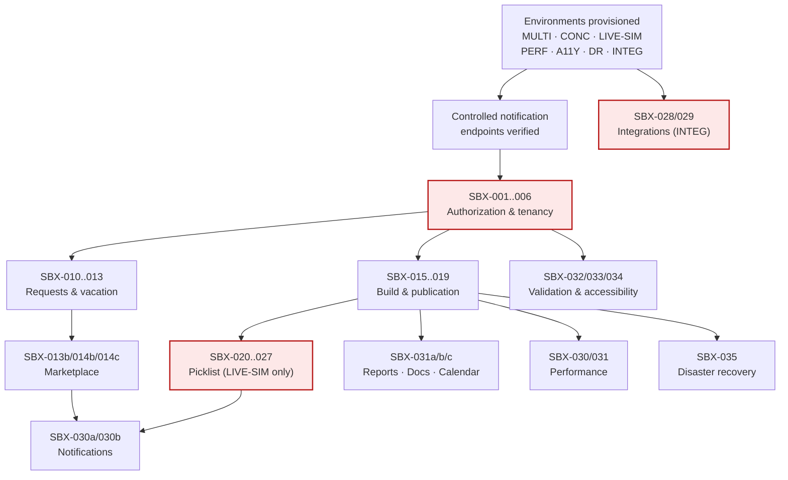

# 18 — Targeted Sandbox Test Plan

**Companion to:** [17-public-source-gap-addendum.md](17-public-source-gap-addendum.md). **Created:** 2026-07-30.

**Purpose:** convert every behaviour that could not be safely verified in production into a controlled, authorized test. Thirteen research phases were constrained to read-only observation; the residue is a set of lifecycles whose behaviour is **structurally evidenced but behaviourally unknown**. This plan is how that residue gets closed.

> **Product-name note:** this plan uses **SchedulePoint**, consistent with the repository and reports 12–16. The task brief used "SchedulePilot" — see PO-DEC-00.

---

## 1. Absolute constraints

1. **No test in this plan may be executed against the live production organization of iSchedule.MD, ever.** Not one.
2. **The active production picklist must never be opened, joined, advanced, or observed in flight.** It was not opened during any research phase, including the task that discovered it exists.
3. Tests against a **source-vendor sandbox** require written vendor authorization naming the tenant, the window, and the permitted actions. Absent that, the test runs against **SchedulePoint's own implementation** instead, and is marked accordingly.
4. **No real patient or case data** may enter any environment, at any time, in any form — including screenshots and logs.
5. **No real person** may receive a test notification. All email, SMS, and voice destinations must be controlled endpoints owned by the test team (§4).
6. Every test must be **reversible or disposable**: either it cleans up after itself, or its environment is reset wholesale.

---

## 2. Required environments

Extends the six environments defined in [11-edge-cases-and-qa.md](11-edge-cases-and-qa.md) §14.9.

| Env | Provides | Used by |
|---|---|---|
| **MULTI** | ≥2 organizations, ≥2 groups each, one user holding **different roles per membership** | SBX-001..004 |
| **CONC** | ≥3 genuinely concurrent authenticated sessions with orchestrated timing | SBX-013, 014, 022, 024 |
| **LIVE-SIM** | A **simulated live picklist**: controllable clock, injectable network faults, scriptable turn advancement, and a full role set | SBX-020..027 |
| **PERF** | Load harness with instrumented telemetry and a large synthetic tenant | SBX-030, 031 |
| **A11Y** | Screen readers (VoiceOver, NVDA), forced-colors, browser zoom to 400%, real mobile devices | SBX-033, 034 |
| **DR** | Restore/migration rehearsal with point-in-time recovery | SBX-035 |
| **INTEG** *(new)* | **Integration sandbox** — a mock surgical-booking endpoint emulating ORSOS/Cerner/Meditech-shaped payloads, with fault injection | SBX-028, 029 |

---

## 3. Required test accounts and roles

All accounts synthetic. Naming uses placeholders only — no real names, no customer organization names.

| Account | Role / membership | Purpose |
|---|---|---|
| `STAFF_A` | Staff in `GROUP_A` | Baseline participant; requests, picks, opportunities |
| `STAFF_B` | Staff in `GROUP_A` | Counterparty for swaps, concurrency, claim races |
| `STAFF_C` | Staff in `GROUP_A`, **also** Scheduler in `GROUP_B` | **Per-membership role divergence** — the key C-02/tenancy case |
| `LOCUM_A` | Locum in `GROUP_A` | Locum restrictions, pick exclusions, staff-over-locum preference |
| `VIEW_A` | Viewer in `GROUP_A` | Read-only authorization boundary |
| `TELECOM_A` | Notification-only in `GROUP_A` | On-call access without schedule presence |
| `SCHED_A` | Scheduler in `GROUP_A` | Approvals, builds, publication, picklist administration |
| `ADMIN_A` | Administrator/top tier in `ORGANIZATION_A` | Impersonation, deactivation, entitlement |
| `ORG_B_USER` | Any role in `ORGANIZATION_B` | **Cross-tenant negative testing** |
| `PROXY_A` | Staff in `GROUP_A`, proxy for `STAFF_A` | Proxy acting authority |

---

## 4. Controlled notification endpoints

**Mandatory before any notification test runs.**

| Channel | Endpoint | Control |
|---|---|---|
| Email | Catch-all mailbox on a test-owned domain, per-account plus-addressing | Never forwards externally |
| SMS | Programmable test number pool (virtual numbers) | Rate-capped; no real handsets |
| Voice | Programmable voice endpoint that answers, records, and discards | No real handsets; recordings purged on cleanup |
| Push | Test device tokens on a dedicated project | Sandbox credentials only |

**Rule:** if a test cannot prove its destination is controlled, the test does not run.

---

## 5. Test cases

**Field key:** **Obj** · **Roles** · **Env** · **Data** · **Setup** · **Steps** · **Evidence** · **Notify** = destination · **Pass** · **Cleanup** · **Refs** · **Gate** (Architecture / Beta / Production).

### 5.1 Authorization, roles, tenancy

#### SBX-001 · Lower-privileged role navigation and authorization
**Obj:** Establish exactly what Staff, Locum, Viewer, and Notification-only roles can see and do — **never observable in thirteen phases** because only one role was ever available.
**Roles:** `STAFF_A`, `LOCUM_A`, `VIEW_A`, `TELECOM_A`, `SCHED_A` · **Env:** MULTI · **Data:** one published schedule, one open request window.
**Setup:** all five accounts active in `GROUP_A`.
**Steps:** 1) Sign in as each role in turn. 2) Capture the full navigation tree. 3) Attempt to load every known route directly. 4) Record allow/deny per route per role.
**Evidence:** role × route matrix; screenshots of each navigation state.
**Pass:** every route resolves to an explicit allow or a clean deny; **no route returns data the role should not see**; denials are generic and leak nothing.
**Cleanup:** none (read-only). **Refs:** FEAT-006, ENT-007, QA-TEN-012, QA-AUTH-006, unresolved #1/#19 · **Gate:** **Architecture**

#### SBX-002 · Picklist permission matrix — **resolves C-02**
**Obj:** Determine what actually gates picklist administration: the per-user `Picklist Admin` flag, the **group-level `Pick List Access` checkbox** (newly found, GAP-17), the Access Level, or some combination.
**Roles:** `SCHED_A`, `STAFF_A`, `ADMIN_A` · **Env:** MULTI + LIVE-SIM · **Data:** two groups, one with `Pick List Access` on and one off.
**Setup:** provision the 2×2×role matrix of (`Picklist Admin` on/off) × (`Pick List Access` on/off).
**Steps:** For each combination: 1) attempt to view Picklist Manager; 2) attempt to view the Dashboard; 3) attempt each administrative control **in the sandbox only**; 4) record the outcome.
**Evidence:** a completed truth table showing which control gates which capability.
**Pass:** the gating mechanism is unambiguously identified and documented.
**Cleanup:** reset all flags. **Refs:** **C-02**, GAP-17, FEAT-006, FEAT-030, ENT-008, QA-AUTH-007 · **Gate:** **Architecture — blocking**

#### SBX-003 · Directory population rule — informs C-06
**Obj:** Determine why the contacts directory consistently shows ~30–35% fewer rows than the user roster in both groups.
**Roles:** `SCHED_A` · **Env:** MULTI · **Data:** roster containing every role plus functional and placeholder accounts.
**Steps:** 1) Record roster count by role and account type. 2) Record directory count. 3) Diff. 4) Toggle one account's role/type at a time and re-count.
**Evidence:** exact inclusion/exclusion rule.
**Pass:** the filter rule is stated precisely. **Cleanup:** restore roles. **Refs:** **C-06**, GAP-15, QA-SEC-014, unresolved #60 · **Gate:** Beta

#### SBX-004 · Cross-tenant isolation sweep
**Obj:** Prove no data crosses an organization or group boundary.
**Roles:** `ORG_B_USER`, `STAFF_C` · **Env:** MULTI · **Data:** distinct fixtures per org.
**Steps:** For every resource type, attempt access to `ORGANIZATION_A` identifiers while authenticated to `ORGANIZATION_B`, via UI and API. Repeat for group boundaries within one org.
**Evidence:** deny log per resource type.
**Pass:** **100% denial**, server-enforced, with no distinction between "not found" and "not permitted".
**Cleanup:** none. **Refs:** FEAT-003, QA-TEN-002..012, QA-SEC-008 · **Gate:** **Architecture**

#### SBX-005 · User invitation, activation, deactivation, impersonation
**Obj:** Establish the account lifecycle — entirely unobserved (the source conflates activation with password reset, PUB-069).
**Roles:** `ADMIN_A`, new synthetic invitee · **Env:** MULTI · **Data:** unused test mailbox.
**Steps:** 1) Invite. 2) Verify token is single-use and expiring. 3) Replay the token — must fail. 4) Activate. 5) Suspend and confirm live sessions die immediately. 6) Deactivate and confirm history is retained and future assignments surfaced. 7) Impersonate and verify a banner, an audit entry, and blocked credential-changing screens.
**Evidence:** lifecycle log; audit entries; session-invalidation timing.
**Notify:** controlled mailbox. **Pass:** each transition behaves as STM-017/STM-018 specify; impersonation is fully audited.
**Cleanup:** purge synthetic accounts. **Refs:** STM-017, STM-018, FEAT-005, FEAT-009, QA-AUTH-004, QA-AUTH-005, QA-AUTH-010 · **Gate:** **Beta**

#### SBX-006 · Session timeout and persistence
**Obj:** Determine idle/absolute session lifetime and `rememberMe` behaviour — never observable (the session never expired in thirteen phases).
**Roles:** `STAFF_A` · **Env:** MULTI · **Steps:** Idle sessions with and without "stay signed in"; sample at intervals; test concurrent-device behaviour.
**Evidence:** measured timeout values. **Pass:** documented, bounded, and consistent with a healthcare product.
**Refs:** PUB-070, QA-AUTH-001, QA-AUTH-002, unresolved #75 · **Gate:** Beta

### 5.2 Requests and vacation

#### SBX-010 · Request lifecycle end-to-end, all types
**Obj:** Exercise creation, editing, approval, denial, withdrawal, and deletion for **every** request type — including the **ON and "No Call" types that only public evidence attests to** (PUB-021), and the shift-group "OFF {X}" type whose creation surface was never located.
**Roles:** `STAFF_A`, `SCHED_A` · **Env:** MULTI · **Data:** open request window; shift groups with `Allow Request` on and off.
**Steps:** For each type: create → verify state → edit → approve → attempt post-approval edit → withdraw → delete. Then repeat with the window **closed** and confirm the server rejects late submission.
**Evidence:** state-transition log per type; the located creation surface for each.
**Pass:** every type has a discoverable creation surface; server-side deadline enforcement confirmed; withdrawal and denial are distinct and separately audited.
**Cleanup:** delete synthetic requests. **Refs:** **C-03**, GAP-07, STM-005, STM-006, FEAT-020, QA-REQ-001..006, unresolved #16/#30/#31/#47 · **Gate:** **Beta**

#### SBX-011 · One record or two — resolves C-03
**Obj:** Determine whether the two withdrawal surfaces act on one underlying record.
**Roles:** `STAFF_A` · **Env:** MULTI · **Steps:** Create a vacation-type request; withdraw via the requests panel; verify the vacation grid; repeat withdrawing via the grid and verify the panel.
**Evidence:** record identity proof. **Pass:** the relationship is unambiguous.
**Refs:** **C-03**, QA-REQ-006, QA-REQ-011 · **Gate:** Architecture (request model)

#### SBX-012 · Vacation modes, quotas, grants, and commit
**Obj:** Exercise both allocation modes (PUB-023), quota advisory behaviour, and the commit-to-schedule operation.
**Roles:** `STAFF_A`, `STAFF_B`, `SCHED_A` · **Env:** MULTI · **Data:** a vacation period with per-staff grants and per-week capacity.
**Steps:** 1) Quota mode: request within, at, and **over** capacity — confirm over-quota is advisory, not blocking. 2) Switch to open mode; repeat. 3) Approve individually and by date-range batch. 4) Commit to schedule. 5) **Re-run the same commit** and verify idempotency. 6) Revert via schedule versioning.
**Evidence:** balance ledger; commit idempotency proof; version history.
**Pass:** commit is idempotent and reversible — **directly replacing the source's irreversible transfer**.
**Cleanup:** reset period. **Refs:** STM-007, FEAT-021, FEAT-022, QA-REQ-007..014, unresolved #45 · **Gate:** **Beta**

#### SBX-013 · Concurrent approval on the last unit of entitlement
**Obj:** Two schedulers approve competing requests simultaneously against one remaining slot.
**Roles:** `SCHED_A` ×2 sessions · **Env:** CONC · **Steps:** Orchestrate simultaneous approval; repeat 50×.
**Pass:** exactly one succeeds every time; the loser receives a clear conflict message; the ledger never goes negative unless policy permits.
**Refs:** QA-REQ-008, QA-CON-004, STM-006 · **Gate:** **Architecture**

### 5.3 Schedule generation and publication

#### SBX-015 · Build execution, failure, and regeneration
**Obj:** Run the engine — **never done in any research phase**. Establish states, diagnostics, and failure handling.
**Roles:** `SCHED_A` · **Env:** PERF (small fixture) · **Data:** synthetic group, full rule set.
**Steps:** 1) Run a satisfiable build. 2) Run an **over-constrained** build to force failure. 3) Verify a distinct failure state and diagnostics. 4) Regenerate. 5) Confirm prior builds are retained, never overwritten.
**Evidence:** build states, BuildResult, RuleViolation output.
**Pass:** failure is explicit and diagnosable; **no partial schedule is ever published**.
**Cleanup:** archive builds. **Refs:** STM-001, FEAT-016, ENT-024, ENT-025b, ENT-026b, QA-SCH-007, unresolved #43 · **Gate:** **Production**

#### SBX-016 · Conflict detection and build-quality verification — **GAP-05**
**Obj:** Exercise the planner/workbench capability the source advertises (PUB-016) but which was **never observable**.
**Roles:** `SCHED_A` · **Env:** PERF · **Data:** a fixture with deliberate hard-rule violations and fairness outliers.
**Steps:** Generate; open the review surface; confirm every injected violation is surfaced, attributed, and explained; confirm outlying statistics are identifiable.
**Evidence:** violation report vs. injected-defect list.
**Pass:** **100% of injected hard violations detected**; each explains *why*.
**Refs:** **GAP-05**, PUB-016, STM-002, ENT-026b, QA-SCH-005 · **Gate:** **Production**

#### SBX-017 · Progressive build around fixed manual assignments
**Obj:** Verify the staged-build capability (PUB-013), including the **circulate-a-partial-schedule** workflow (GAP-04).
**Roles:** `SCHED_A` · **Env:** PERF · **Steps:** 1) Hand-assign a subset. 2) Build stage 1 and confirm manual assignments are preserved exactly. 3) Circulate/export the partial schedule. 4) Add further manual assignments. 5) Build stage 2 to completion.
**Pass:** manual assignments are never overwritten; each stage is independently retained and auditable.
**Refs:** TERM-032, GAP-04, STM-001, FEAT-016, QA-SCH-002 · **Gate:** **Production**

#### SBX-018 · Publication, versioning, revision, and revert
**Obj:** Prove published schedules are versioned and revertible — the capability the source **entirely lacks**.
**Roles:** `SCHED_A` ×2 · **Env:** CONC · **Steps:** 1) Publish. 2) Amend post-publication. 3) Confirm a new version and retained history. 4) Revert. 5) Confirm revert publishes forward. 6) Two schedulers publish the same period concurrently.
**Pass:** no version is ever destroyed; concurrent publication is serialised; affected staff are notified, others are not.
**Refs:** STM-003, STM-004, FEAT-018, FEAT-019, QA-SCH-009, QA-SCH-012, unresolved #40 · **Gate:** **Production**

#### SBX-019 · Qualification enforcement — **GAP-06**
**Obj:** Verify that unqualified or uncredentialed staff cannot be assigned — a capability the source claims ("skill sets", PUB-018) but for which **no mechanism exists**.
**Roles:** `SCHED_A` · **Env:** PERF · **Data:** staff with and without a required qualification; one expired credential.
**Steps:** Attempt assignment via the engine, manual edit, opportunity claim, swap, and picklist pick.
**Pass:** **every path is blocked**; expiry is respected on the assignment date.
**Refs:** **GAP-06**, AMD-08, QA-SCH-006 · **Gate:** **Production**

### 5.4 Picklist — LIVE-SIM only

> **Every test in this section is forbidden against production.** The active production picklist must never be used.

#### SBX-020 · Picklist preparation and mode selection
**Obj:** Exercise preparation across all **three operating modes** (paper / mobile-manual / mobile-integrated — GAP-11).
**Roles:** `SCHED_A` · **Env:** LIVE-SIM · **Steps:** Build a list in each mode; add, edit, reorder, and remove work items; re-sync participants; add notes; validate readiness.
**Pass:** **no control persists anything before an explicit Save** (the FEAT-048 rule); each mode is coherent.
**Refs:** GAP-11, STM-012, FEAT-030, QA-PICK-001..003 · **Gate:** **Production**

#### SBX-021 · Live execution: start, advancement, completion — **GAP-13**
**Obj:** Observe the execution surfaces that were **never seen in any phase**: list-start email, current-picker presentation, timer, remaining-choice review, selection confirmation, automatic advancement, completion email.
**Roles:** `SCHED_A`, `STAFF_A`, `STAFF_B`, `LOCUM_A` · **Env:** LIVE-SIM · **Data:** 6 participants, 8 work items, controlled endpoints.
**Steps:** Start → verify start email → verify current picker → review remaining choices → select → verify confirmation email → verify automatic advancement → complete → verify completion email to staff and administrator.
**Evidence:** full transcript, all notification payloads, instrumented transport log.
**Notify:** controlled endpoints only.
**Pass:** the entire documented flow (PUB-039..043, PUB-048) is reproduced and recorded.
**Cleanup:** discard the simulated list. **Refs:** **GAP-13**, STM-013, STM-014, FEAT-032, QA-PICK-005..016 · **Gate:** **Production**

#### SBX-022 · Simultaneous room selection
**Obj:** Two actors select the same work item at the same instant.
**Roles:** `STAFF_A`, `PROXY_A` · **Env:** LIVE-SIM + CONC · **Steps:** Orchestrate simultaneous selection; repeat 50×.
**Pass:** exactly one pick is recorded every time; the loser sees a clear "already taken" message; **no double assignment ever occurs**.
**Refs:** QA-PICK-005, QA-PICK-011, QA-CON-004, STM-014 · **Gate:** **Architecture**

#### SBX-023 · Reconnection, stale state, and manual refresh — **informs C-04**
**Obj:** Determine the transport and its failure behaviour.
**Roles:** `STAFF_A`, `SCHED_A` · **Env:** LIVE-SIM · **Steps:** 1) Instrument the transport during a live turn. 2) Sever the connection mid-turn. 3) Restore. 4) Verify the turn was not lost and state reconciles. 5) Open the same list in two tabs and diverge them. 6) Measure staleness before and after manual refresh.
**Evidence:** transport trace; reconciliation behaviour.
**Pass:** the server owns turn state and the clock; stale clients converge; no client action is lost or duplicated.
**Refs:** **C-04**, STM-013, QA-PICK-012, QA-PICK-013, QA-PERF-006 · **Gate:** **Architecture — blocking**

#### SBX-024 · Turn expiry, skip, and proxy fallback
**Obj:** Establish timeout behaviour (`Action Time`, `Alert Pick Time` — PUB-045) and whether skip is automatic.
**Roles:** `STAFF_A`, `PROXY_A`, `SCHED_A` · **Env:** LIVE-SIM (controllable clock) · **Steps:** Let a turn expire unattended; verify alerting, skip-or-hold behaviour, proxy fallback, and administrator intervention prompts.
**Pass:** expiry is deterministic and audited; the list never deadlocks.
**Refs:** TERM-064, STM-013, STM-014, QA-PICK-006, unresolved #14 · **Gate:** **Production**

#### SBX-025 · Administrator intervention — **GAP-14**
**Obj:** Exercise live reordering and **picking on behalf of a staff member** (PUB-044).
**Roles:** `SCHED_A` · **Env:** LIVE-SIM · **Steps:** Mid-execution, reorder remaining participants; pick on behalf of `STAFF_A`; verify attribution.
**Pass:** every intervention is audited and attributed to the **administrator**, never silently to the staff member.
**Refs:** **GAP-14**, STM-013, FEAT-032, QA-PICK-008 · **Gate:** **Production**

#### SBX-026 · Proxy acting authority — resolves PO-DEC-03
**Obj:** Confirm whether a proxy **picks** or only receives notifications (PUB-041 indicates picks).
**Roles:** `STAFF_A`, `PROXY_A` · **Env:** LIVE-SIM · **Steps:** Grant proxy; trigger a turn; have the proxy attempt to select; verify authority and attribution; revoke mid-turn.
**Pass:** scope is explicit and enforced; every proxy action names both parties.
**Refs:** **PO-DEC-03**, AMD-06, STM-019, ENT-010, QA-AUTH-008 · **Gate:** **Beta**

#### SBX-027 · Picklist completion, correction, and reopening
**Obj:** Establish post-completion correction and whether unlocking reopens a list.
**Roles:** `SCHED_A` · **Env:** LIVE-SIM · **Steps:** Complete a list; correct an assignment; attempt unlock; verify effect on distributed results.
**Pass:** corrections are possible, audited, and re-notify affected staff.
**Refs:** STM-013, FEAT-030, QA-PICK-016, unresolved #54 · **Gate:** **Production**

### 5.5 Marketplace

#### SBX-013b · Opportunity posting, fan-out, eligibility, and claiming — **GAP-08, GAP-09**
**Obj:** Exercise the claim side, **never observed** because every opportunity inspected belonged to the reviewing account.
**Roles:** `STAFF_A` (poster), `STAFF_B`, `LOCUM_A` (claimants), `SCHED_A` · **Env:** MULTI + CONC · **Data:** eligibility rules; a staff-over-locum preference rule.
**Steps:** 1) Post. 2) Verify **email fan-out to group members** and who exactly receives it (PUB-024). 3) Verify opt-out honoured. 4) Attempt an ineligible claim. 5) Verify **staff take preference over locum** (PUB-025). 6) Claim. 7) Verify reassignment and audit. 8) Withdraw a posting pre-claim.
**Evidence:** recipient list; eligibility decisions; audit entries.
**Notify:** controlled endpoints. **Pass:** recipient rules are explicit; ineligible claims are blocked; the locum preference rule demonstrably works.
**Refs:** **GAP-08**, **GAP-09**, STM-008, FEAT-025, QA-OPP-001..008, unresolved #33/#49 · **Gate:** **Beta**

#### SBX-014b · Simultaneous opportunity claims
**Obj:** Two eligible staff claim the same opportunity at the same instant.
**Roles:** `STAFF_A`, `STAFF_B` · **Env:** CONC · **Steps:** Orchestrate; repeat 50×.
**Pass:** exactly one winner every time; no double assignment; the loser gets a clear message.
**Refs:** QA-OPP-001, QA-CON-004 · **Gate:** **Architecture**

#### SBX-014c · Swaps and transfers, with optional scheduler review
**Obj:** Establish the acceptance/approval model (PUB-026 indicates review is **configurable**).
**Roles:** `STAFF_A`, `STAFF_B`, `SCHED_A` · **Env:** MULTI + CONC · **Steps:** 1) Propose a swap. 2) Counterpart accepts. 3) With review **off**, confirm immediate atomic execution. 4) With review **on**, confirm it waits for approval. 5) Invalidate one leg mid-flow and confirm the whole swap fails. 6) Verify affected-staff email (PUB-027).
**Pass:** **atomic — both legs or neither**; the review policy behaves as configured.
**Refs:** **PO-DEC-02**, AMD-05, STM-009, STM-010, STM-011, QA-OPP-009..011, unresolved #32/#48 · **Gate:** **Beta**

### 5.6 Notifications

#### SBX-030a · Delivery, retry, deduplication, opt-out, and failure across all channels
**Obj:** Establish delivery behaviour the source exposes **nowhere** (no delivery log exists in the product).
**Roles:** `STAFF_A`, `SCHED_A` · **Env:** LIVE-SIM · **Data:** accounts with complete contacts, **missing phone numbers**, and opt-outs set.
**Steps:** 1) Trigger a ladder. 2) Verify each channel fires at its configured offset. 3) Force a transient failure and verify backoff retry. 4) Force permanent failure and verify dead-lettering. 5) Verify an account with **no destination** yields an explicit `no-destination` outcome, not a silent skip. 6) Resolve mid-ladder and confirm pending steps cancel. 7) Run the job twice and confirm **no duplicate delivery**. 8) Verify business-hours vs. personal-hours window selection.
**Evidence:** full delivery ledger per attempt.
**Notify:** controlled endpoints only. **Pass:** every outcome is recorded and queryable; no duplicates; no silent failures.
**Refs:** STM-015, STM-016, FEAT-040, QA-NOT-001..012, unresolved #53 · **Gate:** **Production**

#### SBX-030b · Push channel viability — informs C-10
**Obj:** Validate push as a first-class channel, given it is publicly claimed but **absent from the application**.
**Roles:** `STAFF_A` · **Env:** LIVE-SIM + A11Y devices · **Steps:** Register a device; deliver via push; verify behaviour when push is unavailable and the ladder falls back.
**Pass:** push works and degrades gracefully. **Refs:** **C-10**, AMD-13, PO-DEC-07 · **Gate:** Beta

### 5.7 Reports, documents, calendar

#### SBX-031a · Report generation, printing, export, and sharing
**Obj:** Exercise all six report types plus the recipient-targeted sharing report — **dialog internals unknown for four of six**.
**Roles:** `SCHED_A` · **Env:** MULTI · **Steps:** Open each report dialog; generate; export each format; share to selected recipients; attempt cross-tenant generation.
**Pass:** output is correct and tenant-scoped; sharing reaches only selected recipients.
**Notify:** controlled endpoints. **Refs:** FEAT-024, ENT-039, QA-RPT-001..008, unresolved #57/#58 · **Gate:** Beta

#### SBX-031b · Document lifecycle and access control
**Obj:** Upload, download, permission, supersede, and delete.
**Roles:** `SCHED_A`, `STAFF_A`, `ORG_B_USER` · **Env:** MULTI · **Steps:** Upload; verify uploader and version recorded; attempt cross-tenant download of a storage URL; delete and confirm the URL is invalidated.
**Pass:** cross-tenant access denied; purged documents unreachable.
**Refs:** STM-020, FEAT-050, QA-RPT-009..012, QA-SEC-010 · **Gate:** Beta

#### SBX-031c · Calendar feed issue, rotation, revocation
**Obj:** Verify the redesigned token model.
**Roles:** `STAFF_A` · **Env:** MULTI · **Steps:** Issue; fetch; rotate and confirm the old token dies immediately; revoke; confirm no PII appears in the URL; attempt to reach another membership's feed.
**Pass:** revocation is immediate; scope is one membership; **no PII in the URL**.
**Refs:** STM-021, FEAT-042, QA-SEC-005, QA-SEC-009, unresolved #35 · **Gate:** Beta

### 5.8 Integrations — INTEG only

#### SBX-028 · Surgical-booking import: validation, idempotency, reconciliation, failure — **GAP-12**
**Obj:** Establish ingestion behaviour for a capability **entirely absent from the feature inventory**.
**Roles:** platform service account · **Env:** INTEG · **Data:** synthetic ORSOS/Cerner/Meditech-shaped payloads — **wholly fabricated, never derived from real cases**.
**Steps:** 1) Import a valid payload. 2) **Re-import the identical payload** and confirm idempotency (no duplicates). 3) Import malformed and partially-invalid payloads. 4) Force a mid-import failure and verify no partial state. 5) Import a payload conflicting with manual entries and verify reconciliation. 6) Verify import normalisation controls (`ImportStrip`, lowercase conversion — GAP-19). 7) Verify full audit and retention.
**Pass:** idempotent, atomic, reconciled, audited; failures are visible and replayable.
**Refs:** **GAP-12**, AMD-01, proposed FEAT-055, QA-CON-003, QA-CON-009 · **Gate:** **Architecture** (boundary) + connector release

#### SBX-029 · De-identification at the ingestion boundary — **resolves C-09**
**Obj:** Prove no patient-level content can enter the platform, regardless of what a connector sends.
**Roles:** platform service account · **Env:** INTEG · **Data:** synthetic payloads **deliberately containing fabricated patient-shaped fields**.
**Steps:** 1) Send payloads with patient identifiers in expected and **unexpected** fields. 2) Verify the platform strips or rejects them at the boundary. 3) Verify rejected content never reaches storage, logs, or audit payloads. 4) Verify the field allow-list is enforced positively (allow-list, not deny-list).
**Pass:** **zero patient-level content persists anywhere**, including logs.
**Refs:** **C-09**, PUB-035, FEAT-051, QA-SEC-006, QA-PICK-017 · **Gate:** **Connector release — blocking**

### 5.9 Quality, performance, accessibility, recovery

#### SBX-032 · Form validation and programmatic error states
**Obj:** Establish validation and error behaviour — **no form was ever submitted in thirteen phases**, so no error state exists anywhere in the evidence base.
**Roles:** `STAFF_A`, `SCHED_A` · **Env:** A11Y · **Steps:** Submit every form with invalid, missing, boundary, and hostile input; capture the error presentation and its accessibility semantics.
**Pass:** errors are programmatically associated, announced, and focus-managed (**SP-HR-6**); no error leaks internals.
**Refs:** QA-A11Y-004, QA-A11Y-005, QA-SEC-007, unresolved #69 · **Gate:** **Beta**

#### SBX-033 · Keyboard and screen-reader operability of critical workflows
**Obj:** Verify **SP-HR-3, SP-HR-4, SP-HR-5, SP-HR-6** against the source's four confirmed accessibility failures.
**Roles:** `STAFF_A`, `SCHED_A` · **Env:** A11Y · **Steps:** Complete every critical workflow — including **a timed picklist turn** — using keyboard only, then with a screen reader.
**Pass:** every workflow completes; focus is always visible; every control has an accessible name; **the turn allowance is achievable via assistive technology**.
**Refs:** QA-A11Y-001..005, QA-A11Y-014, FEAT-054 · **Gate:** **Production**

#### SBX-034 · Zoom, reflow, and responsive behaviour
**Obj:** Close the untested zoom/reflow gap.
**Env:** A11Y · **Steps:** 200% and 400% zoom; narrow viewports; orientation changes; verify no page-level horizontal scroll and no loss of content or function.
**Refs:** QA-A11Y-015, QA-A11Y-016, unresolved #70 · **Gate:** Beta

#### SBX-030 · Request-efficiency and load benchmarks — **SP-HR-2**
**Obj:** Enforce "one action, one request" and establish scale behaviour.
**Env:** PERF · **Steps:** 1) Instrument every journey and assert one request per unique tuple. 2) Load-test the schedule grid at ≥200 staff × 8 weeks. 3) Measure real-time connection cost at scale. 4) Verify rate limiting.
**Pass:** **no request amplification** (the source's ~25–40× defect never reproduced); documented budgets met.
**Refs:** **SP-HR-2**, FEAT-049, QA-PERF-001..011 · **Gate:** **Beta**

#### SBX-031 · Solver performance and schedule-quality benchmark
**Obj:** Establish realistic generation performance against the public claim (PUB-017: ~2,700 cells in as little as 5 seconds) and measure **quality**, not just speed.
**Env:** PERF · **Data:** a 30-staff, 3-month fixture with a full rule set.
**Steps:** Generate repeatedly; measure wall-clock, hard-violation count, fairness variance, and unfilled slots.
**Pass:** a documented, defensible performance/quality envelope. **Speed is meaningless without a quality measure and must not be reported alone.**
**Refs:** PUB-017, PUB-046, FEAT-016, QA-PERF-008 · **Gate:** **Production**

#### SBX-035 · Disaster recovery and migration rehearsal
**Obj:** Prove point-in-time restore and schema migration safety.
**Env:** DR · **Steps:** Restore to a point in time; verify audit and version integrity; run a forward migration and a rollback; measure RTO/RPO.
**Pass:** documented RTO/RPO met; **no audit history lost**.
**Refs:** QA-CON-012, QA-CON-013, QA-CON-014 · **Gate:** **Production**

---

## 6. Execution dependencies

**Read:** environments and controlled endpoints gate everything. Authorization (SBX-001..006) precedes all behavioural testing — you cannot trust a lifecycle result until you know who was allowed to do what. Picklist execution depends on build and publication, since a draft needs a schedule. Integrations are independent and can proceed in parallel. Red nodes contain architecture-blocking tests.

---

## 7. Risk controls

| Risk | Control |
|---|---|
| A test touches production | Environment allow-list enforced in CI; production credentials are **never** available to the test harness |
| A real person is contacted | All channels resolve to controlled endpoints (§4); a test aborts if its destination cannot be verified |
| Patient data enters an environment | Synthetic payloads only; SBX-029 positively verifies the boundary; no production extract is ever used |
| A destructive test escapes its scope | Every test declares cleanup; environments are disposable and rebuilt from fixtures |
| Vendor-sandbox testing without authorization | Written authorization naming tenant, window, and permitted actions — otherwise the test targets SchedulePoint's own build |
| Concurrency tests produce flaky evidence | Every race repeated ≥50× with orchestrated timing; a single pass is not evidence |
| Test data leaks into reports | Placeholders only (`ORGANIZATION_A`, `GROUP_A`, `STAFF_A`, `RESOURCE_ID`); the existing sanitization sweep runs over all outputs |

---

## 8. Cleanup requirements

1. Every synthetic account, group, and organization is purged or the environment is rebuilt.
2. All captured notification payloads (including voice recordings) are deleted after evidence extraction.
3. Generated schedules, builds, picklists, and documents are removed or the environment is reset.
4. No test artefact containing synthetic PII persists beyond evidence capture.
5. Cleanup completion is recorded per test run.

---

## 9. Evidence-capture requirements

Every test produces: the **exact steps executed**, environment and build identifiers, role and account used, **sanitized** screenshots or transcripts, audit entries generated, notification payloads (sanitized), pass/fail against the stated criterion, and cleanup confirmation.

**Evidence must never contain** real names, real contact details, customer organization names, patient data, credentials, tokens, cookie values, or live identifiers — the same standard applied across all thirteen research phases.

---

## 10. Gates

### Architecture gate — must pass before architecture is finalised
`SBX-001` · `SBX-002` **(C-02)** · `SBX-004` · `SBX-011` **(C-03)** · `SBX-013` · `SBX-014b` · `SBX-022` · `SBX-023` **(C-04)** · `SBX-028` (boundary design)

### Beta gate — must pass before external beta
`SBX-003` · `SBX-005` · `SBX-006` · `SBX-010` · `SBX-012` · `SBX-013b` · `SBX-014c` · `SBX-026` · `SBX-030` · `SBX-030b` · `SBX-031a` · `SBX-031b` · `SBX-031c` · `SBX-032` · `SBX-034`

### Production gate — must pass before production release
`SBX-015` · `SBX-016` **(GAP-05)** · `SBX-017` · `SBX-018` · `SBX-019` **(GAP-06)** · `SBX-020` · `SBX-021` **(GAP-13)** · `SBX-024` · `SBX-025` **(GAP-14)** · `SBX-027` · `SBX-030a` · `SBX-031` · `SBX-033` · `SBX-035`

### Connector-release gate — must pass before any hospital integration ships
`SBX-028` · `SBX-029` **(C-09)** — plus an `EXTERNAL SPECIFICATION REQUIRED` sign-off per connector.

---

## 11. Coverage confirmation

Every unobservable lifecycle identified across the research has a sandbox test or a documented justification:

| Unobservable behaviour | Test |
|---|---|
| Lower-privileged role navigation | SBX-001 |
| Picklist permission gating (**C-02**) | SBX-002 |
| Directory population (**C-06**) | SBX-003 |
| User invitation/activation/deactivation/impersonation | SBX-005 |
| Session timeout | SBX-006 |
| Request creation/edit/approve/deny/withdraw/delete, all types | SBX-010 |
| One request record or two (**C-03**) | SBX-011 |
| Vacation quota/grant/open mode/approval/commit | SBX-012 |
| Schedule build execution, failure, regeneration | SBX-015 |
| Conflict detection / build quality (**GAP-05**) | SBX-016 |
| Progressive build around locked assignments | SBX-017 |
| Publication and post-publication revision | SBX-018 |
| Qualification enforcement (**GAP-06**) | SBX-019 |
| Picklist modes: paper / manual / integrated | SBX-020 |
| Active picklist execution (**GAP-13**) | SBX-021 |
| Simultaneous room selection | SBX-022 |
| Reconnection, stale state, manual refresh (**C-04**) | SBX-023 |
| Turn expiry, skip, proxy fallback | SBX-024 |
| Administrator intervention (**GAP-14**) | SBX-025 |
| Proxy acting authority | SBX-026 |
| Picklist completion and correction | SBX-027 |
| Opportunity fan-out, eligibility, staff-vs-locum (**GAP-08/09**) | SBX-013b |
| Simultaneous opportunity claims | SBX-014b |
| Swaps, transfers, optional review | SBX-014c |
| Notification delivery, retry, dedup, opt-out, failure | SBX-030a |
| Push channel (**C-10**) | SBX-030b |
| Email / SMS / voice channels | SBX-030a |
| Report generation, print, export, share | SBX-031a |
| Document upload/download/permission/deletion | SBX-031b |
| Calendar-feed revocation and refresh | SBX-031c |
| Import validation, idempotency, reconciliation, failure (**GAP-12**) | SBX-028 |
| De-identification boundary (**C-09**) | SBX-029 |
| Form validation and programmatic error states | SBX-032 |
| Keyboard, screen-reader, zoom, reflow | SBX-033, SBX-034 |
| Solver performance and schedule quality | SBX-031, SBX-030 |
| Disaster recovery | SBX-035 |

**Documented justifications for behaviours with no test:** the two unopened PDF documents in the source's library (no SchedulePoint requirement derives from their contents) and the source's non-firing product tour (excluded from the MVP; onboarding will be designed fresh).

**39 sandbox tests defined.** *(Corrected 2026-08-01 under explicit CAR-026 authorization: the previous hand-written figure of thirty-six understated the count. This figure is derived from the unique `SBX-` headings in this document, and the architecture validator re-derives and checks it on every run.)*
