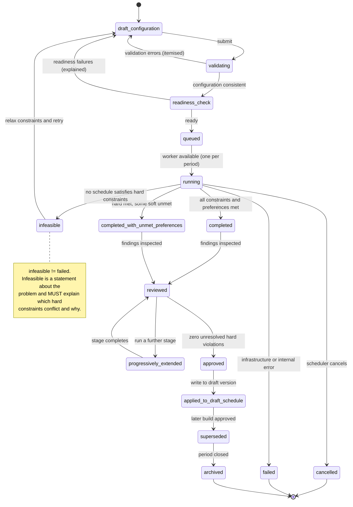

# 21 — Automated Scheduling: Production Requirements

**Created 2026-07-31.** Companion to [19-schedulepoint-production-capability-baseline.md](19-schedulepoint-production-capability-baseline.md).

**Product name:** `SchedulePoint` — **PO-DEC-00 APPROVED**.

---

## 0. Clean-room statement

**This is an independently designed specification of a required capability.** It does not reproduce, reverse-engineer, or approximate iSchedule.MD's proprietary algorithm, source code, data structures, or internal design. No source algorithm was ever observed — **no build was run in thirteen research phases**, and the engine's runtime behaviour was never visible.

What follows is derived from: **observable configuration surfaces** (what inputs the source lets an administrator express), **public capability claims** (what outcomes the vendor advertises), and **independent engineering judgement** about what is required to produce equivalent or better user outcomes.

Where a requirement is a SchedulePoint decision rather than an observation, it is labelled. **Nothing here asserts how the source works internally.**

---

## 1. Why this is mandatory

**Automated scheduling is `REQUIRED FOR PRODUCTION`** (CAP-015, C-08).

The public source presents automated generation as the product's defining capability (PUB-001, PUB-002), the basis of its pricing (PUB-063), and — per multiple customer testimonials — the reason departments adopted it, each describing 30–40 hours of manual work per schedule cycle being eliminated.

**Manual scheduling (CAP-019) remains available** as an administrator override, a recovery mechanism, a way to create fixed assignments, an input to progressive builds, and a temporary development-stage tool. **It is never an acceptable substitute for the production engine.** An internal functional alpha may lean on it while the solver is built; a production release may not.

---

## 2. Inputs

Every input below has an observed configuration surface, a public claim, or an explicit SchedulePoint rationale.

### 2.1 Scope and structure

| Input | Source | Notes |
|---|---|---|
| Organization, Group | ENT-001, ENT-002 | Tenancy scope; all inputs are group-scoped |
| Schedule period | ENT-015 | Bounded range; observed periods ≈166–182 days with Monday start / Sunday end constraints |
| Sites and locations | ENT-003 | May scope demand and qualification requirements. `SCHEDULEPOINT DECISION` — see PO-DEC-01 |
| Shift types | ENT-011 | Code, times, overnight flag, on-call / manual-only / daily-pick / stipend flags |
| Shift groups | ENT-013 | Bundles for scoring and request targeting; carry scoring mode and weight |
| Staffing demand | ENT-014 | Per-day demand units (the source expresses this as an operating-room count with per-weekday defaults including holidays) |

### 2.2 People and capacity

| Input | Source | Notes |
|---|---|---|
| Staff roster | ENT-006 | Active memberships in the group |
| Roles | ENT-007 | Determine participation, not eligibility for specific work |
| **Qualifications and credentials** | ENT-042, ENT-043 | **Evaluated against the assignment date, never "today"** — CAP-058 |
| **Credential expiry** | ENT-043 | An expired credential confers no eligibility |
| FTE | ENT-006 | Contracted capacity |
| **Weekday-specific FTE** | ENT-011 × ENT-006 | Per-shift-type, per-weekday quotas plus a maximum count (PUB-004, PUB-005) |
| **Work percentage** | ENT-006 `workPercentage` | Explicit stored value, not derived — the fairness denominator and picklist-balancing input (PUB-003, PUB-012) |
| Eligibility groups | ENT-012 | Named staff subsets scoping rules |
| Locum status and restrictions | ENT-006, ENT-007 | Including lockout-hours rules and pick-position exclusions |
| **Staff preference attributes** | ENT-006 `preferences` | Readable by staff rules — the public rule example conditions on a shift-length preference (PUB-010). `SCHEDULEPOINT DECISION`: an explicit attribute bag rather than rule-embedded literals |

### 2.3 Demand-side and historical inputs

| Input | Source | Notes |
|---|---|---|
| Availability | ENT-018 | Derived from requests and approved absence |
| **ON requests** (positive availability) | ENT-018 `type=availability` | `PUBLIC SOURCE CLAIM` (PUB-021) — creation surface never observed |
| **OFF requests** | ENT-018 `type=time-off` | Shift- or shift-group-scoped |
| **No Call requests** | ENT-018 `type=no-call` | Broader than an OFF request — no on-call shift of any kind (PUB-021) |
| **Preferred shifts** | ENT-018 `type=shift-preference` | "request to be assigned certain shifts" (PUB-021) |
| Vacation | ENT-019 | Approved selections, committed to the schedule |
| Time off | ENT-018, ENT-019 | Distinct from vacation where the group configures it so |
| **Fixed manual assignments** | ENT-014 `origin=manual`, locked | The progressive-build anchor (PUB-013) |
| **Previously generated assignments** | ENT-014, ENT-024 `protectedAssignmentIds` | Preserved across progressive stages |
| **Historical statistics** | ENT-017, prior ENT-016 | Carried forward to balance work over longer horizons (PUB-015). Source exposes an explicit "do NOT overlap dates" constraint |
| Workload targets | ENT-017, ENT-021b | Target credits/shifts per member |

### 2.4 Rules

| Input | Source |
|---|---|
| Pattern rules (spacing, weekday-scoped) | ENT-021 |
| Staff rules (named-individual, five action types, negation, staffing-balance conditions) | ENT-022 |
| Position restrictions (which pick positions are legal for which shift types) | ENT-023 |
| **Assignment templates (alternating-week rotations)** | ENT-048 — `PUBLIC SOURCE CLAIM` (PUB-007), no authoring surface observed |
| Rule set (which rules apply to this build) | ENT-023b |

---

## 3. Constraint model

**Two enforcement classes, explicitly distinguished** — this distinction is directly observable in the source's own rule-authoring surfaces (hard penalty vs. weighted penalty) and is preserved:

- **Hard constraints** — a schedule violating one is **infeasible**. Never traded off.
- **Soft constraints / weighted preferences** — scored, traded off against each other by the objective function.

### 3.1 Hard constraints (must never be violated in an accepted schedule)

| Constraint | Detail |
|---|---|
| No overlapping assignments | One person cannot hold two assignments whose time ranges intersect, **including across midnight** |
| Minimum rest | Configurable minimum interval between the end of one assignment and the start of the next |
| Overnight-shift handling | A shift crossing midnight occupies both calendar dates for conflict purposes |
| **Qualification and credential validity** | Enforced against the **assignment date** — CAP-058 |
| Site restrictions | Where a shift type is site-scoped |
| Availability | Approved absence and vacation block assignment |
| Maximum assignments | Per staff, per shift type, per weekday, per period |
| Position restrictions | Legal pick positions per shift set |
| **Preservation of protected assignments** | Locked manual and prior-solver assignments are never altered |
| Rules explicitly authored as hard | Any pattern or staff rule set to hard enforcement |

### 3.2 Soft constraints and weighted preferences

| Constraint | Detail |
|---|---|
| Target percentages | Per-staff workload targets (PUB-003) |
| Minimum assignments | Where a group wants a floor as well as a ceiling — `SCHEDULEPOINT DECISION` (the source exposes only maxima) |
| **Optimal call spacing** | Spread call shifts as far apart as practical across the period (PUB-009). **Algorithm independently designed** |
| Weekend-spacing rules | E.g. avoid consecutive weekend calls (PUB-008) |
| Sequence and pattern rules | Activation-triggered offsets |
| **Linked shifts** | Whoever works A works B at a stated offset (PUB-006) |
| **Backup-call relationships** | When one named person holds a shift, another is assigned a paired shift (PUB-011) |
| **Alternating-week templates** | Multi-week rotation adherence (PUB-007) |
| Staff-specific conditional rules | Including staffing-balance-conditioned rules (PUB-010) |
| Preference satisfaction | ON / preferred-shift requests honoured where possible |
| Locum minimisation | Prefer permanent staff where both are eligible |
| Fairness | Even distribution by work percentage across credits, weekends, and high-burden shifts |
| Schedule stability | Minimise churn versus a prior published version when rebuilding |

### 3.3 Partial-assignment preservation

Protected assignments are a **hard** constraint by default. Unlocking is possible but must be **explicit, reasoned, and audited** — never a silent side effect of regeneration.

---

## 4. Build lifecycle

**This lifecycle governs and supersedes STM-001's original state set.**

**States:** `draft-configuration` · `validating` · `readiness-check` · `queued` · `running` · `completed` · `completed-with-unmet-preferences` · `infeasible` · `failed` · `cancelled` · `reviewed` · `progressively-extended` · `approved` · `applied-to-draft-schedule` · `superseded` · `archived`

| From → To | Actor | Guard |
|---|---|---|
| `draft-configuration` → `validating` | scheduler | scope non-empty |
| `validating` → `readiness-check` | system | configuration internally consistent |
| `validating` → `draft-configuration` | system | validation errors, itemised |
| `readiness-check` → `queued` | scheduler | demand, roster, rules, and qualifications all resolvable |
| `readiness-check` → `draft-configuration` | system | readiness failures, itemised and explained |
| `queued` → `running` | system | a worker slot is free; **one running build per period** |
| `running` → `completed` | system | all hard constraints satisfied, all preferences met |
| `running` → `completed-with-unmet-preferences` | system | hard constraints satisfied, some soft constraints unmet |
| `running` → `infeasible` | system | **no schedule satisfies the hard constraints** — must explain which and why |
| `running` → `failed` | system | infrastructure or internal error — distinct from `infeasible` |
| `running` → `cancelled` | scheduler | user-initiated; no partial result persists |
| `completed*` → `reviewed` | scheduler | conflict findings inspected (CAP-059) |
| `reviewed` → `progressively-extended` | scheduler | a further stage is run over this result |
| `reviewed` → `approved` | scheduler | **zero unresolved hard violations** |
| `approved` → `applied-to-draft-schedule` | scheduler | assignments written to a draft version |
| any completed state → `superseded` | system | a later build for the period is approved |
| any terminal state → `archived` | system | period closed |

**`infeasible` and `failed` are different states and must never be conflated.** The first is a statement about the problem; the second is a statement about the system.

---

## 5. Progressive builds

Supports the workflow the public source describes (PUB-013) and the research corroborated at configuration level.

| Requirement | Detail |
|---|---|
| **Locked manual assignments** | Hand-made assignments are protected inputs, never overwritten |
| **Locked prior solver assignments** | A previous stage's output can be protected before the next stage runs |
| **Staged generation** | Any number of stages; each is a distinct build in a chain |
| **Partial schedule circulation** | A stage's output may be circulated for human review **without publication** — circulating never makes a schedule authoritative (CAP-018) |
| **Additional manual assignments between stages** | Newly hand-entered assignments become protected inputs to the next stage |
| **Regeneration around protected assignments** | The engine solves only the unprotected remainder |
| **Comparison between build versions** | Diff of assignments, fairness metrics, and findings between any two stages |
| **Explicit unlocking** | Protection can be removed, but only deliberately |
| **Reasoned overrides** | Unlocking or overriding a hard constraint requires a recorded reason |
| **Audit history** | Every stage, protection change, and override is auditable |

---

## 6. Explainability

**A build must never return only a success/failure flag.** Every result carries:

| Output | Detail |
|---|---|
| Satisfied hard constraints | Which were active and confirmed satisfied |
| **Unsatisfied soft preferences** | Which, for whom, and by how much |
| Objective / quality scores | Overall and per-dimension (fairness, spacing, preference satisfaction) |
| **Eligibility explanation** | Why a given person was or was not eligible for a given slot |
| Assignment rationale | Where practical, why this person for this slot |
| **Detected conflicts** | Severity-classified findings (CAP-059) |
| Preserved assignments | Which protected assignments were honoured |
| **Changed assignments** | Versus the prior version, when rebuilding |
| Unmet demand | Which slots could not be filled, and why |
| Fairness metrics | Distribution by work percentage, weekends, high-burden shifts |
| **Infeasibility explanations** | For `infeasible`: the conflicting hard-constraint set, expressed in domain terms |
| **Remediation suggestions** | Concrete relaxations that would make an infeasible problem solvable |

**Rationale.** The source surfaces none of this — a scheduler sees output with no explanation of why. Trust in an automated scheduler is the product's central adoption barrier, and explainability is how it is earned. This is a deliberate improvement, not an inherited behaviour.

---

## 7. Quality and fairness acceptance criteria

Thresholds are **configurable per organization** unless marked absolute.

| Dimension | Criterion | Configurable |
|---|---|---|
| **Hard-constraint violations** | **Zero unauthorized violations in an approved schedule.** Absolute | **No — absolute** |
| Staffing-demand fulfilment | ≥ threshold % of demand units filled; unfilled slots itemised with reasons | Yes |
| Fair distribution by FTE | Credit distribution normalised by `workPercentage` within a stated variance band | Yes |
| Call-spacing quality | Distribution of intervals between call assignments meets a minimum-spacing target | Yes |
| Weekend distribution | Weekend assignments per member within a variance band, normalised by FTE | Yes |
| High-burden shift distribution | Shifts flagged high-burden distributed within a variance band | Yes |
| Preference satisfaction | ≥ threshold % of honourable ON / preferred-shift requests met | Yes |
| Locum use | ≤ threshold % of assignments to locums where permanent staff were eligible | Yes |
| Workload variance | Standard deviation of normalised credits below a stated bound | Yes |
| **Schedule stability** | Churn versus the prior published version below a bound when rebuilding | Yes |
| **Reproducibility** | **Identical inputs and seed produce an identical schedule.** Absolute | **No — absolute** |
| **Explainability** | Every accepted schedule carries a complete §6 result set. Absolute | **No — absolute** |

**Reproducibility matters more than it appears:** without it, a scheduler cannot distinguish "the engine changed its mind" from "an input changed", and cannot reason about a rebuild at all.

---

## 8. Performance

### 8.1 The public claim is evidence, not a guarantee

The public source claims a 30-staff group with multiple shifts and calls generates 3 months (~2,700 cells) in as little as 5 seconds (PUB-017), and that lists of 20+ picks complete in 4–8 hours (PUB-046).

**These are `PUBLIC SOURCE CLAIM`s about a different product's proprietary implementation. They are not automatic SchedulePoint performance guarantees**, and they say nothing about the *quality* of the schedule produced in that time. **Speed without a quality measure is meaningless and must never be reported alone.**

### 8.2 Benchmark datasets

| Dataset | Shape |
|---|---|
| **Small group** | 10 staff, 1 site, 3 shift types, 5 rules, 1 month |
| **Medium group** | 30 staff + 6 locums, 1 site, 10 shift types, 20 rules, 3 months — **the closest analogue to the public claim** |
| **Large group** | 100+ staff, 1 site, 25 shift types, 50 rules, 6 months |
| **Multiple sites** | 60 staff across 3 sites with site-scoped qualifications |
| **Large rule sets** | 30 staff, 150+ rules including templates and staff rules |
| **Multiple progressive stages** | Medium group run as 4 chained stages with protected assignments |

### 8.3 Initial production performance target

**Proposed, pending load-test evidence (PO-DEC-23):**

| Dataset | Target wall-clock | Quality gate |
|---|---|---|
| Small | < 5 s | zero hard violations |
| **Medium** | **< 60 s** | zero hard violations; fairness variance within band |
| Large | < 10 min | zero hard violations |
| Multi-site | < 5 min | zero hard violations |
| Large rule set | < 10 min | zero hard violations |
| Progressive (4 stages) | < 4 min total | protected assignments preserved exactly |

**Deliberately conservative relative to the public claim.** A correct, explainable schedule in 60 seconds is a far better product than an unexplained one in 5. If load testing (SBX-031) demonstrates better, the target is revised **upward in ambition**; if the engine cannot meet even this, that is a finding requiring an architecture decision, not a silent relaxation.

**Evidence required to approve or revise:** SBX-031 across all six datasets, reporting wall-clock **and** every §7 quality dimension, run ≥5 times per dataset to establish variance.

---

## 9. Manual scheduling

**Manual scheduling must:**

- **remain available** — CAP-019
- **be auditable** — actor, mechanism, before/after, timestamp on every edit
- **validate the same eligibility and conflict rules as the engine** — a manual assignment that would breach a hard constraint is blocked, not silently accepted
- **support explicit override reasons** — where a soft rule is deliberately breached, the reason is recorded
- **create lockable assignments** — manual assignments can be protected as progressive-build inputs
- **feed progressive builds** — the engine solves around them
- **never be presented as a substitute for the production solver**

**Development-stage use.** An internal functional alpha may use manual scheduling in place of the solver. This is a **temporary milestone accommodation and must be explicitly disclosed** to any test users; it does not alter the production requirement.

---

## 10. Evidence status

| Element | Status |
|---|---|
| Configuration inputs | `AUTHENTICATED OBSERVATION` — the source's authoring surfaces were fully catalogued |
| Rule expressiveness | `AUTHENTICATED OBSERVATION` — the authoring forms revealed more than any live rule uses |
| Build pipeline stages | `AUTHENTICATED OBSERVATION` at label level; **execution never observed** |
| Constraint semantics (hard vs. weighted) | `AUTHENTICATED OBSERVATION` — explicit in the authoring UI |
| Templates, target percentages, linked shifts, backup pairing | `PUBLIC SOURCE CLAIM` (PUB-003, 006, 007, 011) |
| Optimal call spacing | `PUBLIC SOURCE CLAIM` for existence; **algorithm never observed** — independently designed |
| Build states beyond locked/unlocked | `SCHEDULEPOINT DECISION` — the source exposes only two |
| Explainability | `SCHEDULEPOINT DECISION` — the source surfaces none |
| Performance targets | `SCHEDULEPOINT DECISION` informed by a public claim; **requires SBX-031** |
| Quality thresholds | `SCHEDULEPOINT DECISION` — no source equivalent |
| Infeasibility handling | `SANDBOX TEST REQUIRED` — no failure state was ever encountered |

---

## 11. Required tests

| Test | Establishes |
|---|---|
| **SBX-015** | Execution, `infeasible` vs. `failed` distinction, regeneration, retained history |
| **SBX-016** | Conflict detection — 100% of injected hard violations detected and explained |
| **SBX-017** | Progressive builds; protected assignments preserved exactly; partial circulation |
| **SBX-018** | Publication, versioning, revision, revert |
| **SBX-019** | Qualification enforcement across **every** assignment path |
| **SBX-031** | Performance and quality across all six benchmark datasets |
| QA-SCH-001..007 | Publication gating, prerequisites, overlap, rest, qualification, concurrency |

**Production gate:** [24-production-completeness-gates.md](24-production-completeness-gates.md) §3.

---

## 12. Cross-references

Capability CAP-015, CAP-016, CAP-017, CAP-018, CAP-019, CAP-058, CAP-059 — [19](19-schedulepoint-production-capability-baseline.md) · Contradiction C-08 — [20](20-contradiction-resolution-register.md) · Entities ENT-021..ENT-026b, ENT-048 — [14](14-domain-model.md) · State machines STM-001, STM-002 — [15](15-state-machines.md) · Tests — [18](18-targeted-sandbox-test-plan.md), [23](23-pre-architecture-evidence-plan.md)
